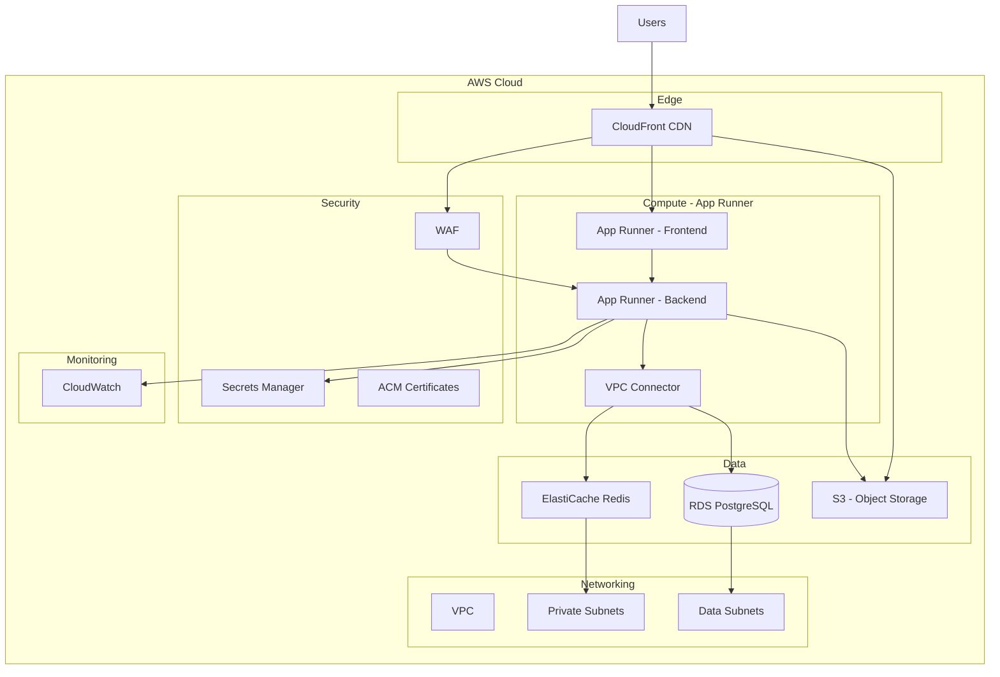
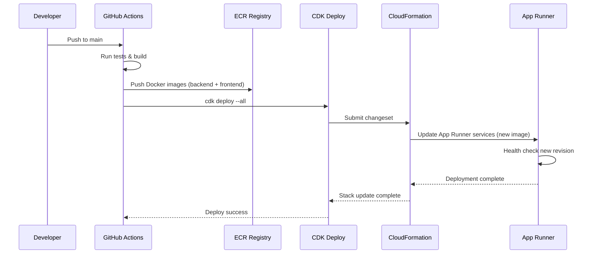
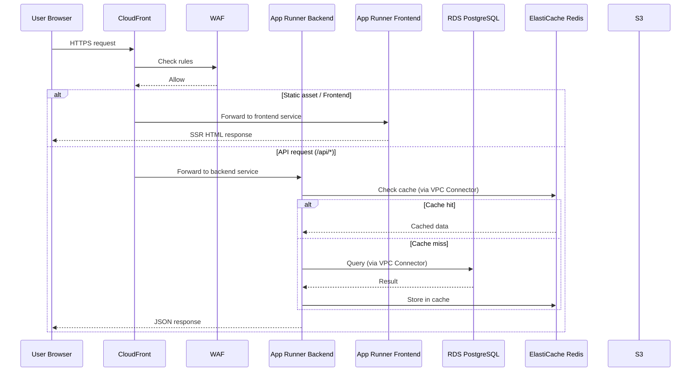

# Design Document: AWS Infrastructure Deployment

## Overview

This design defines the Infrastructure as Code (IaC) setup for deploying the rental platform to AWS. The system consists of a NestJS backend, Next.js frontend, PostgreSQL database, Redis cache, and S3 object storage — all currently running locally and needing a production-grade cloud deployment.

The infrastructure will live in `src/infra/` and provision all AWS resources needed to run the platform with the quality targets defined in the project: LCP ≤ 2.5s, API response ≤ 800ms (p95), and availability ≥ 99.5%.

After evaluating AWS CDK (TypeScript) vs Terraform, this design recommends **AWS CDK with TypeScript** to maintain a single-language stack, leverage existing TypeScript expertise, and enable type-safe infrastructure definitions that integrate naturally with the project's tooling.

## IaC Tool Decision: AWS CDK vs Terraform

### Evaluation Criteria

| Criterion | AWS CDK (TypeScript) | Terraform (HCL) |
|-----------|---------------------|-----------------|
| Language consistency | ✅ Same TypeScript as app | ❌ New language (HCL) |
| Type safety | ✅ Full TypeScript types | ⚠️ Limited validation |
| Learning curve | ✅ Low (team knows TS) | ⚠️ Medium (new DSL) |
| AWS integration depth | ✅ Native, L2/L3 constructs | ✅ Good via providers |
| Multi-cloud support | ❌ AWS only | ✅ Multi-cloud |
| State management | ✅ CloudFormation (managed) | ⚠️ State file (must manage) |
| Community/ecosystem | ✅ Large, growing | ✅ Very large |
| Refactoring/IDE support | ✅ Full IDE support | ⚠️ Limited |
| Testing | ✅ Jest assertions on synth | ⚠️ Separate tools |
| Drift detection | ✅ CloudFormation built-in | ✅ `terraform plan` |

### Recommendation: AWS CDK (TypeScript)

**Rationale:**
1. **Single language** — The entire project (frontend, backend, database schema, tests) is TypeScript. Adding HCL introduces cognitive overhead and tooling fragmentation.
2. **Type-safe constructs** — CDK L2 constructs provide compile-time validation of resource configurations, catching misconfigurations before deployment.
3. **Testable infrastructure** — CDK integrates with Jest (already in the project) for snapshot and assertion-based testing of synthesized CloudFormation templates.
4. **Higher-level abstractions** — CDK L2/L3 constructs handle security best practices (IAM least privilege, encryption defaults) that would require manual configuration in Terraform.
5. **No state file management** — CloudFormation manages state natively; no need for S3 backend + DynamoDB lock table setup.
6. **Future-proof for this project** — The platform targets AWS exclusively (no multi-cloud requirement), so Terraform's multi-cloud advantage is irrelevant.

**Trade-off acknowledged:** If the project ever needs multi-cloud, Terraform would be better. For an AWS-only deployment with a TypeScript team, CDK is the stronger choice.

## Architecture

The compute layer uses **AWS App Runner** — a fully managed container service that scales to zero, eliminating idle costs during the MVP phase. App Runner connects to VPC resources (RDS, Redis) via VPC Connectors. When traffic grows and justifies always-on capacity, the migration path to ECS Fargate is straightforward since the same Docker images are used.



## Sequence Diagrams

### Deployment Pipeline



### Request Flow



## Components and Interfaces

### Stack Architecture (CDK Constructs)

The infrastructure is organized into modular CDK stacks following separation of concerns:

```typescript
// src/infra/lib/stacks overview
interface InfraStackMap {
  network: NetworkStack;       // VPC, subnets, security groups
  data: DataStack;             // RDS, ElastiCache, S3
  compute: ComputeStack;       // App Runner services, VPC Connector
  cdn: CdnStack;               // CloudFront, WAF, ACM
  monitoring: MonitoringStack;  // CloudWatch dashboards, alarms
  ci: CiStack;                 // ECR repositories, IAM for CI/CD
}
```

### Component 1: NetworkStack

**Purpose**: Provisions the VPC with public, private, and isolated subnets for data resources and VPC Connector egress. App Runner services live outside the VPC but connect via VPC Connector.

```typescript
interface NetworkStackProps extends cdk.StackProps {
  readonly environment: 'staging' | 'production';
  readonly maxAzs: number;
  readonly natGateways: number;
}

interface NetworkStackOutputs {
  readonly vpc: ec2.IVpc;
  readonly privateSubnets: ec2.ISubnet[];
  readonly dataSubnets: ec2.ISubnet[];
  readonly vpcConnectorSecurityGroup: ec2.ISecurityGroup;
  readonly dataSecurityGroup: ec2.ISecurityGroup;
}
```

**Responsibilities**:
- Create VPC with 3-tier subnet architecture (public for NAT Gateway, private for VPC Connector, isolated for data)
- Public subnets host the NAT Gateway (required by CDK for PRIVATE_WITH_EGRESS subnets)
- Configure NAT Gateway for private subnet internet access (VPC Connector egress)
- Define security groups: VPC Connector SG → Data SG (ports 5432, 6379)
- Output references for dependent stacks

### Component 2: DataStack

**Purpose**: Provisions all data stores — RDS PostgreSQL, ElastiCache Redis, and S3 buckets.

```typescript
interface DataStackProps extends cdk.StackProps {
  readonly vpc: ec2.IVpc;
  readonly dataSubnets: ec2.ISubnet[];
  readonly dataSecurityGroup: ec2.ISecurityGroup;
  readonly environment: 'staging' | 'production';
}

interface DataStackOutputs {
  readonly dbInstance: rds.IDatabaseInstance;
  readonly dbSecret: secretsmanager.ISecret;
  readonly redisCluster: elasticache.CfnReplicationGroup;
  readonly assetsBucket: s3.IBucket;
  readonly redisEndpoint: string;
}
```

**Responsibilities**:
- Provision RDS PostgreSQL (Multi-AZ for production, single for staging)
- Configure automated backups, encryption at rest (AES-256)
- Provision ElastiCache Redis cluster with encryption in transit
- Create S3 bucket with versioning, lifecycle rules, and CORS for direct uploads
- Store database credentials in Secrets Manager with rotation

### Component 3: ComputeStack (App Runner)

**Purpose**: Provisions App Runner services for backend and frontend, with VPC Connector for database/cache access.

```typescript
interface ComputeStackProps extends cdk.StackProps {
  readonly vpc: ec2.IVpc;
  readonly privateSubnets: ec2.ISubnet[];
  readonly vpcConnectorSecurityGroup: ec2.ISecurityGroup;
  readonly dbSecret: secretsmanager.ISecret;
  readonly redisEndpoint: string;
  readonly assetsBucket: s3.IBucket;
  readonly environment: 'staging' | 'production';
  readonly backendImageUri: string;
  readonly frontendImageUri: string;
}

interface ComputeStackOutputs {
  readonly backendServiceUrl: string;
  readonly frontendServiceUrl: string;
  readonly backendServiceArn: string;
  readonly frontendServiceArn: string;
  readonly vpcConnector: apprunner.CfnVpcConnector;
}
```

**Responsibilities**:
- Create VPC Connector pointing to private subnets
- Create App Runner service for backend (NestJS) with VPC Connector
- Create App Runner service for frontend (Next.js) — no VPC Connector needed (calls backend via public URL)
- Configure auto-scaling: min 1, max based on environment
- Inject environment variables and secrets into services
- Configure health checks (backend: `/api/health`, frontend: `/`)
- Set CPU/memory per environment

### Component 4: CdnStack

**Purpose**: Provisions CloudFront distribution with WAF protection and TLS certificates.

```typescript
interface CdnStackProps extends cdk.StackProps {
  readonly backendServiceUrl: string;
  readonly frontendServiceUrl: string;
  readonly assetsBucketArn: string;
  readonly assetsBucketName: string;
  readonly domainName?: string;
  readonly environment: 'staging' | 'production';
}

interface CdnStackOutputs {
  readonly distribution: cloudfront.IDistribution;
  readonly wafAcl: wafv2.CfnWebACL;
}
```

**Responsibilities**:
- Create CloudFront distribution with App Runner origins (backend + frontend) and S3 origin (via Origin Access Control)
- Import S3 bucket by ARN/name to avoid cross-stack circular dependency (OAC pattern)
- Configure cache behaviors: `/api/*` → backend (no cache), `/assets/*` → S3 (long cache), `/*` → frontend
- Attach WAF with rate limiting and common attack protection
- Provision ACM certificate for custom domain (if provided)
- Enable compression (gzip/brotli) for LCP optimization

### Component 5: MonitoringStack

**Purpose**: Provisions CloudWatch dashboards, alarms, and log groups for observability.

```typescript
interface MonitoringStackProps extends cdk.StackProps {
  readonly backendServiceArn: string;
  readonly frontendServiceArn: string;
  readonly dbInstance: rds.IDatabaseInstance;
  readonly environment: 'staging' | 'production';
}
```

**Responsibilities**:
- Create CloudWatch dashboard with key metrics (App Runner request count, latency, 5xx errors)
- Configure alarms for: API latency > 800ms (p95), error rate > 1%, DB CPU > 80%
- Set up log groups with retention policies
- Configure SNS topic for alarm notifications

## Data Models

### Environment Configuration

```typescript
interface EnvironmentConfig {
  readonly account: string;
  readonly region: string;
  readonly environment: 'staging' | 'production';
  readonly domainName?: string;

  readonly compute: {
    readonly backend: {
      readonly cpu: 0.25 | 0.5 | 1 | 2 | 4;       // vCPU units (App Runner)
      readonly memory: 0.5 | 1 | 2 | 3 | 4 | 6 | 8 | 10 | 12; // GB
      readonly minInstances: number;   // 0 = scale to zero
      readonly maxInstances: number;
      readonly maxConcurrency: number; // requests per instance before scaling
    };
    readonly frontend: {
      readonly cpu: 0.25 | 0.5 | 1 | 2 | 4;
      readonly memory: 0.5 | 1 | 2 | 3 | 4 | 6 | 8 | 10 | 12;
      readonly minInstances: number;
      readonly maxInstances: number;
      readonly maxConcurrency: number;
    };
  };

  readonly database: {
    readonly instanceClass: string;  // e.g., 'db.t3.medium'
    readonly multiAz: boolean;
    readonly backupRetentionDays: number;
    readonly allocatedStorage: number;
  };

  readonly redis: {
    readonly nodeType: string;       // e.g., 'cache.t3.micro'
    readonly numCacheNodes: number;
  };

  readonly network: {
    readonly maxAzs: number;
    readonly natGateways: number;
  };
}
```

**Validation Rules**:
- `account` must be a 12-digit AWS account ID
- `region` must be a valid AWS region (e.g., `us-east-1`, `sa-east-1`)
- `compute.backend.cpu` must be one of: 0.25, 0.5, 1, 2, 4 (App Runner vCPU options)
- `compute.backend.memory` must be compatible with CPU (App Runner constraints)
- `compute.*.minInstances` can be 0 (scale to zero) or ≥ 1 (warm instances)
- `compute.*.maxConcurrency` must be between 1 and 200
- `database.backupRetentionDays` must be between 1 and 35
- `redis.numCacheNodes` must be ≥ 1

### Staging vs Production Defaults

```typescript
const stagingConfig: EnvironmentConfig = {
  account: process.env.CDK_DEFAULT_ACCOUNT!,
  region: 'us-east-1',
  environment: 'staging',
  compute: {
    backend: { cpu: 0.5, memory: 1, minInstances: 0, maxInstances: 2, maxConcurrency: 50 },
    frontend: { cpu: 0.25, memory: 0.5, minInstances: 0, maxInstances: 2, maxConcurrency: 80 },
  },
  database: {
    instanceClass: 'db.t3.micro',
    multiAz: false,
    backupRetentionDays: 7,
    allocatedStorage: 20,
  },
  redis: { nodeType: 'cache.t3.micro', numCacheNodes: 1 },
  network: { maxAzs: 2, natGateways: 1 },
};

const productionConfig: EnvironmentConfig = {
  account: process.env.CDK_DEFAULT_ACCOUNT!,
  region: 'us-east-1',
  environment: 'production',
  compute: {
    backend: { cpu: 1, memory: 2, minInstances: 1, maxInstances: 6, maxConcurrency: 80 },
    frontend: { cpu: 0.5, memory: 1, minInstances: 1, maxInstances: 4, maxConcurrency: 100 },
  },
  database: {
    instanceClass: 'db.t3.medium',
    multiAz: true,
    backupRetentionDays: 30,
    allocatedStorage: 50,
  },
  redis: { nodeType: 'cache.t3.small', numCacheNodes: 2 },
  network: { maxAzs: 2, natGateways: 1 },
};
```

**Key MVP cost optimization**: Staging uses `minInstances: 0` (scale to zero) — services only run when receiving requests. Production uses `minInstances: 1` to avoid cold starts for real users.

## Environment Variable Injection (Zero Manual Configuration)

All environment variables are injected through CDK code using cross-stack references. **Nothing is configured manually in the AWS Console.** This ensures reproducibility, auditability, and consistency across environments.

### Injection Strategy

```typescript
/**
 * Environment variables are resolved at deploy time from:
 * 1. CDK cross-stack references (resource ARNs, endpoints, URLs)
 * 2. Secrets Manager references (sensitive values — DB password, PII key, JWT secret)
 * 3. Static config values (port numbers, feature flags, environment name)
 * 
 * App Runner supports two injection mechanisms:
 * - RuntimeEnvironmentVariables: plain key-value pairs (non-sensitive)
 * - RuntimeEnvironmentSecrets: references to Secrets Manager or SSM Parameter Store
 */
```

### Backend Environment Variables

```typescript
// All values resolved from CDK constructs — no hardcoded strings
const backendEnvironment: Record<string, string> = {
  // Database — resolved from RDS construct + Secrets Manager
  DATABASE_URL: `postgresql://${dbSecret.secretValueFromJson('username')}:${dbSecret.secretValueFromJson('password')}@${dbInstance.dbInstanceEndpointAddress}:${dbInstance.dbInstanceEndpointPort}/rental_platform`,
  
  // Redis — resolved from ElastiCache construct
  REDIS_HOST: redisCluster.attrPrimaryEndPointAddress,
  REDIS_PORT: redisCluster.attrPrimaryEndPointPort,
  
  // S3 — resolved from S3 bucket construct
  S3_BUCKET_NAME: assetsBucket.bucketName,
  S3_REGION: cdk.Stack.of(scope).region,
  
  // App config — static per environment
  NODE_ENV: config.environment === 'production' ? 'production' : 'development',
  PORT: '3000',
  
  // Frontend URL — resolved from frontend App Runner service
  FRONTEND_URL: `https://${frontendService.attrServiceUrl}`,
  // Or if using custom domain via CloudFront:
  // FRONTEND_URL: `https://${config.domainName}`,
};

// Sensitive values — injected via Secrets Manager ARN references
const backendSecrets: Record<string, string> = {
  // These reference Secrets Manager secrets by ARN
  // App Runner resolves them at runtime — values never appear in CloudFormation
  JWT_SECRET: jwtSecret.secretArn,
  PII_ENCRYPTION_KEY: piiKeySecret.secretArn,
  DB_PASSWORD: `${dbSecret.secretArn}:password::`,  // JSON key extraction
};
```

### Frontend Environment Variables

```typescript
const frontendEnvironment: Record<string, string> = {
  // Backend API URL — resolved from backend App Runner service
  NEXT_PUBLIC_API_URL: `https://${backendService.attrServiceUrl}`,
  // Or if using custom domain via CloudFront:
  // NEXT_PUBLIC_API_URL: `https://api.${config.domainName}`,
  
  // S3 for public assets (property photos)
  NEXT_PUBLIC_ASSETS_URL: `https://${distribution.distributionDomainName}/assets`,
  
  // App config
  NODE_ENV: config.environment === 'production' ? 'production' : 'development',
  PORT: '3000',
};
```

### CDK Implementation Pattern

```typescript
// In ComputeStack — how env vars are wired to App Runner
const backendService = new apprunner.CfnService(this, 'BackendService', {
  sourceConfiguration: {
    imageRepository: {
      imageIdentifier: props.backendImageUri,
      imageRepositoryType: 'ECR',
      imageConfiguration: {
        port: '3000',
        // Non-sensitive env vars — resolved from CDK constructs
        runtimeEnvironmentVariables: [
          { name: 'DATABASE_URL', value: buildDatabaseUrl(props.dbSecret, props.dbInstance) },
          { name: 'REDIS_HOST', value: props.redisEndpoint },
          { name: 'REDIS_PORT', value: '6379' },
          { name: 'S3_BUCKET_NAME', value: props.assetsBucket.bucketName },
          { name: 'S3_REGION', value: cdk.Stack.of(this).region },
          { name: 'NODE_ENV', value: props.environment === 'production' ? 'production' : 'development' },
          { name: 'PORT', value: '3000' },
        ],
        // Sensitive env vars — resolved from Secrets Manager at runtime
        runtimeEnvironmentSecrets: [
          { name: 'JWT_SECRET', value: jwtSecret.secretArn },
          { name: 'PII_ENCRYPTION_KEY', value: piiKeySecret.secretArn },
        ],
      },
    },
    authenticationConfiguration: {
      accessRoleArn: ecrAccessRole.roleArn,
    },
  },
  instanceConfiguration: {
    instanceRoleArn: instanceRole.roleArn, // IAM role with Secrets Manager read access
    cpu: String(config.cpu * 1024),
    memory: String(config.memory * 1024),
  },
  // ... rest of config
});
```

### Secrets Management

```typescript
// Secrets are created in the DataStack or a dedicated SecretsStack
// They are NEVER hardcoded — initial values set via CDK or rotated automatically

// Database credentials — auto-generated by RDS, stored in Secrets Manager
const dbSecret = new secretsmanager.Secret(this, 'DbSecret', {
  generateSecretString: {
    secretStringTemplate: JSON.stringify({ username: 'app_user' }),
    generateStringKey: 'password',
    excludePunctuation: true,
  },
});

// Application secrets — created once, referenced by ARN in App Runner
const jwtSecret = new secretsmanager.Secret(this, 'JwtSecret', {
  description: 'JWT signing secret for authentication',
  generateSecretString: { excludePunctuation: true, passwordLength: 64 },
});

const piiKeySecret = new secretsmanager.Secret(this, 'PiiEncryptionKey', {
  description: 'AES-256-CBC key for PII field encryption',
  generateSecretString: { excludePunctuation: true, passwordLength: 32 },
});
```

### Key Principles

1. **No manual console configuration** — Every env var is defined in CDK TypeScript code
2. **Cross-stack references** — Resource endpoints (DB host, Redis host, S3 bucket) are passed between stacks via CDK props
3. **Secrets Manager for sensitive values** — DB password, JWT secret, PII key are never in plaintext in CloudFormation templates
4. **Environment parity** — Same env var names in local `.env` and in CDK; only values differ
5. **Reproducible** — Running `cdk deploy` on a fresh account produces a fully configured environment with no manual steps
6. **Auditable** — All configuration changes are tracked in git (CDK code) and CloudFormation change sets

## Algorithmic Pseudocode

### Stack Dependency Resolution

```typescript
/**
 * ALGORITHM: deployInfrastructure
 * 
 * Deploys all CDK stacks in dependency order.
 * CloudFormation handles inter-stack references via exports/imports.
 */

// Preconditions:
// - AWS credentials configured
// - CDK bootstrapped in target account/region
// - Docker images built and pushed to ECR

// Postconditions:
// - All stacks deployed successfully
// - All cross-stack references resolved
// - Services healthy and receiving traffic

// Deployment order (enforced by CDK dependencies):
// 1. NetworkStack (no dependencies)
// 2. DataStack (depends on NetworkStack)
// 3. CiStack (no dependencies — ECR repos)
// 4. ComputeStack (depends on NetworkStack, DataStack, CiStack)
// 5. CdnStack (depends on ComputeStack)
// 6. MonitoringStack (depends on ComputeStack, DataStack)
```

### App Runner Service Configuration

```typescript
/**
 * ALGORITHM: createAppRunnerService
 * 
 * INPUT: config (service configuration), vpcConnector (for DB/Redis access)
 * OUTPUT: App Runner service with auto-scaling and health checks
 * 
 * Preconditions:
 *   - ECR image exists and is accessible
 *   - VPC Connector is created (for backend service)
 *   - Secrets Manager contains required secrets
 * 
 * Postconditions:
 *   - Service is running and passing health checks
 *   - Auto-scaling configured per environment
 *   - VPC Connector attached (backend only)
 *   - Environment variables and secrets injected
 *   - Scale-to-zero enabled for staging (minInstances: 0)
 */
function createAppRunnerService(
  scope: Construct,
  id: string,
  config: {
    imageUri: string;
    port: number;
    cpu: number;
    memory: number;
    minInstances: number;
    maxInstances: number;
    maxConcurrency: number;
    healthCheckPath: string;
    environmentVariables: Record<string, string>;
    vpcConnector?: apprunner.CfnVpcConnector;
  }
): apprunner.CfnService {
  const service = new apprunner.CfnService(scope, id, {
    sourceConfiguration: {
      imageRepository: {
        imageIdentifier: config.imageUri,
        imageRepositoryType: 'ECR',
        imageConfiguration: {
          port: String(config.port),
          runtimeEnvironmentVariables: Object.entries(config.environmentVariables).map(
            ([name, value]) => ({ name, value })
          ),
        },
      },
      autoDeploymentsEnabled: true, // Auto-deploy on new image push
      authenticationConfiguration: {
        accessRoleArn: ecrAccessRole.roleArn,
      },
    },
    instanceConfiguration: {
      cpu: String(config.cpu * 1024),  // App Runner expects millicores string
      memory: String(config.memory * 1024), // App Runner expects MB string
    },
    autoScalingConfigurationArn: createAutoScalingConfig(scope, {
      minSize: config.minInstances,
      maxSize: config.maxInstances,
      maxConcurrency: config.maxConcurrency,
    }).attrAutoScalingConfigurationArn,
    healthCheckConfiguration: {
      protocol: 'HTTP',
      path: config.healthCheckPath,
      interval: 10,
      timeout: 5,
      healthyThreshold: 1,
      unhealthyThreshold: 3,
    },
    networkConfiguration: config.vpcConnector
      ? { egressConfiguration: { egressType: 'VPC', vpcConnectorArn: config.vpcConnector.attrVpcConnectorArn } }
      : { egressConfiguration: { egressType: 'DEFAULT' } },
  });

  return service;
}
```

### VPC Connector Setup

```typescript
/**
 * ALGORITHM: createVpcConnector
 * 
 * INPUT: vpc, privateSubnets, securityGroup
 * OUTPUT: VPC Connector for App Runner → VPC communication
 * 
 * Preconditions:
 *   - VPC has private subnets with NAT Gateway access
 *   - Security group allows outbound to data layer (ports 5432, 6379)
 * 
 * Postconditions:
 *   - VPC Connector created in private subnets
 *   - App Runner services can reach RDS and Redis via this connector
 *   - Connector security group has outbound rules to data security group
 */
function createVpcConnector(
  scope: Construct,
  vpc: ec2.IVpc,
  privateSubnets: ec2.ISubnet[],
  securityGroup: ec2.ISecurityGroup
): apprunner.CfnVpcConnector {
  return new apprunner.CfnVpcConnector(scope, 'VpcConnector', {
    subnets: privateSubnets.map(s => s.subnetId),
    securityGroups: [securityGroup.securityGroupId],
    vpcConnectorName: `${scope.node.id}-connector`,
  });
}
```

## Key Functions with Formal Specifications

### Function 1: createVpc()

```typescript
function createVpc(scope: Construct, config: NetworkStackProps): ec2.Vpc
```

**Preconditions:**
- `config.maxAzs` is 2 or 3
- `config.natGateways` is between 1 and `config.maxAzs`

**Postconditions:**
- Returns a VPC with CIDR `10.0.0.0/16`
- VPC has exactly `config.maxAzs` availability zones
- Each AZ has one private subnet (for VPC Connector) and one isolated subnet (for data)
- NAT Gateway provisioned in at least one AZ for VPC Connector egress
- Flow logs enabled to CloudWatch

**Loop Invariants:** N/A

### Function 2: createDatabase()

```typescript
function createDatabase(
  scope: Construct,
  vpc: ec2.IVpc,
  config: DataStackProps
): { instance: rds.DatabaseInstance; secret: secretsmanager.Secret }
```

**Preconditions:**
- `vpc` has isolated subnets available
- `config.dataSecurityGroup` allows inbound on port 5432 from VPC Connector security group only

**Postconditions:**
- Returns RDS PostgreSQL 16 instance in isolated subnets
- Storage encrypted with AWS-managed KMS key
- Credentials stored in Secrets Manager with 30-day rotation
- If production: Multi-AZ enabled, deletion protection on
- If staging: Single-AZ, deletion protection off
- Automated backups configured per `config.backupRetentionDays`

**Loop Invariants:** N/A

### Function 3: createAppRunnerService()

```typescript
function createAppRunnerService(
  scope: Construct,
  id: string,
  config: AppRunnerServiceConfig
): apprunner.CfnService
```

**Preconditions:**
- ECR repository contains the specified image
- IAM role has `ecr:GetDownloadUrlForLayer` and `ecr:BatchGetImage` permissions
- VPC Connector exists (for backend service)

**Postconditions:**
- Returns an App Runner service accessible via HTTPS URL
- Auto-scaling configured: scales between `minInstances` and `maxInstances`
- Health check configured at specified path
- If `minInstances === 0`: service scales to zero when idle (cost optimization)
- If VPC Connector provided: service can reach RDS and Redis in private subnets
- Auto-deploy enabled: new ECR image push triggers automatic deployment

**Loop Invariants:** N/A

### Function 4: createCdnDistribution()

```typescript
function createCdnDistribution(
  scope: Construct,
  backendUrl: string,
  frontendUrl: string,
  bucket: s3.Bucket,
  config: CdnStackProps
): cloudfront.Distribution
```

**Preconditions:**
- `backendUrl` and `frontendUrl` are valid App Runner service URLs (HTTPS)
- `bucket` exists and has CORS configured for the domain

**Postconditions:**
- Returns CloudFront distribution with three origins (backend App Runner, frontend App Runner, S3)
- Default behavior routes to frontend App Runner
- `/api/*` behavior routes to backend App Runner with no caching
- `/assets/*` behavior routes to S3 with 1-year cache
- TLS 1.2 minimum, HTTP/2 enabled
- Compression enabled (gzip + brotli)
- If `domainName` provided: ACM certificate attached

**Loop Invariants:** N/A

## Example Usage

```typescript
// src/infra/bin/app.ts — CDK app entry point
import * as cdk from 'aws-cdk-lib';
import { NetworkStack } from '../lib/stacks/network-stack';
import { DataStack } from '../lib/stacks/data-stack';
import { ComputeStack } from '../lib/stacks/compute-stack';
import { CdnStack } from '../lib/stacks/cdn-stack';
import { MonitoringStack } from '../lib/stacks/monitoring-stack';
import { CiStack } from '../lib/stacks/ci-stack';
import { getConfig } from '../lib/config';

const app = new cdk.App();
const env = app.node.tryGetContext('env') as 'staging' | 'production';
const config = getConfig(env);

// ECR repositories (deployed first, images pushed by CI)
const ci = new CiStack(app, `${env}-Ci`, {
  env: { account: config.account, region: config.region },
});

const network = new NetworkStack(app, `${env}-Network`, {
  env: { account: config.account, region: config.region },
  environment: config.environment,
  maxAzs: config.network.maxAzs,
  natGateways: config.network.natGateways,
});

const data = new DataStack(app, `${env}-Data`, {
  env: { account: config.account, region: config.region },
  vpc: network.vpc,
  dataSubnets: network.dataSubnets,
  dataSecurityGroup: network.dataSecurityGroup,
  environment: config.environment,
});

const compute = new ComputeStack(app, `${env}-Compute`, {
  env: { account: config.account, region: config.region },
  vpc: network.vpc,
  privateSubnets: network.privateSubnets,
  vpcConnectorSecurityGroup: network.vpcConnectorSecurityGroup,
  dbSecret: data.dbSecret,
  redisEndpoint: data.redisEndpoint,
  assetsBucket: data.assetsBucket,
  environment: config.environment,
  backendImageUri: `${ci.backendRepo.repositoryUri}:latest`,
  frontendImageUri: `${ci.frontendRepo.repositoryUri}:latest`,
});

const cdn = new CdnStack(app, `${env}-Cdn`, {
  env: { account: config.account, region: config.region },
  backendServiceUrl: compute.backendServiceUrl,
  frontendServiceUrl: compute.frontendServiceUrl,
  assetsBucket: data.assetsBucket,
  environment: config.environment,
  domainName: config.domainName,
});

new MonitoringStack(app, `${env}-Monitoring`, {
  env: { account: config.account, region: config.region },
  backendServiceArn: compute.backendServiceArn,
  frontendServiceArn: compute.frontendServiceArn,
  dbInstance: data.dbInstance,
  environment: config.environment,
});
```

## Correctness Properties

The following properties must hold for any valid deployment:

1. **Network isolation**: ∀ resource ∈ DataSubnets: resource has no direct internet route (no IGW, no NAT)
2. **Least privilege**: VPC Connector security group only allows outbound to data security group on ports 5432 and 6379
3. **Encryption at rest**: ∀ dataStore ∈ {RDS, S3, ElastiCache}: encryption enabled with KMS
4. **Encryption in transit**: ∀ connection: TLS 1.2+ enforced (App Runner native HTTPS, CloudFront → App Runner, Redis AUTH)
5. **High availability**: production.database.multiAz === true ∧ production.compute.minInstances ≥ 1
6. **Secret management**: ∀ secret ∈ {DB password, PII key, JWT secret}: stored in Secrets Manager, never in env vars or code
7. **Backup policy**: production.database.backupRetentionDays ≥ 30
8. **Scaling bounds**: ∀ service: 0 ≤ minInstances ≤ maxInstances
9. **Cost optimization**: staging uses minInstances: 0 (scale to zero), single-AZ data stores
10. **Idempotency**: Running `cdk deploy` multiple times with no changes produces no resource modifications
11. **VPC Connector**: Backend App Runner service has VPC Connector attached; frontend does not (calls backend via public URL)

## Error Handling

### Error Scenario 1: Database Connection Failure

**Condition**: App Runner service cannot connect to RDS via VPC Connector
**Response**: Health check fails → App Runner marks instance unhealthy → replaces instance
**Recovery**: New instance starts with fresh connection; if persistent, check VPC Connector security group rules and Secrets Manager access

### Error Scenario 2: Deployment Failure

**Condition**: New container image fails health checks during App Runner deployment
**Response**: App Runner automatically rolls back to previous working revision
**Recovery**: Previous healthy revision continues serving traffic; investigate failed image

### Error Scenario 3: Stack Deployment Failure

**Condition**: CloudFormation stack update fails (e.g., resource limit, invalid config)
**Response**: CloudFormation automatically rolls back to previous stack state
**Recovery**: All resources return to pre-deployment state; fix configuration and redeploy

### Error Scenario 4: Cold Start (Scale from Zero)

**Condition**: Staging service receives first request after idle period (minInstances: 0)
**Response**: App Runner provisions new instance (~2-5 seconds cold start)
**Recovery**: Subsequent requests are fast; for production, `minInstances: 1` eliminates cold starts

### Error Scenario 5: Redis Cluster Failure

**Condition**: ElastiCache node becomes unavailable
**Response**: Application falls through to database (cache-aside pattern already handles cache misses)
**Recovery**: ElastiCache automatic failover promotes replica (production); single-node restarts (staging)

### Error Scenario 6: VPC Connector Failure

**Condition**: VPC Connector loses connectivity to private subnets
**Response**: Backend service cannot reach RDS/Redis → health checks fail → App Runner replaces instances
**Recovery**: VPC Connector is managed by AWS and self-heals; if NAT Gateway is the issue, traffic routes through healthy NAT in other AZ

## Testing Strategy

### Unit Testing Approach (CDK Assertions)

Test synthesized CloudFormation templates using `aws-cdk-lib/assertions`:

```typescript
import { Template } from 'aws-cdk-lib/assertions';

describe('NetworkStack', () => {
  it('creates VPC with correct CIDR', () => {
    const template = Template.fromStack(networkStack);
    template.hasResourceProperties('AWS::EC2::VPC', {
      CidrBlock: '10.0.0.0/16',
    });
  });

  it('creates isolated subnets for data layer', () => {
    const template = Template.fromStack(networkStack);
    template.resourceCountIs('AWS::EC2::Subnet', expectedSubnetCount);
  });
});

describe('DataStack', () => {
  it('enables encryption on RDS', () => {
    const template = Template.fromStack(dataStack);
    template.hasResourceProperties('AWS::RDS::DBInstance', {
      StorageEncrypted: true,
    });
  });

  it('enables Multi-AZ for production', () => {
    const template = Template.fromStack(prodDataStack);
    template.hasResourceProperties('AWS::RDS::DBInstance', {
      MultiAZ: true,
    });
  });
});

describe('ComputeStack', () => {
  it('creates App Runner service with VPC Connector for backend', () => {
    const template = Template.fromStack(computeStack);
    template.hasResourceProperties('AWS::AppRunner::Service', {
      NetworkConfiguration: {
        EgressConfiguration: {
          EgressType: 'VPC',
        },
      },
    });
  });

  it('configures scale-to-zero for staging', () => {
    const template = Template.fromStack(stagingComputeStack);
    template.hasResourceProperties('AWS::AppRunner::AutoScalingConfiguration', {
      MinSize: 0,
    });
  });
});
```

### Snapshot Testing

Detect unintended infrastructure changes:

```typescript
it('matches snapshot', () => {
  const template = Template.fromStack(stack);
  expect(template.toJSON()).toMatchSnapshot();
});
```

### Integration Testing

- Deploy to a staging environment before production
- Verify end-to-end connectivity: CloudFront → App Runner → RDS/Redis (via VPC Connector)
- Run application health checks against staging URL
- Validate Prisma migrations run successfully against RDS
- Test cold start latency (staging with minInstances: 0)

## Performance Considerations

### LCP ≤ 2.5s Target
- CloudFront edge caching for static assets (CSS, JS, images)
- Brotli compression enabled at CloudFront level
- S3 origin for user-uploaded files (property photos) with cache headers
- Next.js ISR/SSR served from App Runner (consider `us-east-1` with CloudFront edge for Colombian users, or `sa-east-1` if latency is critical)

### API Response ≤ 800ms (p95) Target
- App Runner backend connects to RDS/Redis via VPC Connector (same-region, low latency)
- ElastiCache Redis for cache-aside pattern (already implemented in app)
- Production uses `minInstances: 1` to avoid cold start latency on API calls
- Right-sized App Runner instances (1 vCPU, 2GB for backend)

### Availability ≥ 99.5% Target
- App Runner manages multiple instances across AZs automatically
- RDS Multi-AZ with automatic failover (production)
- CloudFront provides edge redundancy
- Auto-scaling ensures capacity matches demand (maxConcurrency-based)
- Automatic rollback on failed deployments

### Cost Optimization (MVP Focus)
- **Scale to zero** in staging: $0 compute cost when idle
- No ALB cost (App Runner includes load balancing)
- Single NAT Gateway (staging) vs redundant (production)
- S3 Intelligent-Tiering for infrequently accessed files
- Estimated staging monthly cost: ~$25-40 (RDS t3.micro + Redis t3.micro + NAT + S3)
- Estimated production monthly cost: ~$80-120 (RDS t3.medium Multi-AZ + Redis + App Runner warm instances)

### Migration Path to ECS Fargate
When traffic grows and cold starts become unacceptable or fine-grained control is needed:
1. Same Docker images work on ECS Fargate (no code changes)
2. Replace ComputeStack with ECS-based stack
3. Add ALB for path-based routing
4. Update CdnStack to point to ALB instead of App Runner URLs

## Security Considerations

### Network Security
- VPC with 2-tier architecture: private (VPC Connector egress), isolated (RDS/Redis)
- Security groups enforce least-privilege: VPC Connector SG → Data SG on ports 5432/6379 only
- No SSH/RDP access to any resource (App Runner and Fargate are serverless)
- VPC Flow Logs for network audit trail
- App Runner services are not directly in the VPC — they access VPC resources only through the connector

### Data Security
- RDS encryption at rest (AWS KMS)
- S3 bucket encryption (SSE-S3)
- ElastiCache encryption at rest and in transit
- Secrets Manager for all credentials (DB password, PII_ENCRYPTION_KEY, JWT_SECRET)
- S3 bucket policy blocks public access (CloudFront OAC for reads)

### Application Security
- WAF attached to CloudFront with rules:
  - Rate limiting (2000 requests/5min per IP)
  - AWS Managed Rules: Common Rule Set, Known Bad Inputs
  - SQL injection protection
  - XSS protection
- App Runner provides native HTTPS (TLS termination managed by AWS)
- Container images scanned for vulnerabilities in ECR

### Compliance
- All data stays in chosen AWS region (data residency for Colombian law — Ley 1581 de 2012)
- Audit logging via CloudTrail
- PII encryption key managed via Secrets Manager (not hardcoded)

## Dependencies

### AWS Services Required
- **Compute**: App Runner, ECR (image registry)
- **Networking**: VPC, Subnets, NAT Gateway, Security Groups, VPC Connector
- **Database**: RDS PostgreSQL 16, ElastiCache Redis 7
- **Storage**: S3
- **CDN/Security**: CloudFront, WAF, ACM
- **Secrets**: Secrets Manager
- **Monitoring**: CloudWatch

### NPM Packages (src/infra/package.json)
- `aws-cdk-lib` — Core CDK library (includes all AWS service constructs)
- `constructs` — CDK construct base
- `typescript` — TypeScript compiler
- `ts-node` — TypeScript execution for CDK CLI
- `jest` + `ts-jest` — Testing
- `@aws-cdk/aws-apprunner-alpha` — App Runner L2 constructs (if available, otherwise use L1 CfnService)

### Tooling
- AWS CDK CLI (`npm install -g aws-cdk`)
- Docker (for building container images)
- AWS CLI (for credential configuration)

## Folder Structure

```
src/infra/
├── bin/
│   └── app.ts                    # CDK app entry point
├── lib/
│   ├── config/
│   │   ├── environments.ts       # Staging/production configs
│   │   └── index.ts
│   ├── stacks/
│   │   ├── network-stack.ts      # VPC, subnets, security groups
│   │   ├── data-stack.ts         # RDS, Redis, S3
│   │   ├── compute-stack.ts      # ECS, ALB, auto-scaling
│   │   ├── cdn-stack.ts          # CloudFront, WAF, ACM
│   │   ├── monitoring-stack.ts   # CloudWatch, alarms
│   │   └── ci-stack.ts           # ECR repos
│   └── constructs/
│       ├── fargate-service.ts    # Reusable ECS service construct
│       └── secure-bucket.ts      # S3 bucket with security defaults
├── test/
│   ├── network-stack.test.ts
│   ├── data-stack.test.ts
│   ├── compute-stack.test.ts
│   └── snapshot/
│       └── *.snap
├── docker/
│   ├── backend.Dockerfile
│   └── frontend.Dockerfile
├── cdk.json
├── package.json
├── tsconfig.json
└── jest.config.ts
```
