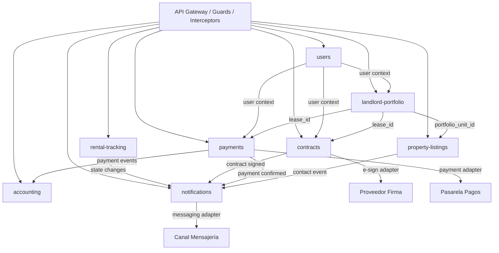
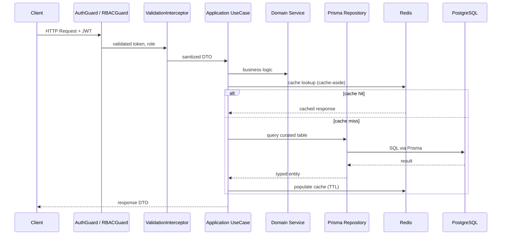
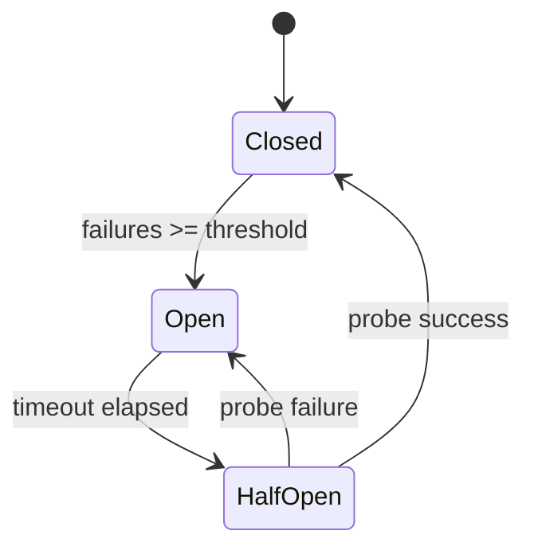
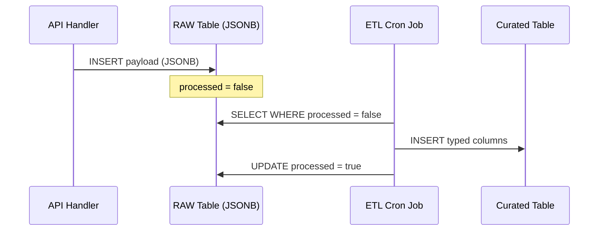

# Diseño Técnico — Backend e Implementación de Base de Datos

## Visión General

El backend de la plataforma de gestión del ciclo de arriendo se implementa como un **monolito modular** en NestJS con TypeScript. Cada uno de los ocho dominios de negocio (`users`, `property-listings`, `landlord-portfolio`, `contracts`, `payments`, `accounting`, `rental-tracking`, `notifications`) es un módulo autocontenido con su propia lógica de aplicación, puertos/adaptadores y esquema de base de datos en PostgreSQL.

El sistema actúa como orquestador del ciclo completo de arriendo: publicación de inmuebles, exploración de oferta, formalización contractual con firma electrónica y gestión de pagos. La arquitectura está diseñada para el MVP pero con bases que permiten evolucionar hacia microservicios.

### Objetivos de diseño

- Separación estricta de dominios mediante esquemas PostgreSQL independientes
- Arquitectura hexagonal por módulo (domain → application → infrastructure)
- Persistencia híbrida: tablas RAW (JSONB) + tablas curadas tipadas con ETL cron jobs
- Resiliencia ante fallos de servicios externos mediante Circuit Breaker con backoff exponencial
- RBAC + resource ownership aplicado en la capa de aplicación
- Caché Redis cache-aside con TTL controlado para consultas frecuentes
- Almacenamiento de objetos para fotos, contratos y comprobantes

### Decisiones arquitectónicas de referencia

| ID | Decisión |
|----|----------|
| AD-01 | Monolito modular como arquitectura base |
| AD-04 | Arquitectura hexagonal por módulo |
| AD-05 | Comunicación inter-módulo vía APIs internas |
| AD-07 | Circuit breaker con backoff exponencial para integraciones externas |
| AD-08 | Sanitización y validación en el boundary de la API |
| AD-09 | RBAC + resource ownership |
| AD-10 | Esquemas PostgreSQL separados por módulo |
| AD-12 | Redis cache-aside distribuido |
| AD-13 | Persistencia híbrida RAW JSON + tablas curadas |
| AD-14 | PostgreSQL como motor principal |


---

## Arquitectura

### Estructura de módulos

Cada módulo sigue la estructura hexagonal estándar:

```
src/backend/modules/{module-name}/
  domain/           # Entidades, value objects, interfaces de puertos de salida
  application/      # Casos de uso (input ports), DTOs, servicios de aplicación
  infrastructure/   # Adaptadores: repositorios Prisma, clientes externos, Redis
  {module}.module.ts
```

La comunicación entre módulos ocurre exclusivamente a través de interfaces de servicio expuestas (nunca joins directos entre esquemas de BD).

### Diagrama de módulos y dependencias



### Flujo de una petición HTTP



### Patrón Circuit Breaker para integraciones externas



Cada adaptador externo (Pasarela_Pagos, Proveedor_Firma, Canal_Mensajería) implementa este patrón con:
- Timeout: 30s para pagos, 15s para firma y mensajería
- Reintentos: máximo 2 con backoff exponencial
- Estado intermedio persistido en BD ante circuit abierto

### Flujo ETL (RAW → Curated)




---

## Componentes e Interfaces

### Módulo `users`

**Responsabilidades:** Registro, autenticación, gestión de roles y permisos, cifrado de PII.

Puertos de entrada (input ports):
- `RegisterUserUseCase(dto: RegisterUserDto): Promise<UserCreatedDto>`
- `LoginUseCase(dto: LoginDto): Promise<AuthTokenDto>`
- `GetUserProfileUseCase(userId: string): Promise<UserProfileDto>`

Puertos de salida (output ports):
- `IUserRepository` — CRUD sobre tablas curadas del esquema `users`
- `IPasswordHasher` — bcrypt con cost factor ≥ 12
- `IPIIEncryptor` — cifrado AES-256 para document_number y phone_number
- `IAuditLogger` — registro de intentos fallidos de login

Adaptadores de infraestructura:
- `PrismaUserRepository implements IUserRepository`
- `BcryptPasswordHasher implements IPasswordHasher`
- `AES256PIIEncryptor implements IPIIEncryptor`

---

### Módulo `property-listings`

**Responsabilidades:** Publicación de inmuebles, búsqueda/filtrado, gestión de fotos, caché de listados.

Puertos de entrada:
- `CreateListingUseCase(dto: CreateListingDto): Promise<ListingDto>`
- `SearchListingsUseCase(filters: ListingFiltersDto): Promise<ListingDto[]>`
- `GetListingDetailUseCase(listingId: string): Promise<ListingDetailDto>`
- `UnpublishListingUseCase(listingId: string, userId: string): Promise<void>`
- `RegisterContactEventUseCase(dto: ContactEventDto): Promise<void>`

Puertos de salida:
- `IListingRepository` — CRUD sobre esquema `property_listings`
- `IObjectStorage` — upload/download de fotos
- `IListingCache` — Redis cache-aside (TTL 5 min)
- `INotificationPort` — disparo de evento "nuevo interesado"

---

### Módulo `landlord-portfolio`

**Responsabilidades:** Gestión del portafolio del arrendador, unidades de portafolio, leases.

Puertos de entrada:
- `CreatePortfolioUnitUseCase(dto: CreatePortfolioUnitDto): Promise<PortfolioUnitDto>`
- `GetPortfolioUseCase(userId: string): Promise<PortfolioUnitDto[]>`
- `UpdatePortfolioUnitUseCase(unitId: string, dto: UpdatePortfolioUnitDto): Promise<PortfolioUnitDto>`

Puertos de salida:
- `IPortfolioRepository` — CRUD sobre esquema `landlord_portfolio`
- `IAuditLogger`

---

### Módulo `contracts`

**Responsabilidades:** Carga de contratos PDF, firma digital, gestión de estados, trazabilidad documental.

Puertos de entrada:
- `UploadContractUseCase(dto: UploadContractDto): Promise<ContractDto>`
- `InitiateSigningUseCase(contractId: string): Promise<SigningSessionDto>`
- `HandleSigningWebhookUseCase(payload: SigningWebhookDto): Promise<void>`
- `GetContractSummaryUseCase(contractId: string, userId: string): Promise<ContractSummaryDto>`

Puertos de salida:
- `IContractRepository` — CRUD sobre esquema `contracts`
- `IObjectStorage` — almacenamiento de PDFs
- `IESignatureProvider` — adaptador con circuit breaker (timeout 15s)
- `INotificationPort` — evento "contrato firmado"
- `IAuditLogger`

---

### Módulo `payments`

**Responsabilidades:** Iniciación de pagos, idempotencia, integración con pasarela, historial.

Puertos de entrada:
- `InitiatePaymentUseCase(dto: InitiatePaymentDto): Promise<PaymentSessionDto>`
- `HandlePaymentWebhookUseCase(payload: PaymentWebhookDto): Promise<void>`
- `GetPaymentHistoryUseCase(userId: string): Promise<PaymentDto[]>`

Puertos de salida:
- `IPaymentRepository` — CRUD sobre esquema `payments`
- `IPaymentGateway` — adaptador con circuit breaker (timeout 30s) e idempotency key
- `INotificationPort` — evento "pago confirmado"
- `IAuditLogger`

---

### Módulo `accounting`

**Responsabilidades:** Reportes de ingresos por periodo, caché de reportes históricos.

Puertos de entrada:
- `GetAggregatedReportUseCase(portfolioId: string, period: PeriodDto): Promise<AggregatedReportDto>`
- `GetIndividualReportUseCase(portfolioUnitId: string, period: PeriodDto): Promise<IndividualReportDto>`

Puertos de salida:
- `IAccountingRepository` — lectura de tablas curadas del esquema `accounting`
- `IReportCache` — Redis cache-aside (TTL 1h para reportes históricos)

---

### Módulo `rental-tracking`

**Responsabilidades:** Máquina de estados del lease, historial de transiciones, estado consolidado.

Estados del Lease: `PUBLISHED → CONTACT_INITIATED → CONTRACT_UPLOADED → CONTRACT_SIGNED → PAYMENT_RECEIVED`

Puertos de entrada:
- `TransitionLeaseStateUseCase(leaseId: string, newState: LeaseState): Promise<void>`
- `GetLeaseStatusUseCase(leaseId: string, userId: string): Promise<LeaseStatusDto>`
- `GetActiveLeasesSummaryUseCase(userId: string): Promise<LeaseSummaryDto[]>`

Puertos de salida:
- `ITrackingRepository` — CRUD sobre esquema `tracking_process`
- `INotificationPort` — eventos de cambio de estado

---

### Módulo `notifications`

**Responsabilidades:** Entrega multicanal (email, WhatsApp), preferencias de usuario, reintentos con circuit breaker.

Puertos de entrada:
- `SendNotificationUseCase(dto: NotificationDto): Promise<void>`
- `UpdateNotificationPreferencesUseCase(userId: string, prefs: PreferencesDto): Promise<void>`

Puertos de salida:
- `INotificationRepository` — persistencia de notificaciones y preferencias
- `IMessagingChannel` — adaptador WhatsApp/email con circuit breaker (timeout 15s, 2 reintentos)
- `IAuditLogger`

---

### Componentes transversales (`shared`)

- `JwtAuthGuard` — validación de token JWT en todos los endpoints protegidos
- `RBACGuard` — verificación de rol + resource ownership
- `ValidationInterceptor` — sanitización y validación de DTOs (class-validator + class-transformer)
- `AuditLoggerService` — registro de acciones sensibles sin PII en texto plano
- `CircuitBreakerFactory` — factory para instanciar circuit breakers por adaptador externo
- `RedisService` — cliente Redis compartido con patrón cache-aside


---

## Modelos de Datos

### Convenciones generales

- Todos los modelos curados incluyen `id` (UUID), `created_at` y `updated_at`
- Cada módulo tiene al menos una tabla RAW con `id`, `payload` (JSONB), `created_at`, `processed` (Boolean)
- Las claves foráneas solo existen dentro del mismo esquema; referencias cross-schema se resuelven por ID sin FK declarada en Prisma
- El campo `@@schema` de Prisma separa lógicamente cada módulo en PostgreSQL

### Esquema `users`

```prisma
model User {
  id               String   @id @default(uuid())
  doc_type         String
  document_number  String   // cifrado AES-256 (PII)
  mail             String   @unique
  hashed_password  String
  phone_number     String   // cifrado AES-256 (PII)
  is_active        Boolean  @default(true)
  expiration_date  DateTime?
  created_at       DateTime @default(now())
  updated_at       DateTime @updatedAt

  natural_person   NaturalPersonDetail?
  legal_person     LegalPersonDetail?
  users_roles      UserRole[]

  @@schema("users")
}

model NaturalPersonDetail {
  id           String   @id @default(uuid())
  user_id      String   @unique
  first_name   String
  last_name    String
  birth_date   DateTime
  pref_cl_type String?
  user         User     @relation(fields: [user_id], references: [id])
  @@schema("users")
}

model LegalPersonDetail {
  id            String @id @default(uuid())
  user_id       String @unique
  business_name String
  user          User   @relation(fields: [user_id], references: [id])
  @@schema("users")
}

model Role {
  id          String           @id @default(uuid())
  name        String           @unique
  description String?
  users_roles UserRole[]
  roles_perms RolePermission[]
  @@schema("users")
}

model Permission {
  id          String           @id @default(uuid())
  effect      String           // ALLOW | DENY
  action      String
  resource    String
  roles_perms RolePermission[]
  @@schema("users")
}

model UserRole {
  user_id String
  role_id String
  user    User   @relation(fields: [user_id], references: [id])
  role    Role   @relation(fields: [role_id], references: [id])
  @@id([user_id, role_id])
  @@schema("users")
}

model RolePermission {
  role_id       String
  permission_id String
  role          Role       @relation(fields: [role_id], references: [id])
  permission    Permission @relation(fields: [permission_id], references: [id])
  @@id([role_id, permission_id])
  @@schema("users")
}

model UsersRaw {
  id         String   @id @default(uuid())
  payload    Json
  created_at DateTime @default(now())
  processed  Boolean  @default(false)
  @@schema("users")
}
```

### Esquema `property_listings`

```prisma
model Property {
  id                   String                    @id @default(uuid())
  property_type        String
  length               Decimal?
  width                Decimal?
  number_of_bathrooms  Int
  number_of_rooms      Int
  is_active            Boolean                   @default(true)
  created_at           DateTime                  @default(now())
  updated_at           DateTime                  @updatedAt
  address              Address?
  additional_features  PropertyAdditionalFeature[]
  @@schema("property_listings")
}

model Address {
  id           String   @id @default(uuid())
  property_id  String   @unique
  state        String
  city         String
  neighborhood String
  address      String
  latitude     Decimal?
  longitude    Decimal?
  property     Property @relation(fields: [property_id], references: [id])
  @@schema("property_listings")
}

model Listing {
  id                String   @id @default(uuid())
  portfolio_unit_id String   // cross-schema ref — no FK
  title             String
  description       String?
  listing_date      DateTime @default(now())
  price             Decimal
  currency          String   @default("COP")
  is_active         Boolean  @default(true)
  created_at        DateTime @default(now())
  updated_at        DateTime @updatedAt
  photos            Photo[]
  @@schema("property_listings")
}

model Photo {
  id         String   @id @default(uuid())
  listing_id String
  file_url   String
  is_main    Boolean  @default(false)
  tx_hash    String?
  created_at DateTime @default(now())
  listing    Listing  @relation(fields: [listing_id], references: [id])
  @@schema("property_listings")
}

model AdditionalFeature {
  id          String                    @id @default(uuid())
  name        String
  description String?
  properties  PropertyAdditionalFeature[]
  @@schema("property_listings")
}

model PropertyAdditionalFeature {
  property_id            String
  additional_feature_id  String
  value                  String?
  order                  Int?
  property               Property          @relation(fields: [property_id], references: [id])
  feature                AdditionalFeature @relation(fields: [additional_feature_id], references: [id])
  @@id([property_id, additional_feature_id])
  @@schema("property_listings")
}

model PropertyListingsRaw {
  id         String   @id @default(uuid())
  payload    Json
  created_at DateTime @default(now())
  processed  Boolean  @default(false)
  @@schema("property_listings")
}
```

### Esquema `landlord_portfolio`

```prisma
model LandlordPortfolio {
  id            String        @id @default(uuid())
  user_id       String        // cross-schema ref — no FK
  name          String
  creation_date DateTime      @default(now())
  created_at    DateTime      @default(now())
  updated_at    DateTime      @updatedAt
  units         PortfolioUnit[]
  @@schema("landlord_portfolio")
}

model PortfolioUnit {
  id                  String            @id @default(uuid())
  portfolio_id        String
  property_id         String            // cross-schema ref — no FK
  conditions          String?
  lease_base_amount   Decimal
  lease_base_currency String            @default("COP")
  created_at          DateTime          @default(now())
  updated_at          DateTime          @updatedAt
  portfolio           LandlordPortfolio @relation(fields: [portfolio_id], references: [id])
  leases              Lease[]
  @@schema("landlord_portfolio")
}

model Lease {
  id                String        @id @default(uuid())
  portfolio_unit_id String
  user_id           String        // cross-schema ref — no FK (arrendatario)
  start_date        DateTime
  end_date          DateTime?
  enc_blob          String?       // datos sensibles cifrados
  created_at        DateTime      @default(now())
  updated_at        DateTime      @updatedAt
  portfolio_unit    PortfolioUnit @relation(fields: [portfolio_unit_id], references: [id])
  @@schema("landlord_portfolio")
}

model PortfolioRaw {
  id         String   @id @default(uuid())
  payload    Json
  created_at DateTime @default(now())
  processed  Boolean  @default(false)
  @@schema("landlord_portfolio")
}
```

### Esquema `tracking_process`

```prisma
model LeaseStatus {
  id          String               @id @default(uuid())
  name        String               @unique
  description String?
  history     LeaseStatusHistory[]
  current     LeaseCurrentStatus[]
  @@schema("tracking_process")
}

model LeaseStatusHistory {
  id                String      @id @default(uuid())
  lease_id          String      // cross-schema ref — no FK
  lease_status_id   String
  record_created_at DateTime    @default(now())
  status            LeaseStatus @relation(fields: [lease_status_id], references: [id])
  current           LeaseCurrentStatus?
  @@schema("tracking_process")
}

model LeaseCurrentStatus {
  lease_id               String             @id  // cross-schema ref — no FK
  lease_status_history_id String            @unique
  lease_status_id        String
  history                LeaseStatusHistory @relation(fields: [lease_status_history_id], references: [id])
  status                 LeaseStatus        @relation(fields: [lease_status_id], references: [id])
  @@schema("tracking_process")
}

model ListingStatus {
  id          String                 @id @default(uuid())
  name        String                 @unique
  description String?
  history     ListingStatusHistory[]
  current     ListingCurrentStatus[]
  @@schema("tracking_process")
}

model ListingStatusHistory {
  id                String        @id @default(uuid())
  listing_id        String        // cross-schema ref — no FK
  listing_status_id String
  record_created_at DateTime      @default(now())
  status            ListingStatus @relation(fields: [listing_status_id], references: [id])
  current           ListingCurrentStatus?
  @@schema("tracking_process")
}

model ListingCurrentStatus {
  listing_id                String               @id  // cross-schema ref — no FK
  listing_status_history_id String               @unique
  listing_status_id         String
  history                   ListingStatusHistory @relation(fields: [listing_status_history_id], references: [id])
  status                    ListingStatus        @relation(fields: [listing_status_id], references: [id])
  @@schema("tracking_process")
}

model TrackingRaw {
  id         String   @id @default(uuid())
  payload    Json
  created_at DateTime @default(now())
  processed  Boolean  @default(false)
  @@schema("tracking_process")
}
```


### Esquema `payments`

```prisma
model ScheduledPayment {
  id         String    @id @default(uuid())
  lease_id   String    // cross-schema ref — no FK
  amount     Decimal
  currency   String    @default("COP")
  due_date   DateTime
  created_at DateTime  @default(now())
  updated_at DateTime  @updatedAt
  payments   Payment[]
  @@schema("payments")
}

model Payment {
  id                   String           @id @default(uuid())
  scheduled_payment_id String
  amount               Decimal
  currency             String           @default("COP")
  payment_desc         String?
  created_at           DateTime         @default(now())
  updated_at           DateTime         @updatedAt
  scheduled_payment    ScheduledPayment @relation(fields: [scheduled_payment_id], references: [id])
  logs                 PaymentLog[]
  @@schema("payments")
}

model PaymentStatus {
  id          String       @id @default(uuid())
  name        String       @unique
  description String?
  logs        PaymentLog[]
  @@schema("payments")
}

model PaymentLog {
  id                String        @id @default(uuid())
  payment_id        String
  payment_status_id String
  status            String
  platform          String?
  data              Json?
  creation_date     DateTime      @default(now())
  payment           Payment       @relation(fields: [payment_id], references: [id])
  payment_status    PaymentStatus @relation(fields: [payment_status_id], references: [id])
  @@schema("payments")
}

model PaymentsRaw {
  id         String   @id @default(uuid())
  payload    Json
  created_at DateTime @default(now())
  processed  Boolean  @default(false)
  @@schema("payments")
}
```

### Esquema `accounting`

```prisma
model AggregatedPaymentReport {
  id               String   @id @default(uuid())
  portfolio_id     String   // cross-schema ref — no FK
  as_of_date       DateTime
  window_months    Int
  period_start     DateTime
  period_end       DateTime
  currency         String   @default("COP")
  number_of_units  Int
  total_amount     Decimal
  avg_amount       Decimal
  payment_count    Int
  min_amount       Decimal
  max_amount       Decimal
  last_payment_at  DateTime?
  first_payment_at DateTime?
  expected_amount  Decimal
  overdue_count    Int
  created_at       DateTime @default(now())
  updated_at       DateTime @updatedAt
  @@schema("accounting")
}

model IndividualPaymentReport {
  id                String   @id @default(uuid())
  portfolio_unit_id String   // cross-schema ref — no FK
  as_of_date        DateTime
  window_months     Int
  period_start      DateTime
  period_end        DateTime
  currency          String   @default("COP")
  total_amount      Decimal
  min_amount        Decimal
  max_amount        Decimal
  payment_count     Int
  last_payment_at   DateTime?
  first_payment_at  DateTime?
  expected_amount   Decimal
  overdue_count     Int
  created_at        DateTime @default(now())
  updated_at        DateTime @updatedAt
  @@schema("accounting")
}

model AccountingRaw {
  id         String   @id @default(uuid())
  payload    Json
  created_at DateTime @default(now())
  processed  Boolean  @default(false)
  @@schema("accounting")
}
```

### Esquema `notifications`

```prisma
model NotificationType {
  id          String                   @id @default(uuid())
  name        String                   @unique
  description String?
  preferences NotificationPreference[]
  @@schema("notifications")
}

model NotificationPreference {
  id                   String           @id @default(uuid())
  user_id              String           // cross-schema ref — no FK
  notification_type_id String
  channel              String           // EMAIL | WHATSAPP
  is_active            Boolean          @default(true)
  created_at           DateTime         @default(now())
  updated_at           DateTime         @updatedAt
  notification_type    NotificationType @relation(fields: [notification_type_id], references: [id])
  @@schema("notifications")
}

model NotificationsRaw {
  id         String   @id @default(uuid())
  payload    Json
  created_at DateTime @default(now())
  processed  Boolean  @default(false)
  @@schema("notifications")
}
```

### Esquema `contracts`

```prisma
model ContractStatus {
  id          String     @id @default(uuid())
  name        String     @unique  // PENDING | SIGNATURE_PENDING | SIGNED
  description String?
  contracts   Contract[]
  @@schema("contracts")
}

model Contract {
  id                 String         @id @default(uuid())
  lease_id           String         // cross-schema ref — no FK
  contract_status_id String
  start_date         DateTime
  end_date           DateTime?
  created_at         DateTime       @default(now())
  updated_at         DateTime       @updatedAt
  status             ContractStatus @relation(fields: [contract_status_id], references: [id])
  parties            ContractParty[]
  files              File[]
  @@schema("contracts")
}

model ContractParty {
  id               String    @id @default(uuid())
  user_id          String    // cross-schema ref — no FK
  contract_id      String
  role_in_contract String
  contract         Contract  @relation(fields: [contract_id], references: [id])
  signings         Signing[]
  @@schema("contracts")
}

model FileType {
  id          String @id @default(uuid())
  name        String @unique
  description String?
  files       File[]
  @@schema("contracts")
}

model FileStatus {
  id          String @id @default(uuid())
  name        String @unique
  description String?
  files       File[]
  @@schema("contracts")
}

model File {
  id             String     @id @default(uuid())
  contract_id    String
  file_type_id   String
  file_status_id String
  file_url       String
  created_at     DateTime   @default(now())
  updated_at     DateTime   @updatedAt
  contract       Contract   @relation(fields: [contract_id], references: [id])
  file_type      FileType   @relation(fields: [file_type_id], references: [id])
  file_status    FileStatus @relation(fields: [file_status_id], references: [id])
  @@schema("contracts")
}

model SigningStatus {
  id          String       @id @default(uuid())
  name        String       @unique
  description String?
  signings    Signing[]
  logs        SigningLog[]
  @@schema("contracts")
}

model Signing {
  id                  String        @id @default(uuid())
  contract_party_id   String
  signing_status_id   String
  signing_timestamp   DateTime?
  document_hash       String?
  contract_party      ContractParty @relation(fields: [contract_party_id], references: [id])
  signing_status      SigningStatus @relation(fields: [signing_status_id], references: [id])
  logs                SigningLog[]
  @@schema("contracts")
}

model SigningLog {
  id                String       @id @default(uuid())
  signing_id        String
  signing_status_id String
  platform          String?
  data              Json?
  creation_date     DateTime     @default(now())
  signing           Signing      @relation(fields: [signing_id], references: [id])
  signing_status    SigningStatus @relation(fields: [signing_status_id], references: [id])
  @@schema("contracts")
}

model ContractsRaw {
  id         String   @id @default(uuid())
  payload    Json
  created_at DateTime @default(now())
  processed  Boolean  @default(false)
  @@schema("contracts")
}
```


---

## Propiedades de Corrección

*Una propiedad es una característica o comportamiento que debe mantenerse verdadero en todas las ejecuciones válidas del sistema — esencialmente, una declaración formal sobre lo que el sistema debe hacer. Las propiedades sirven como puente entre las especificaciones legibles por humanos y las garantías de corrección verificables por máquina.*

---

### Propiedad 1: Registro de usuario con datos válidos crea cuenta con rol asignado

*Para cualquier* conjunto válido de datos de registro (nombre, documento, correo único, celular, contraseña), el sistema debe crear la cuenta, asignar el rol correspondiente y retornar confirmación de registro exitoso.

**Validates: Requirements 1.1**

---

### Propiedad 2: Correo duplicado es rechazado con 409

*Para cualquier* correo electrónico ya registrado en el sistema, un intento de registro con ese mismo correo debe ser rechazado con error 409.

**Validates: Requirements 1.2**

---

### Propiedad 3: Campos inválidos o ausentes retornan 400 con detalle

*Para cualquier* DTO de registro con al menos un campo obligatorio ausente o con formato inválido, el sistema debe retornar error 400 indicando los campos específicos que requieren corrección.

**Validates: Requirements 1.3**

---

### Propiedad 4: Login con credenciales válidas retorna JWT con rol e id

*Para cualquier* usuario registrado, autenticarse con sus credenciales correctas debe retornar un JWT que contenga el rol y el identificador del usuario.

**Validates: Requirements 1.4**

---

### Propiedad 5: Credenciales incorrectas retornan 401 con mensaje genérico

*Para cualquier* combinación de credenciales incorrectas (correo inexistente o contraseña incorrecta), el sistema debe retornar error 401 con el mismo mensaje genérico, sin revelar cuál campo es incorrecto.

**Validates: Requirements 1.5**

---

### Propiedad 6: Contraseñas almacenadas como hash bcrypt, nunca en texto plano

*Para cualquier* contraseña registrada, el valor almacenado en la base de datos debe ser un hash bcrypt con factor de costo ≥ 12, y nunca debe ser igual a la contraseña original ni retornarse en ninguna respuesta de la API.

**Validates: Requirements 1.6**

---

### Propiedad 7: Campos PII cifrados en reposo

*Para cualquier* usuario registrado, los campos `document_number` y `phone_number` almacenados en la base de datos no deben ser iguales a los valores originales en texto plano (deben estar cifrados con AES-256).

**Validates: Requirements 1.7, 11.5**

---

### Propiedad 8: Token JWT inválido o expirado retorna 401 en endpoints protegidos

*Para cualquier* endpoint protegido y cualquier token JWT inválido, expirado o ausente, el sistema debe retornar error 401.

**Validates: Requirements 1.8**

---

### Propiedad 9: Payloads maliciosos son sanitizados o rechazados en el boundary de la API

*Para cualquier* payload de entrada que contenga patrones de inyección SQL o XSS, el interceptor de validación debe sanitizar o rechazar el payload antes de que llegue a la capa de aplicación.

**Validates: Requirements 1.9, 11.6**

---

### Propiedad 10: Log de auditoría de login fallido contiene timestamp e IP sin PII

*Para cualquier* intento de login fallido, el log de auditoría debe contener el timestamp y la IP de origen, y no debe contener la contraseña ni ningún campo PII en texto plano.

**Validates: Requirements 1.10, 11.8**

---

### Propiedad 11: RBAC — rol incorrecto recibe 403 en endpoints restringidos

*Para cualquier* endpoint restringido a un rol específico y cualquier usuario con un rol diferente, el sistema debe retornar error 403.

**Validates: Requirements 2.2, 7.5, 11.1**

---

### Propiedad 12: Resource ownership — usuario solo accede a sus propios recursos

*Para cualquier* operación de lectura o escritura sobre un recurso (unidad de portafolio, contrato, pago, lease, historial de pagos) y cualquier usuario que no sea el propietario del recurso, el sistema debe retornar error 403 y registrar el intento en el log de auditoría.

**Validates: Requirements 2.3, 2.5, 3.12, 5.3, 5.11, 6.9, 8.3, 8.4, 11.2, 11.3**

---

### Propiedad 13: Actualización de unidad de portafolio persiste cambios (round-trip)

*Para cualquier* unidad de portafolio y cualquier conjunto de campos actualizables, actualizar la unidad y luego consultarla debe retornar los datos actualizados.

**Validates: Requirements 2.4**

---

### Propiedad 14: Datos de entrada se persisten en RAW_Table antes de transformación

*Para cualquier* operación de escritura en cualquier módulo, debe existir un registro en la RAW_Table correspondiente con el payload JSONB antes de que se ejecute cualquier transformación a la tabla curada.

**Validates: Requirements 2.6, 6.10, 10.1**

---

### Propiedad 15: ETL round-trip — contenido curado es equivalente al RAW original

*Para cualquier* registro RAW procesado por el ETL_Job, el contenido de la Curated_Table debe ser semánticamente equivalente al payload del registro RAW original, y el registro RAW debe permanecer intacto con `processed = true`.

**Validates: Requirements 2.7, 10.2, 10.3, 10.6**

---

### Propiedad 16: Publicación sin foto es rechazada con 422

*Para cualquier* intento de publicar un inmueble sin adjuntar al menos una fotografía, el sistema debe rechazar la solicitud con error 422.

**Validates: Requirements 3.2**

---

### Propiedad 17: Fotos almacenadas en object storage — BD contiene solo URLs

*Para cualquier* foto subida, la base de datos debe contener únicamente la URL de referencia y no datos binarios del archivo.

**Validates: Requirements 3.3**

---

### Propiedad 18: Listado público retorna solo publicaciones PUBLISHED con al menos una foto

*Para cualquier* estado del sistema, el listado público de inmuebles no debe contener publicaciones con estado distinto a `PUBLISHED` ni publicaciones sin al menos una fotografía asociada.

**Validates: Requirements 3.1, 3.4, 3.8**

---

### Propiedad 19: Filtro por zona retorna solo inmuebles de esa zona

*Para cualquier* zona o barrio como filtro y cualquier conjunto de datos, todos los resultados del listado filtrado deben pertenecer a la zona o barrio especificado.

**Validates: Requirements 3.5**

---

### Propiedad 20: Detalle de inmueble contiene todos los campos requeridos

*Para cualquier* inmueble publicado, el detalle retornado debe incluir fotografías, fecha de publicación, canon, número de habitaciones, número de baños y datos de contacto del arrendador.

**Validates: Requirements 3.6, 3.7**

---

### Propiedad 21: Despublicar inmueble lo remueve del listado público (round-trip)

*Para cualquier* publicación en estado `PUBLISHED`, despublicarla debe cambiar su estado a `UNPUBLISHED` y removerla del listado público.

**Validates: Requirements 3.11**

---

### Propiedad 22: Caché Redis sirve listado con TTL 5 minutos

*Para cualquier* dos consultas consecutivas del listado dentro del TTL de 5 minutos, la segunda consulta debe retornar el mismo resultado sin generar una nueva consulta a la base de datos.

**Validates: Requirements 3.9**

---

### Propiedad 23: Evento de contacto registra inmueble, arrendatario y timestamp

*Para cualquier* evento de contacto registrado, el registro debe contener el identificador del inmueble, el identificador del arrendatario y el timestamp del contacto.

**Validates: Requirements 4.1**

---

### Propiedad 24: Evento de contacto dispara notificación al arrendador

*Para cualquier* evento de contacto registrado exitosamente, debe existir una notificación generada para el arrendador del inmueble.

**Validates: Requirements 4.2**

---

### Propiedad 25: Contrato PDF almacenado en object storage con referencia en BD (round-trip)

*Para cualquier* contrato PDF cargado por un arrendador, la base de datos debe contener la referencia al archivo y el archivo debe ser recuperable desde el object storage.

**Validates: Requirements 5.1**

---

### Propiedad 26: Archivo inválido (no PDF o > 10MB) es rechazado con 422

*Para cualquier* archivo que no sea PDF o que supere 10 MB, el sistema debe rechazar la carga con error 422.

**Validates: Requirements 5.2**

---

### Propiedad 27: Resumen de contrato contiene campos clave y URL del documento

*Para cualquier* contrato accesible, el resumen retornado debe incluir canon, duración, fecha de inicio, partes involucradas y la URL del documento completo.

**Validates: Requirements 5.4**

---

### Propiedad 28: Firma exitosa actualiza estado del contrato a SIGNED con metadatos

*Para cualquier* contrato en proceso de firma, cuando el Proveedor_Firma confirma la firma exitosa de todas las partes, el estado del contrato debe actualizarse a `SIGNED` con la fecha y el identificador de transacción del proveedor.

**Validates: Requirements 5.6**

---

### Propiedad 29: Contrato SIGNED dispara notificación a ambas partes

*Para cualquier* contrato que transiciona a estado `SIGNED`, deben generarse notificaciones para el arrendador y el arrendatario del lease.

**Validates: Requirements 5.8**

---

### Propiedad 30: Eventos de firma registrados en log de auditoría

*Para cualquier* evento del proceso de firma (inicio, confirmación, error), debe existir un registro en el log de auditoría con timestamp y datos de las partes involucradas.

**Validates: Requirements 5.9**

---

### Propiedad 31: Contrato SIGNED es inmutable — no permite modificaciones

*Para cualquier* contrato en estado `SIGNED`, cualquier intento de modificar el documento debe ser rechazado.

**Validates: Requirements 5.10**

---

### Propiedad 32: Idempotency Key única por transacción de pago previene duplicados

*Para cualquier* pago iniciado, múltiples reintentos con la misma Idempotency_Key no deben generar más de una transacción procesada en la Pasarela_Pagos.

**Validates: Requirements 6.1, 6.2**

---

### Propiedad 33: Pago confirmado actualiza estado a PAID con metadatos completos

*Para cualquier* Scheduled_Payment, cuando la Pasarela_Pagos confirma el pago exitoso, el estado debe actualizarse a `PAID` con el identificador de transacción externo, el monto y la fecha de pago.

**Validates: Requirements 6.3**

---

### Propiedad 34: Pago rechazado mantiene estado PENDING

*Para cualquier* Scheduled_Payment, cuando la Pasarela_Pagos rechaza la transacción, el estado debe permanecer en `PENDING`.

**Validates: Requirements 6.4**

---

### Propiedad 35: Cada evento de pago genera registro en payment_logs con campos requeridos

*Para cualquier* evento de pago (inicio, confirmación, rechazo, error), debe existir un registro en `payment_logs` con timestamp, estado y datos de la transacción.

**Validates: Requirements 6.6**

---

### Propiedad 36: Pago confirmado dispara notificación al arrendador

*Para cualquier* pago confirmado como exitoso, debe generarse una notificación para el arrendador con el monto, periodo e inmueble asociado.

**Validates: Requirements 6.7**

---

### Propiedad 37: Historial de pagos retorna solo pagos del usuario solicitante, ordenados por fecha desc

*Para cualquier* usuario autenticado, el historial de pagos retornado debe contener únicamente los pagos asociados a sus contratos, ordenados por fecha descendente.

**Validates: Requirements 6.8**

---

### Propiedad 38: Reporte contable agrega correctamente pagos PAID del periodo

*Para cualquier* arrendador y cualquier periodo, el reporte de ingresos debe ser igual a la suma de todos los pagos en estado `PAID` asociados a sus contratos en ese periodo.

**Validates: Requirements 7.1, 7.2**

---

### Propiedad 39: Reportes históricos servidos desde caché Redis con TTL 1 hora

*Para cualquier* reporte de periodo histórico (> 24 horas de antigüedad), dos consultas consecutivas dentro del TTL de 1 hora deben retornar el mismo resultado sin recalcular desde la base de datos.

**Validates: Requirements 7.4**

---

### Propiedad 40: Estado actual del Lease siempre es un valor válido del enum

*Para cualquier* Lease en el sistema, su estado actual debe ser uno de los valores válidos: `PUBLISHED`, `CONTACT_INITIATED`, `CONTRACT_UPLOADED`, `CONTRACT_SIGNED`, `PAYMENT_RECEIVED`.

**Validates: Requirements 8.1**

---

### Propiedad 41: Transición de estado del Lease registra estado anterior, nuevo y timestamp

*Para cualquier* cambio de estado de un Lease, el historial de estados debe contener el estado anterior, el estado nuevo y el timestamp del cambio.

**Validates: Requirements 8.2**

---

### Propiedad 42: Transición a CONTRACT_SIGNED o PAYMENT_RECEIVED dispara notificación a ambas partes

*Para cualquier* Lease que transiciona a `CONTRACT_SIGNED` o `PAYMENT_RECEIVED`, deben generarse notificaciones para el arrendador y el arrendatario con el nuevo estado e inmueble asociado.

**Validates: Requirements 8.5**

---

### Propiedad 43: Estado curado del Lease es coherente con el último registro del historial

*Para cualquier* Lease procesado por el ETL_Job, el estado en la Curated_Table debe ser igual al estado del último registro en el historial de estados.

**Validates: Requirements 8.7**

---

### Propiedad 44: Notificación enviada por el canal preferido del usuario

*Para cualquier* usuario con preferencia de canal configurada y cualquier evento de notificación, la notificación debe enviarse por el canal preferido del usuario.

**Validates: Requirements 9.2**

---

### Propiedad 45: Notificación persistida con estado, canal, timestamp y evento origen

*Para cualquier* notificación generada, el registro persistido debe contener el estado (SENT, FAILED, PENDING), el canal utilizado, el timestamp y el evento que la originó.

**Validates: Requirements 9.4**

---

### Propiedad 46: Preferencias de notificación desactivadas previenen envío por ese canal

*Para cualquier* usuario que ha desactivado un canal de notificación, no deben enviarse notificaciones por ese canal.

**Validates: Requirements 9.6**

---

### Propiedad 47: Cambio de preferencias aplica a notificaciones futuras

*Para cualquier* usuario que actualiza sus preferencias de notificación, las notificaciones generadas después del cambio deben respetar las nuevas preferencias.

**Validates: Requirements 9.7**

---

### Propiedad 48: Circuit Breaker se abre ante fallos repetidos y retorna degradación controlada

*Para cualquier* adaptador de servicio externo (Pasarela_Pagos, Proveedor_Firma, Canal_Mensajería), cuando el número de fallos supera el umbral configurado, el circuit breaker debe abrirse y las llamadas posteriores deben retornar una respuesta de degradación controlada sin propagar el error como fallo general de la plataforma.

**Validates: Requirements 12.1, 12.2**

---

### Propiedad 49: Llamadas a servicios externos son canceladas al superar el timeout configurado

*Para cualquier* llamada a un servicio externo que supere el timeout configurado (30s para Pasarela_Pagos, 15s para Proveedor_Firma y Canal_Mensajería), la llamada debe ser cancelada y el sistema debe retornar un estado intermedio al usuario.

**Validates: Requirements 12.3**

---

### Propiedad 50: Restricciones de unicidad en BD previenen duplicados

*Para cualquier* intento de crear un registro que viole una restricción de unicidad (correo de usuario, combinación usuario-rol, publicación activa por unidad de portafolio, Lease activo por unidad de portafolio), el sistema debe rechazar la operación con un error apropiado.

**Validates: Requirements 13.4**

---

### Propiedad 51: Migraciones Prisma son idempotentes

*Para cualquier* migración de base de datos generada por Prisma, ejecutarla dos veces consecutivas no debe producir errores ni registros duplicados.

**Validates: Requirements 13.7**

---

### Propiedad 52: Acción sensible registrada en log de auditoría con usuario, acción, recurso y timestamp

*Para cualquier* acción sensible (firma de contrato, pago, cambio de rol, acceso a PII), el log de auditoría debe contener el identificador del usuario, la acción realizada, el recurso afectado y el timestamp, sin PII en texto plano.

**Validates: Requirements 11.7, 11.8**


---

## Manejo de Errores

### Códigos de respuesta HTTP estándar

| Código | Uso |
|--------|-----|
| 200 | Operación exitosa |
| 201 | Recurso creado |
| 400 | Datos de entrada inválidos o ausentes |
| 401 | Token JWT ausente, inválido o expirado |
| 403 | Acceso denegado por RBAC o resource ownership |
| 404 | Recurso no encontrado |
| 409 | Conflicto (correo duplicado, unicidad violada) |
| 422 | Entidad no procesable (foto ausente, archivo inválido) |
| 500 | Error interno del servidor |
| 503 | Servicio externo no disponible (circuit breaker abierto) |

### Estrategia por capa

**Capa de infraestructura (adaptadores externos):**
- Circuit Breaker con estados: Closed → Open → Half-Open
- Backoff exponencial: 1s, 2s, 4s (máximo 2 reintentos)
- Timeout: 30s Pasarela_Pagos, 15s Proveedor_Firma y Canal_Mensajería
- Estado intermedio persistido en BD ante circuit abierto: `PROCESSING` (pagos), `SIGNATURE_PENDING` (contratos), `FAILED` (notificaciones)

**Capa de aplicación (casos de uso):**
- Errores de dominio mapeados a excepciones tipadas de NestJS (`BadRequestException`, `ForbiddenException`, etc.)
- Validación de resource ownership antes de cualquier operación sobre entidades propias
- Transacciones de BD para operaciones que modifican múltiples tablas

**Capa de API (interceptores y guards):**
- `ValidationInterceptor`: sanitiza y valida DTOs con class-validator antes de llegar al caso de uso
- `JwtAuthGuard`: valida token en todos los endpoints protegidos
- `RBACGuard`: verifica rol del usuario contra el endpoint solicitado
- Respuestas de error con formato consistente: `{ statusCode, message, errors? }`

**ETL Jobs:**
- Registros RAW inválidos marcados como `ETL_ERROR` con motivo del error
- El job continúa procesando los demás registros sin interrumpirse
- Alertas configurables ante tasa de error ETL > umbral definido

**Caché Redis:**
- Fallo de Redis no interrumpe el flujo: fallback directo a PostgreSQL
- TTL controlado: 5 min para listados, 1h para reportes históricos
- Invalidación explícita al despublicar un inmueble o actualizar datos cacheados

---

## Estrategia de Testing

### Enfoque dual: tests unitarios + tests basados en propiedades

Los tests unitarios verifican ejemplos concretos, casos borde y condiciones de error. Los tests basados en propiedades verifican propiedades universales sobre rangos amplios de entradas generadas aleatoriamente. Ambos son complementarios y necesarios para cobertura completa.

### Tests unitarios

Foco en:
- Ejemplos concretos de casos de uso (happy path y error path)
- Integración entre capas dentro de un módulo
- Casos borde: campos vacíos, valores límite, estados inválidos
- Comportamiento de circuit breaker con mocks de servicios externos
- Comportamiento del ETL con registros RAW válidos e inválidos

Herramientas: Jest (NestJS), `@nestjs/testing`, mocks de Prisma con `jest-mock-extended`.

### Tests basados en propiedades

Cada propiedad de corrección definida en este documento debe implementarse como un test basado en propiedades.

Librería: **fast-check** (TypeScript/JavaScript)

Configuración mínima: **100 iteraciones por propiedad** (parámetro `numRuns: 100` en fast-check).

Cada test debe incluir un comentario de trazabilidad:
```
// Feature: backend-database-implementation, Property N: <texto de la propiedad>
```

**Generadores clave a implementar:**

- `arbitraryValidUser()` — genera usuarios con datos válidos aleatorios
- `arbitraryInvalidRegistrationDto()` — genera DTOs con campos faltantes o inválidos
- `arbitraryListing()` — genera publicaciones con/sin fotos
- `arbitraryLeaseState()` — genera estados válidos del enum de Lease
- `arbitraryRawPayload()` — genera payloads JSONB para tablas RAW
- `arbitraryMaliciousPayload()` — genera strings con patrones SQL injection y XSS
- `arbitraryPaymentEvent()` — genera eventos de pago con estados aleatorios

**Ejemplos de tests de propiedades:**

```typescript
// Feature: backend-database-implementation, Property 2: Correo duplicado es rechazado con 409
it('correo duplicado siempre retorna 409', async () => {
  await fc.assert(
    fc.asyncProperty(arbitraryValidUser(), async (user) => {
      await authService.register(user);
      const result = await authService.register({ ...user, name: 'Otro' });
      expect(result.statusCode).toBe(409);
    }),
    { numRuns: 100 }
  );
});

// Feature: backend-database-implementation, Property 15: ETL round-trip
it('contenido curado es equivalente al RAW original', async () => {
  await fc.assert(
    fc.asyncProperty(arbitraryRawPayload(), async (payload) => {
      await rawTable.insert({ payload });
      await etlJob.run();
      const curated = await curatedTable.findByPayloadId(payload.id);
      expect(curated).toMatchObject(extractCuratedFields(payload));
    }),
    { numRuns: 100 }
  );
});

// Feature: backend-database-implementation, Property 18: Listado solo retorna PUBLISHED con foto
it('listado nunca retorna publicaciones sin foto o no PUBLISHED', async () => {
  await fc.assert(
    fc.asyncProperty(fc.array(arbitraryListing()), async (listings) => {
      await seedListings(listings);
      const result = await listingService.getPublicListings({});
      expect(result.every(l => l.status === 'PUBLISHED' && l.photos.length > 0)).toBe(true);
    }),
    { numRuns: 100 }
  );
});
```

### Cobertura objetivo

- Cada una de las 52 propiedades de corrección debe tener exactamente un test basado en propiedades
- Los casos borde marcados como `edge-case` en el prework deben cubrirse con tests unitarios específicos
- Los criterios marcados como `yes - example` deben cubrirse con tests de integración o snapshot tests del schema Prisma

