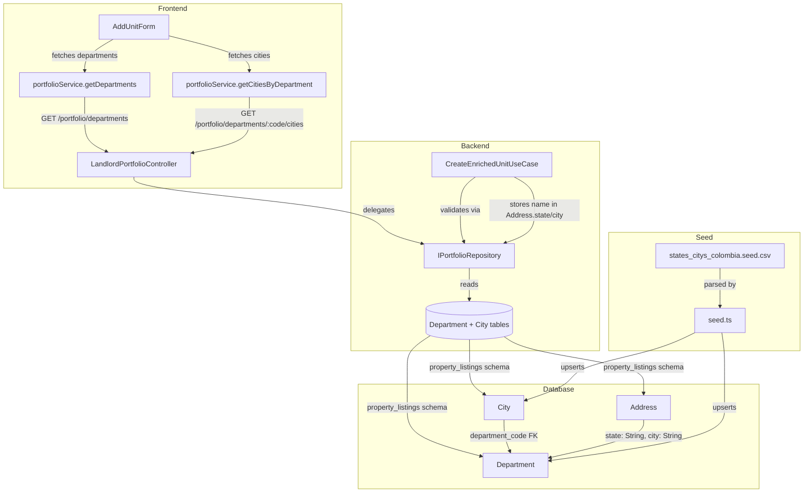

# Design Document: Colombian Geographic Catalog

## Overview

This feature introduces two new catalog tables — `Department` and `City` — in the `property_listings` schema, following the exact same pattern as `PropertyType` and `DocumentType`. The tables store the official DANE geographic division data (33 departments, 1,122 municipalities) seeded from the existing CSV file at `db/seeds/states_citys_colombia.seed.csv`.

Two public GET endpoints enable cascading frontend dropdowns: `GET /portfolio/departments` returns all active departments, and `GET /portfolio/departments/:departmentCode/cities` returns active cities filtered by department. The `AddUnitForm` is extended with department and city `<select>` elements that implement the cascading pattern (select department → load cities). The `CreateEnrichedUnitUseCase` validates the provided codes against the catalog and stores the resolved department **name** in `Address.state` and city **name** in `Address.city`.

Key design decisions:
- `Address.state` and `Address.city` remain plain `String` columns — no foreign keys — consistent with the project's cross-schema reference conventions.
- `departmentCode` and `cityCode` are **required** in the DTO — no backward compatibility needed since there are no existing rows in the Address table.
- The `City` model has a Prisma `@relation` to `Department` (same schema), enabling cascading queries.
- The CSV uses semicolon delimiters with whitespace in column headers and accented characters — the seed script handles all of this.

## Architecture



The endpoints live on `LandlordPortfolioController` (not a new controller) because:
1. The portfolio module already owns `CreateEnrichedUnitUseCase` that validates department/city codes
2. `IPortfolioRepository` is the natural home for geographic lookups (same module boundary)
3. This mirrors how `PropertyType` lives on the same controller (`GET /portfolio/property-types`)

**Route ordering note:** The `departments` route and `departments/:departmentCode/cities` route must be declared **before** `:portfolioId/units` to avoid NestJS interpreting `departments` as a `portfolioId` parameter.

## Components and Interfaces

### Database Layer

**New Prisma model — `Department`:**

```prisma
model Department {
  id        String  @id @default(uuid())
  code      String  @unique   // 2-digit DANE code, e.g. "05"
  name      String            // e.g. "ANTIOQUIA"
  is_active Boolean @default(true)

  cities City[]

  @@schema("property_listings")
}
```

**New Prisma model — `City`:**

```prisma
model City {
  id              String  @id @default(uuid())
  code            String  @unique   // 5-digit DANE code, e.g. "05001"
  department_code String            // references Department.code
  name            String            // e.g. "MEDELLÍN"
  is_active       Boolean @default(true)

  department Department @relation(fields: [department_code], references: [code])

  @@schema("property_listings")
}
```

The `City → Department` relation uses `@relation(fields: [department_code], references: [code])` — this is a same-schema relation (both in `property_listings`), so Prisma supports it. `Address.state` and `Address.city` remain plain `String` fields — no relation to these catalog tables.

### Seed Script

Add a new section to `src/backend/db/seeds/seed.ts` after the Property Types block. The seed reads the CSV file, parses semicolon-delimited rows, trims whitespace from headers and values, and upserts departments and cities:

```typescript
import * as fs from 'fs';
import * as path from 'path';

// ── Departments & Cities (DANE CSV) ──────────────────────────────────────────
const csvPath = path.join(__dirname, 'states_citys_colombia.seed.csv');
const csvContent = fs.readFileSync(csvPath, 'utf-8');
const lines = csvContent.split('\n').filter((line) => line.trim().length > 0);

// Parse header — trim whitespace from each column name
const headers = lines[0].split(';').map((h) => h.trim());
const codeDeptIdx = headers.indexOf('Código_Departamento');
const nameDeptIdx = headers.indexOf('Nombre_Departamento');
const codeMunIdx = headers.indexOf('Código_Municipio');
const nameMunIdx = headers.indexOf('Nombre_Municipio');

// Extract unique departments
const departmentMap = new Map<string, string>(); // code → name
for (let i = 1; i < lines.length; i++) {
  const cols = lines[i].split(';').map((c) => c.trim());
  const deptCode = cols[codeDeptIdx];
  const deptName = cols[nameDeptIdx];
  if (deptCode && deptName && !departmentMap.has(deptCode)) {
    departmentMap.set(deptCode, deptName);
  }
}

// Upsert departments
for (const [code, name] of departmentMap) {
  await prisma.department.upsert({
    where: { code },
    update: { name, is_active: true },
    create: { code, name, is_active: true },
  });
}
console.log(`✅ Departments seeded: ${departmentMap.size}`);

// Upsert cities
let cityCount = 0;
for (let i = 1; i < lines.length; i++) {
  const cols = lines[i].split(';').map((c) => c.trim());
  const cityCode = cols[codeMunIdx];
  const cityName = cols[nameMunIdx];
  const deptCode = cols[codeDeptIdx];
  if (cityCode && cityName && deptCode) {
    await prisma.city.upsert({
      where: { code: cityCode },
      update: { name: cityName, department_code: deptCode, is_active: true },
      create: { code: cityCode, name: cityName, department_code: deptCode, is_active: true },
    });
    cityCount++;
  }
}
console.log(`✅ Cities seeded: ${cityCount}`);
```

Key parsing details:
- **Semicolon delimiter** — the CSV uses `;` not `,`
- **Whitespace in headers** — e.g. ` Código_Municipio ` has leading/trailing spaces, so `.trim()` is essential
- **Accented characters** — `fs.readFileSync(csvPath, 'utf-8')` preserves UTF-8 encoding (MEDELLÍN, BOGOTÁ, CAQUETÁ)
- **Trailing semicolons** — each row ends with `;` producing an empty last column, which is harmless
- **Idempotent** — uses `upsert` with `where: { code }`, safe to re-run

### Domain Layer — Repository Port

**Extend `IPortfolioRepository`** with four new methods:

```typescript
// In portfolio-repository.port.ts
export interface IPortfolioRepository {
  // ... existing methods ...

  // Geographic catalog
  findAllDepartments(): Promise<{ id: string; code: string; name: string }[]>;
  findCitiesByDepartmentCode(departmentCode: string): Promise<{ id: string; code: string; departmentCode: string; name: string }[]>;
  findDepartmentByCode(code: string): Promise<{ id: string; code: string; name: string } | null>;
  findCityByCode(code: string): Promise<{ id: string; code: string; departmentCode: string; name: string } | null>;
}
```

### Infrastructure Layer — Prisma Repository

**Add to `PrismaPortfolioRepository`:**

```typescript
async findAllDepartments(): Promise<{ id: string; code: string; name: string }[]> {
  const departments = await this.prisma.department.findMany({
    where: { is_active: true },
    orderBy: { name: 'asc' },
  });
  return departments.map((d) => ({ id: d.id, code: d.code, name: d.name }));
}

async findCitiesByDepartmentCode(departmentCode: string): Promise<{ id: string; code: string; departmentCode: string; name: string }[]> {
  const cities = await this.prisma.city.findMany({
    where: { department_code: departmentCode, is_active: true },
    orderBy: { name: 'asc' },
  });
  return cities.map((c) => ({ id: c.id, code: c.code, departmentCode: c.department_code, name: c.name }));
}

async findDepartmentByCode(code: string): Promise<{ id: string; code: string; name: string } | null> {
  const dept = await this.prisma.department.findUnique({ where: { code } });
  if (!dept || !dept.is_active) return null;
  return { id: dept.id, code: dept.code, name: dept.name };
}

async findCityByCode(code: string): Promise<{ id: string; code: string; departmentCode: string; name: string } | null> {
  const city = await this.prisma.city.findUnique({ where: { code } });
  if (!city || !city.is_active) return null;
  return { id: city.id, code: city.code, departmentCode: city.department_code, name: city.name };
}
```

Same implementation pattern as `findPropertyTypeByCode` / `findAllPropertyTypes`.

### Application Layer — Use Case Validation

**Modify `CreateEnrichedUnitUseCase.execute()`** to validate `departmentCode` and `cityCode` when provided:

```typescript
// After propertyType validation, before createEnrichedUnit call:
const department = await this.portfolioRepository.findDepartmentByCode(dto.departmentCode);
if (!department) {
  throw new BadRequestException(
    `Departamento no válido: "${dto.departmentCode}". Consulte GET /portfolio/departments para ver los departamentos disponibles.`,
  );
}
const departmentName = department.name;

const city = await this.portfolioRepository.findCityByCode(dto.cityCode);
if (!city || city.departmentCode !== dto.departmentCode) {
  throw new BadRequestException(
    `Ciudad no válida: "${dto.cityCode}" para el departamento "${dto.departmentCode}". Consulte GET /portfolio/departments/${dto.departmentCode}/cities para ver las ciudades disponibles.`,
  );
}
const cityName = city.name;
```

The resolved `departmentName` and `cityName` are passed to `createEnrichedUnit` via the `CreateEnrichedUnitData` interface, and the repository stores them in `Address.state` and `Address.city` respectively.

### Application Layer — Response DTOs

**New `DepartmentResponseDto`:**

```typescript
import { ApiProperty } from '@nestjs/swagger';

export class DepartmentResponseDto {
  @ApiProperty({ example: 'uuid-here' })
  id!: string;

  @ApiProperty({ example: '05', description: 'Código DANE del departamento (2 dígitos)' })
  code!: string;

  @ApiProperty({ example: 'ANTIOQUIA' })
  name!: string;
}
```

**New `CityResponseDto`:**

```typescript
import { ApiProperty } from '@nestjs/swagger';

export class CityResponseDto {
  @ApiProperty({ example: 'uuid-here' })
  id!: string;

  @ApiProperty({ example: '05001', description: 'Código DANE del municipio (5 dígitos)' })
  code!: string;

  @ApiProperty({ example: '05', description: 'Código del departamento al que pertenece' })
  departmentCode!: string;

  @ApiProperty({ example: 'MEDELLÍN' })
  name!: string;
}
```

**Update `EnrichedUnitResponseDto`** — add department/city code fields:

```typescript
@ApiProperty({ description: 'Código DANE del departamento' })
departmentCode!: string;

@ApiProperty({ description: 'Código DANE de la ciudad' })
cityCode!: string;
```

**Update `CreateEnrichedUnitDto`** — add required fields:

```typescript
@ApiProperty({ example: '05', description: 'Código DANE del departamento (2 dígitos). Consulte GET /portfolio/departments' })
@IsString()
@IsNotEmpty()
departmentCode!: string;

@ApiProperty({ example: '05001', description: 'Código DANE del municipio (5 dígitos). Consulte GET /portfolio/departments/:departmentCode/cities' })
@IsString()
@IsNotEmpty()
cityCode!: string;
```

### Controller Layer

**Add to `LandlordPortfolioController`** (before the `:portfolioId` routes):

```typescript
@Public()
@Get('departments')
@ApiOperation({
  summary: 'Listar departamentos activos',
  description: 'Retorna el catálogo de departamentos colombianos activos, ordenados por nombre.',
})
@ApiOkResponse({ description: 'Lista de departamentos activos', type: [DepartmentResponseDto] })
getDepartments() {
  return this.portfolioRepository.findAllDepartments();
}

@Public()
@Get('departments/:departmentCode/cities')
@ApiOperation({
  summary: 'Listar ciudades de un departamento',
  description: 'Retorna las ciudades/municipios activos del departamento especificado, ordenados por nombre.',
})
@ApiParam({ name: 'departmentCode', description: 'Código DANE del departamento (2 dígitos)', example: '05' })
@ApiOkResponse({ description: 'Lista de ciudades activas del departamento', type: [CityResponseDto] })
getCitiesByDepartment(@Param('departmentCode') departmentCode: string) {
  return this.portfolioRepository.findCitiesByDepartmentCode(departmentCode);
}
```

### Data Flow — CreateEnrichedUnit with Department/City

**Update `CreateEnrichedUnitData` interface:**

```typescript
export interface CreateEnrichedUnitData {
  // ... existing fields ...
  departmentName: string;   // resolved name to store in Address.state
  cityName: string;         // resolved name to store in Address.city
  departmentCode: string;   // code for response DTO
  cityCode: string;         // code for response DTO
}
```

**Update `PrismaPortfolioRepository.createEnrichedUnit()`** — use resolved names for Address:

```typescript
// In the Address creation within the transaction:
await tx.address.create({
  data: {
    property_id: property.id,
    address: data.address,
    state: data.departmentName,   // department name
    city: data.cityName,          // city name
    neighborhood: '',
  },
});
```

### Frontend — Type Definitions

**Add to `src/frontend/modules/landlord-portfolio/types.ts`:**

```typescript
export interface Department {
  id: string;
  code: string;
  name: string;
}

export interface City {
  id: string;
  code: string;
  departmentCode: string;
  name: string;
}
```

**Update `CreateUnitRequest`:**

```typescript
export interface CreateUnitRequest {
  // ... existing fields ...
  departmentCode: string;
  cityCode: string;
}
```

**Update `EnrichedUnitFormData`:**

```typescript
export interface EnrichedUnitFormData {
  // ... existing fields ...
  departmentCode: string;  // defaults to ''
  cityCode: string;        // defaults to ''
}
```

**Update `EnrichedUnitResponse`:**

```typescript
export interface EnrichedUnitResponse {
  // ... existing fields ...
  departmentCode: string;
  cityCode: string;
}
```

### Frontend — Portfolio Service

**Add to `src/frontend/shared/services/portfolio.ts`:**

```typescript
async getDepartments(): Promise<Department[]> {
  let res: Response;
  try {
    res = await fetch(`${API_URL}/portfolio/departments`, {
      method: 'GET',
      headers: { 'Content-Type': 'application/json' },
    });
  } catch {
    throw new Error('No se pudo conectar con el servidor. Verifica tu conexión e intenta de nuevo.');
  }

  if (!res.ok) {
    if (res.status >= 500) throw new Error('Error del servidor. Intenta de nuevo más tarde.');
    throw new Error('Error del servidor. Intenta de nuevo más tarde.');
  }

  return res.json();
},

async getCitiesByDepartment(departmentCode: string): Promise<City[]> {
  let res: Response;
  try {
    res = await fetch(`${API_URL}/portfolio/departments/${departmentCode}/cities`, {
      method: 'GET',
      headers: { 'Content-Type': 'application/json' },
    });
  } catch {
    throw new Error('No se pudo conectar con el servidor. Verifica tu conexión e intenta de nuevo.');
  }

  if (!res.ok) {
    if (res.status >= 500) throw new Error('Error del servidor. Intenta de nuevo más tarde.');
    throw new Error('Error del servidor. Intenta de nuevo más tarde.');
  }

  return res.json();
},
```

No auth token needed — both endpoints are public. Same error handling pattern as `getPropertyTypes()`.

### Frontend — AddUnitForm Changes

1. Add state for departments, cities, and their loading flags:
   ```typescript
   const [departments, setDepartments] = useState<Department[]>([]);
   const [isLoadingDepartments, setIsLoadingDepartments] = useState(true);
   const [cities, setCities] = useState<City[]>([]);
   const [isLoadingCities, setIsLoadingCities] = useState(false);
   ```

2. Add `useEffect` to fetch departments on mount (same pattern as property types):
   ```typescript
   useEffect(() => {
     let cancelled = false;
     portfolioService.getDepartments()
       .then((depts) => { if (!cancelled) setDepartments(depts); })
       .catch(() => { /* graceful degradation */ })
       .finally(() => { if (!cancelled) setIsLoadingDepartments(false); });
     return () => { cancelled = true; };
   }, []);
   ```

3. Add `useEffect` to fetch cities when `formData.departmentCode` changes:
   ```typescript
   useEffect(() => {
     if (!formData.departmentCode) {
       setCities([]);
       return;
     }
     let cancelled = false;
     setIsLoadingCities(true);
     portfolioService.getCitiesByDepartment(formData.departmentCode)
       .then((c) => { if (!cancelled) setCities(c); })
       .catch(() => { /* graceful degradation */ })
       .finally(() => { if (!cancelled) setIsLoadingCities(false); });
     return () => { cancelled = true; };
   }, [formData.departmentCode]);
   ```

4. When department changes, clear the selected city:
   ```typescript
   const handleDepartmentChange = (value: string) => {
     handleChange('departmentCode', value);
     handleChange('cityCode', '');  // clear city on department change
   };
   ```

5. Render department `<select>` (between address and propertyType fields):
   - Show `<Skeleton>` while loading
   - Default disabled option: `"Selecciona un departamento"`
   - Map fetched departments to `<option key={d.code} value={d.code}>{d.name}</option>`
   - `min-h-[44px]`, associated `<label>`, `aria-describedby` for errors

6. Render city `<select>` (after department):
   - Show `<Skeleton>` while loading cities
   - Disabled when no department is selected
   - Default disabled option: `"Selecciona una ciudad"`
   - Map fetched cities to `<option key={c.code} value={c.code}>{c.name}</option>`
   - Same accessibility attributes

7. Update `handleSubmit` to include `departmentCode` and `cityCode` in the request:
   ```typescript
   const request: CreateUnitRequest = {
     // ... existing fields ...
     departmentCode: formData.departmentCode,
     cityCode: formData.cityCode,
   };
   ```

8. Update `initialFormData` to include new fields:
   ```typescript
   const initialFormData: EnrichedUnitFormData = {
     // ... existing fields ...
     departmentCode: '',
     cityCode: '',
   };
   ```

## Data Models

### Department (new table)

| Column    | Type    | Constraints              |
|-----------|---------|--------------------------|
| id        | UUID    | PK, auto-generated       |
| code      | String  | UNIQUE, NOT NULL         |
| name      | String  | NOT NULL                 |
| is_active | Boolean | NOT NULL, DEFAULT true   |

Schema: `property_listings`

### City (new table)

| Column          | Type    | Constraints                          |
|-----------------|---------|--------------------------------------|
| id              | UUID    | PK, auto-generated                   |
| code            | String  | UNIQUE, NOT NULL                     |
| department_code | String  | NOT NULL, FK → Department.code       |
| name            | String  | NOT NULL                             |
| is_active       | Boolean | NOT NULL, DEFAULT true               |

Schema: `property_listings`

### Address (existing — behavioral change only)

`state` and `city` remain `String` fields. The values stored will now be the department **name** (e.g., `"ANTIOQUIA"`) and city **name** (e.g., `"MEDELLÍN"`) respectively, resolved from the catalog during unit creation.

### CreateEnrichedUnitData (existing interface — extended)

New required fields: `departmentName`, `cityName`, `departmentCode`, `cityCode`.


## Correctness Properties

*A property is a characteristic or behavior that should hold true across all valid executions of a system — essentially, a formal statement about what the system should do. Properties serve as the bridge between human-readable specifications and machine-verifiable correctness guarantees.*

### Property 1: Active-only department filtering with name ordering

*For any* collection of Department records with varying `is_active` values, `findAllDepartments()` SHALL return only those records where `is_active` is `true`, and the result array SHALL be sorted by `name` in ascending alphabetical order — that is, for every consecutive pair `result[i]` and `result[i+1]`, `result[i].name <= result[i+1].name`.

**Validates: Requirements 4.3, 4.4, 6.1**

### Property 2: Active city filtering by department with name ordering

*For any* department code and any collection of City records with varying `is_active` and `department_code` values, `findCitiesByDepartmentCode(departmentCode)` SHALL return only those records where `is_active` is `true` AND `department_code` matches the provided parameter, and the result array SHALL be sorted by `name` in ascending alphabetical order.

**Validates: Requirements 5.4, 5.5, 6.2**

### Property 3: Geographic validation accepts valid department+city and rejects invalid

*For any* `departmentCode` and `cityCode` string pair, `CreateEnrichedUnitUseCase` SHALL accept the pair if and only if: (a) there exists an active Department record whose `code` equals `departmentCode`, AND (b) there exists an active City record whose `code` equals `cityCode` AND whose `department_code` equals `departmentCode`. If either condition fails, the use case SHALL throw a `BadRequestException`.

**Validates: Requirements 7.1, 7.2, 7.3, 7.4**

### Property 4: Address populated from catalog names

*For any* valid `departmentCode`/`cityCode` pair provided to `CreateEnrichedUnitUseCase`, the resulting `Address.state` SHALL equal the `name` of the Department record matching `departmentCode`, and `Address.city` SHALL equal the `name` of the City record matching `cityCode`.

**Validates: Requirements 7.5**

### Property 5: Department dropdown renders catalog faithfully

*For any* non-empty array of Department objects returned by the API, the AddUnitForm department `<select>` SHALL contain exactly one `<option>` per Department, where each option's `value` attribute equals the Department's `code` and the option's display text equals the Department's `name`.

**Validates: Requirements 8.3**

### Property 6: City dropdown renders catalog faithfully

*For any* non-empty array of City objects returned by the API, the AddUnitForm city `<select>` SHALL contain exactly one `<option>` per City, where each option's `value` attribute equals the City's `code` and the option's display text equals the City's `name`.

**Validates: Requirements 8.7**

### Property 7: Department change clears city and triggers city fetch

*For any* sequence of department selections in the AddUnitForm, when the user changes the selected department, the previously selected city SHALL be cleared (reset to empty string) and a new fetch SHALL be triggered for the cities of the newly selected department.

**Validates: Requirements 8.5, 8.9**

## Error Handling

| Scenario | Layer | Response |
|----------|-------|----------|
| Invalid `departmentCode` in CreateEnrichedUnit | Use Case | 400 Bad Request: `Departamento no válido: "{code}". Consulte GET /portfolio/departments...` |
| Invalid `cityCode` or city not in department | Use Case | 400 Bad Request: `Ciudad no válida: "{code}" para el departamento "{deptCode}". Consulte GET /portfolio/departments/{deptCode}/cities...` |
| Missing `departmentCode` or `cityCode` | DTO validation | 400 Bad Request: class-validator rejects missing required fields |
| Non-existent `departmentCode` in cities endpoint | Controller | Returns empty array `[]` (no error) |
| Department fetch network failure (frontend) | Service | Throws "No se pudo conectar con el servidor..." |
| Department fetch server error ≥ 500 (frontend) | Service | Throws "Error del servidor..." |
| City fetch network failure (frontend) | Service | Throws "No se pudo conectar con el servidor..." |
| City fetch server error ≥ 500 (frontend) | Service | Throws "Error del servidor..." |
| Department fetch fails in AddUnitForm | Component | Graceful degradation — dropdown has no options |
| City fetch fails in AddUnitForm | Component | Graceful degradation — dropdown has no options |
| Seed script fails mid-execution | Seed | Re-runnable due to idempotent upserts; partial state is safe |
| CSV file missing or unreadable | Seed | Script throws and exits with error message |

## Testing Strategy

### Property-Based Tests (fast-check)

The feature has testable properties suitable for PBT, primarily around repository filtering/ordering logic, use case validation logic, and frontend dropdown rendering.

- Library: `fast-check` (already available in the project)
- Minimum 100 iterations per property test
- Tag format: `Feature: colombian-geo-catalog, Property {N}: {description}`

**Property tests to implement:**

1. **findAllDepartments active-only filtering + ordering** — Generate random arrays of `{ code, name, is_active }` records, mock the Prisma query, verify only active records are returned and sorted by `name` ascending.
   - Tag: `Feature: colombian-geo-catalog, Property 1: Active-only department filtering with name ordering`

2. **findCitiesByDepartmentCode filtering + ordering** — Generate random arrays of `{ code, department_code, name, is_active }` records and a target department code, mock the Prisma query, verify only active records matching the department are returned and sorted by `name` ascending.
   - Tag: `Feature: colombian-geo-catalog, Property 2: Active city filtering by department with name ordering`

3. **CreateEnrichedUnitUseCase geographic validation** — Generate random departmentCode/cityCode pairs, mock `findDepartmentByCode` and `findCityByCode` to return non-null for known codes and null for unknown, verify accept/reject behavior matches the property.
   - Tag: `Feature: colombian-geo-catalog, Property 3: Geographic validation accepts valid department+city and rejects invalid`

4. **Address populated from catalog names** — Generate random valid department/city pairs with names, mock repository methods, verify `Address.state` receives department name and `Address.city` receives city name.
   - Tag: `Feature: colombian-geo-catalog, Property 4: Address populated from catalog names`

5. **Department dropdown rendering** — Generate random Department arrays, render the AddUnitForm component, verify option count, values, and labels match the input data.
   - Tag: `Feature: colombian-geo-catalog, Property 5: Department dropdown renders catalog faithfully`

6. **City dropdown rendering** — Generate random City arrays, render the AddUnitForm component with a selected department, verify option count, values, and labels match the input data.
   - Tag: `Feature: colombian-geo-catalog, Property 6: City dropdown renders catalog faithfully`

7. **Department change clears city** — Generate random department change sequences, verify city is cleared and new fetch is triggered each time.
   - Tag: `Feature: colombian-geo-catalog, Property 7: Department change clears city and triggers city fetch`

### Unit Tests (example-based)

- `GET /portfolio/departments` returns 200 without authentication
- `GET /portfolio/departments/05/cities` returns 200 without authentication
- `GET /portfolio/departments/99/cities` returns empty array for non-existent department
- AddUnitForm shows skeleton while departments are loading
- AddUnitForm department default option is disabled with "Selecciona un departamento"
- AddUnitForm city select is disabled when no department is selected
- AddUnitForm city default option is disabled with "Selecciona una ciudad"
- AddUnitForm shows skeleton while cities are loading
- `getDepartments()` throws correct error messages for network/server errors
- `getCitiesByDepartment()` throws correct error messages for network/server errors
- Department and city `<select>` elements have `min-h-[44px]`, `<label>`, and `aria-describedby`

### Integration Tests

- Seed script creates 33 departments and 1,122 cities with correct codes/names
- Seed script is idempotent (running twice produces no duplicates)
- Seed script preserves accented characters (MEDELLÍN, BOGOTÁ, CAQUETÁ)
- Full flow: seed → fetch departments → fetch cities for department → create enriched unit with valid codes → verify Address.state = department name, Address.city = city name
