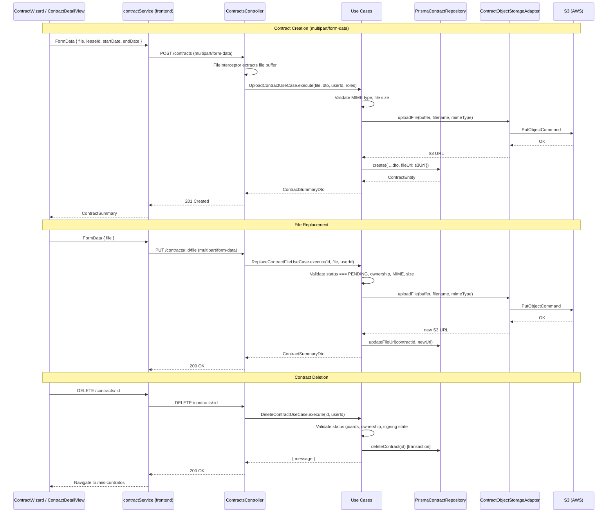

# Design Document: Contract File Management

## Overview

This feature replaces the placeholder file handling in the contracts module with real S3 upload, download, file replacement, and contract deletion. The current flow has the frontend generating a fake URL (`https://storage.placeholder.com/contracts/...`) and the backend storing it directly — the existing `ContractObjectStorageAdapter` (which has a full S3 implementation) is never invoked with the actual file bytes.

The changes span three layers:

1. **Backend API**: Switch `POST /contracts` from JSON to `multipart/form-data`, wire the file buffer through to `ContractObjectStorageAdapter.uploadFile()`, add `PUT /contracts/:id/file` for replacement, and `DELETE /contracts/:id` with status-based guards.
2. **Frontend service**: Replace `JSON.stringify` calls with `FormData` construction, send the actual `File` object.
3. **Frontend UI**: Update `ContractWizard` to submit via FormData, add "Reemplazar documento" and "Eliminar contrato" buttons to `ContractDetailView` with status-based visibility, reuse `ConfirmationDialog` for delete confirmation.

### Key Design Decisions

| Decision | Rationale |
|----------|-----------|
| Keep separate `ObjectStorageAdapter` per module | Both adapters share `@src/shared/s3` utilities but differ in allowed MIME types and S3 key prefix. Consolidating would couple modules and violate hexagonal boundaries. The shared utilities already eliminate code duplication where it matters. |
| Use S3 presigned URLs for contract file download | Unlike listing photos (public), contract PDFs are sensitive documents accessible only to contract parties. The S3 bucket stores contracts with private ACL. The backend generates short-lived presigned URLs (15 min TTL) via `GetObjectCommand` + `getSignedUrl()` when an authorized party requests the contract summary. The frontend never sees the raw S3 object URL — only the time-limited presigned URL. This avoids exposing permanent S3 URLs in the database response. |
| Store the S3 object key (not full URL) in the `File` table | Since we use presigned URLs, the `File.file_url` field stores the S3 object key (e.g. `contracts/1719849600000-uuid-filename.pdf`) instead of the full `https://bucket.s3.region.amazonaws.com/...` URL. The presigned URL is generated on-the-fly at read time by the `GetContractSummaryUseCase`. This means the stored key never expires and the presigned URL TTL is controlled server-side. |
| Determine "only landlord signed" via `Signing` table | The `contracts` schema already has `Signing` records linked to `ContractParty`. A signing with a `COMPLETED` status for a party means that party has signed. Query `Signing` records for the contract's parties to determine who has signed. |
| Use NestJS `FileInterceptor` from `@nestjs/platform-express` | Standard NestJS approach for `multipart/form-data`. The file is available as `Express.Multer.File` with `buffer`, `originalname`, `size`, and `mimetype` fields. |
| S3 error mapping to HTTP status codes | `ObjectStorageCredentialsException` and `ObjectStorageBucketNotFoundException` → 502 Bad Gateway (infrastructure misconfiguration). `ObjectStorageValidationException` → 422 (client-side validation). Generic `ObjectStorageException` → 502. |
| Cascade delete contract records in a transaction | When deleting a contract, remove `SigningLog` → `Signing` → `File` → `ContractParty` → `Contract` in a single Prisma transaction to maintain referential integrity. |

## Architecture



## Components and Interfaces

### Backend — New/Modified Components

#### 1. `UploadContractUseCase` (modified)

Current: Receives `UploadContractDto` with `fileUrl` string from JSON body.
New: Receives file buffer + metadata extracted from multipart request. Calls `IObjectStorage.uploadFile()` to get the S3 object key, stores it in the `File` record. The full download URL is never stored — it's generated as a presigned URL at read time.

```typescript
// New signature
async execute(
  file: { buffer: Buffer; originalname: string; size: number; mimetype: string },
  dto: CreateContractDto, // leaseId, startDate, endDate only
  userId: string,
  userRoles: string[],
): Promise<ContractSummaryDto>
```

#### 2. `ReplaceContractFileUseCase` (new)

Handles `PUT /contracts/:id/file`. Validates:
- Contract exists and user is the LANDLORD party
- Contract status is `PENDING`
- File is valid PDF ≤ 10 MB

Uploads new file to S3, updates the `File` record's `file_url` (stores the S3 object key).

```typescript
interface IReplaceContractFile {
  execute(
    contractId: string,
    file: { buffer: Buffer; originalname: string; size: number; mimetype: string },
    userId: string,
  ): Promise<ContractSummaryDto>;
}
```

#### 3. `DeleteContractUseCase` (new)

Handles `DELETE /contracts/:id`. Validates:
- Contract exists and user is the LANDLORD party
- Status is `PENDING` → allow delete
- Status is `SIGNATURE_PENDING` → allow only if tenant has no completed `Signing` record
- Status is `SIGNED` → reject with 409

Deletes in transaction: `SigningLog` → `Signing` → `File` → `ContractParty` → `ContractsRaw` (related) → `Contract`.

```typescript
interface IDeleteContract {
  execute(contractId: string, userId: string): Promise<{ message: string }>;
}
```

#### 4. `ContractsController` (modified)

- `POST /contracts`: Add `@UseInterceptors(FileInterceptor('file'))`, accept `@UploadedFile()` and `@Body()` fields from multipart form.
- `PUT /contracts/:id/file`: New endpoint with `FileInterceptor('file')`.
- `DELETE /contracts/:id`: New endpoint.

#### 5. `CreateContractDto` (new, replaces `UploadContractDto` for multipart)

Only contains the text fields from the multipart form: `leaseId`, `startDate`, `endDate?`. The file comes from `@UploadedFile()`.

#### 6. `IContractRepository` (extended)

New methods:
```typescript
updateFileUrl(contractId: string, newFileUrl: string): Promise<ContractEntity>;
deleteContract(contractId: string): Promise<void>;
findSigningsByContractId(contractId: string): Promise<SigningInfo[]>;
```

Where `SigningInfo`:
```typescript
interface SigningInfo {
  contractPartyId: string;
  role: string; // LANDLORD | TENANT
  signingStatusName: string; // from SigningStatus.name
}
```

#### 7. `IObjectStorage` port (extended)

Add a `getPresignedUrl` method to the existing `IObjectStorage` interface:

```typescript
export interface IObjectStorage {
  uploadFile(fileBuffer: Buffer, filename: string, mimeType: string): Promise<string>; // returns S3 object key
  getPresignedUrl(objectKey: string, expiresInSeconds?: number): Promise<string>; // returns time-limited download URL
}
```

The `ContractObjectStorageAdapter` implements `getPresignedUrl` using `@aws-sdk/s3-request-presigner`'s `getSignedUrl()` with `GetObjectCommand`. Default TTL: 900 seconds (15 minutes).

#### 8. `GetContractSummaryUseCase` (modified)

Current: Returns `fileUrl` directly from the `File` record.
New: Reads the S3 object key from `File.file_url`, calls `IObjectStorage.getPresignedUrl(objectKey)` to generate a time-limited download URL, and returns that in the `ContractSummaryDto.fileUrl` field. Also verifies the requesting user is a party of the contract before generating the URL.

Also extended to include `signingDetails` in the response.

### Frontend — New/Modified Components

#### 1. `contractService` (modified)

- `createContract()`: Build `FormData` with `file`, `leaseId`, `startDate`, `endDate`. Send with `Content-Type` omitted (browser sets `multipart/form-data` boundary automatically).
- `replaceContractFile(contractId, file, token)`: New method. `PUT /contracts/:id/file` with `FormData`.
- `deleteContract(contractId, token)`: New method. `DELETE /contracts/:id`.

#### 2. `ContractWizard` (modified)

- `handleSubmit`: Build `FormData` from `formData.file` + text fields. Call updated `contractService.createContract()`.
- Loading text: "Subiendo contrato..." during submission.
- Error handling: 422 → show validation message, 502 → show storage error with retry suggestion.

#### 3. `ContractDetailView` (modified)

New state and UI:
- Fetch contract with signing info (new `canDelete` field in response or computed client-side).
- "Reemplazar documento" button: visible when `status === 'PENDING'`. Opens file picker (PDF only). On select, calls `contractService.replaceContractFile()`.
- "Eliminar contrato" button: visible when `status === 'PENDING'` OR (`status === 'SIGNATURE_PENDING'` AND only landlord has signed). Opens `ConfirmationDialog`.
- On delete success: navigate to `/mis-contratos`.
- On 409 error: show explanatory message.

### Signing State Determination

To determine whether "only the landlord has signed" for `SIGNATURE_PENDING` contracts:

1. The `GET /contracts/:id` response will include a new `signingDetails` array with per-party signing status.
2. Backend queries: `ContractParty` → `Signing` → `SigningStatus` for each party.
3. A party "has signed" if they have a `Signing` record with `signing_status.name === 'COMPLETED'`.
4. The frontend uses this to compute button visibility:
   - `canReplace = status === 'PENDING'`
   - `canDelete = status === 'PENDING' || (status === 'SIGNATURE_PENDING' && !tenantHasSigned)`

The `ContractSummaryDto` will be extended with:
```typescript
signingDetails?: Array<{
  role: string;       // 'LANDLORD' | 'TENANT'
  hasSigned: boolean;
}>;
```

## Data Models

### Existing Models (no schema changes needed)

The `contracts` schema already has all the tables needed:

- `Contract` — main record with `contract_status_id`, `lease_id`
- `ContractParty` — links users to contracts with `role_in_contract`
- `File` — stores `file_url`, `file_type_id`, `file_status_id`, linked to `contract_id`
- `Signing` — per-party signing record with `signing_status_id`, `signing_timestamp`
- `SigningStatus` — catalog: `PENDING`, `COMPLETED`, `FAILED`
- `SigningLog` — audit trail for signing events

No new tables or columns are required. The `File.file_url` field will store the S3 object key (e.g. `contracts/1719849600000-uuid-filename.pdf`) instead of the placeholder URL. The presigned download URL is generated on-the-fly by `GetContractSummaryUseCase` when a contract party requests the contract details.

### DTO Changes

#### `CreateContractDto` (new — replaces `UploadContractDto` for the multipart endpoint)

```typescript
class CreateContractDto {
  leaseId: string;    // from form field
  startDate: string;  // ISO date from form field
  endDate?: string;   // optional ISO date from form field
}
```

#### `ContractSummaryDto` (extended)

```typescript
class SigningDetailDto {
  role: string;       // 'LANDLORD' | 'TENANT'
  hasSigned: boolean;
}

// Added to ContractSummaryDto:
signingDetails?: SigningDetailDto[];
```

#### Frontend `ContractSummary` type (extended)

```typescript
interface SigningDetail {
  role: string;
  hasSigned: boolean;
}

interface ContractSummary {
  // ... existing fields
  signingDetails?: SigningDetail[];
}
```

### S3 Object Key Format

Uses existing `generateObjectKey('contracts', filename)`:
```
contracts/{timestamp}-{uuid}-{originalFilename}.pdf
```

Example: `contracts/1719849600000-a1b2c3d4-e5f6-7890-abcd-ef1234567890-contrato-arriendo.pdf`

This key is stored in `File.file_url`. The actual download URL is a presigned URL generated at read time with a 15-minute TTL. The S3 bucket should have private ACL — no public read access for the `contracts/` prefix.

### Presigned URL Flow

```
Frontend requests GET /contracts/:id
  → Backend verifies user is a contract party
  → Backend reads File.file_url (S3 object key)
  → Backend calls ContractObjectStorageAdapter.getPresignedUrl(objectKey, 900)
  → AWS SDK generates presigned URL with 15-min expiry
  → Backend returns presigned URL in ContractSummaryDto.fileUrl
  → Frontend renders <a href={presignedUrl} target="_blank">
```

This differs from listings photos which use public S3 URLs — contract PDFs are private by design.


## Correctness Properties

*A property is a characteristic or behavior that should hold true across all valid executions of a system — essentially, a formal statement about what the system should do. Properties serve as the bridge between human-readable specifications and machine-verifiable correctness guarantees.*

### Property 1: Object key generation preserves filename and uses correct prefix

*For any* valid filename string (non-empty, non-whitespace), calling `generateObjectKey('contracts', filename)` SHALL produce a key that starts with `contracts/`, contains the original filename, and calling `parseObjectKey` on the result SHALL recover the original filename.

**Validates: Requirements 1.3**

### Property 2: Non-PDF MIME types are always rejected

*For any* MIME type string that is not exactly `application/pdf`, the upload validation (both create and replace) SHALL reject the file with a validation error, and no S3 upload or database write SHALL occur.

**Validates: Requirements 1.4, 3.5**

### Property 3: Files exceeding 10 MB are always rejected

*For any* file size in bytes greater than 10,485,760 (10 × 1024 × 1024), the upload validation (both create and replace) SHALL reject the file with a validation error, and no S3 upload or database write SHALL occur.

**Validates: Requirements 1.5, 3.6**

### Property 4: File replacement is rejected for any non-PENDING contract

*For any* contract whose status is `SIGNATURE_PENDING` or `SIGNED`, a file replacement request SHALL be rejected with a 409 Conflict, and the existing file URL SHALL remain unchanged.

**Validates: Requirements 3.2, 3.3, 6.3**

### Property 5: Non-landlord users are rejected for contract modifications

*For any* user ID that does not match the LANDLORD party of a contract, requests to replace the file or delete the contract SHALL be rejected with a 403 Forbidden, and no changes SHALL be made to the contract.

**Validates: Requirements 3.4, 4.2, 5.3**

### Property 6: Contract deletion guard based on status and signing state

*For any* contract, deletion SHALL be allowed if and only if: (a) the status is `PENDING`, OR (b) the status is `SIGNATURE_PENDING` AND the tenant party does NOT have a `Signing` record with status `COMPLETED`. For all other states (status `SIGNED`, or `SIGNATURE_PENDING` with tenant signed), deletion SHALL be rejected with a 409 Conflict.

**Validates: Requirements 4.1, 5.1, 5.2, 6.1**

### Property 7: Presigned URLs are only generated for contract parties

*For any* user ID that is NOT a party of a given contract, requesting the contract summary SHALL be rejected with a 403 Forbidden, and no presigned URL SHALL be generated. Presigned URLs are never exposed to unauthorized users.

**Validates: Requirements 2.5**

## Error Handling

### Backend Error Mapping

| Error Source | Exception Type | HTTP Status | User Message |
|---|---|---|---|
| MIME type not `application/pdf` | `UnprocessableEntityException` | 422 | "Solo se permiten archivos PDF" |
| File size > 10 MB | `UnprocessableEntityException` | 422 | "El archivo no puede superar 10 MB" |
| Missing file in multipart | `UnprocessableEntityException` | 422 | "El archivo es obligatorio" |
| Empty file buffer | `UnprocessableEntityException` | 422 | "El archivo está vacío" |
| S3 credentials error | `BadGatewayException` | 502 | "Error de configuración de almacenamiento" |
| S3 bucket not found | `BadGatewayException` | 502 | "Error de configuración de almacenamiento" |
| S3 generic error | `BadGatewayException` | 502 | "Error temporal de almacenamiento. Intenta de nuevo." |
| Replace on non-PENDING | `ConflictException` | 409 | Status-specific message |
| Delete on SIGNED | `ConflictException` | 409 | "No se puede eliminar un contrato firmado" |
| Delete on SIGNATURE_PENDING (both signed) | `ConflictException` | 409 | "No se puede eliminar un contrato que ya fue firmado por ambas partes" |
| User not landlord party | `ForbiddenException` | 403 | "No tienes permiso para realizar esta acción" |
| Contract not found | `NotFoundException` | 404 | "Contrato no encontrado" |
| Lease not found | `NotFoundException` | 404 | "Lease no encontrado" |

### S3 Exception Translation

The `UploadContractUseCase` and `ReplaceContractFileUseCase` catch `ObjectStorage*Exception` types thrown by the adapter and translate them:

```typescript
try {
  fileUrl = await this.objectStorage.uploadFile(file.buffer, file.originalname, file.mimetype);
} catch (error) {
  if (error instanceof ObjectStorageValidationException) {
    throw new UnprocessableEntityException(error.message);
  }
  if (error instanceof ObjectStorageCredentialsException || error instanceof ObjectStorageBucketNotFoundException) {
    throw new BadGatewayException('Error de configuración de almacenamiento');
  }
  if (error instanceof ObjectStorageException) {
    throw new BadGatewayException('Error temporal de almacenamiento. Intenta de nuevo.');
  }
  throw error;
}
```

### Frontend Error Handling

| HTTP Status | Frontend Behavior |
|---|---|
| 422 | Display server error message verbatim (validation errors) |
| 502 | Display "Problema temporal de almacenamiento. Intenta de nuevo más tarde." |
| 403 | Display "No tienes permiso para realizar esta acción" |
| 404 | Display "Contrato no encontrado" |
| 409 | Display server error message verbatim (conflict messages) |
| Network error | Display "No se pudo conectar con el servidor. Verifica tu conexión e intenta de nuevo." |

## Testing Strategy

### Unit Tests

Focus on specific examples, edge cases, and error conditions:

- **UploadContractUseCase**: Test with valid file → S3 called, contract created. Test with non-LANDLORD role → 403. Test with non-owned lease → 403. Test S3 error scenarios (credentials, bucket, generic) → 502.
- **ReplaceContractFileUseCase**: Test replace on PENDING → success. Test replace on SIGNATURE_PENDING → 409. Test replace on SIGNED → 409. Test non-landlord → 403.
- **DeleteContractUseCase**: Test delete PENDING → success. Test delete SIGNATURE_PENDING (landlord-only signed) → success. Test delete SIGNATURE_PENDING (both signed) → 409. Test delete SIGNED → 409. Test non-landlord → 403. Test non-existent → 404.
- **ContractWizard**: Test FormData construction. Test loading state text. Test navigation on success. Test error display for 422 and 502.
- **ContractDetailView**: Test button visibility per status. Test ConfirmationDialog flow. Test error messages.

### Property-Based Tests

Library: `fast-check` (already available in the project's test ecosystem via Jest).

Each property test runs a minimum of 100 iterations and is tagged with the design property reference.

- **Property 1** (object key round-trip): Generate random filenames → `generateObjectKey` → `parseObjectKey` → verify filename recovered. Tag: `Feature: contract-file-management, Property 1: Object key generation preserves filename and uses correct prefix`
- **Property 2** (MIME rejection): Generate random non-PDF MIME strings → call validation logic → verify rejection. Tag: `Feature: contract-file-management, Property 2: Non-PDF MIME types are always rejected`
- **Property 3** (size rejection): Generate random sizes > 10MB → call validation logic → verify rejection. Tag: `Feature: contract-file-management, Property 3: Files exceeding 10 MB are always rejected`
- **Property 4** (replace status guard): Generate contracts with random non-PENDING statuses → call replace → verify 409. Tag: `Feature: contract-file-management, Property 4: File replacement is rejected for any non-PENDING contract`
- **Property 5** (ownership guard): Generate random non-landlord user IDs → call replace/delete → verify 403. Tag: `Feature: contract-file-management, Property 5: Non-landlord users are rejected for contract modifications`
- **Property 6** (deletion guard): Generate contracts with all combinations of status × signing state → call delete → verify allowed/rejected matches the rule. Tag: `Feature: contract-file-management, Property 6: Contract deletion guard based on status and signing state`

### Integration Tests

- `POST /contracts` with multipart/form-data: verify end-to-end creation with mocked S3.
- `PUT /contracts/:id/file`: verify file replacement flow.
- `DELETE /contracts/:id`: verify cascade deletion in transaction.
- `GET /contracts/:id`: verify `signingDetails` included in response.
