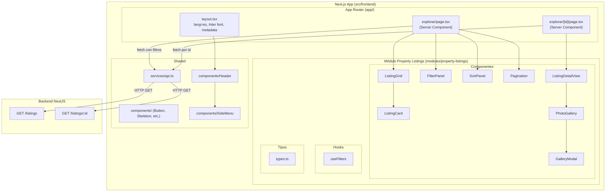
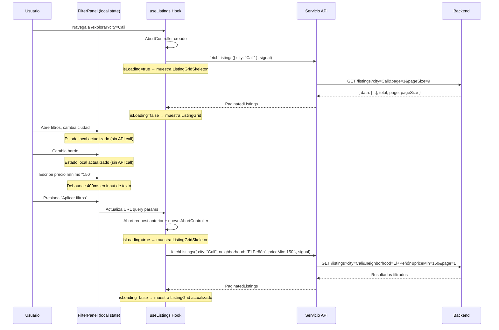
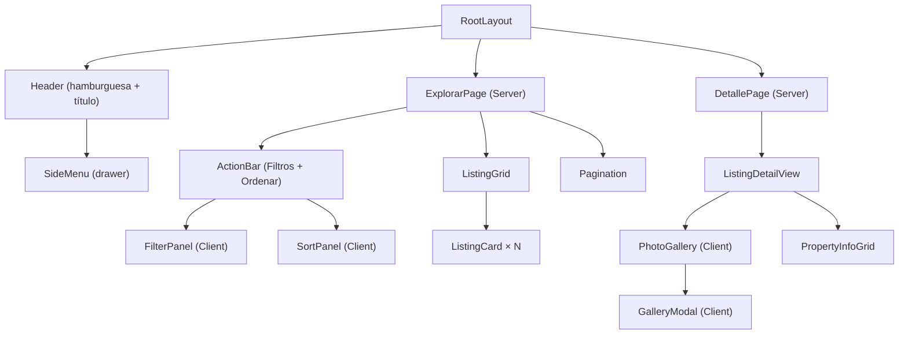

# Documento de Diseño — Explorar Inmuebles (Frontend)

## Visión General

Este diseño cubre la implementación del módulo frontend "Explorar Inmuebles" de la plataforma de arriendo de vivienda. El módulo permite a usuarios anónimos y autenticados navegar, filtrar, ordenar y paginar la oferta de inmuebles publicados, así como acceder al detalle completo de cada inmueble.

La solución se implementa como una aplicación Next.js (App Router) con Tailwind CSS y TypeScript, siguiendo un enfoque mobile-first. Consume los endpoints REST del backend NestJS existente (`GET /listings`, `GET /listings/:id`), los cuales requieren ampliación para soportar filtros avanzados, ordenamiento y paginación.

El diseño de referencia visual se encuentra en Figma: `https://www.figma.com/design/Yw53CFbVdMWVX7bQ6MFefk/properties_rental_platform_design`

### Decisiones de Diseño Clave

| Decisión | Justificación |
|----------|---------------|
| URL state (query params) para filtros/ordenamiento/paginación | Permite compartir búsquedas por enlace, back/forward del navegador funciona, SSR-friendly |
| `fetch` nativo de Next.js en capa de servicio con `AbortController` | Aprovecha caché y revalidación del framework; AbortController cancela requests en vuelo cuando el usuario cambia filtros antes de que la respuesta anterior llegue |
| Debounce de 400ms en campos de texto libre (búsqueda, precio, área) | Evita disparar una llamada API por cada tecla presionada; solo se ejecuta el fetch cuando el usuario deja de escribir |
| Filtros con acción explícita "Aplicar filtros" (no reactivos por campo) | El Panel_Filtros acumula cambios localmente y solo dispara la llamada API cuando el usuario presiona "Aplicar filtros", evitando requests intermedios |
| Skeleton loaders durante carga de datos | Comunica al usuario que los datos están siendo obtenidos sin bloquear la interfaz; mejora la percepción de velocidad |
| `React.lazy` + `Suspense` para componentes pesados (GalleryModal, FilterPanel, SortPanel) | Reduce el bundle inicial; estos componentes solo se cargan cuando el usuario los necesita |
| Componentes Server por defecto, Client solo donde hay interactividad | Minimiza JS enviado al cliente, mejora LCP |
| Panel de filtros como vista full-screen en mobile | Sigue el patrón del diseño Figma, mejor UX en pantallas pequeñas |
| Tokens de diseño en `tailwind.config.ts` | Fuente única de verdad para colores, tipografía y espaciado |
| Backend retorna datos enriquecidos en listado (`propertyType`, `neighborhood`, `rooms`, `bathrooms`) | Evita N+1 de llamadas al detalle desde el frontend para renderizar tarjetas |

---

## Arquitectura

### Diagrama de Arquitectura General



### Estrategia de Renderizado

| Página | Tipo | Razón |
|--------|------|-------|
| `/explorar` | Server Component (con Client Components hijos para interactividad) | SSR para SEO y LCP; filtros/paginación vía query params |
| `/explorar/[id]` | Server Component (con Client Components para galería) | SSR para SEO; galería y modal requieren estado del cliente |

### Flujo de Datos



---

## Componentes e Interfaces

### Estructura de Archivos del Frontend

```
src/frontend/
├── app/
│   ├── layout.tsx                          # Layout raíz (lang="es", Inter, metadata)
│   ├── page.tsx                            # Redirect a /explorar
│   └── explorar/
│       ├── page.tsx                        # Página de listado (Server Component)
│       └── [id]/
│           └── page.tsx                    # Página de detalle (Server Component)
├── modules/
│   └── property-listings/
│       ├── components/
│       │   ├── ListingGrid.tsx             # Cuadrícula responsive de tarjetas
│       │   ├── ListingCard.tsx             # Tarjeta individual de inmueble
│       │   ├── FilterPanel.tsx             # Panel de filtros (Client Component)
│       │   ├── SortPanel.tsx               # Panel de ordenamiento (Client Component)
│       │   ├── ActionBar.tsx               # Barra con botones Filtros + Ordenar
│       │   ├── PhotoGallery.tsx            # Galería de fotos con navegación
│       │   ├── GalleryModal.tsx            # Modal fullscreen de imagen ampliada
│       │   ├── ListingDetailView.tsx       # Vista completa del detalle
│       │   └── PropertyInfoGrid.tsx        # Grilla de habitaciones/baños/área
│       ├── hooks/
│       │   ├── useFilters.ts              # Hook para gestión de filtros vía URL
│       │   └── useListings.ts             # Hook para fetch con AbortController + loading state
│       └── types.ts                        # Interfaces TypeScript del módulo
├── shared/
│   ├── components/
│   │   ├── Header.tsx                      # Encabezado fijo con hamburguesa + título
│   │   ├── SideMenu.tsx                    # Menú lateral (drawer)
│   │   ├── Button.tsx                      # Botón reutilizable (primary/secondary)
│   │   ├── Skeleton.tsx                    # Skeleton loader genérico (rect, circle, text lines)
│   │   ├── ListingCardSkeleton.tsx         # Skeleton específico para tarjeta de inmueble
│   │   ├── ListingGridSkeleton.tsx         # Grid de skeletons para estado de carga del listado
│   │   ├── ListingDetailSkeleton.tsx       # Skeleton para página de detalle completa
│   │   ├── EmptyState.tsx                  # Estado vacío con mensaje
│   │   ├── ErrorState.tsx                  # Estado de error con retry
│   │   └── Pagination.tsx                  # Componente de paginación
│   ├── services/
│   │   └── api.ts                          # Capa de servicio HTTP con AbortController
│   ├── hooks/
│   │   ├── useBodyScrollLock.ts            # Lock scroll cuando hay modal/drawer abierto
│   │   └── useDebounce.ts                  # Hook genérico de debounce para valores
│   └── utils/
│       ├── formatPrice.ts                  # Formateo de precio COP
│       └── formatRelativeDate.ts           # Fecha relativa en español
├── tailwind.config.ts
├── next.config.ts
├── tsconfig.json
├── package.json
└── .env.local
```

### Jerarquía de Componentes



### Especificaciones de Componentes Clave

#### `ListingCard`
- **Props**: `listing: Listing`
- **Comportamiento**: Renderiza como `<Link>` a `/explorar/{id}`. Muestra foto principal (o primera foto, o placeholder), título "Tipo · Barrio", precio formateado, badges de habitaciones/baños, fecha relativa.
- **Imagen**: Usa `next/image` con `alt` descriptivo basado en el título.
- **Accesibilidad**: Área táctil mínima 44×44px, `<article>` semántico.

#### `FilterPanel`
- **Props**: `isOpen: boolean`, `onClose: () => void`, `currentFilters: ListingFilters`
- **Tipo**: Client Component (`'use client'`), cargado con `React.lazy`
- **Estado local**: Mantiene una copia local de los filtros que el usuario modifica. Los cambios en dropdowns e inputs se acumulan en este estado local sin disparar llamadas API.
- **Debounce**: Los campos de texto libre (precio min/max, área min/max) usan `useDebounce(400ms)` para evitar re-renders excesivos del estado local.
- **Comportamiento**: Vista fullscreen en mobile. Campos: ciudad (dropdown), barrio (dropdown, deshabilitado sin ciudad), fecha publicación (dropdown), tipo propiedad (dropdown), precio min/max (inputs numéricos con debounce), habitaciones (dropdown), baños (dropdown), área min/max (inputs numéricos con debounce). Botón "Aplicar filtros" copia el estado local a los query params de la URL (dispara fetch). Botón "Limpiar filtros" resetea el estado local y los query params. **Ningún cambio individual de campo dispara una llamada API.**

#### `SortPanel`
- **Props**: `isOpen: boolean`, `onClose: () => void`, `currentSort: { sortBy: string, sortOrder: string }`
- **Tipo**: Client Component
- **Comportamiento**: Vista fullscreen con 4 opciones radio. Check visual en opción activa. Botón "Aplicar ordenamiento".

#### `PhotoGallery`
- **Props**: `photos: Photo[]`
- **Tipo**: Client Component
- **Comportamiento**: Imagen principal con navegación izquierda/derecha (botones 36×36px semitransparentes), indicador "X / Y", puntos de navegación. Click en imagen abre `GalleryModal`.

#### `GalleryModal`
- **Props**: `photos: Photo[]`, `initialIndex: number`, `isOpen: boolean`, `onClose: () => void`
- **Tipo**: Client Component
- **Comportamiento**: Fullscreen, imagen ampliada, navegación (48×48px), miniaturas inferiores, indicador "X / Y", botón cierre (X). Cierra con Escape. Bloquea scroll del body.

#### `SideMenu`
- **Props**: `isOpen: boolean`, `onClose: () => void`, `user?: { name: string, role: string } | null`
- **Tipo**: Client Component
- **Comportamiento**: Drawer 320px desde la izquierda. Si autenticado: avatar, nombre, rol, enlaces completos. Si anónimo: solo "Explorar inmuebles" + opciones login/registro. Cierra al click fuera o botón X.

#### `Pagination`
- **Props**: `total: number`, `page: number`, `pageSize: number`, `onPageChange: (page: number) => void`, `onPageSizeChange: (size: number) => void`
- **Comportamiento**: Muestra "Mostrando X a Y de Z resultados", selector de items por página, botones anterior/siguiente y números de página.

### Hook `useFilters`

```typescript
// Gestiona el estado de filtros sincronizado con query params de la URL
function useFilters(): {
  filters: ListingFilters;
  setFilter: (key: keyof ListingFilters, value: string | number | undefined) => void;
  clearFilters: () => void;
  setSort: (sortBy: string, sortOrder: string) => void;
  setPage: (page: number) => void;
  setPageSize: (pageSize: number) => void;
}
```

Internamente usa `useSearchParams` y `useRouter` de Next.js para leer/escribir query params. Cada cambio de filtro navega a la misma ruta con los params actualizados, lo que dispara un re-render del Server Component padre.

### Control de Llamadas API

#### Principio: No disparar requests en cada interacción del usuario

El frontend implementa tres mecanismos para controlar cuándo se ejecutan llamadas al backend:

#### 1. Acción explícita en paneles (Filtros y Ordenamiento)

El `FilterPanel` y `SortPanel` **no** disparan llamadas API al cambiar cada campo. Los cambios se acumulan en estado local del componente. Solo cuando el usuario presiona "Aplicar filtros" o "Aplicar ordenamiento" se actualizan los query params de la URL, lo que dispara el fetch en el Server Component.

```
Usuario cambia ciudad → estado local del FilterPanel
Usuario cambia barrio → estado local del FilterPanel
Usuario cambia precio → estado local del FilterPanel
Usuario presiona "Aplicar filtros" → actualiza URL query params → Server Component re-fetch
```

#### 2. Debounce en campos de texto libre

Para campos donde el usuario escribe texto (búsqueda por título, inputs de precio mínimo/máximo, inputs de área mínimo/máximo), se aplica un debounce de 400ms. El valor solo se actualiza en el estado local del `FilterPanel` después de que el usuario deja de escribir por 400ms.

```typescript
// shared/hooks/useDebounce.ts
function useDebounce<T>(value: T, delay: number = 400): T {
  const [debouncedValue, setDebouncedValue] = useState(value);
  useEffect(() => {
    const timer = setTimeout(() => setDebouncedValue(value), delay);
    return () => clearTimeout(timer);
  }, [value, delay]);
  return debouncedValue;
}
```

Esto se usa dentro del `FilterPanel` para los campos de texto, pero dado que el panel ya requiere acción explícita ("Aplicar filtros"), el debounce aquí es principalmente para evitar re-renders innecesarios del estado local. Si en el futuro se agrega búsqueda reactiva fuera del panel, el debounce será crítico.

#### 3. AbortController para cancelar requests en vuelo

Cuando el usuario navega rápidamente (ej. cambia de página, aplica filtros y luego cambia de página de nuevo antes de que la primera respuesta llegue), el request anterior se cancela automáticamente usando `AbortController`.

```typescript
// modules/property-listings/hooks/useListings.ts
function useListings(filters: ListingFilters) {
  const [data, setData] = useState<PaginatedListings | null>(null);
  const [isLoading, setIsLoading] = useState(true);
  const [error, setError] = useState<Error | null>(null);

  useEffect(() => {
    const controller = new AbortController();
    setIsLoading(true);
    setError(null);

    fetchListings(filters, controller.signal)
      .then(setData)
      .catch((err) => {
        if (err.name !== 'AbortError') setError(err);
      })
      .finally(() => {
        if (!controller.signal.aborted) setIsLoading(false);
      });

    return () => controller.abort(); // Cancela el request anterior
  }, [filters]);

  return { data, isLoading, error, retry: () => { /* re-trigger */ } };
}
```

El servicio API acepta un `signal` opcional:

```typescript
// shared/services/api.ts
export async function fetchListings(
  filters: ListingFilters,
  signal?: AbortSignal
): Promise<PaginatedListings> {
  const params = new URLSearchParams();
  // ... build params
  const res = await fetch(`${API_URL}/listings?${params}`, { signal });
  if (!res.ok) throw new Error(`Error al obtener inmuebles: ${res.status}`);
  return res.json();
}
```

### Skeleton Loaders

Los skeletons replican la estructura visual del contenido que se está cargando, usando bloques animados con `animate-pulse` de Tailwind.

#### `ListingCardSkeleton`

Replica la estructura de `ListingCard`:
- Rectángulo gris para la imagen (aspect ratio igual al de la foto real)
- Línea de texto para el título (60% del ancho)
- Línea corta para el precio (30% del ancho)
- Dos badges pequeños para habitaciones/baños
- Línea corta para la fecha (40% del ancho)

```tsx
function ListingCardSkeleton() {
  return (
    <div className="border border-neutral-300 rounded-card overflow-hidden shadow-card">
      <div className="bg-neutral-100 animate-pulse h-[296px]" />
      <div className="p-4 space-y-3">
        <div className="bg-neutral-100 animate-pulse h-6 w-3/5 rounded" />
        <div className="flex justify-between items-center">
          <div className="bg-neutral-100 animate-pulse h-5 w-1/3 rounded" />
          <div className="flex gap-2">
            <div className="bg-neutral-100 animate-pulse h-7 w-12 rounded-badge" />
            <div className="bg-neutral-100 animate-pulse h-7 w-12 rounded-badge" />
          </div>
        </div>
        <div className="bg-neutral-100 animate-pulse h-4 w-2/5 rounded" />
      </div>
    </div>
  );
}
```

#### `ListingGridSkeleton`

Renderiza un grid de `ListingCardSkeleton` (por defecto 6 tarjetas en desktop, 3 en mobile) con el mismo layout responsive que `ListingGrid`.

#### `ListingDetailSkeleton`

Replica la estructura de la página de detalle:
- Rectángulo grande para la galería de fotos
- Líneas para precio y título
- Tres bloques para la grilla de habitaciones/baños/área
- Líneas para descripción, características y ubicación
- Rectángulo para el botón de contacto

#### Cuándo se muestran los skeletons

| Escenario | Skeleton mostrado |
|-----------|-------------------|
| Carga inicial de `/explorar` | `ListingGridSkeleton` (6 tarjetas) |
| Cambio de filtros/ordenamiento/página | `ListingGridSkeleton` reemplaza el grid actual |
| Carga de `/explorar/[id]` | `ListingDetailSkeleton` |
| Imágenes de tarjetas cargando | `next/image` con `placeholder="blur"` o fondo neutral |

Los skeletons se muestran usando el estado `isLoading` del hook `useListings` o mediante `React.Suspense` con fallback en Server Components.

### Lazy Loading de Componentes

Los componentes que no se necesitan en la carga inicial se cargan bajo demanda con `React.lazy` + `Suspense`:

```typescript
// Componentes cargados lazy (solo cuando el usuario los abre)
const FilterPanel = lazy(() => import('./components/FilterPanel'));
const SortPanel = lazy(() => import('./components/SortPanel'));
const GalleryModal = lazy(() => import('./components/GalleryModal'));
const SideMenu = lazy(() => import('../shared/components/SideMenu'));
```

Cada uno se envuelve en `<Suspense>` con un fallback mínimo (spinner o null, ya que son modales/drawers que aparecen sobre el contenido existente):

```tsx
<Suspense fallback={null}>
  {isFilterOpen && <FilterPanel ... />}
</Suspense>
```

Esto reduce el bundle JS inicial significativamente, ya que `FilterPanel` (con 8 campos de formulario), `SortPanel`, `GalleryModal` y `SideMenu` solo se descargan cuando el usuario interactúa con ellos.

---

## Modelos de Datos

### Interfaces TypeScript del Frontend

```typescript
// modules/property-listings/types.ts

export interface Photo {
  id: string;
  fileUrl: string;
  isMain: boolean;
}

export interface Listing {
  id: string;
  portfolioUnitId: string;
  title: string;
  description: string | null;
  listingDate: string; // ISO date string
  price: number;
  currency: string;
  isActive: boolean;
  photos: Photo[];
  numberOfRooms: number | null;
  numberOfBathrooms: number | null;
  propertyType: string | null;
  neighborhood: string | null;
}

export interface ListingAddress {
  state: string;
  city: string;
  neighborhood: string;
  address: string;
}

export interface ListingDetail extends Listing {
  address: ListingAddress | null;
  landlordUserId: string | null;
}

export interface ListingFilters {
  city?: string;
  neighborhood?: string;
  search?: string;
  propertyType?: string;
  priceMin?: number;
  priceMax?: number;
  rooms?: number;
  bathrooms?: number;
  areaMin?: number;
  areaMax?: number;
  publishedWithin?: '24h' | '7d' | '30d' | '90d' | 'any';
  sortBy?: 'date' | 'price';
  sortOrder?: 'asc' | 'desc';
  page?: number;
  pageSize?: number;
}

export interface PaginatedListings {
  data: Listing[];
  total: number;
  page: number;
  pageSize: number;
}
```

### Servicio API

```typescript
// shared/services/api.ts

const API_URL = process.env.NEXT_PUBLIC_API_URL;

export async function fetchListings(
  filters: ListingFilters,
  signal?: AbortSignal
): Promise<PaginatedListings> {
  const params = new URLSearchParams();
  Object.entries(filters).forEach(([key, value]) => {
    if (value !== undefined && value !== '') {
      params.set(key, String(value));
    }
  });
  const res = await fetch(`${API_URL}/listings?${params.toString()}`, { signal });
  if (!res.ok) throw new Error(`Error al obtener inmuebles: ${res.status}`);
  return res.json();
}

export async function fetchListingDetail(
  id: string,
  signal?: AbortSignal
): Promise<ListingDetail> {
  const res = await fetch(`${API_URL}/listings/${id}`, { signal });
  if (!res.ok) {
    if (res.status === 404) throw new Error('NOT_FOUND');
    throw new Error(`Error al obtener detalle: ${res.status}`);
  }
  return res.json();
}
```

### Cambios Requeridos en el Backend

#### 1. `ListingFiltersDto` ampliado

```typescript
// Nuevos campos en listing-filters.dto.ts
export class ListingFiltersDto {
  // ... campos existentes (city, neighborhood, search)

  @ApiPropertyOptional({ example: 'Apartamento' })
  @IsOptional()
  @IsString()
  propertyType?: string;

  @ApiPropertyOptional({ example: 500000 })
  @IsOptional()
  @IsNumber()
  @Type(() => Number)
  priceMin?: number;

  @ApiPropertyOptional({ example: 3000000 })
  @IsOptional()
  @IsNumber()
  @Type(() => Number)
  priceMax?: number;

  @ApiPropertyOptional({ example: 2 })
  @IsOptional()
  @IsNumber()
  @Type(() => Number)
  rooms?: number;

  @ApiPropertyOptional({ example: 1 })
  @IsOptional()
  @IsNumber()
  @Type(() => Number)
  bathrooms?: number;

  @ApiPropertyOptional({ example: 30 })
  @IsOptional()
  @IsNumber()
  @Type(() => Number)
  areaMin?: number;

  @ApiPropertyOptional({ example: 150 })
  @IsOptional()
  @IsNumber()
  @Type(() => Number)
  areaMax?: number;

  @ApiPropertyOptional({ enum: ['24h', '7d', '30d', '90d', 'any'] })
  @IsOptional()
  @IsIn(['24h', '7d', '30d', '90d', 'any'])
  publishedWithin?: string;

  @ApiPropertyOptional({ enum: ['date', 'price'], default: 'date' })
  @IsOptional()
  @IsIn(['date', 'price'])
  sortBy?: string;

  @ApiPropertyOptional({ enum: ['asc', 'desc'], default: 'desc' })
  @IsOptional()
  @IsIn(['asc', 'desc'])
  sortOrder?: string;

  @ApiPropertyOptional({ example: 1, default: 1 })
  @IsOptional()
  @IsNumber()
  @Type(() => Number)
  page?: number;

  @ApiPropertyOptional({ example: 9, default: 9 })
  @IsOptional()
  @IsNumber()
  @Type(() => Number)
  pageSize?: number;
}
```

#### 2. `ListingResponseDto` enriquecido

```typescript
// Campos adicionales en listing-response.dto.ts
export class ListingResponseDto {
  // ... campos existentes

  @ApiPropertyOptional({ nullable: true })
  numberOfRooms!: number | null;

  @ApiPropertyOptional({ nullable: true })
  numberOfBathrooms!: number | null;

  @ApiPropertyOptional({ nullable: true })
  propertyType!: string | null;

  @ApiPropertyOptional({ nullable: true })
  neighborhood!: string | null;
}
```

#### 3. Respuesta paginada

```typescript
// Nuevo DTO: paginated-listings-response.dto.ts
export class PaginatedListingsResponseDto {
  @ApiProperty({ type: [ListingResponseDto] })
  data!: ListingResponseDto[];

  @ApiProperty({ example: 42 })
  total!: number;

  @ApiProperty({ example: 1 })
  page!: number;

  @ApiProperty({ example: 9 })
  pageSize!: number;
}
```

#### 4. Cambios en el repositorio (`findPublished`)

El método `findPublished` del `PrismaListingRepository` debe:
- Resolver `Property` y `Address` para cada listing (vía `PortfolioUnit`) para aplicar filtros de `propertyType`, `rooms`, `bathrooms`, `area` y para enriquecer la respuesta con `neighborhood`.
- Aplicar filtro `publishedWithin` sobre `Listing.listing_date`.
- Aplicar filtros de `priceMin`/`priceMax` sobre `Listing.price`.
- Aplicar ordenamiento (`sortBy` + `sortOrder`).
- Aplicar paginación (`skip`/`take` basado en `page`/`pageSize`).
- Retornar `{ data, total }` en lugar de un arreglo plano.

La estrategia de consulta cross-schema sigue el patrón existente: primero resolver `Address` → `Property` → `PortfolioUnit` IDs, luego filtrar `Listing` por esos IDs.

### Configuración de Tailwind (Tokens de Diseño)

```typescript
// tailwind.config.ts
import type { Config } from 'tailwindcss';

const config: Config = {
  content: [
    './app/**/*.{ts,tsx}',
    './modules/**/*.{ts,tsx}',
    './shared/**/*.{ts,tsx}',
  ],
  theme: {
    extend: {
      fontFamily: {
        sans: ['Inter', 'system-ui', 'sans-serif'],
      },
      colors: {
        primary: '#1d4ed8',
        neutral: {
          900: '#111827',
          600: '#4b5563',
          300: '#d1d5db',
          100: '#f3f4f6',
          50: '#f9fafb',
        },
      },
      fontSize: {
        h1: ['32px', { lineHeight: '1.2', fontWeight: '700' }],
        h2: ['24px', { lineHeight: '1.3', fontWeight: '700' }],
        h3: ['20px', { lineHeight: '1.4', fontWeight: '600' }],
        body: ['16px', { lineHeight: '1.5', fontWeight: '400' }],
        caption: ['14px', { lineHeight: '1.5', fontWeight: '400' }],
        small: ['12px', { lineHeight: '1.5', fontWeight: '400' }],
      },
      spacing: {
        'mobile-margin': '16px',
        'desktop-margin': '52px',
        'section-gap': '24px',
        'element-gap': '12px',
      },
      borderRadius: {
        card: '6px',
        badge: '4px',
      },
      boxShadow: {
        card: '0px 1px 2px rgba(0, 0, 0, 0.05)',
      },
    },
  },
  plugins: [],
};

export default config;
```


---

## Propiedades de Correctitud

*Una propiedad es una característica o comportamiento que debe mantenerse verdadero en todas las ejecuciones válidas de un sistema — esencialmente, una declaración formal sobre lo que el sistema debe hacer. Las propiedades sirven como puente entre especificaciones legibles por humanos y garantías de correctitud verificables por máquina.*

### Propiedad 1: Round-trip de filtros en URL

*Para cualquier* objeto `ListingFilters` válido, serializar los filtros como query params de la URL y luego parsearlos de vuelta a un objeto `ListingFilters` debe producir un objeto equivalente al original.

**Valida: Requisito 3.13**

### Propiedad 2: Mapeo de filtros a parámetros de API

*Para cualquier* combinación válida de filtros, la URL construida por el Servicio_API debe contener exactamente los parámetros con valores definidos (no `undefined` ni cadena vacía) como query params, y no debe incluir parámetros con valores indefinidos.

**Valida: Requisito 3.12**

### Propiedad 3: Limpiar filtros restablece al estado inicial

*Para cualquier* conjunto de filtros activos (con uno o más valores definidos), ejecutar la acción "Limpiar filtros" debe producir un objeto de filtros donde todos los campos son `undefined` (estado inicial).

**Valida: Requisito 3.11**

### Propiedad 4: Selector de barrio deshabilitado sin ciudad

*Para cualquier* estado de filtros, si el campo `city` es `undefined` o cadena vacía, el selector de barrio (`neighborhood`) debe estar deshabilitado. Si `city` tiene un valor no vacío, el selector de barrio debe estar habilitado.

**Valida: Requisito 3.3**

### Propiedad 5: Selección de foto principal en tarjeta

*Para cualquier* arreglo no vacío de fotos, la foto seleccionada para la tarjeta debe ser la que tiene `isMain === true` si existe; de lo contrario, debe ser la primera foto del arreglo.

**Valida: Requisito 4.2**

### Propiedad 6: Formato de título "Tipo · Barrio"

*Para cualquier* par de cadenas `propertyType` y `neighborhood` no nulas, el título formateado de la tarjeta debe contener ambos valores separados por " · ". Si alguno es nulo, el título debe mostrar solo el valor disponible sin el separador.

**Valida: Requisito 4.3**

### Propiedad 7: Formato de precio en COP

*Para cualquier* número no negativo, la función `formatPrice` debe producir una cadena que comience con "$", use puntos como separadores de miles (formato colombiano), y no contenga decimales. Además, parsear los dígitos de la cadena resultante (removiendo "$" y ".") debe producir el número original.

**Valida: Requisitos 4.4, 5.5**

### Propiedad 8: Fecha relativa en español

*Para cualquier* fecha en el pasado (entre hace 1 minuto y hace 365 días), la función `formatRelativeDate` debe producir una cadena no vacía en español que comience con "Publicado hace" y contenga una unidad de tiempo válida (minuto, hora, día, semana, mes).

**Valida: Requisito 4.6**

### Propiedad 9: Atributos derivados de la tarjeta

*Para cualquier* listing con un `id` y un `title` no vacío, la tarjeta debe generar un `href` igual a `/explorar/${id}` y un atributo `alt` de imagen que contenga el `title` del listing.

**Valida: Requisitos 4.7, 4.8**

### Propiedad 10: Indicador de posición de la galería

*Para cualquier* arreglo de fotos de longitud N (N ≥ 1) y un índice actual I (1 ≤ I ≤ N), el indicador de posición de la galería debe mostrar el texto "I / N".

**Valida: Requisito 5.3**

### Propiedad 11: Backend acepta filtros válidos

*Para cualquier* combinación válida de parámetros de filtrado (`propertyType` como string, `priceMin`/`priceMax` como números no negativos, `rooms`/`bathrooms` como enteros positivos, `areaMin`/`areaMax` como números positivos, `publishedWithin` como uno de `24h|7d|30d|90d|any`), el endpoint `GET /listings` debe aceptar la solicitud sin errores de validación y retornar un status 200.

**Valida: Requisitos 6.1, 6.2, 6.8**

### Propiedad 12: Ordenamiento correcto en backend

*Para cualquier* par válido de `sortBy` (`date` o `price`) y `sortOrder` (`asc` o `desc`), los listings retornados por `GET /listings` deben estar ordenados según el campo y dirección especificados: si `sortBy=date`, ordenados por `listingDate`; si `sortBy=price`, ordenados por `price`.

**Valida: Requisito 6.3**

### Propiedad 13: Paginación correcta en backend

*Para cualquier* `page` (≥ 1) y `pageSize` (≥ 1) válidos, la respuesta de `GET /listings` debe retornar un objeto con `data` (arreglo de longitud ≤ `pageSize`), `total` (número total de resultados), `page` (igual al solicitado) y `pageSize` (igual al solicitado). Además, si `total > 0`, la longitud de `data` debe ser `min(pageSize, total - (page - 1) * pageSize)` cuando la página existe, o 0 si la página excede el total.

**Valida: Requisitos 6.4, 6.5**

### Propiedad 14: Respuesta enriquecida del backend

*Para cualquier* listing que esté vinculado a una propiedad (vía `PortfolioUnit`), la respuesta de `GET /listings` debe incluir `numberOfRooms`, `numberOfBathrooms` y `propertyType` con los valores de la tabla `Property`, y `neighborhood` con el valor de la tabla `Address`.

**Valida: Requisitos 6.6, 6.7**

### Propiedad 15: Propagación de errores en Servicio_API

*Para cualquier* respuesta HTTP con status no exitoso (4xx o 5xx), las funciones `fetchListings` y `fetchListingDetail` del Servicio_API deben lanzar un `Error` cuyo mensaje contenga el código de status HTTP.

**Valida: Requisito 7.6**

### Propiedad 16: Texto del botón de ordenamiento refleja selección

*Para cualquier* opción de ordenamiento seleccionada, el texto del botón de ordenamiento en la barra de acciones debe coincidir con la etiqueta de la opción seleccionada (ej. "Más recientes", "Precio: menor a mayor").

**Valida: Requisito 10.5**

### Propiedad 17: Debounce suprime llamadas intermedias

*Para cualquier* secuencia de N cambios de valor en un campo con debounce (N ≥ 2) que ocurren dentro de un intervalo menor al delay de debounce (400ms), solo el último valor de la secuencia debe propagarse como valor debounced. Los valores intermedios no deben generar actualizaciones de estado.

**Valida: Control de llamadas API (decisión de diseño)**

### Propiedad 18: AbortController cancela requests previos

*Para cualquier* secuencia de dos invocaciones consecutivas de `useListings` con filtros distintos, el `AbortController` de la primera invocación debe ser abortado antes de que la segunda invocación inicie su fetch. Si la primera respuesta llega después del abort, no debe actualizar el estado del componente.

**Valida: Control de llamadas API (decisión de diseño)**

### Propiedad 19: Filtros no disparan API sin acción explícita

*Para cualquier* secuencia de cambios en campos del `FilterPanel` (sin presionar "Aplicar filtros"), el número de llamadas HTTP realizadas al backend debe ser cero. Solo al ejecutar la acción "Aplicar filtros" se debe generar exactamente una llamada HTTP.

**Valida: Control de llamadas API (decisión de diseño)**

---

## Manejo de Errores

| Escenario | Componente | Comportamiento |
|-----------|------------|----------------|
| API retorna error de red / 5xx en listado | `ExplorarPage` | Muestra `ErrorState` con mensaje "No pudimos cargar los inmuebles. Intenta de nuevo." y botón "Reintentar" |
| API retorna listado vacío | `ExplorarPage` | Muestra `EmptyState` con mensaje "No se encontraron inmuebles. Intenta ajustar los filtros de búsqueda." |
| API retorna 404 en detalle | `DetallePage` | Muestra mensaje "Este inmueble no fue encontrado" con enlace "Volver a explorar" → `/explorar` |
| API retorna error de red / 5xx en detalle | `DetallePage` | Muestra `ErrorState` con mensaje y botón "Reintentar" |
| Listing sin fotos | `ListingCard` | Muestra imagen placeholder con alt "Sin fotografía disponible" |
| Listing sin `propertyType` o `neighborhood` | `ListingCard` | Muestra solo el valor disponible en el título, sin separador " · " |
| `NEXT_PUBLIC_API_URL` no configurada | `api.ts` | Las llamadas fallan con error descriptivo; en desarrollo se usa fallback a `http://localhost:3001` |
| Filtro de precio con min > max | `FilterPanel` | Validación del lado del cliente; no envía la solicitud, muestra mensaje de ayuda |

### Estrategia de Retry

El botón "Reintentar" en los estados de error ejecuta una recarga de la página (en Server Components) o una re-invocación del fetch (en Client Components). No se implementa retry automático con backoff en el frontend MVP — el usuario decide cuándo reintentar.

---

## Estrategia de Testing

### Enfoque Dual: Tests Unitarios + Tests de Propiedades

#### Tests de Propiedades (Property-Based Testing)

- **Librería**: [fast-check](https://github.com/dubzzz/fast-check) para TypeScript
- **Mínimo 100 iteraciones** por test de propiedad
- **Cada test referencia** la propiedad del documento de diseño

Las propiedades 1-10 y 15-16 son funciones puras del frontend (formateo, serialización, lógica de selección) ideales para PBT. Las propiedades 11-14 involucran el backend y se testean con tests de integración con mocks del repositorio.

**Propiedades frontend testeables con fast-check:**
- Propiedad 1: Round-trip de filtros en URL — `fc.record()` con campos opcionales
- Propiedad 2: Mapeo de filtros a API params — `fc.record()` verificando URLSearchParams
- Propiedad 3: Limpiar filtros — `fc.record()` verificando reset
- Propiedad 4: Barrio deshabilitado sin ciudad — `fc.option(fc.string())` para city
- Propiedad 5: Selección de foto — `fc.array(photoArb)` con `fc.boolean()` para isMain
- Propiedad 6: Formato de título — `fc.tuple(fc.option(fc.string()), fc.option(fc.string()))`
- Propiedad 7: Formato de precio — `fc.nat()` verificando round-trip de dígitos
- Propiedad 8: Fecha relativa — `fc.date()` en rango pasado
- Propiedad 9: Atributos de tarjeta — `fc.record({ id: fc.uuid(), title: fc.string() })`
- Propiedad 10: Indicador de galería — `fc.nat()` para N y I
- Propiedad 15: Error propagation — `fc.integer({ min: 400, max: 599 })` para status codes
- Propiedad 16: Texto de botón de sort — `fc.constantFrom(...)` para opciones
- Propiedad 17: Debounce — `fc.array(fc.string())` con timing assertions usando fake timers
- Propiedad 18: AbortController — `fc.array(fc.record(...))` para secuencias de filtros, verificando abort
- Propiedad 19: Filtros sin acción explícita — `fc.array(fc.record(...))` verificando 0 llamadas HTTP

**Propiedades backend testeables con fast-check (con mocks):**
- Propiedad 11: Filtros válidos aceptados — generadores de DTOs válidos
- Propiedad 12: Ordenamiento — generar listas y verificar orden
- Propiedad 13: Paginación — generar listas y verificar slicing
- Propiedad 14: Respuesta enriquecida — generar entidades con propiedades vinculadas

**Tag format**: `Feature: explore-properties-frontend, Property {N}: {título}`

#### Tests Unitarios (Example-Based)

Tests unitarios con Jest/Vitest para escenarios específicos y edge cases:

- **Componentes**: Renderizado correcto de `ListingCard`, `FilterPanel`, `SortPanel`, `PhotoGallery`, `GalleryModal`, `SideMenu`, `Pagination`, `Header`
- **Estados de UI**: Loading (skeleton), empty state, error state con retry
- **Edge cases**: Listing sin fotos (placeholder), listing sin propertyType/neighborhood, galería con una sola foto
- **Accesibilidad**: Elementos semánticos, atributos ARIA, labels en formularios
- **Responsive**: Clases CSS correctas para breakpoints mobile/desktop
- **Interacciones**: Abrir/cerrar filtros, abrir/cerrar menú, navegación de galería, cierre de modal con Escape

#### Tests de Integración

- Verificar que las páginas Server Component renderizan correctamente con datos mock del API
- Verificar que los query params de la URL se propagan correctamente al Servicio_API
- Verificar que el backend con los nuevos filtros/sorting/paginación retorna resultados correctos contra una base de datos de prueba
