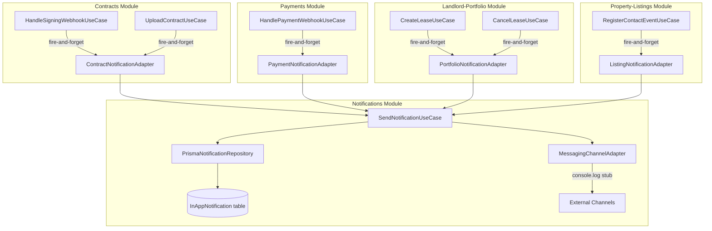
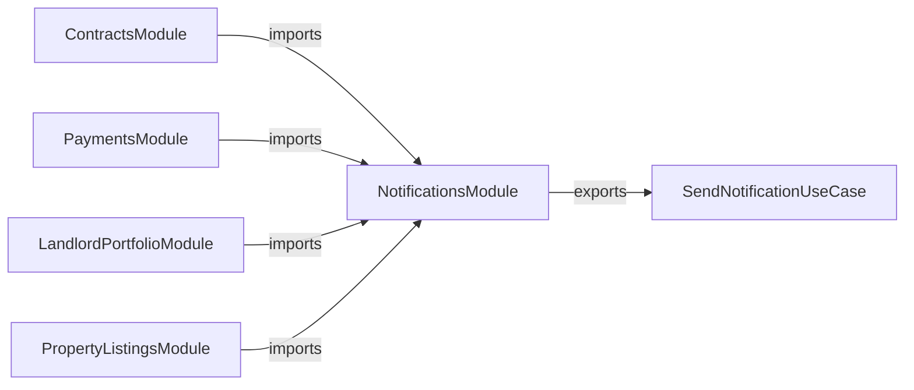

# Design Document: In-App Notifications Wiring

## Overview

This feature replaces the empty notification port stubs in four backend modules (contracts, payments, landlord-portfolio, property-listings) with real `@Injectable()` adapter classes that delegate to the existing `SendNotificationUseCase` in the notifications module. The result is that key rental lifecycle events — contract signing, contract upload, payment receipt, lease creation, lease cancellation, and tenant interest — produce real `InAppNotification` records visible on the `/mis-notificaciones` page.

The scope is strictly backend wiring. No new database tables, no new API endpoints, no frontend changes. The existing `SendNotificationUseCase` already handles notification type resolution, content building, in-app record creation, and external messaging attempts. The adapters are thin delegation layers that translate module-specific method signatures into `SendNotificationDto` calls.

External messaging (WhatsApp/email) remains stubbed via `MessagingChannelAdapter` — only in-app notifications are activated.

### Design Rationale

- **Thin adapters over direct coupling**: Each module keeps its own `INotificationPort` interface, and the adapter translates domain-specific method calls into the generic `SendNotificationDto`. This preserves hexagonal architecture boundaries — modules don't depend on the notifications module's internal DTOs at the domain level.
- **NestJS module imports over manual wiring**: Each consuming module imports `NotificationsModule` to access `SendNotificationUseCase` via DI, following the established cross-module communication pattern.
- **Fire-and-forget preserved**: The existing `.catch(() => undefined)` pattern in use cases remains unchanged. Adapters themselves are async but the calling use cases never await them.

## Architecture

### High-Level Data Flow



### NestJS Module Dependency Graph



Each consuming module:
1. Adds `NotificationsModule` to its `imports` array
2. Replaces the `useValue` stub with `useClass: XxxNotificationAdapter` for its notification port token
3. The adapter receives `SendNotificationUseCase` via constructor injection (provided by the imported `NotificationsModule`)

## Components and Interfaces

### 1. Contracts Module — `ContractNotificationAdapter`

**File**: `src/backend/modules/contracts/infrastructure/adapters/contract-notification.adapter.ts`

**Implements**: `INotificationPort` from `src/backend/modules/contracts/domain/ports/notification.port.ts`

The existing `INotificationPort` interface needs to be extended with a `notifyContractUploaded` method:

```typescript
// Updated contracts/domain/ports/notification.port.ts
export interface INotificationPort {
  notifyContractSigned(
    landlordUserId: string,
    tenantUserId: string,
    contractId: string,
    signedAt: Date,
  ): Promise<void>;
  notifySigningFailed(userId: string, contractId: string): Promise<void>;
  notifyContractUploaded(
    tenantUserId: string,
    contractId: string,
    leaseId: string,
  ): Promise<void>;
}
```

**Adapter class**:

```typescript
@Injectable()
export class ContractNotificationAdapter implements INotificationPort {
  constructor(private readonly sendNotification: SendNotificationUseCase) {}

  async notifyContractSigned(
    landlordUserId: string,
    tenantUserId: string,
    contractId: string,
    signedAt: Date,
  ): Promise<void> {
    const data = { contractId, signedAt: signedAt.toISOString() };
    await this.sendNotification.execute({
      userId: landlordUserId,
      notificationTypeName: 'CONTRACT_SIGNED',
      eventSource: 'contract.signed',
      data,
    });
    await this.sendNotification.execute({
      userId: tenantUserId,
      notificationTypeName: 'CONTRACT_SIGNED',
      eventSource: 'contract.signed',
      data,
    });
  }

  async notifySigningFailed(userId: string, contractId: string): Promise<void> {
    await this.sendNotification.execute({
      userId,
      notificationTypeName: 'CONTRACT_SIGNED',
      eventSource: 'contract.signing_failed',
      data: { contractId },
    });
  }

  async notifyContractUploaded(
    tenantUserId: string,
    contractId: string,
    leaseId: string,
  ): Promise<void> {
    if (!tenantUserId) return; // skip silently if tenant unresolved
    await this.sendNotification.execute({
      userId: tenantUserId,
      notificationTypeName: 'CONTRACT_UPLOADED',
      eventSource: 'contract.uploaded',
      data: { contractId, leaseId },
    });
  }
}
```

**Module wiring change** in `contracts.module.ts`:
- Add `NotificationsModule` to `imports`
- Replace `{ provide: CONTRACT_NOTIFICATION_PORT, useValue: { ... } }` with `{ provide: CONTRACT_NOTIFICATION_PORT, useClass: ContractNotificationAdapter }`

**Use case integration**: `UploadContractUseCase` needs to call `notifyContractUploaded` after successful upload. The call follows the fire-and-forget pattern:

```typescript
// In UploadContractUseCase.execute(), after creating the contract:
if (tenantUserId) {
  this.notificationPort
    .notifyContractUploaded(tenantUserId, contract.id, dto.leaseId)
    .catch(() => undefined);
}
```

This requires injecting `CONTRACT_NOTIFICATION_PORT` into `UploadContractUseCase`.

### 2. Payments Module — `PaymentNotificationAdapter`

**File**: `src/backend/modules/payments/infrastructure/adapters/payment-notification.adapter.ts`

**Implements**: `IPaymentNotificationPort` from `src/backend/modules/payments/domain/ports/notification.port.ts`

The existing interface is sufficient — no changes needed:

```typescript
export interface IPaymentNotificationPort {
  notifyPaymentReceived(
    landlordUserId: string,
    amount: number,
    currency: string,
    leaseId: string,
  ): Promise<void>;
}
```

**Adapter class**:

```typescript
@Injectable()
export class PaymentNotificationAdapter implements IPaymentNotificationPort {
  constructor(private readonly sendNotification: SendNotificationUseCase) {}

  async notifyPaymentReceived(
    landlordUserId: string,
    amount: number,
    currency: string,
    leaseId: string,
  ): Promise<void> {
    await this.sendNotification.execute({
      userId: landlordUserId,
      notificationTypeName: 'PAYMENT_RECEIVED',
      eventSource: 'payment.received',
      data: { amount, currency, leaseId },
    });
  }
}
```

**Module wiring change** in `payments.module.ts`:
- Add `NotificationsModule` to `imports`
- Replace `{ provide: PAYMENT_NOTIFICATION_PORT, useValue: { ... } }` with `{ provide: PAYMENT_NOTIFICATION_PORT, useClass: PaymentNotificationAdapter }`

### 3. Landlord-Portfolio Module — `PortfolioNotificationAdapter`

**File**: `src/backend/modules/landlord-portfolio/infrastructure/adapters/portfolio-notification.adapter.ts`

**New interface**: `src/backend/modules/landlord-portfolio/domain/ports/notification.port.ts`

```typescript
export const PORTFOLIO_NOTIFICATION_PORT = 'PORTFOLIO_NOTIFICATION_PORT';

export interface IPortfolioNotificationPort {
  notifyLeaseCreated(
    tenantUserId: string,
    leaseId: string,
    unitId: string,
  ): Promise<void>;
  notifyLeaseCancelled(
    tenantUserId: string,
    leaseId: string,
  ): Promise<void>;
}
```

**Adapter class**:

```typescript
@Injectable()
export class PortfolioNotificationAdapter implements IPortfolioNotificationPort {
  constructor(private readonly sendNotification: SendNotificationUseCase) {}

  async notifyLeaseCreated(
    tenantUserId: string,
    leaseId: string,
    unitId: string,
  ): Promise<void> {
    if (!tenantUserId) return;
    await this.sendNotification.execute({
      userId: tenantUserId,
      notificationTypeName: 'LEASE_CREATED',
      eventSource: 'lease.created',
      data: { leaseId, unitId },
    });
  }

  async notifyLeaseCancelled(
    tenantUserId: string,
    leaseId: string,
  ): Promise<void> {
    if (!tenantUserId) return;
    await this.sendNotification.execute({
      userId: tenantUserId,
      notificationTypeName: 'LEASE_CANCELLED',
      eventSource: 'lease.cancelled',
      data: { leaseId },
    });
  }
}
```

**Module wiring change** in `landlord-portfolio.module.ts`:
- Add `NotificationsModule` to `imports`
- Add `PortfolioNotificationAdapter` to `providers`
- Add `{ provide: PORTFOLIO_NOTIFICATION_PORT, useClass: PortfolioNotificationAdapter }` to `providers`

**Use case integration**:
- `CreateLeaseUseCase` needs `@Inject(PORTFOLIO_NOTIFICATION_PORT)` and calls `notifyLeaseCreated` after successful lease creation (fire-and-forget)
- `CancelLeaseUseCase` needs `@Inject(PORTFOLIO_NOTIFICATION_PORT)` and calls `notifyLeaseCancelled` after successful cancellation (fire-and-forget). The tenant user ID is available from `lease.user_id`.

### 4. Property-Listings Module — `ListingNotificationAdapter`

**File**: `src/backend/modules/property-listings/infrastructure/adapters/listing-notification.adapter.ts`

**Implements**: `INotificationPort` from `src/backend/modules/property-listings/domain/ports/notification.port.ts`

The existing interface is sufficient — no changes needed:

```typescript
export interface INotificationPort {
  notifyLandlordOfInterest(
    landlordUserId: string,
    tenantName: string,
    listingId: string,
  ): Promise<void>;
}
```

**Adapter class**:

```typescript
@Injectable()
export class ListingNotificationAdapter implements INotificationPort {
  constructor(private readonly sendNotification: SendNotificationUseCase) {}

  async notifyLandlordOfInterest(
    landlordUserId: string,
    tenantUserId: string,
    listingId: string,
  ): Promise<void> {
    await this.sendNotification.execute({
      userId: landlordUserId,
      notificationTypeName: 'NEW_INTEREST',
      eventSource: 'listing.contact_initiated',
      data: { listingId, tenantUserId },
    });
  }
}
```

**Module wiring change** in `property-listings.module.ts`:
- Add `NotificationsModule` to `imports`
- Replace `{ provide: NOTIFICATION_PORT, useValue: { ... } }` with `{ provide: NOTIFICATION_PORT, useClass: ListingNotificationAdapter }`

### Notification Event Summary

| Event | Notification Type | Recipient | Event Source | Data Payload |
|-------|------------------|-----------|--------------|--------------|
| Contract signed | `CONTRACT_SIGNED` | Landlord + Tenant | `contract.signed` | `{ contractId, signedAt }` |
| Signing failed | `CONTRACT_SIGNED` | Landlord | `contract.signing_failed` | `{ contractId }` |
| Contract uploaded | `CONTRACT_UPLOADED` | Tenant | `contract.uploaded` | `{ contractId, leaseId }` |
| Payment received | `PAYMENT_RECEIVED` | Landlord | `payment.received` | `{ amount, currency, leaseId }` |
| Lease created | `LEASE_CREATED` | Tenant | `lease.created` | `{ leaseId, unitId }` |
| Lease cancelled | `LEASE_CANCELLED` | Tenant | `lease.cancelled` | `{ leaseId }` |
| New interest | `NEW_INTEREST` | Landlord | `listing.contact_initiated` | `{ listingId, tenantUserId }` |

## Data Models

### Notification Type Catalog Additions

Two new rows in the `NotificationType` table (added to `seed.ts`):

| name | description |
|------|-------------|
| `LEASE_CREATED` | Arriendo creado para un arrendatario |
| `LEASE_CANCELLED` | Arriendo cancelado por el arrendador |

The existing seed already includes `CONTRACT_SIGNED`, `PAYMENT_RECEIVED`, `NEW_INTEREST`, and `CONTRACT_UPLOADED` (the latter was added previously but the seed currently has `PAYMENT_DUE` instead — the seed needs `CONTRACT_UPLOADED` added and `PAYMENT_DUE` can remain as-is since it may be used later).

Updated seed notification types array:

```typescript
const notificationTypes = [
  { name: 'NEW_INTEREST', description: 'Nuevo arrendatario interesado en un inmueble' },
  { name: 'CONTRACT_SIGNED', description: 'Contrato firmado por todas las partes' },
  { name: 'CONTRACT_UPLOADED', description: 'Contrato cargado por el arrendador' },
  { name: 'PAYMENT_RECEIVED', description: 'Pago del canon recibido exitosamente' },
  { name: 'PAYMENT_DUE', description: 'Recordatorio de pago próximo a vencer' },
  { name: 'LEASE_CREATED', description: 'Arriendo creado para un arrendatario' },
  { name: 'LEASE_CANCELLED', description: 'Arriendo cancelado por el arrendador' },
];
```

### `buildNotificationContent` Updates

The `buildNotificationContent` function in `SendNotificationUseCase` needs new cases for `LEASE_CREATED`, `LEASE_CANCELLED`, and `NEW_INTEREST` (the current `CONTACT_INITIATED` case should be updated to handle `NEW_INTEREST` since that's the actual notification type name used):

```typescript
case 'NEW_INTEREST':
  return {
    title: 'Nuevo interesado',
    message: data.listingId
      ? `Un arrendatario ha mostrado interés en tu inmueble (publicación ${String(data.listingId)}).`
      : 'Un arrendatario ha mostrado interés en uno de tus inmuebles.',
  };
case 'LEASE_CREATED':
  return {
    title: 'Arriendo creado',
    message: data.leaseId
      ? `Se ha creado un nuevo arriendo (${String(data.leaseId)}) para ti.`
      : 'Se ha creado un nuevo arriendo para ti.',
  };
case 'LEASE_CANCELLED':
  return {
    title: 'Arriendo cancelado',
    message: data.leaseId
      ? `El arriendo ${String(data.leaseId)} ha sido cancelado.`
      : 'Un arriendo ha sido cancelado.',
  };
```

### Existing Data Models (Unchanged)

- **InAppNotification** table: `id`, `user_id`, `notification_type_id`, `title`, `message`, `read`, `event_source`, `data` (JSONB), `created_at`
- **NotificationType** table: `id`, `name` (unique), `description`
- **SendNotificationDto**: `userId`, `notificationTypeName`, `eventSource`, `data?`

No schema migrations are needed — only seed data additions and code changes.

## Correctness Properties

*A property is a characteristic or behavior that should hold true across all valid executions of a system — essentially, a formal statement about what the system should do. Properties serve as the bridge between human-readable specifications and machine-verifiable correctness guarantees.*

### Property 1: Contracts adapter delegates with correct notification type and data

*For any* valid landlord user ID, tenant user ID, and contract ID, calling `ContractNotificationAdapter.notifyContractSigned` SHALL result in exactly two calls to `SendNotificationUseCase.execute` — one for each user ID — with `notificationTypeName` equal to `'CONTRACT_SIGNED'`, `eventSource` equal to `'contract.signed'`, and `data` containing the `contractId`. Calling `notifySigningFailed` SHALL result in one call with `eventSource` equal to `'contract.signing_failed'`. Calling `notifyContractUploaded` with a non-empty tenant user ID SHALL result in one call with `notificationTypeName` equal to `'CONTRACT_UPLOADED'` and `data` containing both `contractId` and `leaseId`.

**Validates: Requirements 1.1, 1.2, 1.3, 2.1, 2.2**

### Property 2: Payments adapter delegates with correct notification type and data

*For any* valid landlord user ID, positive amount, currency string, and lease ID, calling `PaymentNotificationAdapter.notifyPaymentReceived` SHALL result in exactly one call to `SendNotificationUseCase.execute` with `notificationTypeName` equal to `'PAYMENT_RECEIVED'`, `eventSource` equal to `'payment.received'`, and `data` containing `amount`, `currency`, and `leaseId`.

**Validates: Requirements 3.1, 3.2**

### Property 3: Landlord-portfolio adapter delegates with correct notification type and data

*For any* valid tenant user ID, lease ID, and unit ID, calling `PortfolioNotificationAdapter.notifyLeaseCreated` SHALL result in exactly one call to `SendNotificationUseCase.execute` with `notificationTypeName` equal to `'LEASE_CREATED'` and `data` containing `leaseId` and `unitId`. Calling `notifyLeaseCancelled` with a valid tenant user ID and lease ID SHALL result in one call with `notificationTypeName` equal to `'LEASE_CANCELLED'` and `data` containing `leaseId`.

**Validates: Requirements 4.1, 4.2, 5.1, 5.2**

### Property 4: Property-listings adapter delegates with correct notification type and data

*For any* valid landlord user ID, tenant user ID, and listing ID, calling `ListingNotificationAdapter.notifyLandlordOfInterest` SHALL result in exactly one call to `SendNotificationUseCase.execute` with `notificationTypeName` equal to `'NEW_INTEREST'`, `eventSource` equal to `'listing.contact_initiated'`, and `data` containing `listingId` and `tenantUserId`.

**Validates: Requirements 6.1, 6.2**

### Property 5: buildNotificationContent produces valid Spanish content for all known types

*For any* known notification type name in `{CONTRACT_SIGNED, PAYMENT_RECEIVED, NEW_INTEREST, CONTRACT_UPLOADED, LEASE_CREATED, LEASE_CANCELLED}` and any data payload, `buildNotificationContent(typeName, data)` SHALL return a non-empty `title` and a non-empty `message`, both in Spanish. When the data payload contains contextual fields (e.g., `contractId`, `amount`, `leaseId`, `listingId`), the `message` SHALL include the string representation of those values.

**Validates: Requirements 8.3, 10.3, 10.4**

## Error Handling

### Fire-and-Forget Pattern

All notification calls from use cases follow the established fire-and-forget pattern:

```typescript
this.notificationPort
  .someMethod(args)
  .catch(() => undefined);
```

This ensures:
1. The main business flow (contract upload, payment processing, lease creation) is never blocked by notification delivery
2. Notification failures are silently suppressed at the use case level
3. The `SendNotificationUseCase` internally handles its own error logging and retry logic for external channels

### Adapter-Level Guards

Each adapter method that receives a user ID that might be null/undefined (e.g., `notifyContractUploaded`, `notifyLeaseCreated`, `notifyLeaseCancelled`) includes a guard clause:

```typescript
if (!tenantUserId) return; // skip silently
```

This prevents calling `SendNotificationUseCase` with an invalid user ID.

### SendNotificationUseCase Resilience

The existing `SendNotificationUseCase` already handles:
- **Missing notification type**: Logs a warning and returns without throwing (Req 7.3)
- **External channel failures**: Retries up to 2 times with exponential backoff, then persists a `FAILED` record and logs to audit — but never throws to the caller
- **In-app notification creation**: If this fails (e.g., DB error), the error propagates up but is caught by the fire-and-forget `.catch()` in the use case

### MessagingChannelAdapter

Remains unchanged as a console-logging stub. The circuit breaker (`messaging` profile: failureThreshold=3, timeout=15s) wraps the stub call. Since the stub never throws, the circuit breaker stays closed.

## Testing Strategy

### Dual Testing Approach

- **Unit tests**: Verify specific adapter behavior, edge cases, and module wiring
- **Property tests**: Verify universal delegation correctness across all valid inputs

### Property-Based Testing

**Library**: `fast-check` (already available in the Node.js ecosystem for TypeScript)

**Configuration**: Minimum 100 iterations per property test.

Each property test mocks `SendNotificationUseCase.execute` and generates random valid inputs to verify the adapter produces the correct `SendNotificationDto` calls.

**Tag format**: `Feature: in-app-notifications-wiring, Property {number}: {property_text}`

#### Property Test Plan

| Property | Test File | What Varies | What's Verified |
|----------|-----------|-------------|-----------------|
| 1 | `contract-notification.adapter.spec.ts` | landlordUserId, tenantUserId, contractId, leaseId | Correct notificationTypeName, eventSource, data payload, call count |
| 2 | `payment-notification.adapter.spec.ts` | landlordUserId, amount, currency, leaseId | Correct notificationTypeName, eventSource, data payload |
| 3 | `portfolio-notification.adapter.spec.ts` | tenantUserId, leaseId, unitId | Correct notificationTypeName, eventSource, data payload |
| 4 | `listing-notification.adapter.spec.ts` | landlordUserId, tenantUserId, listingId | Correct notificationTypeName, eventSource, data payload |
| 5 | `build-notification-content.spec.ts` | typeName (from known set), data payload fields | Non-empty title/message, contextual data inclusion |

### Unit Tests (Example-Based)

| Test | What's Verified |
|------|-----------------|
| `notifyContractUploaded` with null tenant ID | Adapter returns without calling SendNotificationUseCase |
| `notifyLeaseCreated` with empty tenant ID | Adapter returns without calling SendNotificationUseCase |
| `notifyLeaseCancelled` with empty tenant ID | Adapter returns without calling SendNotificationUseCase |
| Fire-and-forget in `HandleSigningWebhookUseCase` | Use case completes even when notification port throws |
| Fire-and-forget in `HandlePaymentWebhookUseCase` | Use case completes even when notification port throws |
| Fire-and-forget in `CreateLeaseUseCase` | Use case completes even when notification port throws |
| Fire-and-forget in `CancelLeaseUseCase` | Use case completes even when notification port throws |
| `SendNotificationUseCase` with unknown type | Logs warning, returns without throwing |
| `buildNotificationContent` default case | Returns typeName as title for unknown types |

### Smoke Tests (Module Wiring)

| Test | What's Verified |
|------|-----------------|
| ContractsModule resolves `CONTRACT_NOTIFICATION_PORT` | Provider is `ContractNotificationAdapter`, not the stub |
| PaymentsModule resolves `PAYMENT_NOTIFICATION_PORT` | Provider is `PaymentNotificationAdapter`, not the stub |
| LandlordPortfolioModule resolves `PORTFOLIO_NOTIFICATION_PORT` | Provider is `PortfolioNotificationAdapter`, not the stub |
| PropertyListingsModule resolves `NOTIFICATION_PORT` | Provider is `ListingNotificationAdapter`, not the stub |
| NotificationsModule exports `SendNotificationUseCase` | Available for injection by consuming modules |
| Seed includes all 7 notification types | `CONTRACT_SIGNED`, `PAYMENT_RECEIVED`, `NEW_INTEREST`, `CONTRACT_UPLOADED`, `PAYMENT_DUE`, `LEASE_CREATED`, `LEASE_CANCELLED` |

---

## Post-Implementation Design Additions

The following design additions address UX gaps found during manual testing (Requirements 11–14).

### Human-Readable Notification Messages (Req 11)

**Problem**: `buildNotificationContent` interpolates raw UUIDs into messages (e.g., "El contrato 28c794b0-ce76-..."). Users cannot interpret these.

**Approach**: Each notification adapter resolves human-readable context *before* calling `SendNotificationUseCase`. The resolved names are passed in the `data` payload alongside the IDs. `buildNotificationContent` uses the display names when available, falling back to generic descriptions.

**Data payload changes**:

| Event | Additional data fields |
|-------|----------------------|
| Contract uploaded | `propertyName?: string` (resolved from lease → unit → portfolio) |
| Lease created | `propertyName?: string`, `unitName?: string` |
| Lease cancelled | `propertyName?: string` |
| Contract signed | `propertyName?: string` |
| Payment received | (amount already human-readable) |
| New interest | `propertyTitle?: string` (from listing) |

**Message examples** (after fix):
- "Se ha cargado un contrato para tu arriendo en Apartamento Centro." (instead of UUID)
- "Se ha creado un nuevo arriendo en Casa Norte para ti." (instead of UUID)
- "Un arriendo ha sido cancelado." (generic fallback when name unavailable)

### Frontend Notification Type Translations (Req 12)

**File**: `src/frontend/modules/notifications/utils/translate-notification-type.ts`

Add missing entries:
```typescript
LEASE_CREATED: 'Arriendo creado',
LEASE_CANCELLED: 'Arriendo cancelado',
```

### Delete Notification Endpoint (Req 13)

**Backend**:
- Add `DELETE /notifications/:id` to `NotificationsController`
- Create `DeleteNotificationUseCase` that soft-deletes the `InAppNotification` record (sets `deleted_at`)
- Add `softDeleteNotification(id, userId)` to `INotificationRepository` and `PrismaNotificationRepository`
- Verify ownership: notification's `user_id` must match the authenticated user

**Frontend**:
- Add a delete button (trash icon) to each notification card in `NotificationsListView`
- Call `DELETE /notifications/:id` on click
- Remove the card from the list optimistically

### Notification Badge on Hamburger Icon (Req 14)

**Problem**: The `SideMenu` already shows a badge next to "Mis notificaciones", but most pages don't pass `unreadNotificationCount` to it. More importantly, the hamburger icon itself has no indicator — users must open the menu to discover unread notifications.

**Approach**:
1. Add an optional `unreadNotificationCount` prop to the `Header` component
2. When > 0, render a small red dot on the hamburger menu button (top-right corner)
3. All authenticated pages that use `SideMenu` must fetch the unread count and pass it to both `Header` and `SideMenu`
4. Consider extracting the notification count fetch into a shared hook (`useUnreadNotificationCount`) to avoid duplicating the fetch logic across every page

### Move "Gestionar preferencias" to Top of Page (Req 15)

**Problem**: The "Gestionar preferencias" button is at the bottom of the notification list in `NotificationsListView`. As notifications accumulate, it gets buried and users may never find it.

**Approach**: Move the preferences link to the top action bar, next to "Marcar todas como leídas". Both actions become a top toolbar row. When the list is empty, the preferences link still appears at the top (not centered in the empty state).

### Context-Aware Positioning of "Gestionar preferencias" (Req 16)

**Problem**: The "Gestionar preferencias" link sat at the top-left in both empty and populated states. On mobile with no notifications, this looked orphaned — a lone link floating above empty space.

**Approach — context-aware positioning**:
- **Empty state**: The component returns early with a centered layout: "No tienes notificaciones aún" message + "Gestionar preferencias" CTA button centered below it. This feels natural and gives the user a clear action.
- **Populated state**: The "Gestionar preferencias" button sits in the top action bar (`flex justify-between`) alongside "Marcar todas como leídas". Both use `flex-wrap gap-2` for mobile stacking.
- The button uses Primary_Button_Style in both positions for consistency.

### Bold Highlighting of Dynamic Names in Messages (Req 17)

**Problem**: Notification messages like "El arriendo en Mi primer apartamento ha sido cancelado" were hard to parse because the dynamic property name blended into the surrounding text. Users couldn't quickly identify the relevant context.

**Approach — two-layer solution**:

1. **Backend** (`buildNotificationContent`): Wraps dynamic display names in `**double asterisks**` (markdown bold syntax). Example: `"El arriendo en **Mi primer apartamento** ha sido cancelado."`. Generic fallback messages (when no name is available) contain no markers.

2. **Frontend** (`NotificationsListView`): A `renderMessageWithBold` helper parses `**bold**` markers using `split(/\*\*(.+?)\*\*/g)` and renders them as `<strong className="font-semibold text-neutral-900">` elements. The surrounding text remains `text-neutral-600`. Messages without markers render as plain text (backward-compatible).

**Message examples** (rendered):
- "El arriendo en **Mi primer apartamento** ha sido cancelado." → "Mi primer apartamento" appears bold and darker
- "Se ha recibido un pago por **150000** en **Casa Norte**." → amount and property name both highlighted
- "Un arriendo ha sido cancelado." → no bold markers, renders as plain text

### Bulk Delete Read Notifications (Req 18)

**Problem**: Users accumulate read notifications over time and have no way to clean them up in bulk — only one-by-one via the trash icon.

**Approach — full stack**:

1. **Repository**: `softDeleteAllReadByUserId(userId)` uses `updateMany` with `where: { user_id, read: true, ...softDeleteFilter }` and `data: softDeleteData()`. Returns the count of affected rows.

2. **Use case**: `DeleteReadNotificationsUseCase` — thin delegation layer that calls the repository and returns `{ deletedCount }`.

3. **Controller**: `DELETE /notifications/read` endpoint (placed before `DELETE /notifications/:id` to avoid route param collision). Returns `{ deletedCount }`.

4. **Frontend service**: `deleteReadNotifications(token)` calls `DELETE /notifications/read`.

5. **Frontend UI**: "Eliminar leídas" button in the action bar, styled in red text (`text-red-600`) to signal destructive action. Appears only when there are read notifications. Uses optimistic removal with rollback on failure.
