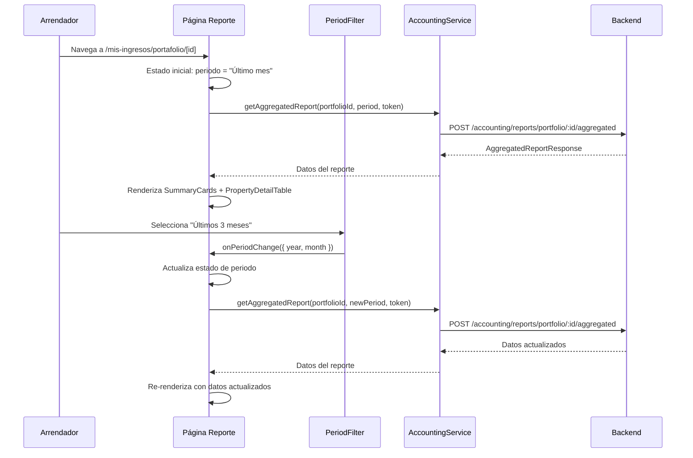
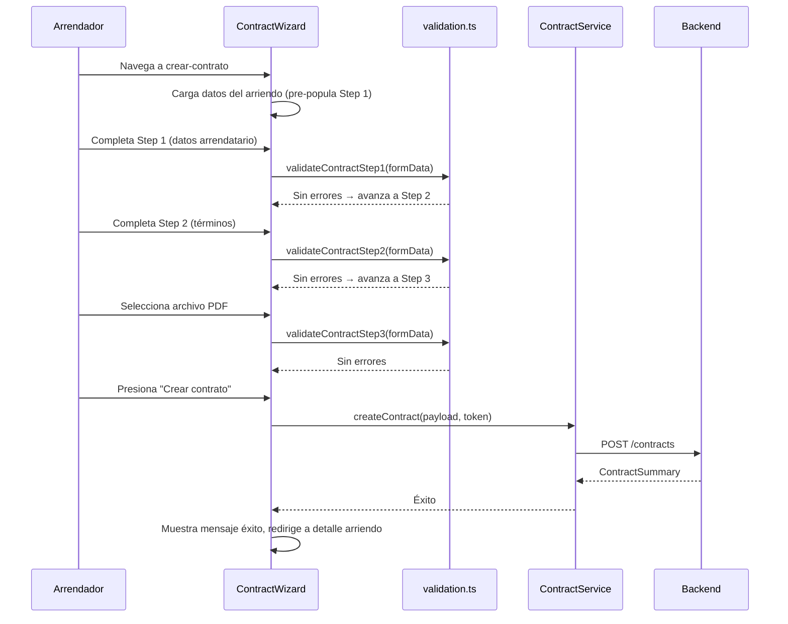

# Documento de Diseño — Módulos del Arrendador (Frontend)

## Visión General

Este diseño cubre la implementación de los módulos frontend restantes para el arrendador: contabilidad (Mis ingresos), gestión de arriendos (historial, detalle), creación de contratos, y publicación de unidades en Explorar. Estos módulos se integran con la aplicación Next.js (App Router) existente en `src/frontend/`, reutilizando el sistema de diseño, componentes compartidos (Header, SideMenu, Button, Skeleton, EmptyState, ErrorState, Pagination), AuthProvider, y los servicios existentes (PortfolioService, AuthService).

Los módulos consumen endpoints REST del backend NestJS existente para contabilidad (`POST /accounting/reports/...`), contratos (`POST /contracts`, `GET /contracts/:id`, `POST /contracts/:id/sign`), portafolio (`GET /portfolio`, `GET /portfolio/:portfolioId/units`), y listings (`POST /listings`). Se requieren dos nuevos endpoints backend para arriendos (`GET /portfolio/:portfolioId/units/:unitId/leases`, `GET /portfolio/:portfolioId/units/:unitId/leases/:leaseId`).

Diseño de referencia visual en Figma: `https://www.figma.com/design/Yw53CFbVdMWVX7bQ6MFefk/properties_rental_platform_design`

### Decisiones de Diseño Clave

| Decisión | Justificación |
|----------|---------------|
| Tres nuevos módulos frontend: `landlord-accounting`, `landlord-leases`, `landlord-contracts` | Separación de responsabilidades por dominio, consistente con la arquitectura modular existente |
| Todas las páginas como Client Components | Requieren token JWT, AuthProvider, estado de formularios, redirecciones programáticas |
| Reutilización de `LandlordRoute` existente | Ya implementa verificación de auth + rol LANDLORD; evita duplicar lógica |
| Nuevos servicios `AccountingService`, `ContractService`, `LeaseService` en `shared/services/` | Sigue el patrón de `portfolioService` y `authService` — `fetch` nativo, error handling tipado, token desde `localStorage` |
| Extensión de `ListingService` (api.ts) para `POST /listings` | Reutiliza el servicio existente para listings, agregando el método de creación |
| `Filtro_Periodo` como componente reutilizable en `landlord-accounting` | Usado en 3 páginas (overview, reporte portafolio, reporte unidad); lógica de cómputo de periodo encapsulada |
| `Badge_Estado` como componente compartido en `shared/components/` | Usado en arriendos y unidades del portafolio; mapeo de colores centralizado |
| `Tarjeta_Resumen` como componente compartido en `shared/components/` | Usado en overview y reportes; patrón label + valor formateado |
| Wizard de contrato con estado local en componente padre | Preserva datos entre pasos sin estado global; patrón consistente con `RegistrationWizard` |
| Photo upload con preview y validación client-side | MVP usa stub de ObjectStorage; la UI de upload es funcional con File API del navegador |
| `formatCOP`/`stripCOP` para inputs de moneda | Patrón existente en FilterPanel de property-listings; muestra `$1.200.000` mientras almacena dígitos |
| Toast component para funcionalidades post-MVP | "Exportar reporte" y "Ver pagos" muestran toast temporal en lugar de navegar |

---

## Arquitectura

### Diagrama de Arquitectura General

```mermaid
graph TB
    subgraph "Next.js App (src/frontend)"
        subgraph "App Router (app/)"
            Layout["layout.tsx<br/>AuthProvider wrapper"]
            IngresosPage["mis-ingresos/page.tsx"]
            ReportePortPage["mis-ingresos/portafolio/[portfolioId]/page.tsx"]
            ReporteUnidadPage["mis-ingresos/portafolio/[portfolioId]/unidad/[unitId]/page.tsx"]
            ArriendosPage["mi-portafolio/[portfolioId]/unidades/[unitId]/arriendos/page.tsx"]
            CrearArriendoPage["mi-portafolio/.../arriendos/crear/page.tsx"]
            DetalleArriendoPage["mi-portafolio/.../arriendos/[leaseId]/page.tsx"]
            CrearContratoPage["mi-portafolio/.../arriendos/[leaseId]/crear-contrato/page.tsx"]
            PublicarPage["mi-portafolio/[portfolioId]/unidades/[unitId]/publicar/page.tsx"]
        end

        subgraph "Módulo Landlord Accounting"
            PeriodFilter["PeriodFilter"]
            SummaryCard["SummaryCard"]
            PortfolioIncomeCard["PortfolioIncomeCard"]
            PropertyDetailTable["PropertyDetailTable"]
            AccountingTypes["types.ts"]
        end

        subgraph "Módulo Landlord Leases"
            LeaseCard["LeaseCard"]
            LeaseDetailView["LeaseDetailView"]
            StatusBadge["StatusBadge (shared)"]
            LeaseTypes["types.ts"]
        end

        subgraph "Módulo Landlord Contracts"
            ContractWizard["ContractWizard"]
            StepTenant["StepTenant"]
            StepTerms["StepTerms"]
            StepDocument["StepDocument"]
            WizardProgress["WizardProgress"]
            ContractTypes["types.ts"]
            ContractValidation["validation.ts"]
        end

        subgraph "Shared"
            AccountingService["services/accounting.ts"]
            ContractService["services/contract.ts"]
            LeaseService["services/lease.ts"]
            ListingServiceExt["services/api.ts (extended)"]
            PortfolioService["services/portfolio.ts (existing)"]
            SharedUI["components/ (Header, Button, Skeleton, etc.)"]
        end
    end

    subgraph "Backend NestJS"
        AccAggEndpoint["POST /accounting/.../aggregated"]
        AccIndEndpoint["POST /accounting/.../unit/:unitId"]
        ContractEndpoints["POST /contracts, GET /contracts/:id"]
        LeaseListEndpoint["GET /portfolio/.../leases"]
        LeaseDetailEndpoint["GET /portfolio/.../leases/:leaseId"]
        ListingCreateEndpoint["POST /listings"]
        PortfolioEndpoints["GET /portfolio, GET /portfolio/:id/units"]
    end

    IngresosPage --> PortfolioService
    ReportePortPage --> AccountingService
    ReporteUnidadPage --> AccountingService
    ArriendosPage --> LeaseService
    DetalleArriendoPage --> LeaseService
    CrearContratoPage --> ContractService
    PublicarPage --> ListingServiceExt

    AccountingService --> AccAggEndpoint
    AccountingService --> AccIndEndpoint
    ContractService --> ContractEndpoints
    LeaseService --> LeaseListEndpoint
    LeaseService --> LeaseDetailEndpoint
    ListingServiceExt --> ListingCreateEndpoint
    PortfolioService --> PortfolioEndpoints
```



### Estrategia de Renderizado

| Página | Tipo | Razón |
|--------|------|-------|
| `/mis-ingresos` | Client Component | Token JWT para fetch, AuthProvider para verificar rol y logout |
| `/mis-ingresos/portafolio/[portfolioId]` | Client Component | Token JWT, estado de periodo seleccionado |
| `/mis-ingresos/portafolio/[portfolioId]/unidad/[unitId]` | Client Component | Token JWT, estado de periodo seleccionado |
| `/mi-portafolio/[portfolioId]/unidades/[unitId]/arriendos` | Client Component | Token JWT, AuthProvider |
| `/mi-portafolio/.../arriendos/crear` | Client Component | Formulario con validación, estado local, token JWT |
| `/mi-portafolio/.../arriendos/[leaseId]` | Client Component | Token JWT, AuthProvider |
| `/mi-portafolio/.../arriendos/[leaseId]/crear-contrato` | Client Component | Formulario multi-paso con estado local, validación, file upload |
| `/mi-portafolio/[portfolioId]/unidades/[unitId]/publicar` | Client Component | Formulario con file upload, validación, estado local |

### Flujo de Datos — Reporte Agregado



### Flujo de Datos — Creación de Contrato



---

## Componentes e Interfaces

### Estructura de Archivos del Frontend

```
src/frontend/
├── app/
│   ├── mis-ingresos/
│   │   ├── page.tsx                                    # Accounting overview dashboard
│   │   └── portafolio/
│   │       └── [portfolioId]/
│   │           ├── page.tsx                            # Aggregated portfolio report
│   │           └── unidad/
│   │               └── [unitId]/
│   │                   └── page.tsx                    # Individual unit report
│   └── mi-portafolio/
│       └── [id]/
│           └── unidades/
│               └── [unitId]/
│                   ├── arriendos/
│                   │   ├── page.tsx                    # Unit leases history
│                   │   ├── crear/
│                   │   │   └── page.tsx                # Lease creation form
│                   │   └── [leaseId]/
│                   │       ├── page.tsx                # Lease detail
│                   │       └── crear-contrato/
│                   │           └── page.tsx            # Contract creation wizard
│                   └── publicar/
│                       └── page.tsx                    # Publish listing
├── modules/
│   ├── landlord-accounting/
│   │   ├── components/
│   │   │   ├── PeriodFilter.tsx                       # Reusable period tab selector
│   │   │   ├── SummaryCard.tsx                        # Metric card (label + value)
│   │   │   ├── PortfolioIncomeCard.tsx                # Portfolio card for overview
│   │   │   └── PropertyDetailTable.tsx                # Per-property detail table
│   │   ├── types.ts                                   # Accounting interfaces
│   │   └── utils.ts                                   # Period computation helpers
│   ├── landlord-leases/
│   │   ├── components/
│   │   │   ├── LeaseCard.tsx                          # Lease card with status + actions
│   │   │   ├── LeaseDetailView.tsx                    # Full lease detail view
│   │   │   ├── LeaseCreateForm.tsx                    # Lease creation form
│   │   │   └── UnitInfoHeader.tsx                     # Unit info header for leases page
│   │   ├── types.ts                                   # Lease interfaces
│   │   └── validation.ts                              # Lease form validation
│   ├── landlord-contracts/
│   │   ├── components/
│   │   │   ├── ContractWizard.tsx                     # 3-step wizard orchestrator
│   │   │   ├── WizardProgress.tsx                     # Step indicator (1-2-3)
│   │   │   ├── StepTenant.tsx                         # Step 1: tenant data
│   │   │   ├── StepTerms.tsx                          # Step 2: contract terms
│   │   │   └── StepDocument.tsx                       # Step 3: PDF upload
│   │   ├── types.ts                                   # Contract interfaces
│   │   └── validation.ts                              # Contract form validation
│   └── landlord-publish/
│       ├── components/
│       │   ├── PublishForm.tsx                         # Publish listing form
│       │   ├── PhotoUploader.tsx                       # Photo upload with previews
│       │   └── PhotoThumbnail.tsx                      # Individual photo preview
│       ├── types.ts                                   # Publish interfaces
│       └── validation.ts                              # Publish form validation
├── shared/
│   ├── services/
│   │   ├── accounting.ts                              # NEW: AccountingService
│   │   ├── contract.ts                                # NEW: ContractService
│   │   ├── lease.ts                                   # NEW: LeaseService
│   │   ├── api.ts                                     # EXTENDED: createListing()
│   │   ├── portfolio.ts                               # Existing (no changes)
│   │   └── auth.ts                                    # Existing (no changes)
│   ├── components/
│   │   ├── StatusBadge.tsx                            # NEW: Reusable status badge
│   │   ├── Toast.tsx                                  # NEW: Temporary toast notification
│   │   ├── Header.tsx                                 # Existing (no changes)
│   │   ├── SideMenu.tsx                               # Existing (already has /mis-ingresos link)
│   │   ├── Button.tsx                                 # Existing (no changes)
│   │   ├── Skeleton.tsx                               # Existing (no changes)
│   │   ├── EmptyState.tsx                             # Existing (no changes)
│   │   ├── ErrorState.tsx                             # Existing (no changes)
│   │   └── Pagination.tsx                             # Existing (no changes)
│   └── utils/
│       ├── formatPrice.ts                             # Existing (reutilizado)
│       └── formatRelativeDate.ts                      # Existing (reutilizado)
```


### Jerarquía de Componentes

```mermaid
graph TD
    Layout["RootLayout + AuthProvider"]

    %% Accounting pages
    Layout --> IngresosPage["IngresosPage"]
    IngresosPage --> LR1["LandlordRoute"]
    LR1 --> Header1["Header (hamburguesa + 'Mis ingresos')"]
    LR1 --> SummaryCards1["SummaryCard × 3"]
    LR1 --> PortfolioIncomeCards["PortfolioIncomeCard × N"]

    Layout --> ReportePortPage["ReportePortfolioPage"]
    ReportePortPage --> LR2["LandlordRoute"]
    LR2 --> Header2["Header (← + 'Reporte de portafolio')"]
    LR2 --> PeriodFilter1["PeriodFilter"]
    LR2 --> SummaryCards2["SummaryCard × 2"]
    LR2 --> PropertyDetailTable["PropertyDetailTable"]

    Layout --> ReporteUnidadPage["ReporteUnidadPage"]
    ReporteUnidadPage --> LR3["LandlordRoute"]
    LR3 --> Header3["Header (← + 'Reporte de inmueble')"]
    LR3 --> PeriodFilter2["PeriodFilter"]
    LR3 --> SummaryCards3["SummaryCard × 2"]
    LR3 --> LeaseHistory["LeaseCard × N (historial)"]

    %% Lease pages
    Layout --> ArriendosPage["ArriendosUnidadPage"]
    ArriendosPage --> LR4["LandlordRoute"]
    LR4 --> Header4["Header (← + 'Arriendos de la unidad')"]
    LR4 --> UnitInfoHeader["UnitInfoHeader"]
    LR4 --> LeaseCards["LeaseCard × N"]

    Layout --> DetallePage["DetalleArriendoPage"]
    DetallePage --> LR5["LandlordRoute"]
    LR5 --> Header5["Header (← + 'Detalle del arriendo')"]
    LR5 --> LeaseDetailView["LeaseDetailView"]

    %% Contract wizard
    Layout --> ContratoPage["CrearContratoPage"]
    ContratoPage --> LR6["LandlordRoute"]
    LR6 --> Header6["Header (← + 'Crear contrato')"]
    LR6 --> ContractWizard["ContractWizard"]
    ContractWizard --> WizardProgress["WizardProgress (1-2-3)"]
    ContractWizard --> StepTenant["StepTenant"]
    ContractWizard --> StepTerms["StepTerms"]
    ContractWizard --> StepDocument["StepDocument"]

    %% Publish page
    Layout --> PublicarPage["PublicarPage"]
    PublicarPage --> LR7["LandlordRoute"]
    LR7 --> Header7["Header (← + 'Publicar en arriendo')"]
    LR7 --> PublishForm["PublishForm"]
    PublishForm --> PhotoUploader["PhotoUploader"]
    PhotoUploader --> PhotoThumbnail["PhotoThumbnail × N"]
```



### Especificaciones de Componentes Clave

#### `PeriodFilter` (modules/landlord-accounting/components/PeriodFilter.tsx)

- **Tipo**: Client Component (`'use client'`)
- **Props**: `selectedPeriod: PeriodOption`, `onPeriodChange: (period: PeriodRequest) => void`
- **PeriodOption**: `'1m' | '3m' | '6m' | '12m'`
- **Comportamiento**: Renderiza 4 tabs horizontales con `role="tablist"`. Tab seleccionado: fondo `#1d4ed8`, texto blanco. Tabs no seleccionados: fondo `#f3f4f6`, texto `#4b5563`. Al seleccionar un tab, computa `PeriodRequest` restando los meses correspondientes de la fecha actual e invoca `onPeriodChange`.
- **Scroll**: `overflow-x-auto` con `scrollbar-width: none` para scroll horizontal en mobile sin scrollbar visible.
- **Accesibilidad**: `role="tablist"` en contenedor, `role="tab"` + `aria-selected` en cada tab, min touch target 44×44px.

#### `SummaryCard` (modules/landlord-accounting/components/SummaryCard.tsx)

- **Props**: `label: string`, `value: string`, `valueColor?: string`
- **Comportamiento**: Renderiza un contenedor con borde `#d1d5db`, border-radius 6px, padding 16px. Label en text-caption color `#4b5563`, valor en text-h3 font-semibold con color configurable (default `#111827`).

#### `PortfolioIncomeCard` (modules/landlord-accounting/components/PortfolioIncomeCard.tsx)

- **Props**: `portfolio: PortfolioIncomeSummary`
- **Comportamiento**: Tarjeta con borde, border-radius 6px, sombra card. Muestra nombre del portafolio (text-body font-semibold), cantidad de propiedades (text-caption `#4b5563`), ingreso mensual formateado en COP (text-h3 font-semibold color primary). Dos botones: "Ver reporte" (navega a `/mis-ingresos/portafolio/[id]`) y "Ver inmuebles" (navega a `/mi-portafolio/[id]`).

#### `PropertyDetailTable` (modules/landlord-accounting/components/PropertyDetailTable.tsx)

- **Props**: `units: PropertyDetailRow[]`
- **Comportamiento**: Tabla semántica (`<table>`, `<thead>`, `<tbody>`, `<th>`, `<td>`) con columnas: dirección, barrio, ingreso mensual (COP), estado de pago (StatusBadge). En mobile, cada fila se renderiza como una tarjeta apilada para mantener legibilidad.

#### `StatusBadge` (shared/components/StatusBadge.tsx)

- **Props**: `status: string`, `variant?: 'lease' | 'unit' | 'payment'`
- **Mapeo de colores para lease**: "Vigente" → bg `#DCFCE7` text `#166534`, "Acordado" → bg `#DBEAFE` text `#1E40AF`, "Finalizado" → bg `#F3F4F6` text `#4B5563`
- **Mapeo de colores para unit**: "Ocupado" → bg `#FEF3C7` text `#92400E`, "Disponible" → bg `#DCFCE7` text `#166534`, "Mantenimiento" → bg `#FEE2E2` text `#991B1B`
- **Mapeo de colores para payment**: "Al día" → bg `#DCFCE7` text `#166534`, "Pendiente" → bg `#FEF3C7` text `#92400E`
- **Accesibilidad**: `aria-label="Estado: {status}"`, border-radius 4px, padding horizontal 8px, vertical 2px, text-small font-medium.

#### `LeaseCard` (modules/landlord-leases/components/LeaseCard.tsx)

- **Props**: `lease: LeaseListItem`, `portfolioId: string`, `unitId: string`
- **Comportamiento**: Tarjeta con borde, border-radius 6px, padding 16px. Muestra: nombre del arrendatario (text-body font-semibold), periodo formateado "DD/MM/YYYY - DD/MM/YYYY" o "DD/MM/YYYY - Vigente" (text-caption `#4b5563`), monto mensual en COP (text-h3 font-semibold color primary), StatusBadge con estado del arriendo.
- **Acciones contextuales**: "Ver detalle" (siempre visible, navega a detalle), "Generar contrato" (visible si no hay contrato, navega a crear-contrato), "Ver contrato" (visible si contrato PENDING/SIGNATURE_PENDING), "Ver contrato archivado" (visible si contrato SIGNED).

#### `LeaseDetailView` (modules/landlord-leases/components/LeaseDetailView.tsx)

- **Props**: `lease: LeaseDetail`
- **Comportamiento**: Vista de solo lectura con 3 secciones:
  1. **Inmueble**: tipo propiedad, habitaciones, baños, área m², dirección completa — campos con label en text-caption font-medium `#4b5563` y valor en text-body `#111827`.
  2. **Arrendatario**: nombre completo, tipo y número de documento, email, teléfono — mismo patrón de label/valor.
  3. **Acuerdo**: canon mensual en COP (text-h3 font-semibold color primary), fecha de acuerdo, fecha inicio propuesta — formateadas DD/MM/YYYY.
- **Botón inferior**: "Generar contrato" (primary, full width, min-height 44px) o "Ver contrato" si ya existe contrato.

#### `UnitInfoHeader` (modules/landlord-leases/components/UnitInfoHeader.tsx)

- **Props**: `unit: UnitInfo`
- **Comportamiento**: Muestra nombre de unidad (text-h3 font-semibold), tipo de propiedad (text-caption `#4b5563`), dirección (text-caption `#4b5563`), badges compactos para habitaciones, baños, área (fondo `#f3f4f6`, border-radius 4px).

#### `LeaseCreateForm` (modules/landlord-leases/components/LeaseCreateForm.tsx)

- **Tipo**: Client Component
- **Props**: `unit: UnitInfo`, `portfolioId: string`, `unitId: string`, `onSuccess: () => void`
- **Estado local**: `{ tenantEmail: string, startDate: string, endDate: string, errors: Record<string, string>, serverError: string | null, isSubmitting: boolean }`
- **Campos**: Correo electrónico del arrendatario (email input, required), Fecha de inicio (date input, required), Fecha de fin (date input, optional).
- **Validación**: Usa `validateLeaseForm` de `validation.ts` antes de submit.
- **Submit**: Envía `POST /portfolio/:portfolioId/units/:unitId/leases` via `leaseService.createLease()` con `{ tenantEmail, startDate, endDate? }`.
- **Error handling**: 403 → "No tienes permiso para crear arriendos en esta unidad", 404 → "No se encontró un arrendatario con ese correo electrónico", 409 → "Esta unidad ya tiene un arriendo activo", network/5xx → mensajes estándar. Preserva datos del formulario en caso de error.
- **Éxito**: Muestra "¡Arriendo creado exitosamente!" y redirige a Página_Arriendos_Unidad.

#### `ContractWizard` (modules/landlord-contracts/components/ContractWizard.tsx)

- **Tipo**: Client Component
- **Props**: `lease: LeaseDetail`, `onSuccess: () => void`
- **Estado local**: `{ currentStep: 1|2|3, formData: ContractFormData, errors: Record<string, string>, serverError: string | null, isSubmitting: boolean }`
- **Comportamiento**: Orquesta los 3 pasos. Preserva `formData` al navegar entre pasos. Valida el paso actual antes de avanzar. En Step 3, envía datos al backend via ContractService.
- **Patrón**: Consistente con `RegistrationWizard` del módulo users.

#### `WizardProgress` (modules/landlord-contracts/components/WizardProgress.tsx)

- **Props**: `currentStep: number`, `steps: string[]`
- **Comportamiento**: 3 círculos numerados conectados por líneas. Paso actual: fondo primary. Completados: check verde. Pendientes: fondo neutral. Labels debajo: "Arrendatario", "Términos", "Documento".
- **Accesibilidad**: `aria-current="step"` en paso actual, `aria-label="Paso X de Y: {label}"`.

#### `StepTenant` (modules/landlord-contracts/components/StepTenant.tsx)

- **Props**: `data: ContractFormData`, `errors: Record<string, string>`, `onChange: (field, value) => void`
- **Campos**: nombre, apellido, tipo documento (dropdown), número documento, email, teléfono. Pre-poblados desde datos del arriendo.
- **Notice box**: Fondo `#FEF3C7`, borde `#F59E0B`, texto de disclaimer legal.

#### `StepTerms` (modules/landlord-contracts/components/StepTerms.tsx)

- **Props**: `data: ContractFormData`, `errors: Record<string, string>`, `onChange: (field, value) => void`
- **Campos**: fecha inicio (date input), fecha fin (date input, opcional), canon mensual (currency input con formatCOP/stripCOP, pre-poblado desde leaseBaseAmount).

#### `StepDocument` (modules/landlord-contracts/components/StepDocument.tsx)

- **Props**: `data: ContractFormData`, `errors: Record<string, string>`, `onFileSelect: (file: File) => void`
- **Comportamiento**: Área de upload con borde dashed `#d1d5db`, border-radius 6px. Acepta solo PDF. Muestra nombre del archivo seleccionado o "Seleccionar archivo PDF". Para MVP, el archivo se sube al stub de ObjectStorage que retorna una URL placeholder.

#### `PhotoUploader` (modules/landlord-publish/components/PhotoUploader.tsx)

- **Tipo**: Client Component
- **Props**: `photos: PhotoFile[]`, `onAdd: (files: File[]) => void`, `onRemove: (index: number) => void`, `maxPhotos?: number`
- **Comportamiento**: Área de upload con borde dashed, acepta JPEG/PNG/WebP. Muestra thumbnails en fila horizontal scrollable. Cada thumbnail tiene botón X para eliminar. Contador "X de 10 fotos" + "Faltan Y fotos" (Y = max(0, 3 - count)).
- **Validación**: Acepta hasta `maxPhotos` (default 10). Tipos MIME: `image/jpeg`, `image/png`, `image/webp`.

#### `PhotoThumbnail` (modules/landlord-publish/components/PhotoThumbnail.tsx)

- **Props**: `src: string`, `onRemove: () => void`
- **Comportamiento**: Preview 1:1 aspect ratio, border-radius 6px, botón X en esquina superior derecha.

#### `PublishForm` (modules/landlord-publish/components/PublishForm.tsx)

- **Tipo**: Client Component
- **Props**: `unit: UnitInfo`, `onSuccess: () => void`
- **Estado local**: `{ photos: PhotoFile[], title: string, description: string, price: string, errors: Record<string, string>, serverError: string | null, isSubmitting: boolean }`
- **Campos**: Título (text input), Descripción (textarea, opcional), Canon de arrendamiento (currency input con formatCOP/stripCOP, pre-poblado desde leaseBaseAmount).
- **Submit**: Envía `POST /listings` con portfolioUnitId, title, description, price, currency "COP", y fotos como multipart form data.

#### `Toast` (shared/components/Toast.tsx)

- **Props**: `message: string`, `isVisible: boolean`, `onClose: () => void`, `duration?: number`
- **Comportamiento**: Notificación temporal en la parte inferior de la pantalla. Se auto-oculta después de `duration` ms (default 3000). Fondo `#111827`, texto blanco, border-radius 6px.
- **Accesibilidad**: `role="status"`, `aria-live="polite"`.

---

## Modelos de Datos

### Interfaces TypeScript — Módulo Accounting

```typescript
// modules/landlord-accounting/types.ts

export interface PeriodRequest {
  year: number;
  month: number;
}

export type PeriodOption = '1m' | '3m' | '6m' | '12m';

export interface AggregatedReportResponse {
  portfolioId: string;
  periodStart: string;   // ISO date
  periodEnd: string;     // ISO date
  currency: string;
  numberOfUnits: number;
  totalAmount: number;
  avgAmount: number;
  paymentCount: number;
  minAmount: number;
  maxAmount: number;
  expectedAmount: number;
  overdueCount: number;
  message?: string;
}

export interface IndividualReportResponse {
  portfolioUnitId: string;
  periodStart: string;
  periodEnd: string;
  currency: string;
  totalAmount: number;
  minAmount: number;
  maxAmount: number;
  paymentCount: number;
  expectedAmount: number;
  overdueCount: number;
  message?: string;
}

export interface PortfolioIncomeSummary {
  id: string;
  name: string;
  totalUnits: number;
  activeLeases: number;
  monthlyIncome: number;
}

export interface PropertyDetailRow {
  unitId: string;
  address: string;
  neighborhood: string;
  monthlyIncome: number;
  paymentStatus: 'Al día' | 'Pendiente';
}
```

### Interfaces TypeScript — Módulo Leases

```typescript
// modules/landlord-leases/types.ts

export interface LeaseListItem {
  id: string;
  tenantName: string;
  startDate: string;       // ISO date
  endDate: string | null;  // null = open-ended
  monthlyAmount: number;
  status: 'Vigente' | 'Acordado' | 'Finalizado';
  contractId: string | null;
  contractStatus: 'PENDING' | 'SIGNATURE_PENDING' | 'SIGNED' | null;
}

export interface LeaseDetail {
  id: string;
  portfolioUnitId: string;
  userId: string;
  startDate: string;
  endDate: string | null;
  status: 'Vigente' | 'Acordado' | 'Finalizado';
  monthlyAmount: number;
  contractId: string | null;
  contractStatus: string | null;
  tenant: {
    fullName: string;
    documentTypeCode: string;
    documentNumber: string;
    email: string;
    phoneNumber: string;
  };
  property: {
    propertyType: string;
    numberOfRooms: number;
    numberOfBathrooms: number;
    area: number | null;
    address: string;
  };
}

export interface UnitInfo {
  id: string;
  name: string;
  propertyType: string;
  address: string;
  numberOfRooms: number;
  numberOfBathrooms: number;
  area: number | null;
}

export interface CreateLeaseRequest {
  tenantEmail: string;
  startDate: string;       // YYYY-MM-DD
  endDate?: string;        // YYYY-MM-DD or omitted for open-ended
}
```

### Interfaces TypeScript — Módulo Contracts

```typescript
// modules/landlord-contracts/types.ts

export interface ContractFormData {
  // Step 1 — Tenant
  firstName: string;
  lastName: string;
  documentTypeCode: string;
  documentNumber: string;
  email: string;
  phoneNumber: string;
  // Step 2 — Terms
  startDate: string;       // YYYY-MM-DD
  endDate: string;         // YYYY-MM-DD or empty
  monthlyRent: string;     // string for form input (raw digits)
  // Step 3 — Document
  file: File | null;
  fileUrl: string;         // populated after upload
}

export interface UploadContractRequest {
  leaseId: string;
  startDate: string;
  endDate?: string;
  fileUrl: string;
  fileSizeBytes?: number;
  mimeType?: string;
}

export interface ContractParty {
  userId: string;
  role: string;
}

export interface ContractSummary {
  id: string;
  leaseId: string;
  status: 'PENDING' | 'SIGNATURE_PENDING' | 'SIGNED';
  startDate: string;
  endDate: string | null;
  fileUrl: string;
  signedAt: string | null;
  externalSigningId: string | null;
  parties: ContractParty[];
}
```

### Interfaces TypeScript — Módulo Publish

```typescript
// modules/landlord-publish/types.ts

export interface PhotoFile {
  file: File;
  previewUrl: string;  // URL.createObjectURL result
}

export interface PublishFormData {
  title: string;
  description: string;
  price: string;       // raw digits string
  photos: PhotoFile[];
}

export interface CreateListingRequest {
  portfolioUnitId: string;
  title: string;
  description?: string;
  price: number;
  currency: string;
  // photos sent as multipart form data
}
```


### Servicios

#### AccountingService (shared/services/accounting.ts)

```typescript
const API_URL = process.env.NEXT_PUBLIC_API_URL || 'http://localhost:3001';

export const accountingService = {
  async getAggregatedReport(
    portfolioId: string,
    period: PeriodRequest,
    token: string
  ): Promise<AggregatedReportResponse> { ... },

  async getIndividualReport(
    portfolioId: string,
    unitId: string,
    period: PeriodRequest,
    token: string
  ): Promise<IndividualReportResponse> { ... },
};
```

Cada método:
- Usa `fetch` nativo con `Content-Type: application/json` y `Authorization: Bearer <token>`
- `getAggregatedReport` → `POST /accounting/reports/portfolio/${portfolioId}/aggregated` con body `{ year, month }`
- `getIndividualReport` → `POST /accounting/reports/portfolio/${portfolioId}/unit/${unitId}` con body `{ year, month }`
- Error handling: 401 → "Sesión expirada", 403 → "No tienes permiso para acceder a reportes contables", network → "No se pudo conectar con el servidor. Verifica tu conexión e intenta de nuevo.", 5xx → "Error del servidor. Intenta de nuevo más tarde."

#### ContractService (shared/services/contract.ts)

```typescript
const API_URL = process.env.NEXT_PUBLIC_API_URL || 'http://localhost:3001';

export const contractService = {
  async createContract(
    data: UploadContractRequest,
    token: string
  ): Promise<ContractSummary> { ... },

  async getContract(
    contractId: string,
    token: string
  ): Promise<ContractSummary> { ... },

  async signContract(
    contractId: string,
    token: string
  ): Promise<void> { ... },
};
```

Cada método:
- `createContract` → `POST /contracts` con body JSON
- `getContract` → `GET /contracts/${contractId}`
- `signContract` → `POST /contracts/${contractId}/sign`
- Error handling: 401 → "Sesión expirada", 403 → "No tienes permiso para realizar esta acción", 404 → "Contrato no encontrado", 422 → "Solo se permiten archivos PDF de máximo 10 MB", network → "No se pudo conectar con el servidor...", 5xx → "Error del servidor..."

#### LeaseService (shared/services/lease.ts)

```typescript
const API_URL = process.env.NEXT_PUBLIC_API_URL || 'http://localhost:3001';

export const leaseService = {
  async getUnitLeases(
    portfolioId: string,
    unitId: string,
    token: string
  ): Promise<LeaseListItem[]> { ... },

  async getLeaseDetail(
    portfolioId: string,
    unitId: string,
    leaseId: string,
    token: string
  ): Promise<LeaseDetail> { ... },

  async createLease(
    portfolioId: string,
    unitId: string,
    data: CreateLeaseRequest,
    token: string
  ): Promise<LeaseListItem> { ... },
};
```

Cada método:
- `getUnitLeases` → `GET /portfolio/${portfolioId}/units/${unitId}/leases`
- `getLeaseDetail` → `GET /portfolio/${portfolioId}/units/${unitId}/leases/${leaseId}`
- `createLease` → `POST /portfolio/${portfolioId}/units/${unitId}/leases` con body `{ tenantEmail, startDate, endDate? }`
- Error handling: 401 → "Sesión expirada", 403 → "No tienes permiso para ver los arriendos de esta unidad", 404 → "Arriendo no encontrado" / "No se encontró un arrendatario con ese correo electrónico", 409 → "Esta unidad ya tiene un arriendo activo", network → "No se pudo conectar con el servidor...", 5xx → "Error del servidor..."

#### Extensión de api.ts — createListing

```typescript
// Added to shared/services/api.ts

export async function createListing(
  formData: FormData,
  token: string
): Promise<{ id: string }> {
  let res: Response;
  try {
    res = await fetch(`${API_URL}/listings`, {
      method: 'POST',
      headers: {
        Authorization: `Bearer ${token}`,
        // No Content-Type — browser sets multipart boundary automatically
      },
      body: formData,
    });
  } catch {
    throw new Error('No se pudo conectar con el servidor. Verifica tu conexión e intenta de nuevo.');
  }

  if (!res.ok) {
    if (res.status === 401) throw new Error('Sesión expirada');
    if (res.status === 403) throw new Error('No tienes permiso para publicar este inmueble');
    if (res.status >= 500) throw new Error('Error del servidor. Intenta de nuevo más tarde.');
    throw new Error('Error del servidor. Intenta de nuevo más tarde.');
  }

  return res.json();
}
```

### Funciones de Validación

#### Contract Validation (modules/landlord-contracts/validation.ts)

```typescript
export function validateContractStep1(data: ContractFormData): Record<string, string> {
  const errors: Record<string, string> = {};
  if (!data.firstName.trim()) errors.firstName = 'El nombre es obligatorio';
  if (!data.lastName.trim()) errors.lastName = 'El apellido es obligatorio';
  if (!data.documentTypeCode) errors.documentTypeCode = 'Selecciona un tipo de documento';
  if (!data.documentNumber.trim()) errors.documentNumber = 'El número de documento es obligatorio';
  const emailError = validateContractEmail(data.email);
  if (emailError) errors.email = emailError;
  const phoneError = validateContractPhone(data.phoneNumber);
  if (phoneError) errors.phoneNumber = phoneError;
  return errors;
}

export function validateContractEmail(value: string): string | null {
  if (!value.trim()) return 'Ingresa un correo electrónico válido';
  if (!/^[^\s@]+@[^\s@]+\.[^\s@]+$/.test(value)) return 'Ingresa un correo electrónico válido';
  return null;
}

export function validateContractPhone(value: string): string | null {
  if (!value.trim()) return 'El teléfono debe tener exactamente 10 dígitos';
  if (!/^\d+$/.test(value)) return 'El teléfono debe tener exactamente 10 dígitos';
  if (value.length !== 10) return 'El teléfono debe tener exactamente 10 dígitos';
  return null;
}

export function validateContractStep2(data: ContractFormData): Record<string, string> {
  const errors: Record<string, string> = {};
  if (!data.startDate) errors.startDate = 'La fecha de inicio es obligatoria';
  if (data.startDate && data.endDate && new Date(data.endDate) <= new Date(data.startDate)) {
    errors.endDate = 'La fecha de fin debe ser posterior a la fecha de inicio';
  }
  const rentError = validateMonthlyRent(data.monthlyRent);
  if (rentError) errors.monthlyRent = rentError;
  return errors;
}

export function validateMonthlyRent(value: string): string | null {
  if (!value.trim()) return 'El canon mensual es obligatorio y debe ser un valor positivo';
  const num = Number(value);
  if (!Number.isFinite(num) || num <= 0) return 'El canon mensual es obligatorio y debe ser un valor positivo';
  return null;
}

export function validateContractStep3(data: ContractFormData): Record<string, string> {
  const errors: Record<string, string> = {};
  if (!data.file) errors.file = 'Debes seleccionar un archivo PDF para continuar';
  return errors;
}
```

#### Lease Validation (modules/landlord-leases/validation.ts)

```typescript
export function validateLeaseForm(data: {
  tenantEmail: string;
  startDate: string;
  endDate: string;
}): Record<string, string> {
  const errors: Record<string, string> = {};
  const emailError = validateLeaseEmail(data.tenantEmail);
  if (emailError) errors.tenantEmail = emailError;
  if (!data.startDate) errors.startDate = 'La fecha de inicio es obligatoria';
  if (data.startDate && data.endDate && new Date(data.endDate) <= new Date(data.startDate)) {
    errors.endDate = 'La fecha de fin debe ser posterior a la fecha de inicio';
  }
  return errors;
}

export function validateLeaseEmail(value: string): string | null {
  if (!value.trim()) return 'El correo electrónico del arrendatario es obligatorio';
  if (!/^[^\s@]+@[^\s@]+\.[^\s@]+$/.test(value)) return 'Ingresa un correo electrónico válido';
  return null;
}
```

#### Publish Validation (modules/landlord-publish/validation.ts)

```typescript
export function validatePublishForm(data: {
  photos: unknown[];
  title: string;
  price: string;
}): Record<string, string> {
  const errors: Record<string, string> = {};
  if (data.photos.length < 3) errors.photos = 'Debes subir al menos 3 fotos';
  if (!data.title.trim()) errors.title = 'El título es obligatorio';
  const priceError = validatePublishPrice(data.price);
  if (priceError) errors.price = priceError;
  return errors;
}

export function validatePublishPrice(value: string): string | null {
  if (!value.trim()) return 'El canon de arrendamiento es obligatorio';
  const num = Number(value);
  if (!Number.isFinite(num) || num <= 0) return 'Ingresa un valor numérico válido';
  return null;
}
```

#### Period Computation (modules/landlord-accounting/utils.ts)

```typescript
import type { PeriodRequest, PeriodOption } from './types';

const PERIOD_MONTHS: Record<PeriodOption, number> = {
  '1m': 1,
  '3m': 3,
  '6m': 6,
  '12m': 12,
};

export function computePeriod(option: PeriodOption, now: Date = new Date()): PeriodRequest {
  const months = PERIOD_MONTHS[option];
  const target = new Date(now.getFullYear(), now.getMonth() - months, 1);
  return {
    year: target.getFullYear(),
    month: target.getMonth() + 1, // 1-indexed
  };
}
```

### Rutas del App Router

| Ruta | Archivo | Descripción |
|------|---------|-------------|
| `/mis-ingresos` | `app/mis-ingresos/page.tsx` | Dashboard de ingresos |
| `/mis-ingresos/portafolio/[portfolioId]` | `app/mis-ingresos/portafolio/[portfolioId]/page.tsx` | Reporte agregado |
| `/mis-ingresos/portafolio/[portfolioId]/unidad/[unitId]` | `app/mis-ingresos/portafolio/[portfolioId]/unidad/[unitId]/page.tsx` | Reporte individual |
| `/mi-portafolio/[portfolioId]/unidades/[unitId]/arriendos` | `app/mi-portafolio/[id]/unidades/[unitId]/arriendos/page.tsx` | Historial de arriendos |
| `/mi-portafolio/[portfolioId]/unidades/[unitId]/arriendos/crear` | `app/mi-portafolio/[id]/unidades/[unitId]/arriendos/crear/page.tsx` | Crear arriendo |
| `/mi-portafolio/[portfolioId]/unidades/[unitId]/arriendos/[leaseId]` | `app/mi-portafolio/[id]/unidades/[unitId]/arriendos/[leaseId]/page.tsx` | Detalle del arriendo |
| `/mi-portafolio/[portfolioId]/unidades/[unitId]/arriendos/[leaseId]/crear-contrato` | `app/mi-portafolio/[id]/unidades/[unitId]/arriendos/[leaseId]/crear-contrato/page.tsx` | Wizard de contrato |
| `/mi-portafolio/[portfolioId]/unidades/[unitId]/publicar` | `app/mi-portafolio/[id]/unidades/[unitId]/publicar/page.tsx` | Publicar en arriendo |

Nota: El parámetro de ruta `[id]` en `mi-portafolio/[id]` corresponde al `portfolioId`. Los parámetros anidados `[unitId]` y `[leaseId]` se extraen con `useParams()`.

### Cambios Requeridos en el Backend

#### Nuevos Endpoints de Arriendos

1. **`GET /portfolio/:portfolioId/units/:unitId/leases`** — Lista de arriendos de una unidad
   - Respuesta: `LeaseListItemDto[]` con campos: id, tenantName (resuelto cross-schema desde `users.NaturalPersonDetail`/`users.LegalPersonDetail`), startDate, endDate, monthlyAmount (desde `PortfolioUnit.leaseBaseAmount`), status (resuelto desde `tracking_process.LeaseCurrentStatus` + `tracking_process.LeaseStatus`), contractId, contractStatus.
   - Protección: JWT + verificación de ownership del portafolio.

2. **`GET /portfolio/:portfolioId/units/:unitId/leases/:leaseId`** — Detalle de un arriendo
   - Respuesta: `LeaseDetailDto` con campos: id, portfolioUnitId, userId, startDate, endDate, status, monthlyAmount, contractId, contractStatus, tenant (fullName, documentTypeCode, documentNumber, email, phoneNumber), property (propertyType, numberOfRooms, numberOfBathrooms, area, address).
   - Protección: JWT + verificación de ownership del portafolio.
   - Resolución cross-schema: `Lease.user_id` → `users.User` → `users.NaturalPersonDetail`/`users.LegalPersonDetail` para datos del arrendatario. `PortfolioUnit.property_id` → `landlord_portfolio.Property` → `landlord_portfolio.Address` para datos del inmueble.

3. **`POST /portfolio/:portfolioId/units/:unitId/leases`** — Crear un arriendo para una unidad
   - Request body: `CreateLeaseDto` con campos: `tenantEmail` (string, required), `startDate` (ISO date string, required), `endDate` (ISO date string, optional).
   - Lógica:
     1. Verificar ownership del portafolio (JWT user → `LandlordPortfolio.user_id`).
     2. Resolver `tenantEmail` → `users.User.id` buscando por `mail` en el esquema `users`. Si no existe → 404.
     3. Verificar que la unidad no tenga un arriendo activo (lease sin `end_date` o con `end_date` futura y status "Vigente"). Si existe → 409.
     4. Crear registro `Lease` en `landlord_portfolio` con `portfolio_unit_id`, `user_id`, `start_date`, `end_date`.
     5. Crear `LeaseStatusHistory` en `tracking_process` con status "Acordado".
     6. Crear `LeaseCurrentStatus` en `tracking_process` apuntando al history entry.
   - Respuesta: `LeaseListItemDto` del arriendo creado (201 Created).
   - Protección: JWT + verificación de ownership del portafolio.
   - Errores: 403 (no es dueño), 404 (tenant no encontrado), 409 (unidad ya tiene arriendo activo).

---


## Propiedades de Correctitud

*Una propiedad es una característica o comportamiento que debe mantenerse verdadero en todas las ejecuciones válidas de un sistema — esencialmente, una declaración formal sobre lo que el sistema debe hacer. Las propiedades sirven como puente entre especificaciones legibles por humanos y garantías de correctitud verificables por máquina.*

### Propiedad 1: Header de autorización en peticiones de servicios

*Para cualquier* cadena de token no vacía, todas las peticiones HTTP realizadas por AccountingService, ContractService y LeaseService deben incluir el header `Authorization` con el valor exacto `Bearer <token>`.

**Valida: Requisitos 1.3, 2.3**

### Propiedad 2: Validación de Step 1 del wizard de contrato

*Para cualquier* objeto `ContractFormData`, `validateContractStep1` debe retornar un `Record<string, string>` vacío (sin errores) si y solo si: firstName no está vacío después de trim, lastName no está vacío después de trim, documentTypeCode no está vacío, documentNumber no está vacío después de trim, email tiene formato válido (no vacío, contiene `@` y dominio), y phoneNumber consiste exactamente en 10 dígitos numéricos. Si algún campo no cumple su regla, el error correspondiente debe estar presente en el resultado.

**Valida: Requisito 8.5**

### Propiedad 3: Validación de Step 2 del wizard de contrato (fechas y monto)

*Para cualquier* par de cadenas de fecha (startDate, endDate) y cadena de monto (monthlyRent), `validateContractStep2` debe retornar error para endDate si y solo si endDate no está vacía y `new Date(endDate) <= new Date(startDate)`. Debe retornar error para monthlyRent si y solo si el valor está vacío, no es parseable como número finito, o es menor o igual a cero.

**Valida: Requisito 8.9**

### Propiedad 4: Validación del formulario de publicación

*Para cualquier* combinación de cantidad de fotos (0-15), cadena de título, y cadena de precio, `validatePublishForm` debe retornar error para photos si y solo si la cantidad es menor a 3, error para title si y solo si está vacío después de trim, y error para price si y solo si está vacío, no es parseable como número finito, o es menor o igual a cero.

**Valida: Requisito 9.9**

### Propiedad 5: Cómputo de periodo es consistente e idempotente

*Para cualquier* fecha válida y cualquier opción de periodo ('1m', '3m', '6m', '12m'), `computePeriod(option, date)` debe producir un `PeriodRequest` con year entre 2020 y 2100 y month entre 1 y 12. Además, computar el periodo dos veces con los mismos argumentos debe producir el mismo resultado (determinismo).

**Valida: Requisitos 12.4, 12.7**

### Propiedad 6: Validación del formulario de creación de arriendo

*Para cualquier* cadena de email, cadena de fecha de inicio, y cadena de fecha de fin, `validateLeaseForm` debe retornar error para tenantEmail si y solo si está vacío después de trim o no tiene formato de email válido (contiene `@` y dominio), error para startDate si y solo si está vacío, y error para endDate si y solo si endDate no está vacía y `new Date(endDate) <= new Date(startDate)`.

**Valida: Requisito 11.5**

---

## Manejo de Errores

### Errores de Red y Servidor

| Escenario | Componente | Comportamiento |
|-----------|-----------|----------------|
| Error de red (fetch falla) | Páginas de reporte | Muestra ErrorState con botón "Reintentar" |
| Error de red | ContractWizard | Muestra error encima del formulario, preserva todos los datos |
| Error de red | PublishForm | Muestra error encima del formulario, preserva datos y fotos |
| Error 5xx del servidor | Todos | Muestra "Error del servidor. Intenta de nuevo más tarde." |

### Errores de Autenticación y Autorización

| Escenario | Componente | Comportamiento |
|-----------|-----------|----------------|
| 401 en cualquier endpoint | Todos los servicios | Propaga "Sesión expirada"; la página invoca `logout()` del AuthProvider → redirige a `/auth/login` |
| 403 en reportes | Páginas de reporte | Muestra "No tienes permiso para acceder a reportes contables" |
| 403 en contratos | ContractWizard | Muestra "No tienes permiso para crear un contrato para este arriendo" |
| 403 en publicación | PublishForm | Muestra "No tienes permiso para publicar este inmueble" |
| 404 en arriendo | DetalleArriendoPage | Muestra "Arriendo no encontrado" con enlace a lista de arriendos |
| 404 en contrato | ContractService | Muestra "Contrato no encontrado" |
| 422 en contrato | ContractWizard | Muestra "Solo se permiten archivos PDF de máximo 10 MB" |
| Usuario sin rol LANDLORD | LandlordRoute | Muestra "No tienes permisos para acceder a esta sección" con enlace a `/explorar` |
| Usuario no autenticado | LandlordRoute | Redirige a `/auth/login` |

### Errores de Validación Client-Side

- Los mensajes de error aparecen debajo del campo afectado en tipografía text-caption (14px), color de estado error (`#EF4444`)
- El borde del campo se resalta con color de error
- Los mensajes desaparecen automáticamente cuando el usuario corrige el valor (`onChange`)
- Los errores se asocian al campo mediante `aria-describedby` y se anuncian con `aria-live="polite"`
- El formulario NO se envía al backend si hay errores de validación
- En el wizard, el usuario no puede avanzar al siguiente paso si hay errores en el paso actual

### Estados de Carga

| Escenario | Indicador |
|-----------|-----------|
| Carga de dashboard de ingresos | Skeleton replicando SummaryCards + PortfolioIncomeCards |
| Carga de reporte agregado | Skeleton replicando SummaryCards + PropertyDetailTable |
| Carga de reporte individual | Skeleton replicando SummaryCards + LeaseCards |
| Carga de lista de arriendos | Skeleton replicando UnitInfoHeader + LeaseCards |
| Carga de detalle de arriendo | Skeleton replicando LeaseDetailView |
| Submit de contrato | Botón "Crear contrato" deshabilitado + spinner |
| Submit de publicación | Botón "Publicar inmueble" deshabilitado + spinner |
| Verificación de auth en LandlordRoute | Spinner centrado con `aria-busy="true"` |
| Cambio de periodo en reportes | Skeleton reemplaza contenido actual durante fetch |

### Funcionalidades Post-MVP (Toast)

Las siguientes acciones muestran un Toast con "Funcionalidad disponible próximamente":
- "Exportar reporte" en páginas de reporte agregado e individual
- "Ver pagos" en historial de arriendos del reporte individual

---

## Estrategia de Testing

### Enfoque Dual: Tests Unitarios + Tests de Propiedades

Este módulo se beneficia de property-based testing para las funciones de validación puras y la lógica de cómputo de periodos, que tienen un espacio de entrada grande y propiedades universales claras. Los componentes de UI, flujos de integración, y error handling se testean con tests unitarios basados en ejemplos.

### Librería de Property-Based Testing

- **fast-check** para TypeScript/JavaScript
- Mínimo 100 iteraciones por propiedad
- Cada test referencia la propiedad del documento de diseño

### Tests de Propiedades (Property-Based)

| Propiedad | Archivo de Test | Tag |
|-----------|----------------|-----|
| P1: Bearer token header | `shared/services/__tests__/landlord-services.property.test.ts` | Feature: landlord-modules-frontend, Property 1: Bearer token header attachment |
| P2: Contract Step 1 validation | `modules/landlord-contracts/__tests__/validation.property.test.ts` | Feature: landlord-modules-frontend, Property 2: Contract Step 1 validation |
| P3: Contract Step 2 validation | `modules/landlord-contracts/__tests__/validation.property.test.ts` | Feature: landlord-modules-frontend, Property 3: Contract Step 2 date and amount validation |
| P4: Publish form validation | `modules/landlord-publish/__tests__/validation.property.test.ts` | Feature: landlord-modules-frontend, Property 4: Publish form validation |
| P5: Period computation | `modules/landlord-accounting/__tests__/utils.property.test.ts` | Feature: landlord-modules-frontend, Property 5: Period computation correctness |
| P6: Lease form validation | `modules/landlord-leases/__tests__/validation.property.test.ts` | Feature: landlord-modules-frontend, Property 6: Lease form validation |

### Tests Unitarios (Example-Based)

| Área | Archivo de Test | Cobertura |
|------|----------------|-----------|
| AccountingService | `shared/services/__tests__/accounting.test.ts` | Mapeo de errores 401/403/5xx/red, construcción de URLs, headers, body |
| ContractService | `shared/services/__tests__/contract.test.ts` | Mapeo de errores 401/403/404/422/5xx/red, construcción de URLs |
| LeaseService | `shared/services/__tests__/lease.test.ts` | Mapeo de errores 401/403/404/5xx/red, construcción de URLs |
| createListing | `shared/services/__tests__/api.test.ts` | Multipart form data, errores 401/403/5xx/red |
| PeriodFilter | `modules/landlord-accounting/__tests__/PeriodFilter.test.tsx` | Renderizado de tabs, selección, callback, accesibilidad (role=tablist, aria-selected) |
| SummaryCard | `modules/landlord-accounting/__tests__/SummaryCard.test.tsx` | Renderizado de label y valor, color configurable |
| PortfolioIncomeCard | `modules/landlord-accounting/__tests__/PortfolioIncomeCard.test.tsx` | Renderizado de datos, navegación de botones |
| PropertyDetailTable | `modules/landlord-accounting/__tests__/PropertyDetailTable.test.tsx` | Renderizado de filas, formato COP, StatusBadge |
| StatusBadge | `shared/components/__tests__/StatusBadge.test.tsx` | Mapeo de colores para lease/unit/payment, aria-label |
| LeaseCard | `modules/landlord-leases/__tests__/LeaseCard.test.tsx` | Renderizado, acciones contextuales por estado/contrato, formato de fechas |
| LeaseDetailView | `modules/landlord-leases/__tests__/LeaseDetailView.test.tsx` | Secciones inmueble/arrendatario/acuerdo, botón generar/ver contrato |
| LeaseCreateForm | `modules/landlord-leases/__tests__/LeaseCreateForm.test.tsx` | Validación visual, submit, errores 404/409, pre-poblado, redirección |
| ContractWizard | `modules/landlord-contracts/__tests__/ContractWizard.test.tsx` | Navegación entre pasos, preservación de datos, pre-poblado, submit, errores |
| WizardProgress | `modules/landlord-contracts/__tests__/WizardProgress.test.tsx` | Accesibilidad (aria-current, aria-label), estados visual |
| PhotoUploader | `modules/landlord-publish/__tests__/PhotoUploader.test.tsx` | Agregar/eliminar fotos, contador, tipos MIME, límite 10 |
| PublishForm | `modules/landlord-publish/__tests__/PublishForm.test.tsx` | Validación visual, submit, pre-poblado, errores |
| Toast | `shared/components/__tests__/Toast.test.tsx` | Visibilidad, auto-hide, aria-live |
| Páginas (integración) | `modules/landlord-accounting/__tests__/pages.test.tsx` | Flujo: carga → renderizado, error → retry, skeleton, logout en 401 |

### Tests de Integración

| Flujo | Descripción |
|-------|-------------|
| Dashboard de ingresos | Página → PortfolioService → renderizado de cards |
| Reporte con cambio de periodo | Página → PeriodFilter → AccountingService → re-renderizado |
| Lista de arriendos | Página → LeaseService → renderizado de LeaseCards |
| Detalle de arriendo → crear contrato | Detalle → botón → wizard → submit → ContractService → éxito → redirección |
| Publicar unidad | Formulario → fotos + datos → createListing → éxito → redirección |
| Crear arriendo | Formulario → email + fechas → leaseService.createLease → éxito → redirección a lista |
| Crear arriendo — tenant no encontrado | Formulario → submit → 404 → mensaje "No se encontró un arrendatario..." |
| Crear arriendo — unidad ocupada | Formulario → submit → 409 → mensaje "Esta unidad ya tiene un arriendo activo" |
| Error 401 en reporte | Carga reporte → 401 → logout automático → redirección a login |
| Protección de ruta | Usuario TENANT → LandlordRoute → mensaje "sin permisos" |

---

## Addendum: Cambios Post-Implementación

Los siguientes cambios se realizaron durante y después de la implementación, extendiendo o desviándose del diseño original.

### A1. GetPortfolioUseCase — Resolución Cross-Schema de Detalles de Propiedad

El `GetPortfolioUseCase` (`src/backend/modules/landlord-portfolio/application/use-cases/get-portfolio.use-case.ts`) fue mejorado para resolver detalles de propiedad desde las tablas `Property` y `Address` del esquema `landlord_portfolio` via lookup cross-schema. Anteriormente solo retornaba datos básicos de `PortfolioUnit`.

El `PortfolioUnitResponseDto` fue extendido con campos opcionales:

```typescript
@ApiPropertyOptional({ description: 'Tipo de propiedad (resuelto desde Property)' })
propertyType?: string;

@ApiPropertyOptional({ description: 'Dirección completa (resuelto desde Address)' })
address?: string;

@ApiPropertyOptional({ description: 'Número de habitaciones' })
numberOfRooms?: number;

@ApiPropertyOptional({ description: 'Número de baños' })
numberOfBathrooms?: number;

@ApiPropertyOptional({ description: 'Área en m² (largo × ancho)', nullable: true })
area?: number | null;
```

El use case resuelve estos campos haciendo `prisma.property.findUnique({ where: { id: entity.propertyId }, include: { address: true } })` y calculando `area = length × width` cuando ambos valores están disponibles.

### A2. PortfolioUnit (Frontend) — Tipo Extendido con Detalles de Propiedad

La interfaz `PortfolioUnit` en `src/frontend/modules/landlord-portfolio/types.ts` fue extendida con campos opcionales poblados por el endpoint mejorado del backend:

```typescript
// Property details (resolved from Property + Address by backend)
propertyType?: string;
address?: string;
numberOfRooms?: number;
numberOfBathrooms?: number;
area?: number | null;
```

### A3. Tarjeta de Unidad Mejorada (Diseño Figma)

Las tarjetas de unidad en la página de lista de unidades del portafolio (`/mi-portafolio/[id]/unidades`) fueron rediseñadas para coincidir con el diseño Figma:

- **Icono de propiedad**: Icono de casa en fondo circular gris (`w-[40px] h-[40px] rounded-full bg-[#f3f4f6]`)
- **Subtítulo de tipo de propiedad**: Debajo del nombre de la unidad (`text-caption text-[#4b5563]`)
- **Dirección con icono de ubicación**: Pin de ubicación SVG + texto de dirección
- **Fila de detalles de propiedad**: Área (m²), habitaciones (hab), baños (baños) separados por puntos (`·`)
- **Sección de arrendatario**: Para unidades ocupadas, muestra nombre del arrendatario, renta mensual, y flecha chevron de navegación a arriendos
- **Indicador "Publicada en Explorar"**: Badge/pill con fondo verde (`bg-[#f0fdf4]`, texto `text-[#166534]`)
- **Link "Ver historial"**: Solo se muestra para unidades no ocupadas (las unidades ocupadas tienen la flecha chevron)

### A4. Patrón Consistente de Botón de Retroceso

Todas las páginas nuevas fueron actualizadas para usar un patrón consistente de botón de retroceso:

- Usa `<Link>` de `next/link` en lugar de `<button>` con `router.push()`
- Usa clase `rounded-card` en lugar de `rounded-[6px]`
- Usa el icono SVG de flecha izquierda (`<line x1="19" y1="12" x2="5" y2="12" />` + `<polyline points="12 19 5 12 12 5" />`) en lugar del chevron (`<polyline points="15 18 9 12 15 6" />`)

Este patrón es consistente con las páginas existentes como `mi-portafolio/[id]/page.tsx` y `mi-portafolio/[id]/agregar-unidad/page.tsx`.

Páginas actualizadas: publicar, arriendos, arriendos/crear, arriendos/[leaseId], arriendos/[leaseId]/crear-contrato, mis-ingresos/portafolio/[portfolioId], mis-ingresos/portafolio/[portfolioId]/unidad/[unitId].

### A5. mapPortfolioUnitToUnitInfo — Datos Reales del Backend

La función `mapPortfolioUnitToUnitInfo` en 3 páginas (publicar, arriendos, arriendos/crear) fue actualizada para usar los datos reales de propiedad del response mejorado del backend en lugar de hardcodear ceros para rooms, baths, address, y propertyType.

### A6. Eliminación de Badge de Tipo de Propiedad en Tarjeta de Portafolio

Se eliminó el badge de `propertyType` del componente `PortfolioCard` (`src/frontend/modules/landlord-portfolio/components/PortfolioCard.tsx`). El tipo de propiedad es un atributo por unidad, no por portafolio — un portafolio puede contener unidades de diferentes tipos. El campo `PortfolioSummary.propertyType` permanece en el tipo pero ya no se muestra en la UI.

### A7. Corrección de Rutas de Botón de Retroceso (Publicar + Arriendos)

Se corrigieron las rutas de los botones de retroceso en las páginas de "Publicar en arriendo" y "Arriendos de la unidad":
- Publicar: `/mi-portafolio/${portfolioId}` → `/mi-portafolio/${portfolioId}/unidades`
- Arriendos: `/mi-portafolio/${portfolioId}/unidades/${unitId}` → `/mi-portafolio/${portfolioId}/unidades`

Las rutas anteriores apuntaban a páginas inexistentes, causando errores "no encontrado". Ambas ahora navegan correctamente a la lista de unidades del portafolio.