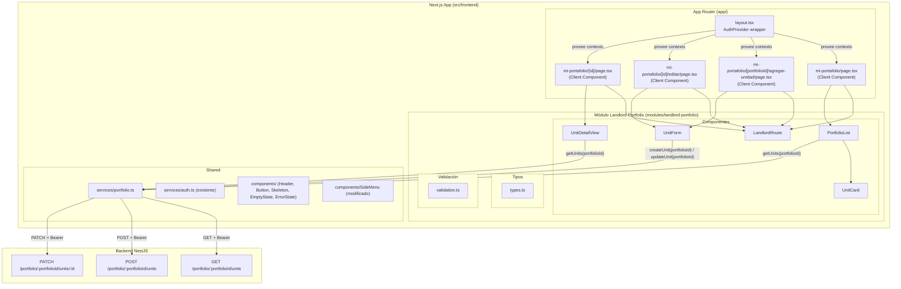
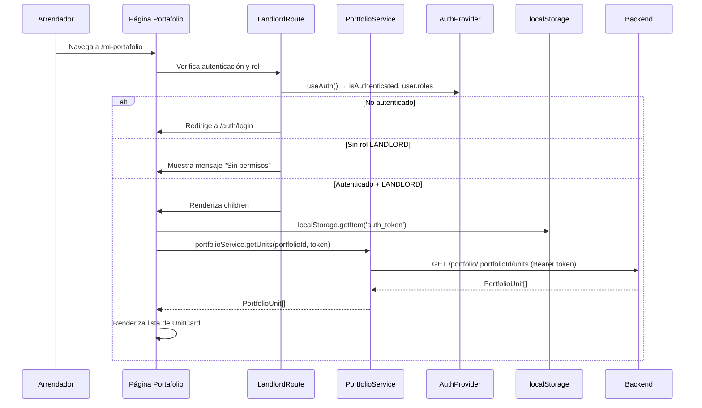
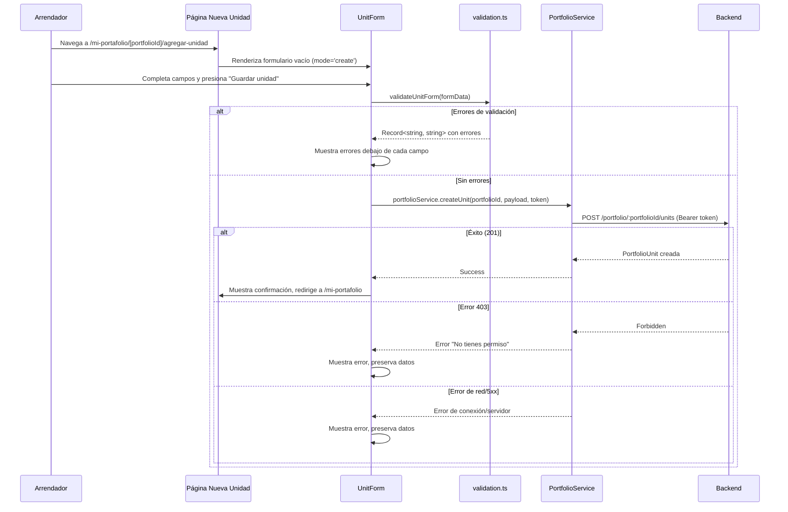
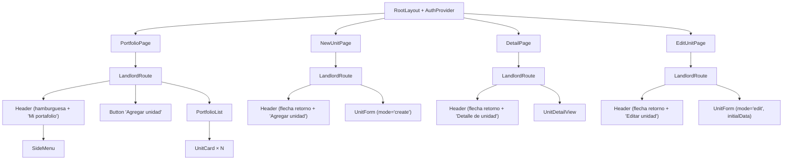

# Documento de Diseño — Portafolio del Arrendador (Frontend)

## Visión General

Este diseño cubre la implementación del módulo frontend del Portafolio del Arrendador de la plataforma de arriendo de vivienda. El módulo permite a arrendadores autenticados (rol LANDLORD) visualizar su portafolio de unidades, agregar nuevas unidades, editar unidades existentes y consultar el detalle de cada una.

La solución se implementa dentro de la aplicación Next.js (App Router) existente en `src/frontend/`, con Tailwind CSS y TypeScript, siguiendo un enfoque mobile-first. Consume los endpoints REST del backend NestJS (`GET /portfolio` para listar portafolios, `POST /portfolio` para crear portafolios, `GET /portfolio/:portfolioId/units`, `POST /portfolio/:portfolioId/units`, `PATCH /portfolio/:portfolioId/units/:id`).

El diseño de referencia visual se encuentra en Figma: `https://www.figma.com/design/Yw53CFbVdMWVX7bQ6MFefk/properties_rental_platform_design`

### Decisiones de Diseño Clave

| Decisión | Justificación |
|----------|---------------|
| Todas las páginas como Client Components | Requieren acceso al AuthProvider (token JWT, roles), estado de formularios, redirecciones programáticas y `localStorage` |
| Componente `LandlordRoute` para protección por rol | Extiende el patrón de `ProtectedRoute` existente verificando además el rol LANDLORD, evitando duplicar lógica en cada página |
| `PortfolioService` en `shared/services/portfolio.ts` | Sigue el patrón de `authService` — capa de abstracción con `fetch` nativo, manejo de errores tipado, token desde `localStorage`. Los métodos `getUnits`, `createUnit` y `updateUnit` ahora requieren `portfolioId` como primer parámetro |
| Formulario reutilizable `UnitForm` para crear y editar | Evita duplicación; recibe `mode: 'create' | 'edit'` y `initialData` opcional para pre-poblar campos en edición |
| Validación client-side con funciones puras en `validation.ts` | Retroalimentación inmediata, reduce llamadas innecesarias al backend, testeable con property-based testing |
| Reutilización de componentes compartidos (Header, Button, Skeleton, EmptyState, ErrorState) | Consistencia visual, menor código, tokens de diseño centralizados |
| Actualización del enlace "Mis arriendos" → `/mi-portafolio` en SideMenu | Integración natural con la navegación existente |
| `formatPrice` y `formatRelativeDate` reutilizados | Funciones ya existentes en `shared/utils/` que cubren el formato COP y fechas relativas en español |
| Interfaz en español, código en inglés | Consistente con la convención del proyecto: rutas URL en español, componentes/funciones en inglés |

---

## Arquitectura

### Diagrama de Arquitectura General



### Estrategia de Renderizado

| Página | Tipo | Razón |
|--------|------|-------|
| `/mi-portafolio` | Client Component | Requiere token JWT para fetch, acceso a AuthProvider para verificar rol y logout |
| `/mi-portafolio/nueva-unidad` | Client Component | Redirige a `/mi-portafolio` (la creación de unidades se hace ahora desde `/mi-portafolio/[portfolioId]/agregar-unidad`) |
| `/mi-portafolio/[id]/editar` | Client Component | Formulario pre-poblado con datos del backend, envío autenticado |
| `/mi-portafolio/[id]` | Client Component | Requiere token JWT para fetch, acceso a AuthProvider |

Todas las páginas son Client Components porque requieren interactividad (formularios, estado, `localStorage`, redirecciones programáticas, verificación de rol).

### Flujo de Listado de Portafolio



### Flujo de Creación de Unidad



---

## Componentes e Interfaces

### Estructura de Archivos

```
src/frontend/
├── app/
│   ├── layout.tsx                              # Existente (sin cambios)
│   └── mi-portafolio/
│       ├── page.tsx                            # Página de listado
│       ├── nueva-unidad/
│       │   └── page.tsx                        # Redirige a /mi-portafolio
│       └── [id]/
│           ├── page.tsx                        # Página de detalle
│           └── editar/
│               └── page.tsx                    # Página de edición
├── modules/
│   └── landlord-portfolio/
│       ├── components/
│       │   ├── LandlordRoute.tsx               # Protección auth + rol LANDLORD
│       │   ├── PortfolioList.tsx                # Lista de tarjetas de unidades
│       │   ├── UnitCard.tsx                     # Tarjeta individual de unidad
│       │   ├── UnitForm.tsx                     # Formulario crear/editar (reutilizable)
│       │   └── UnitDetailView.tsx               # Vista de detalle de unidad
│       ├── types.ts                            # Interfaces TypeScript del módulo
│       └── validation.ts                       # Funciones de validación puras
├── shared/
│   ├── services/
│   │   ├── api.ts                              # Existente (sin cambios)
│   │   ├── auth.ts                             # Existente (sin cambios)
│   │   └── portfolio.ts                        # Nuevo: PortfolioService
│   ├── components/
│   │   ├── SideMenu.tsx                        # Modificado: enlace "Mis arriendos" → /mi-portafolio
│   │   └── ...                                 # Existentes (sin cambios)
│   └── utils/
│       ├── formatPrice.ts                      # Existente (reutilizado)
│       └── formatRelativeDate.ts               # Existente (reutilizado)
```

### Jerarquía de Componentes



### Especificaciones de Componentes Clave

#### `LandlordRoute` (modules/landlord-portfolio/components/LandlordRoute.tsx)

- **Tipo**: Client Component (`'use client'`)
- **Props**: `children: React.ReactNode`
- **Comportamiento**: Consume `useAuth()`. Si `isLoading` es true, muestra spinner centrado con `aria-busy="true"`. Si `!isAuthenticated`, redirige a `/auth/login` con `router.push`. Si autenticado pero `!user.roles.includes('LANDLORD')`, muestra mensaje "No tienes permisos para acceder a esta sección" con enlace a `/explorar`. Si autenticado + LANDLORD, renderiza `children`.
- **Accesibilidad**: `aria-live="polite"` en zona de mensajes, spinner con `role="status"` y `sr-only` label.

#### `PortfolioList` (modules/landlord-portfolio/components/PortfolioList.tsx)

- **Tipo**: Client Component
- **Props**: `units: PortfolioUnit[]`
- **Comportamiento**: Renderiza un listado vertical (single column, mobile-first) de `UnitCard`. Cada tarjeta separada por `gap` del sistema de diseño.
- **Accesibilidad**: Contenedor `<section>` con `aria-label="Listado de unidades de portafolio"`.

#### `UnitCard` (modules/landlord-portfolio/components/UnitCard.tsx)

- **Tipo**: Componente presentacional
- **Props**: `unit: PortfolioUnit`
- **Comportamiento**: Renderiza como `<Link>` a `/mi-portafolio/{unit.id}`. Contenedor con borde `#d1d5db`, border-radius 6px, sombra `0px 1px 2px rgba(0,0,0,0.05)`, fondo blanco, padding 16px. Muestra:
  - Canon base formateado con `formatPrice` en tipografía H3 (20px SemiBold, color primario `#1d4ed8`) + "/mes" en Caption (14px, `#4b5563`)
  - Badge de moneda (fondo `#f3f4f6`, border-radius 4px, Caption 14px, `#4b5563`)
  - Condiciones en Body (16px, `#4b5563`) o "Sin condiciones especiales" en Caption si nulas/vacías
  - Fecha de creación relativa con `formatRelativeDate` adaptada (prefijo "Agregado" en lugar de "Publicado") en Caption (14px, `#4b5563`)
- **Accesibilidad**: `<article>` semántico, área táctil mínima 44×44px, `aria-label` descriptivo.

#### `UnitForm` (modules/landlord-portfolio/components/UnitForm.tsx)

- **Tipo**: Client Component
- **Props**: `mode: 'create' | 'edit'`, `initialData?: PortfolioUnit`, `onSuccess: () => void`
- **Estado local**: `{ formData: UnitFormData, errors: Record<string, string>, serverError: string | null, isSubmitting: boolean }`
- **Campos**:
  - `propertyId` (text input) — solo lectura en modo edición
  - `leaseBaseAmount` (number input)
  - `leaseBaseCurrency` (text input, valor por defecto "COP")
  - `conditions` (textarea, opcional)
- **Validación**: Al hacer submit, llama a `validateUnitForm(formData)`. Errores se muestran debajo de cada campo en Caption (14px, color error). Errores desaparecen al corregir (`onChange`).
- **Submit (create)**: Llama a `portfolioService.createUnit(portfolioId, payload, token)`. En éxito muestra confirmación y ejecuta `onSuccess()`.
- **Submit (edit)**: Construye payload solo con campos modificados respecto a `initialData`. Llama a `portfolioService.updateUnit(portfolioId, id, payload, token)`. En éxito muestra confirmación y ejecuta `onSuccess()`.
- **Accesibilidad**: Labels con `htmlFor`, errores con `aria-describedby`, `aria-live="polite"` en zona de errores, botón deshabilitado durante submit con `aria-busy`, navegación por teclado (Tab/Shift+Tab/Enter).

#### `UnitDetailView` (modules/landlord-portfolio/components/UnitDetailView.tsx)

- **Tipo**: Componente presentacional
- **Props**: `unit: PortfolioUnit`
- **Comportamiento**: Muestra:
  - Canon base formateado como "$X/mes" en H2 (24px Bold, color primario `#1d4ed8`)
  - Badge de moneda (fondo `#f3f4f6`, border-radius 4px, Caption)
  - Sección "Condiciones" con título H3 (20px SemiBold) y texto en Body (16px, `#4b5563`) o "Sin condiciones especiales"
  - Sección "Información" con fecha de creación y última actualización formateadas en español
  - Botón primario "Editar unidad" que navega a `/mi-portafolio/[id]/editar`
- **Accesibilidad**: Elementos semánticos (`section`, `h2`, `h3`), `aria-label` en secciones.

#### Modificación del `SideMenu` existente

- Cambiar el `href` del enlace "Mis arriendos" de `/mis-arriendos` a `/mi-portafolio`.
- No se requieren otros cambios; el SideMenu ya maneja correctamente el estado autenticado/anónimo.

---

## Modelos de Datos

### Interfaces TypeScript del Módulo

```typescript
// modules/landlord-portfolio/types.ts

export interface PortfolioUnit {
  id: string;
  portfolioId: string;
  propertyId: string;
  conditions: string | null;
  leaseBaseAmount: number;
  leaseBaseCurrency: string;
  createdAt: string; // ISO date string
  updatedAt: string; // ISO date string
}

export interface CreatePortfolioUnitRequest {
  propertyId: string;
  leaseBaseAmount: number;
  leaseBaseCurrency: string;
  conditions?: string;
}

export interface UpdatePortfolioUnitRequest {
  conditions?: string;
  leaseBaseAmount?: number;
  leaseBaseCurrency?: string;
}

export interface UnitFormData {
  propertyId: string;
  leaseBaseAmount: string; // string para input de formulario
  leaseBaseCurrency: string;
  conditions: string;
}
```

Estas interfaces reflejan la estructura de `PortfolioUnitResponseDto` del backend. Los campos `createdAt` y `updatedAt` se reciben como strings ISO del JSON response.

### PortfolioService (shared/services/portfolio.ts)

```typescript
// shared/services/portfolio.ts

const API_URL = process.env.NEXT_PUBLIC_API_URL || 'http://localhost:3001';

export const portfolioService = {
  async getUnits(portfolioId: string, token: string): Promise<PortfolioUnit[]> { ... },
  async createUnit(portfolioId: string, data: CreatePortfolioUnitRequest, token: string): Promise<PortfolioUnit> { ... },
  async updateUnit(portfolioId: string, id: string, data: UpdatePortfolioUnitRequest, token: string): Promise<PortfolioUnit> { ... },
};
```

Each method:
- Uses `fetch` nativo with `Content-Type: application/json`
- Adjunts `Authorization: Bearer <token>` in all requests
- Methods `getUnits`, `createUnit`, and `updateUnit` require `portfolioId` as first parameter, constructing URLs like `/portfolio/${portfolioId}/units`
- Error handling HTTP:
  - 401 → propaga error con mensaje "Sesión expirada"
  - 403 → propaga error con mensaje "No tienes permiso para realizar esta acción"
  - 404 → propaga error con mensaje "Unidad de portafolio no encontrada"
  - 5xx → propaga error con mensaje "Error del servidor. Intenta de nuevo más tarde."
  - Error de red (fetch falla) → propaga error con mensaje "No se pudo conectar con el servidor. Verifica tu conexión e intenta de nuevo."

### Funciones de Validación (modules/landlord-portfolio/validation.ts)

```typescript
// modules/landlord-portfolio/validation.ts

export function validatePropertyId(value: string): string | null { ... }
export function validateLeaseBaseAmount(value: string): string | null { ... }
export function validateLeaseBaseCurrency(value: string): string | null { ... }
export function validateUnitForm(data: UnitFormData): Record<string, string> { ... }
```

Reglas de validación por campo:

| Campo | Regla | Mensaje de error |
|-------|-------|-----------------|
| propertyId (vacío) | No vacío después de trim | "El ID del inmueble es obligatorio" |
| leaseBaseAmount (vacío) | No vacío | "El canon base es obligatorio" |
| leaseBaseAmount (no numérico) | Parseable como número finito | "Ingresa un valor numérico válido" |
| leaseBaseAmount (negativo) | ≥ 0 | "El canon base debe ser mayor o igual a cero" |
| leaseBaseCurrency (vacío) | No vacío | "La moneda es obligatoria" |
| leaseBaseCurrency (formato) | Exactamente 3 caracteres alfabéticos | "La moneda debe tener exactamente 3 caracteres (ej. COP)" |

Cada función retorna `null` si el valor es válido, o el mensaje de error en español si es inválido. `validateUnitForm` agrega los campos `propertyId`, `leaseBaseAmount` y `leaseBaseCurrency` al `Record<string, string>` de errores (conditions es opcional, no se valida).

### Función auxiliar: formatRelativeDate adaptada

La función `formatRelativeDate` existente usa el prefijo "Publicado". Para las tarjetas de portafolio se necesita "Agregado". Se creará una función wrapper `formatPortfolioDate` en el módulo que reemplace el prefijo:

```typescript
// modules/landlord-portfolio/utils.ts
export function formatPortfolioDate(isoDate: string): string {
  return formatRelativeDate(isoDate).replace('Publicado', 'Agregado');
}
```

Alternativamente, se puede refactorizar `formatRelativeDate` para aceptar un prefijo opcional. Se opta por el wrapper para no modificar la función compartida existente.


---

## Propiedades de Correctitud

*Una propiedad es una característica o comportamiento que debe mantenerse verdadero en todas las ejecuciones válidas de un sistema — esencialmente, una declaración formal sobre lo que el sistema debe hacer. Las propiedades sirven como puente entre especificaciones legibles por humanos y garantías de correctitud verificables por máquina.*

### Propiedad 1: Header de autorización en peticiones del PortfolioService

*Para cualquier* cadena de token no vacía, todas las peticiones HTTP realizadas por el PortfolioService (`getUnits`, `createUnit`, `updateUnit`) deben incluir el header `Authorization` con el valor exacto `Bearer <token>`.

**Valida: Requisito 1.3**

### Propiedad 2: Validación de propertyId

*Para cualquier* cadena de texto, `validatePropertyId` debe retornar `null` (válido) si y solo si la cadena no está vacía después de eliminar espacios en blanco (`trim`). Si la cadena está vacía o compuesta únicamente de espacios en blanco, debe retornar "El ID del inmueble es obligatorio".

**Valida: Requisitos 4.3, 9.2, 9.5**

### Propiedad 3: Validación de leaseBaseAmount

*Para cualquier* cadena de texto, `validateLeaseBaseAmount` debe retornar `null` (válido) si y solo si la cadena es parseable como un número finito mayor o igual a cero. Si la cadena está vacía, debe retornar "El canon base es obligatorio". Si la cadena no es parseable como número finito (NaN, Infinity), debe retornar "Ingresa un valor numérico válido". Si el número parseado es negativo, debe retornar "El canon base debe ser mayor o igual a cero".

**Valida: Requisitos 4.4, 9.3, 9.6**

### Propiedad 4: Validación de leaseBaseCurrency

*Para cualquier* cadena de texto, `validateLeaseBaseCurrency` debe retornar `null` (válido) si y solo si la cadena consiste exactamente en 3 caracteres alfabéticos (mayúsculas o minúsculas, patrón `/^[a-zA-Z]{3}$/`). Si la cadena está vacía, debe retornar "La moneda es obligatoria". Si no tiene exactamente 3 caracteres alfabéticos, debe retornar "La moneda debe tener exactamente 3 caracteres (ej. COP)".

**Valida: Requisitos 4.5, 9.4, 9.7**

### Propiedad 5: Cálculo de diff para PATCH solo incluye campos modificados

*Para cualquier* par de objetos `UnitFormData` (datos iniciales y datos actuales), el payload generado para la petición PATCH debe contener exactamente los campos cuyos valores difieren entre ambos objetos, y no debe incluir campos cuyos valores son idénticos.

**Valida: Requisito 5.5**

---

## Manejo de Errores

### Errores de Red y Servidor

| Escenario | Componente | Comportamiento |
|-----------|-----------|----------------|
| Error de red (fetch falla) | PortfolioPage | Muestra ErrorState con botón "Reintentar" |
| Error de red | UnitForm (crear/editar) | Muestra "No se pudo conectar con el servidor. Verifica tu conexión e intenta de nuevo." encima del formulario, preserva datos |
| Error de red | DetailPage | Muestra ErrorState con botón "Reintentar" |
| Error 5xx del servidor | Todos | Muestra "Error del servidor. Intenta de nuevo más tarde." |

### Errores de Autenticación y Autorización

| Escenario | Componente | Comportamiento |
|-----------|-----------|----------------|
| 401 en cualquier endpoint | PortfolioService | Propaga error "Sesión expirada"; la página invoca `logout()` del AuthProvider → redirige a `/auth/login` |
| 403 en crear/editar | UnitForm | Muestra "No tienes permiso para realizar esta acción", preserva datos del formulario |
| 404 en detalle/edición | DetailPage / EditUnitPage | Muestra "Unidad de portafolio no encontrada" con enlace a `/mi-portafolio` |
| Usuario sin rol LANDLORD | LandlordRoute | Muestra "No tienes permisos para acceder a esta sección" con enlace a `/explorar` |
| Usuario no autenticado | LandlordRoute | Redirige a `/auth/login` |

### Errores de Validación Client-Side

- Los mensajes de error aparecen debajo del campo afectado en tipografía Caption (14px), color de estado error
- El borde del campo se resalta con color de error
- Los mensajes desaparecen automáticamente cuando el usuario corrige el valor (`onChange`)
- Los errores se asocian al campo mediante `aria-describedby` y se anuncian con `aria-live="polite"`
- El formulario NO se envía al backend si hay errores de validación

### Estados de Carga

| Escenario | Indicador |
|-----------|-----------|
| Carga de listado de portafolio | Skeleton loader replicando la estructura de UnitCard (3 tarjetas) |
| Carga de detalle de unidad | Skeleton loader replicando la estructura de UnitDetailView |
| Carga de datos para edición | Skeleton loader en el formulario |
| Submit de creación | Botón "Guardar unidad" deshabilitado + spinner dentro del botón |
| Submit de edición | Botón "Guardar cambios" deshabilitado + spinner dentro del botón |
| Verificación de auth en LandlordRoute | Spinner centrado en pantalla con `aria-busy="true"` |

---

## Estrategia de Testing

### Enfoque Dual: Tests Unitarios + Tests de Propiedades

Este módulo se beneficia de property-based testing para las funciones de validación puras y la lógica de construcción de payloads, que tienen un espacio de entrada grande y propiedades universales claras. Los componentes de UI y flujos de integración se testean con tests unitarios basados en ejemplos.

### Librería de Property-Based Testing

- **fast-check** para TypeScript/JavaScript
- Mínimo 100 iteraciones por propiedad
- Cada test referencia la propiedad del documento de diseño

### Tests de Propiedades (Property-Based)

| Propiedad | Archivo de Test | Tag |
|-----------|----------------|-----|
| P1: Bearer token header | `shared/services/__tests__/portfolio.property.test.ts` | Feature: landlord-portfolio-frontend, Property 1: Bearer token header attachment |
| P2: validatePropertyId | `modules/landlord-portfolio/__tests__/validation.property.test.ts` | Feature: landlord-portfolio-frontend, Property 2: validatePropertyId correctness |
| P3: validateLeaseBaseAmount | `modules/landlord-portfolio/__tests__/validation.property.test.ts` | Feature: landlord-portfolio-frontend, Property 3: validateLeaseBaseAmount correctness |
| P4: validateLeaseBaseCurrency | `modules/landlord-portfolio/__tests__/validation.property.test.ts` | Feature: landlord-portfolio-frontend, Property 4: validateLeaseBaseCurrency correctness |
| P5: PATCH diff computation | `modules/landlord-portfolio/__tests__/validation.property.test.ts` | Feature: landlord-portfolio-frontend, Property 5: PATCH diff only modified fields |

### Tests Unitarios (Example-Based)

| Área | Archivo de Test | Cobertura |
|------|----------------|-----------|
| LandlordRoute | `modules/landlord-portfolio/__tests__/LandlordRoute.test.tsx` | Redirección de anónimos, mensaje para no-LANDLORD, loader durante verificación, renderizado de LANDLORD |
| PortfolioList + UnitCard | `modules/landlord-portfolio/__tests__/PortfolioList.test.tsx` | Renderizado de tarjetas, formato de precio, condiciones null/no-null, enlace a detalle, estado vacío |
| UnitForm (crear) | `modules/landlord-portfolio/__tests__/UnitForm.test.tsx` | Renderizado de campos, validación visual, submit exitoso, errores 403/red/servidor, preservación de datos |
| UnitForm (editar) | `modules/landlord-portfolio/__tests__/UnitForm.test.tsx` | Pre-poblado de campos, propertyId read-only, submit con diff, errores 404/403/red |
| UnitDetailView | `modules/landlord-portfolio/__tests__/UnitDetailView.test.tsx` | Renderizado de datos, condiciones null, fechas, botón editar |
| PortfolioService | `shared/services/__tests__/portfolio.test.ts` | Mapeo de errores 401/403/404/5xx/red, construcción de URLs, headers |
| Páginas (integración) | `modules/landlord-portfolio/__tests__/pages.test.tsx` | Flujo completo: carga → renderizado, carga → error → retry, skeleton durante carga |
| SideMenu (modificación) | `shared/components/__tests__/SideMenu.test.tsx` | Verificar que enlace "Mis arriendos" apunta a `/mi-portafolio` |

### Tests de Integración

| Flujo | Descripción |
|-------|-------------|
| Listado completo | Página → PortfolioService → renderizado de tarjetas |
| Creación completa | Formulario → validación → PortfolioService → confirmación → redirección |
| Edición completa | Carga datos → pre-poblado → modificación → PATCH con diff → confirmación → redirección |
| Detalle con 401 | Carga detalle → 401 → logout automático → redirección a login |
| Protección de ruta | Usuario TENANT → LandlordRoute → mensaje "sin permisos" |
