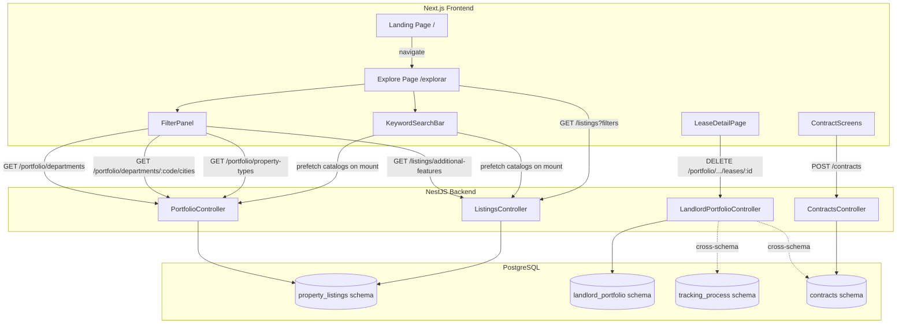
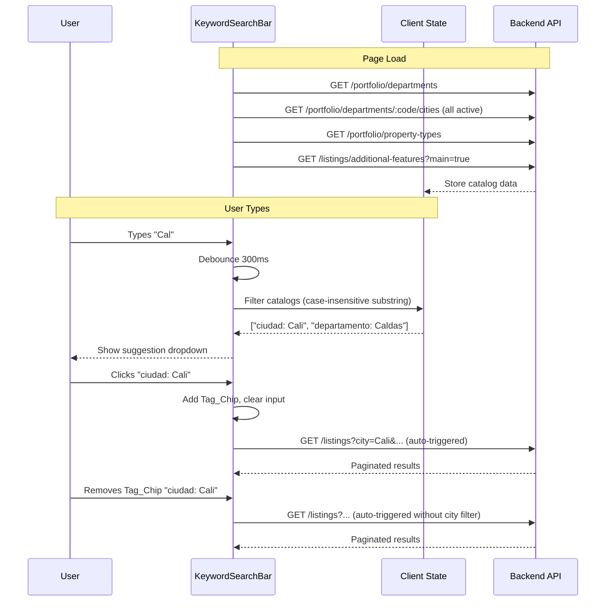
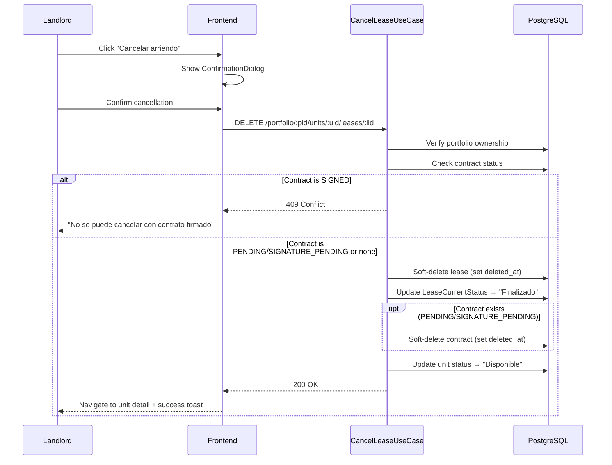
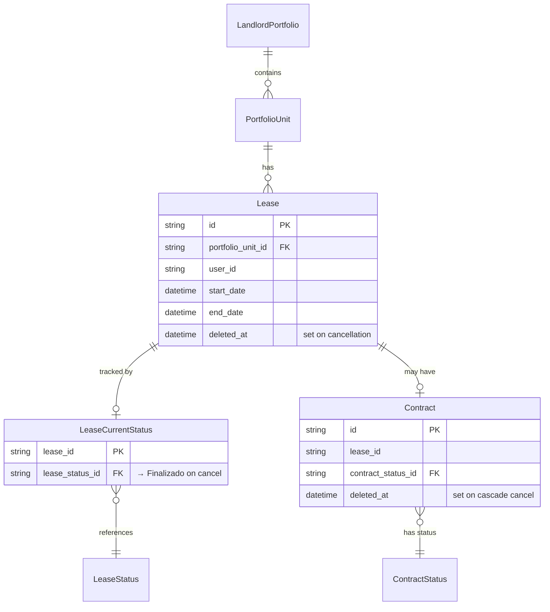

# Design Document: Listing Search and UX Enhancements

## Overview

This design covers ten interconnected improvements to the Colombian urban housing rental platform. The changes span backend-driven filters, a keyword search bar, a landing page, lease detail redesign, lease cancellation, contract screen consistency, and a date-handling bug fix.

The design is organized into three logical groups:

1. **Search & Filtering** (Requirements 1–5): Replace hardcoded filter data with backend-driven catalogs, extend the AdditionalFeature schema, and add a keyword search bar with client-side suggestion filtering.
2. **UX & Pages** (Requirements 6–7, 9): Create a landing page, redesign the lease detail page with cards, and align contract screens visually.
3. **Lease Lifecycle & Bug Fixes** (Requirements 8, 10): Add lease cancellation with contract cascade logic, and fix the "Invalid Date" bug in contract creation.

### Key Design Decisions

| ID | Decision | Rationale |
|----|----------|-----------|
| DD-01 | Prefetch all catalog data for keyword suggestions on page load | Avoids per-keystroke API calls; catalog data is small and changes infrequently (cached 300s on backend) |
| DD-02 | Client-side substring matching with 300ms debounce | Responsive UX without backend load; catalog size (~100s of entries) is well within browser memory |
| DD-03 | Extend existing `AdditionalFeature` table with new columns (not a new table) | Preserves existing `PropertyAdditionalFeature` join relationships; migration is additive |
| DD-04 | Lease cancellation as a single transactional use case | Ensures atomicity across lease soft-delete, status update, unit status change, and optional contract soft-delete |
| DD-05 | Landing page as a static Next.js page (no API calls) | Fast LCP, SEO-friendly; no dynamic data needed |
| DD-06 | Fix "Invalid Date" at both frontend validation and backend validation layers | Defense in depth — frontend prevents bad UX, backend prevents bad data |
| DD-07 | All lease queries must include `deleted_at: null` filter | Soft-deleted leases must be excluded from active lease counts, unit status derivation, lease lists, and rental tracking summaries to ensure data consistency after cancellation |

---

## Architecture

### System Context



### Request Flow: Keyword Search



### Request Flow: Lease Cancellation



---

## Components and Interfaces

### Backend Components

#### 1. Extended AdditionalFeature Endpoint

**New endpoint:** `GET /listings/additional-features`

```typescript
// PropertyListingsController — new route
@Public()
@Get('additional-features')
@ApiOperation({ summary: 'Listar características adicionales activas' })
@ApiOkResponse({ type: [AdditionalFeatureResponseDto] })
getAdditionalFeatures(@Query('main') main?: boolean) {
  return this.getAdditionalFeaturesUseCase.execute(main);
}
```

**Response DTO:**
```typescript
export class AdditionalFeatureResponseDto {
  id!: string;
  name!: string;
  description!: string | null;
  type!: string;        // 'numeric' | 'text'
  element!: string;     // 'text_field' | 'dropdown' | 'checkbox' | 'number_field'
  active!: boolean;
  main!: boolean;
  required!: boolean;
  errorMessage!: string | null;
}
```

#### 2. Extended ListingFiltersDto

Add new filter parameters to the existing DTO:

```typescript
// Additions to ListingFiltersDto
@IsOptional() @IsString()
department?: string;          // DANE department code

// city already exists

// neighborhood already exists

@IsOptional()
additionalFeatures?: Record<string, string>;  // { featureId: value }
```

#### 3. CancelLeaseUseCase

**New use case:** `src/backend/modules/landlord-portfolio/application/use-cases/cancel-lease.use-case.ts`

```typescript
@Injectable()
export class CancelLeaseUseCase {
  constructor(
    private readonly prisma: PrismaService,
    private readonly auditLogger: AuditLoggerService,
  ) {}

  async execute(
    portfolioId: string,
    unitId: string,
    leaseId: string,
    userId: string,
  ): Promise<void> {
    // 1. Verify portfolio ownership (ForbiddenException if not owner)
    // 2. Verify unit belongs to portfolio
    // 3. Find lease, verify it belongs to unit
    // 4. Check lease status is "Acordado" (ConflictException otherwise)
    // 5. Check associated contract status
    //    - SIGNED → ConflictException("No se puede cancelar un arriendo con contrato firmado")
    //    - PENDING/SIGNATURE_PENDING → soft-delete contract
    //    - None → proceed
    // 6. Soft-delete lease (set deleted_at)
    // 7. Create LeaseStatusHistory entry with "Finalizado"
    // 8. Update LeaseCurrentStatus to "Finalizado"
    // 9. Audit log
  }
}
```

**New controller route:**
```typescript
@Delete(':portfolioId/units/:unitId/leases/:leaseId')
@ApiOperation({ summary: 'Cancelar arriendo' })
cancelLease(
  @Param('portfolioId') portfolioId: string,
  @Param('unitId') unitId: string,
  @Param('leaseId') leaseId: string,
  @Req() req: AuthenticatedRequest,
) {
  return this.cancelLeaseUseCase.execute(portfolioId, unitId, leaseId, req.user.id);
}
```

#### 4. Contract Date Validation Fix

**Backend fix in `CreateContractDto`:**

The DTO already uses `@IsDateString()` from class-validator, which validates ISO 8601 format. The issue is in `UploadContractUseCase` where `new Date(dto.startDate)` is called without checking the result. Add a guard:

```typescript
// In UploadContractUseCase.execute()
const parsedStartDate = new Date(dto.startDate);
if (isNaN(parsedStartDate.getTime())) {
  throw new UnprocessableEntityException(
    'La fecha de inicio no es válida. Use formato ISO 8601 (ej: 2025-01-15)'
  );
}
```

### Frontend Components

#### 5. KeywordSearchBar Component

**New component:** `src/frontend/modules/property-listings/components/KeywordSearchBar.tsx`

```typescript
interface KeywordSearchBarProps {
  onSearch: (filters: ListingFilters) => void;
  currentFilters: ListingFilters;
}

interface TagChip {
  dimension: 'department' | 'city' | 'propertyType' | 'additionalFeature';
  value: string;
  label: string;  // Display text, e.g. "ciudad: Cali"
}
```

**Behavior:**
- On mount: prefetch departments, cities (for all active departments), property types, and main additional features. Store in component state.
- On input change: debounce 300ms, then filter prefetched catalogs with case-insensitive substring match.
- On suggestion click: add TagChip, clear input, and immediately call `onSearch` with updated filters.
- On chip remove: remove TagChip and immediately call `onSearch` with updated filters.
- On "Buscar" button click: convert TagChips to ListingFilters, call `onSearch` (redundant explicit trigger).

#### 6. Updated FilterPanel

**Changes to `FilterPanel.tsx`:**
- Replace hardcoded `CITIES` array with backend-fetched departments and cities.
- Add department dropdown above city dropdown.
- City dropdown disabled until department is selected.
- Fetch additional features on mount; render `main: true` features in basic section, `main: false && active: true` in "Filtros avanzados" expandable section.
- Dynamic field rendering based on `element` type.

#### 7. Landing Page

**New page:** `src/frontend/app/page.tsx` (replace redirect)

```typescript
// Static page — no API calls
export default function LandingPage() {
  return (
    <>
      <nav>/* Links: Explorar, Iniciar sesión, Registrarse */</nav>
      <main>
        <section>/* Hero: platform description + "Buscar inmuebles" CTA */</section>
      </main>
    </>
  );
}
```

#### 8. LeaseDetailPage Redesign

**Updated component structure:**

```
LeaseDetailPage
├── Header (back arrow)
├── StatusBadge (lease variant)
├── Card: "Inmueble"
│   ├── Tipo de propiedad
│   ├── Habitaciones / Baños
│   ├── Área
│   └── Dirección
├── Card: "Arrendatario"
│   ├── Nombre completo
│   ├── Documento
│   ├── Correo electrónico
│   └── Teléfono
├── Card: "Acuerdo"
│   ├── Monto mensual
│   ├── Fecha de inicio
│   ├── Fecha de fin
│   ├── Contrato (link if exists)
│   └── Estado del contrato
└── Actions
    └── "Cancelar arriendo" button (if status === "Acordado")
```

#### 9. Contract Screen Updates

**ContractDetailView changes:**
- Wrap sections in card containers with border/background.
- Organize into "Términos", "Partes", "Documento" card sections.
- Ensure StatusBadge with `contract` variant is used consistently.

**ContractWizard changes:**
- Use design system typography tokens.
- Use Primary_Button_Style for CTAs.
- Add frontend date validation to prevent "Invalid Date":

```typescript
// In validateContractStep2
if (!data.startDate) {
  errors.startDate = 'La fecha de inicio es obligatoria';
} else if (isNaN(new Date(data.startDate).getTime())) {
  errors.startDate = 'La fecha de inicio es obligatoria';
}
```

**formatDate fix:**
```typescript
function formatDate(dateStr: string): string {
  if (!dateStr) return '—';
  const date = new Date(dateStr);
  if (isNaN(date.getTime())) return '—';
  return date.toLocaleDateString('es-CO', {
    year: 'numeric',
    month: 'long',
    day: 'numeric',
  });
}
```

### Updated ListingFilters Type

```typescript
export interface ListingFilters {
  department?: string;       // NEW — DANE department code
  city?: string;
  neighborhood?: string;
  search?: string;
  propertyType?: string;
  priceMin?: number;
  priceMax?: number;
  rooms?: number;
  bathrooms?: number;
  areaMin?: number;
  areaMax?: number;
  publishedWithin?: '24h' | '7d' | '30d' | '90d' | 'any';
  additionalFeatures?: Record<string, string>;  // NEW — { featureId: value }
  sortBy?: 'date' | 'price';
  sortOrder?: 'asc' | 'desc';
  page?: number;
  pageSize?: number;
}
```

---

## Data Models

### AdditionalFeature Schema Extension

**Migration:** Add columns to `AdditionalFeature` table in `property_listings` schema.

```prisma
model AdditionalFeature {
  id            String    @id @default(uuid())
  name          String
  description   String?
  type          String    @default("text")     // 'numeric' | 'text'
  element       String    @default("text_field") // 'text_field' | 'dropdown' | 'checkbox' | 'number_field'
  active        Boolean   @default(true)
  main          Boolean   @default(false)
  required      Boolean   @default(false)
  error_message String?
  deleted_at    DateTime?

  properties PropertyAdditionalFeature[]

  @@schema("property_listings")
}
```

**Column details:**

| Column | Type | Default | Description |
|--------|------|---------|-------------|
| `type` | String | `"text"` | Value type: `numeric` or `text` |
| `element` | String | `"text_field"` | UI element: `text_field`, `dropdown`, `checkbox`, `number_field` |
| `active` | Boolean | `true` | Whether the feature is currently in use |
| `main` | Boolean | `false` | `true` = basic filter section; `false` = advanced filters |
| `required` | Boolean | `false` | Whether the field is required in listing creation |
| `error_message` | String? | `null` | Custom validation error message for required fields |

### Existing Models (No Changes)

The following models are used but not modified:
- `Department` — already has `code`, `name`, `is_active`, `deleted_at`
- `City` — already has `code`, `department_code`, `name`, `is_active`, `deleted_at`
- `PropertyType` — already has `code`, `description`, `is_active`
- `Lease` — uses existing `deleted_at` for soft-delete on cancellation
- `Contract` — uses existing `deleted_at` for soft-delete on lease cancellation
- `LeaseStatus`, `LeaseStatusHistory`, `LeaseCurrentStatus` — used for status transitions during cancellation

### Entity Relationship (Cancellation Flow)



---

## Correctness Properties

*A property is a characteristic or behavior that should hold true across all valid executions of a system — essentially, a formal statement about what the system should do. Properties serve as the bridge between human-readable specifications and machine-verifiable correctness guarantees.*

### Property 1: Location filter correctness

*For any* set of listings and any combination of department, city, and neighborhood filter values, all listings returned by the search endpoint shall have addresses matching every specified filter criterion (department matches state, city matches city, neighborhood contains the substring).

**Validates: Requirements 2.3**

### Property 2: Additional feature filter correctness

*For any* set of listings with associated PropertyAdditionalFeature records and any additional feature filter parameters, all listings returned by the search endpoint shall have a matching PropertyAdditionalFeature entry for each specified filter.

**Validates: Requirements 3.5**

### Property 3: Required feature validation with error message

*For any* additional feature marked as `required: true` with a configured `error_message`, submitting a listing creation form without a value for that feature shall be rejected, and the configured `error_message` shall be displayed next to the field.

**Validates: Requirements 4.2, 4.3**

### Property 4: Additional feature type validation

*For any* additional feature with `type: "numeric"`, submitting a non-numeric value shall be rejected by the backend with an error indicating the field name and expected type. *For any* additional feature with `type: "text"`, submitting a text value shall be accepted.

**Validates: Requirements 4.5**

### Property 5: Case-insensitive substring suggestion matching

*For any* catalog entry (department, city, property type, or main additional feature) and any case-variant substring of its name, the keyword search suggestion filter function shall include that entry in the results.

**Validates: Requirements 5.5**

### Property 6: Lease cancellation state transitions

*For any* lease in "Acordado" status owned by the requesting user, with no associated SIGNED contract, cancellation shall result in: (a) the lease's `deleted_at` being set, (b) the lease tracking status updated to "Finalizado", and (c) if a PENDING or SIGNATURE_PENDING contract exists, that contract's `deleted_at` being set.

**Validates: Requirements 8.3, 8.4**

### Property 7: Signed contract blocks cancellation

*For any* lease that has an associated contract with status "SIGNED", attempting cancellation shall return a conflict error and leave the lease, contract, and all status records unchanged.

**Validates: Requirements 8.5**

### Property 8: Ownership authorization on cancellation

*For any* user who is not the owner of the portfolio containing the lease, attempting cancellation shall return a 403 Forbidden error and leave all records unchanged.

**Validates: Requirements 8.7**

### Property 9: Date formatting never produces "Invalid Date"

*For any* valid ISO 8601 date string, the `formatDate` function shall produce a string that does not contain "Invalid Date" and matches the Spanish locale date format. *For any* empty, null, or invalid date string, the function shall return a fallback string (e.g., "—") instead of "Invalid Date".

**Validates: Requirements 10.1, 10.4**

### Property 10: Backend ISO 8601 date validation

*For any* string submitted as `startDate` to the contract creation endpoint, if the string is a valid ISO 8601 date, the backend shall accept it; if the string is not a valid ISO 8601 date (including empty strings), the backend shall return a 422 error with a descriptive message.

**Validates: Requirements 10.2**

### Property 11: Frontend empty/invalid date validation

*For any* empty string, null value, or string that produces `NaN` when passed to `new Date().getTime()`, the frontend contract validation shall return the error message "La fecha de inicio es obligatoria" and shall never allow the form to submit.

**Validates: Requirements 10.3**

---

## Error Handling

### Filter Panel Catalog Fetch Failures

| Scenario | Behavior |
|----------|----------|
| Department fetch fails | Show "No se pudieron cargar las opciones" in dropdown, offer retry button |
| City fetch fails | Show error message in city dropdown, offer retry |
| Additional features fetch fails | Graceful degradation — show only built-in filters (price, rooms, etc.) |
| Property types fetch fails | Already handled — empty array fallback (existing pattern) |

### Keyword Search Bar

| Scenario | Behavior |
|----------|----------|
| Catalog prefetch fails | Search bar still renders; suggestions unavailable; user can still use FilterPanel |
| Empty suggestion results | Show "Sin sugerencias" message in dropdown |

### Lease Cancellation

| Scenario | HTTP Status | Message |
|----------|-------------|---------|
| Portfolio not found | 404 | "Portafolio no encontrado" |
| Not portfolio owner | 403 | "No tienes permiso para cancelar este arriendo" |
| Lease not found | 404 | "Arriendo no encontrado" |
| Lease status ≠ "Acordado" | 409 | "Solo se pueden cancelar arriendos en estado Acordado" |
| Contract is SIGNED | 409 | "No se puede cancelar un arriendo con contrato firmado" |
| Database error | 500 | "Error interno. Intenta de nuevo." |

### Contract Date Validation

| Scenario | Layer | Behavior |
|----------|-------|----------|
| Empty startDate | Frontend | Show "La fecha de inicio es obligatoria" |
| Invalid date string | Frontend | Show "La fecha de inicio es obligatoria" |
| Invalid ISO 8601 on backend | Backend | 422 with descriptive error |
| Valid date | Both | Accept and format correctly |

---

## Testing Strategy

### Property-Based Testing

This feature includes pure logic functions and backend use cases suitable for property-based testing. The project uses TypeScript; **fast-check** is the recommended PBT library.

**Configuration:**
- Minimum 100 iterations per property test
- Each test tagged with: `Feature: listing-search-and-ux-enhancements, Property {N}: {title}`

**Properties to implement as PBT:**

| Property | Target | Approach |
|----------|--------|----------|
| P1: Location filter correctness | `SearchListingsUseCase` / repository filter logic | Generate random listings with addresses, apply random filter combos, verify all results match |
| P2: Additional feature filter correctness | `SearchListingsUseCase` / repository filter logic | Generate random listings with features, apply feature filters, verify matches |
| P3: Required feature validation | Frontend validation function | Generate random feature configs with `required: true`, verify empty submission is rejected with correct message |
| P4: Type validation | Backend validation logic | Generate random feature configs and values, verify numeric features reject non-numeric, text features accept text |
| P5: Substring suggestion matching | `filterSuggestions` pure function | Generate random catalog entries and substrings, verify case-insensitive inclusion |
| P6: Cancellation state transitions | `CancelLeaseUseCase` (with mocked Prisma) | Generate random lease/contract states, verify correct soft-deletes and status updates |
| P7: Signed contract blocks cancel | `CancelLeaseUseCase` (with mocked Prisma) | Generate leases with SIGNED contracts, verify cancellation is rejected |
| P8: Ownership authorization | `CancelLeaseUseCase` (with mocked Prisma) | Generate random user IDs ≠ owner, verify 403 |
| P9: Date formatting | `formatDate` pure function | Generate random valid ISO dates, verify no "Invalid Date"; generate invalid strings, verify fallback |
| P10: Backend date validation | `CreateContractDto` validation | Generate random strings, verify ISO 8601 accepted, non-ISO rejected |
| P11: Frontend date validation | `validateContractStep2` function | Generate empty/null/invalid date strings, verify error message |

### Unit Tests (Example-Based)

| Area | Tests |
|------|-------|
| FilterPanel | Department dropdown populates from API; city dropdown disabled without department; cascading clear on department change; error state on fetch failure |
| KeywordSearchBar | Renders on explore page; debounce timing; chip add/remove; no auto-search on chip change; Buscar triggers search; sync with FilterPanel |
| Landing Page | Renders at `/`; hero section content; CTA links to `/explorar`; nav links present |
| LeaseDetailPage | Three card sections render; StatusBadge with lease variant; all fields present; cancel button for "Acordado" only |
| ContractScreens | Card format in list; three sections in detail; StatusBadge with contract variant |
| Date handling | formatDate with valid dates; formatDate with empty/null/invalid; validation step 2 rejects empty startDate |

### Integration Tests

| Area | Tests |
|------|-------|
| `GET /portfolio/departments` | Returns sorted active departments |
| `GET /portfolio/departments/:code/cities` | Returns sorted active cities for department |
| `GET /listings/additional-features` | Returns active features with full metadata; `?main=true` filter works |
| `GET /listings` with new filters | Department, city, neighborhood, additionalFeatures params accepted and filter correctly |
| `DELETE .../leases/:id` | Full cancellation flow with contract cascade; ownership check; signed contract rejection |
| `POST /contracts` | Rejects invalid dates with descriptive error |
