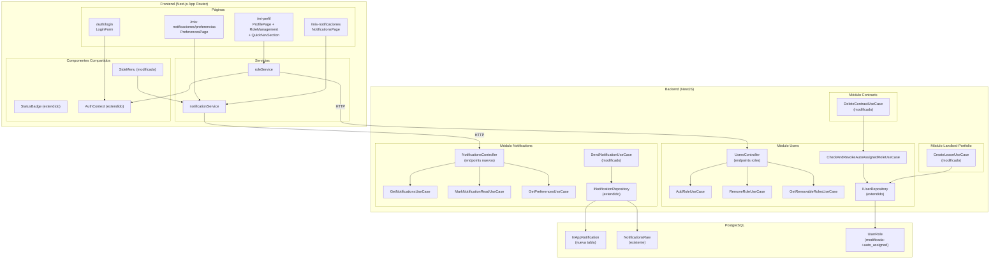
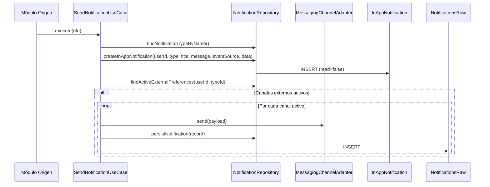
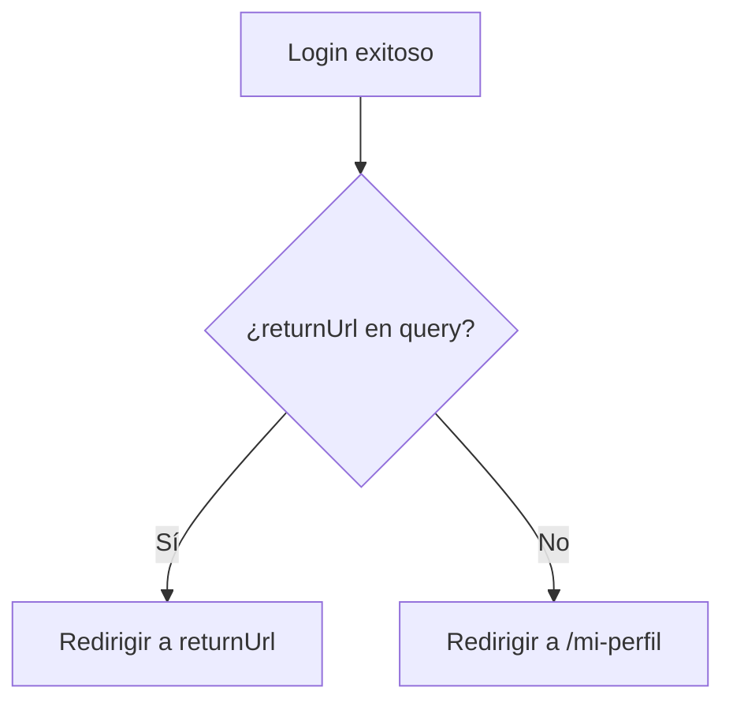
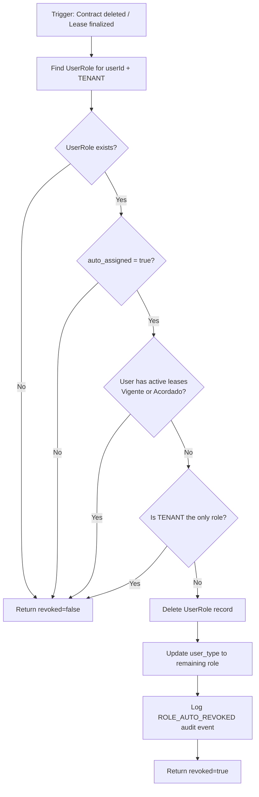

# Documento de Diseño — Multirole y Notificaciones (Frontend)

## Resumen de Investigación

Se analizó el código fuente existente para informar las decisiones de diseño:

- **Backend de notificaciones**: `SendNotificationUseCase` actualmente solo persiste en `NotificationsRaw` (canal externo) y envía vía `MessagingChannelAdapter`. No existe modelo `InAppNotification` ni endpoints para consultar notificaciones in-app. El `NotificationsController` solo expone `PUT /notifications/preferences`.
- **Frontend de autenticación**: `AuthContext` almacena `{ accessToken, userId, displayName, roles }` en `localStorage`. No expone un método `refreshToken` ni `updateAuth`. `LoginForm` redirige siempre a `/explorar` tras login exitoso.
- **SideMenu**: `buildNavLinks()` genera enlaces según roles. No incluye enlace de notificaciones.
- **CreateLeaseUseCase**: Resuelve al arrendatario por email pero no verifica ni asigna el rol TENANT automáticamente.
- **ProfileCard**: Muestra roles como badges pero no ofrece gestión de roles.
- **Prisma schema**: No existe tabla `InAppNotification`. La tabla `NotificationsRaw` almacena entregas de canales externos como JSON.
- **Servicios frontend**: Siguen un patrón consistente con `fetch` nativo, manejo de errores por código HTTP, y constante `API_URL` desde `process.env.NEXT_PUBLIC_API_URL`.

---

## Overview

Este diseño aborda tres capacidades interrelacionadas:

1. **Notificaciones in-app**: Nuevo modelo `InAppNotification` en el schema `notifications`, nuevos endpoints backend (GET lista, GET count, PATCH read, PATCH read-all, GET preferences agrupadas), servicio frontend `notificationService`, página de historial (`/mis-notificaciones`) y página de preferencias de canales externos (`/mis-notificaciones/preferencias`).

2. **Experiencia multirole**: Página de perfil mejorada (`/mi-perfil`) como landing page con sección de navegación rápida por rol, redirección post-login unificada a `/mi-perfil`, enlace "Mis notificaciones" con badge de no leídas en SideMenu.

3. **Gestión de roles**: Asignación automática de TENANT en `CreateLeaseUseCase`, auto-revocación del rol TENANT cuando el arriendo no se materializa (contrato eliminado o arriendo finalizado sin contrato firmado) mediante `CheckAndRevokeAutoAssignedRoleUseCase`, endpoints `POST /auth/roles/add`, `DELETE /auth/roles/:roleName`, `GET /auth/roles/removable`, sección de gestión de roles en `/mi-perfil`, y actualización del `AuthContext` con nuevo JWT tras cambios de rol. La columna `auto_assigned` en `UserRole` distingue roles asignados automáticamente de los agregados manualmente por el usuario.

El diseño sigue la arquitectura hexagonal existente, el patrón de servicios frontend con `fetch` nativo, y los estándares de accesibilidad WCAG 2.1 AA del proyecto.

---

## Architecture

### Diagrama de Componentes



### Flujo de Notificación (Modificado)



### Flujo de Redirección Post-Login



---

## Components and Interfaces

### Backend — Nuevos Endpoints

#### NotificationsController (extendido)

| Método | Ruta | Descripción | Auth |
|--------|------|-------------|------|
| `GET` | `/notifications` | Lista notificaciones in-app del usuario | JWT |
| `GET` | `/notifications/count` | Conteo de no leídas | JWT |
| `PATCH` | `/notifications/:id/read` | Marcar una como leída | JWT |
| `PATCH` | `/notifications/read-all` | Marcar todas como leídas | JWT |
| `GET` | `/notifications/preferences` | Preferencias agrupadas por tipo | JWT |
| `PUT` | `/notifications/preferences` | Actualizar preferencia (existente) | JWT |

#### UsersController (extendido)

| Método | Ruta | Descripción | Auth |
|--------|------|-------------|------|
| `POST` | `/auth/roles/add` | Agregar rol al usuario | JWT |
| `DELETE` | `/auth/roles/:roleName` | Eliminar rol del usuario | JWT |
| `GET` | `/auth/roles/removable` | Consultar eliminabilidad de roles | JWT |

### Backend — Nuevos Use Cases

#### GetNotificationsUseCase
```typescript
// Input: userId (from JWT)
// Output: InAppNotificationDto[]
// Queries InAppNotification WHERE userId, ORDER BY createdAt DESC
```

#### GetNotificationCountUseCase
```typescript
// Input: userId (from JWT)
// Output: { unreadCount: number }
// Queries InAppNotification WHERE userId AND read = false, COUNT
```

#### MarkNotificationReadUseCase
```typescript
// Input: userId, notificationId
// Output: InAppNotificationDto
// Validates ownership (userId match), updates read = true
// Throws NotFoundException if not found or not owned
```

#### MarkAllNotificationsReadUseCase
```typescript
// Input: userId
// Output: { updatedCount: number }
// UPDATE InAppNotification SET read = true WHERE userId AND read = false
```

#### GetNotificationPreferencesUseCase
```typescript
// Input: userId
// Output: PreferencesGroupedDto[]
// Queries all NotificationType, cross-joins with channels [EMAIL, WHATSAPP]
// Fills isActive from NotificationPreference or defaults to false
```

#### AddRoleUseCase
```typescript
// Input: userId, roleName
// Output: { accessToken: string, roles: string[] }
// Validates role exists, user doesn't already have it
// Inserts UserRole with auto_assigned = false (manual addition)
// Updates user_type to "BOTH"
// Signs new JWT with updated roles
// Logs audit event ROLE_ADDED
```

#### RemoveRoleUseCase
```typescript
// Input: userId, roleName
// Output: { accessToken: string, roles: string[] }
// Validates role exists, user has it, user has >1 role
// Checks removability (active resources)
// Deletes UserRole, updates user_type to remaining role
// Signs new JWT with updated roles
// Logs audit event ROLE_REMOVED
```

#### GetRemovableRolesUseCase
```typescript
// Input: userId
// Output: RemovableRoleDto[]
// For each user role, checks active resources:
//   TENANT: active leases, active contracts as tenant, pending payments
//   LANDLORD: portfolios with units, active leases in portfolio units, active contracts as landlord
// Returns { roleName, removable, reasons[] }
```

#### CheckAndRevokeAutoAssignedRoleUseCase
```typescript
// Input: userId, roleName (e.g. "TENANT")
// Output: { revoked: boolean }
// Called after contract deletion or lease finalization
// Logic (executed within a transaction):
//   1. Find the UserRole record for (userId, roleName)
//   2. If not found → return { revoked: false }
//   3. If auto_assigned = false → return { revoked: false } (user added it manually)
//   4. Check if user has other active leases (status "Vigente" or "Acordado") as tenant
//   5. If has active leases → return { revoked: false }
//   6. Check if user has only this one role (must keep at least one)
//   7. If only role → return { revoked: false }
//   8. Delete UserRole record, update user_type to remaining role
//   9. Log audit event ROLE_AUTO_REVOKED { userId, roleName }
//  10. Return { revoked: true }
```

### Backend — Interfaces de Repositorio (Extensiones)

#### INotificationRepository (extendido)
```typescript
export interface INotificationRepository {
  // ... métodos existentes ...

  // Nuevos métodos para in-app notifications
  createInAppNotification(data: CreateInAppNotificationData): Promise<InAppNotificationEntity>;
  findInAppNotificationsByUserId(userId: string): Promise<InAppNotificationEntity[]>;
  countUnreadByUserId(userId: string): Promise<number>;
  markAsRead(id: string, userId: string): Promise<InAppNotificationEntity | null>;
  markAllAsRead(userId: string): Promise<number>;
  findAllNotificationTypes(): Promise<NotificationTypeEntity[]>;
  findActiveExternalPreferences(userId: string, notificationTypeId: string): Promise<NotificationPreferenceEntity[]>;
}
```

#### IUserRepository (extendido)
```typescript
export interface IUserRepository {
  // ... métodos existentes ...

  // Nuevos métodos para gestión de roles
  addRoleToUser(userId: string, roleId: string, autoAssigned: boolean): Promise<void>;
  removeRoleFromUser(userId: string, roleId: string): Promise<void>;
  updateUserType(userId: string, userType: string): Promise<void>;
  findUserRoles(userId: string): Promise<{ id: string; name: string; autoAssigned: boolean }[]>;
  findUserRoleRecord(userId: string, roleName: string): Promise<{ id: string; roleId: string; autoAssigned: boolean } | null>;
  hasActiveLeases(userId: string): Promise<boolean>;
  hasActiveContractsAsRole(userId: string, role: string): Promise<boolean>;
  hasPendingPayments(userId: string): Promise<boolean>;
  hasPortfoliosWithUnits(userId: string): Promise<boolean>;
  hasActiveLeasesInPortfolios(userId: string): Promise<boolean>;
  countUserRoles(userId: string): Promise<number>;
}
```

### Frontend — Servicios

#### notificationService (`src/frontend/shared/services/notification.ts`)

```typescript
export interface InAppNotification {
  id: string;
  notificationType: string;
  title: string;
  message: string;
  read: boolean;
  eventSource: string;
  data: Record<string, unknown>;
  createdAt: string;
}

export interface NotificationCount {
  unreadCount: number;
}

export interface NotificationPreferenceGroup {
  notificationTypeName: string;
  channels: {
    channel: 'EMAIL' | 'WHATSAPP';
    isActive: boolean;
  }[];
}

export const notificationService = {
  getNotifications(token: string): Promise<InAppNotification[]>;
  getNotificationCount(token: string): Promise<NotificationCount>;
  markAsRead(notificationId: string, token: string): Promise<InAppNotification>;
  markAllAsRead(token: string): Promise<{ updatedCount: number }>;
  getPreferences(token: string): Promise<NotificationPreferenceGroup[]>;
  updatePreference(data: { notificationTypeName: string; channel: string; isActive: boolean }, token: string): Promise<void>;
};
```

#### roleService (`src/frontend/shared/services/role.ts`)

```typescript
export interface RemovableRole {
  roleName: string;
  removable: boolean;
  reasons: string[];
}

export interface RoleChangeResponse {
  accessToken: string;
  roles: string[];
}

export const roleService = {
  addRole(roleName: string, token: string): Promise<RoleChangeResponse>;
  removeRole(roleName: string, token: string): Promise<RoleChangeResponse>;
  getRemovableRoles(token: string): Promise<RemovableRole[]>;
};
```

### Frontend — Páginas Nuevas

#### NotificationsPage (`src/frontend/app/mis-notificaciones/page.tsx`)
- `ProtectedRoute` wrapper
- Header con hamburguesa + SideMenu
- Botón "Marcar todas como leídas"
- Lista de tarjetas de notificación con indicador leído/no leído
- Enlace a preferencias
- Skeleton loading, empty state, error state con retry

#### PreferencesPage (`src/frontend/app/mis-notificaciones/preferencias/page.tsx`)
- `ProtectedRoute` wrapper
- Header con flecha de retroceso a `/mis-notificaciones`
- Banner informativo "Las notificaciones en la aplicación están siempre activas"
- Secciones por tipo de notificación con toggles EMAIL/WHATSAPP
- UI optimista con rollback en error
- Skeleton loading, error state con retry

### Frontend — Componentes Modificados

#### SideMenu (modificado)
- `buildNavLinks()` agrega "Mis notificaciones" con ícono campana antes de "Mi perfil" para usuarios autenticados
- Badge numérico de no leídas junto al ícono (consulta `GET /notifications/count`)
- No se agrega enlace "Inicio" (la página `/inicio` ya no existe)

#### StatusBadge (extendido)
- Nueva variante `notification` con mapeo: SENT→verde, FAILED→rojo, PENDING→ámbar

#### AuthContext (extendido)
- Nuevo método `updateAuth(accessToken, roles)` para actualizar estado tras cambio de rol sin re-login

#### LoginForm (modificado)
- Redirección post-login siempre a `/mi-perfil` (en lugar de `/explorar`)
- Soporte para `returnUrl` query parameter: si existe, redirige a `returnUrl` en lugar de `/mi-perfil`

#### ProfilePage + RoleManagementSection + QuickNavSection
- Nueva sección `RoleManagementSection` debajo de ProfileCard
- Muestra roles actuales como badges
- Botón "Agregar rol" si falta un rol
- Botón "Eliminar rol" por cada rol (deshabilitado si no es removable)
- ConfirmationDialog para eliminación
- Nueva sección `QuickNavSection` debajo de RoleManagementSection con título "Navegación rápida"
- Para LANDLORD-only: tarjeta "Ir a mi portafolio" con ícono, descripción y flecha → `/mi-portafolio`
- Para TENANT-only: tarjeta "Ir a mis arriendos" con ícono, descripción y flecha → `/mis-arriendos`
- Para multirole: ambas tarjetas
- Cada tarjeta es un `<Link>` con `border`, `border-radius: 6px`, min touch target 44px, accesible
- Sirve como guía de onboarding para usuarios recién registrados

```typescript
// QuickNavSection — estructura de datos
interface QuickNavCard {
  title: string;       // "Ir a mi portafolio" | "Ir a mis arriendos"
  description: string; // Texto descriptivo del destino
  href: string;        // "/mi-portafolio" | "/mis-arriendos"
  icon: () => JSX.Element;
}

function getQuickNavCards(roles: string[]): QuickNavCard[] {
  const cards: QuickNavCard[] = [];
  if (roles.includes('LANDLORD')) {
    cards.push({
      title: 'Ir a mi portafolio',
      description: 'Gestiona tus propiedades, unidades y arriendos. Publica inmuebles para encontrar arrendatarios.',
      href: '/mi-portafolio',
      icon: PortfolioIcon,
    });
  }
  if (roles.includes('TENANT')) {
    cards.push({
      title: 'Ir a mis arriendos',
      description: 'Consulta tus arriendos activos, contratos y pagos. Haz seguimiento del proceso de arriendo.',
      href: '/mis-arriendos',
      icon: LeaseIcon,
    });
  }
  return cards;
}
```

### Mapa de Traducciones de Tipos de Notificación

```typescript
const NOTIFICATION_TYPE_TRANSLATIONS: Record<string, string> = {
  CONTRACT_SIGNED: 'Contrato firmado',
  PAYMENT_RECEIVED: 'Pago recibido',
  CONTACT_INITIATED: 'Contacto iniciado',
  CONTRACT_UPLOADED: 'Contrato cargado',
};

export function translateNotificationType(name: string): string {
  return NOTIFICATION_TYPE_TRANSLATIONS[name] ?? name;
}
```

---

## Data Models

### Nueva Tabla: InAppNotification (schema `notifications`)

```prisma
model InAppNotification {
  id                   String   @id @default(uuid())
  user_id              String
  notification_type_id String
  title                String
  message              String
  read                 Boolean  @default(false)
  event_source         String
  data                 Json     @default("{}")
  created_at           DateTime @default(now())

  notification_type NotificationType @relation(fields: [notification_type_id], references: [id])

  @@index([user_id, read])
  @@index([user_id, created_at])
  @@schema("notifications")
}
```

### Entidad de Dominio: InAppNotificationEntity

```typescript
export class InAppNotificationEntity {
  constructor(
    public readonly id: string,
    public readonly userId: string,
    public readonly notificationTypeId: string,
    public readonly title: string,
    public readonly message: string,
    public readonly read: boolean,
    public readonly eventSource: string,
    public readonly data: Record<string, unknown>,
    public readonly createdAt: Date,
  ) {}
}
```

### DTOs Nuevos

#### InAppNotificationDto (Response)
```typescript
export class InAppNotificationDto {
  @ApiProperty() id!: string;
  @ApiProperty() notificationType!: string;
  @ApiProperty() title!: string;
  @ApiProperty() message!: string;
  @ApiProperty() read!: boolean;
  @ApiProperty() eventSource!: string;
  @ApiProperty() data!: Record<string, unknown>;
  @ApiProperty() createdAt!: string;
}
```

#### NotificationCountDto (Response)
```typescript
export class NotificationCountDto {
  @ApiProperty() unreadCount!: number;
}
```

#### PreferencesGroupedDto (Response)
```typescript
export class ChannelPreferenceDto {
  @ApiProperty({ enum: ['EMAIL', 'WHATSAPP'] }) channel!: string;
  @ApiProperty() isActive!: boolean;
}

export class PreferencesGroupedDto {
  @ApiProperty() notificationTypeName!: string;
  @ApiProperty({ type: [ChannelPreferenceDto] }) channels!: ChannelPreferenceDto[];
}
```

#### AddRoleDto (Request)
```typescript
export class AddRoleDto {
  @ApiProperty({ enum: ['LANDLORD', 'TENANT'] })
  @IsIn(['LANDLORD', 'TENANT'])
  roleName!: string;
}
```

#### RemovableRoleDto (Response)
```typescript
export class RemovableRoleDto {
  @ApiProperty() roleName!: string;
  @ApiProperty() removable!: boolean;
  @ApiProperty({ type: [String] }) reasons!: string[];
}
```

#### RoleChangeResponseDto (Response)
```typescript
export class RoleChangeResponseDto {
  @ApiProperty() accessToken!: string;
  @ApiProperty({ type: [String] }) roles!: string[];
}
```

### Modificación a NotificationType (Prisma)

Se agrega relación inversa para `InAppNotification`:

```prisma
model NotificationType {
  // ... campos existentes ...
  in_app_notifications InAppNotification[]
}
```

### Modificación a UserRole (Prisma)

Se agrega columna `auto_assigned` para distinguir roles asignados automáticamente de los agregados manualmente:

```prisma
model UserRole {
  id            String  @id @default(uuid())
  user_id       String
  role_id       String
  auto_assigned Boolean @default(false)

  user User @relation(fields: [user_id], references: [id])
  role Role @relation(fields: [role_id], references: [id])

  @@unique([user_id, role_id])
  @@schema("users")
}
```

- `auto_assigned = true`: rol asignado automáticamente por `CreateLeaseUseCase` (Req 11)
- `auto_assigned = false` (default): rol agregado manualmente por el usuario vía `POST /auth/roles/add` (Req 12) o durante el registro inicial

### Modificación a SendNotificationUseCase

El use case se modifica para:
1. **Siempre** crear un registro `InAppNotification` con `read: false`
2. **Adicionalmente** enviar por canales externos activos según preferencias
3. El título y mensaje se generan a partir del `notificationTypeName` y `data` usando un helper `buildNotificationContent(typeName, data): { title, message }`

### Modificación a CreateLeaseUseCase

Se agrega dentro de la transacción existente:
1. Verificar si el arrendatario tiene rol TENANT
2. Si no lo tiene: insertar `UserRole` con `auto_assigned = true`, actualizar `user_type` a "BOTH"
3. Registrar evento de auditoría `ROLE_AUTO_ASSIGNED`
4. Si ya lo tiene: continuar sin error (skip silencioso)

### Modificación a AddRoleUseCase

Se asegura que al agregar un rol manualmente:
1. Insertar `UserRole` con `auto_assigned = false` (valor por defecto)
2. Esto garantiza que roles agregados por el usuario nunca serán auto-revocados

### Modificación a DeleteContractUseCase

Se agrega después de la eliminación exitosa del contrato:
1. Obtener el `leaseId` del contrato eliminado
2. Obtener el `tenantUserId` del arriendo asociado
3. Si el contrato eliminado tenía estado PENDING: invocar `CheckAndRevokeAutoAssignedRoleUseCase.execute(tenantUserId, "TENANT")`
4. La invocación es fire-and-forget respecto al resultado de la revocación (no afecta la respuesta de eliminación del contrato)

### Nuevo: CheckAndRevokeAutoAssignedRoleUseCase — Flujo de Revocación



---

## Correctness Properties

*A property is a characteristic or behavior that should hold true across all valid executions of a system — essentially, a formal statement about what the system should do. Properties serve as the bridge between human-readable specifications and machine-verifiable correctness guarantees.*

### Property 1: Notification service response parsing round-trip

*For any* valid JSON response from the notifications API (notifications list, unread count, or preferences), the `notificationService` methods shall parse and return an object structurally equivalent to the original API response.

**Validates: Requirements 1.1, 1.2, 1.5**

### Property 2: Notification service request construction

*For any* valid input parameters (notification ID for markAsRead, preference data for updatePreference), the `notificationService` shall construct an HTTP request with the correct URL path containing the parameter and the correct request body matching the input.

**Validates: Requirements 1.3, 1.6**

### Property 3: Service error mapping for server errors

*For any* HTTP response with status code ≥ 500, all `notificationService` methods shall throw an error with the message "Error del servidor. Intenta de nuevo más tarde.".

**Validates: Requirements 1.9**

### Property 4: In-app notifications ordered by creation date

*For any* set of `InAppNotification` records belonging to a user, `GET /notifications` shall return them ordered by `createdAt` descending (most recent first).

**Validates: Requirements 2.1**

### Property 5: Unread count matches actual unread notifications

*For any* set of `InAppNotification` records belonging to a user with varying `read` status, `GET /notifications/count` shall return an `unreadCount` equal to the number of records where `read` is `false`.

**Validates: Requirements 2.2**

### Property 6: Mark as read updates correctly

*For any* `InAppNotification` belonging to the authenticated user with `read=false`, calling `PATCH /notifications/:id/read` shall set `read` to `true` and return the updated record.

**Validates: Requirements 2.3**

### Property 7: Mark all as read updates all unread

*For any* set of `InAppNotification` records belonging to a user, calling `PATCH /notifications/read-all` shall set `read=true` on all records where `read` was `false`, and return a count equal to the number of records that were updated.

**Validates: Requirements 2.5**

### Property 8: Preferences grouped with defaults

*For any* set of `NotificationType` records and partial `NotificationPreference` records for a user, `GET /notifications/preferences` shall return one group per notification type, each containing entries for EMAIL and WHATSAPP channels, where missing preferences default to `isActive: false`.

**Validates: Requirements 2.6**

### Property 9: SendNotificationUseCase always creates in-app notification

*For any* valid `SendNotificationDto`, executing `SendNotificationUseCase` shall create exactly one `InAppNotification` record with `read=false` for the target user, regardless of the user's external channel preferences.

**Validates: Requirements 2.8**

### Property 10: External channels sent only when active

*For any* valid `SendNotificationDto` and user preference configuration, `SendNotificationUseCase` shall send via an external channel (EMAIL or WHATSAPP) if and only if the user has an active preference for that channel and notification type.

**Validates: Requirements 2.9**

### Property 11: Notification card contains all required fields

*For any* `InAppNotification` object, the rendered notification card shall contain the translated notification type name, the title, the message, a visual read/unread indicator, and a relative creation date.

**Validates: Requirements 3.3**

### Property 12: Preferences page shows exactly EMAIL and WHATSAPP toggles per type

*For any* set of notification types returned by the API, the preferences page shall render exactly two toggle controls (EMAIL and WHATSAPP) per notification type, with no controls for the in-app channel.

**Validates: Requirements 4.4, 4.5**

### Property 13: Optimistic toggle update with rollback on failure

*For any* toggle state change on the preferences page, the UI shall immediately reflect the new state (optimistic update); if the API call fails, the toggle shall revert to its previous state.

**Validates: Requirements 4.6, 4.7**

### Property 14: Post-login redirect always to /mi-perfil

*For any* authenticated user without a `returnUrl`, the login flow shall redirect to `/mi-perfil` regardless of the user's role configuration (LANDLORD only, TENANT only, or both).

**Validates: Requirements 6.1, 6.2**

### Property 15: returnUrl preserved through login flow

*For any* protected URL that triggers a redirect to `/auth/login`, the login flow shall redirect back to the original URL after successful authentication instead of applying the default redirect to `/mi-perfil`.

**Validates: Requirements 6.3**

### Property 16: SideMenu notification link positioned before "Mi perfil"

*For any* authenticated user's role configuration, the `buildNavLinks` function shall place the "Mis notificaciones" link immediately before the "Mi perfil" link in the navigation list.

**Validates: Requirements 7.1**

### Property 17: Unread badge visibility

*For any* unread notification count, the SideMenu shall display a numeric badge next to the notification icon if and only if the count is greater than zero, and the badge shall display the exact count value.

**Validates: Requirements 7.2**

### Property 18: QuickNavSection shows correct cards based on roles

*For any* user role configuration (LANDLORD only, TENANT only, or both), the `getQuickNavCards` function shall return exactly the cards corresponding to the user's roles: a "Mi portafolio" card if LANDLORD is present, a "Mis arriendos" card if TENANT is present, and both cards if the user has both roles.

**Validates: Requirements 5.2, 5.3, 5.4**

### Property 19: StatusBadge notification variant mapping

*For any* notification delivery status in {SENT, FAILED, PENDING}, the StatusBadge with variant `notification` shall render the correct Spanish label and color pair. For any status string not in this set, it shall render the default gray style.

**Validates: Requirements 8.1, 8.3**

### Property 20: Unknown notification type fallback

*For any* notification type name string not present in the known translation map, the `translateNotificationType` function shall return the original string unchanged.

**Validates: Requirements 9.5**

### Property 21: Auto-assign TENANT role on lease creation

*For any* user without the TENANT role, when `CreateLeaseUseCase` creates a lease where that user is the tenant, the use case shall assign the TENANT role and update `user_type` to "BOTH".

**Validates: Requirements 11.1, 11.2**

### Property 22: Idempotent TENANT assignment on lease creation

*For any* user who already has the TENANT role, when `CreateLeaseUseCase` creates a lease where that user is the tenant, the use case shall complete successfully without error and without creating a duplicate role entry.

**Validates: Requirements 11.4**

### Property 23: Role removability determined by active resources

*For any* user with roles and varying active resources, `GET /auth/roles/removable` shall mark TENANT as non-removable if the user has active leases, active contracts as tenant, or pending payments; and shall mark LANDLORD as non-removable if the user has portfolios with units, active leases in portfolio units, or active contracts as landlord. Roles with no blocking resources shall be marked as removable.

**Validates: Requirements 12.2, 12.3, 12.4**

### Property 24: Add role returns new JWT with updated roles

*For any* valid role addition (adding the missing role to a single-role user), `POST /auth/roles/add` shall return a new JWT whose decoded payload contains both roles, and the response `roles` array shall contain both role names.

**Validates: Requirements 12.1**

### Property 25: Remove role returns new JWT with remaining role

*For any* valid role removal (removing a removable role from a dual-role user), `DELETE /auth/roles/:roleName` shall return a new JWT whose decoded payload contains only the remaining role, and the response `roles` array shall contain only the remaining role name.

**Validates: Requirements 12.5**

### Property 26: AuthProvider updates state with new JWT data

*For any* `RoleChangeResponse` containing a new access token and roles array, calling `updateAuth` on the AuthProvider shall update the stored token, roles, and user state to match the response data without requiring a new login.

**Validates: Requirements 12.11**

### Property 27: auto_assigned flag reflects assignment source

*For any* role assignment operation, if the role is assigned by `CreateLeaseUseCase` (auto-assignment), the resulting `UserRole` record shall have `auto_assigned = true`; if the role is assigned by `AddRoleUseCase` (manual addition via `POST /auth/roles/add`), the resulting `UserRole` record shall have `auto_assigned = false`.

**Validates: Requirements 13.2, 13.3**

### Property 28: Auto-revocation decision correctness

*For any* user with the TENANT role and any combination of (hasActiveLeases, autoAssigned, isOnlyRole), `CheckAndRevokeAutoAssignedRoleUseCase` shall revoke the TENANT role if and only if all three conditions are met: `auto_assigned = true`, the user has no active leases (status "Vigente" or "Acordado") as tenant, and the user has at least one other role. In all other cases, the TENANT role shall be preserved.

**Validates: Requirements 13.6, 13.7, 13.8, 13.10**

---

## Error Handling

### Backend

| Escenario | Código HTTP | Mensaje |
|-----------|-------------|---------|
| Token JWT inválido o expirado | 401 | "Unauthorized" |
| Notificación no encontrada o no pertenece al usuario | 404 | "Notificación no encontrada" |
| Tipo de notificación no encontrado | 404 | "Tipo de notificación no encontrado: {name}" |
| Rol no encontrado | 400 | "Rol '{name}' no encontrado" |
| Usuario ya tiene el rol | 409 | "El usuario ya tiene el rol {name}" |
| No se puede eliminar el único rol | 400 | "El usuario debe tener al menos un rol" |
| Rol no eliminable por recursos activos | 409 | "No se puede eliminar el rol {name}: {reasons}" |
| Error interno del servidor | 500 | "Error interno del servidor" |

### Frontend

| Escenario | Comportamiento |
|-----------|---------------|
| HTTP 401 en cualquier servicio | Lanzar error "Sesión expirada" → componente llama `logout()` |
| HTTP 403 | Lanzar error "No tienes permiso para realizar esta acción" |
| HTTP 404 | Lanzar error con mensaje del servidor |
| HTTP 409 | Lanzar error con mensaje del servidor |
| HTTP 500+ | Lanzar error "Error del servidor. Intenta de nuevo más tarde." |
| Error de red (fetch falla) | Lanzar error "No se pudo conectar con el servidor. Verifica tu conexión e intenta de nuevo." |
| Toggle optimista falla | Revertir toggle al estado anterior + mostrar toast/mensaje de error |
| Carga de datos falla | Mostrar `ErrorState` con botón "Reintentar" |

### SendNotificationUseCase (modificado)

- La creación de `InAppNotification` es crítica: si falla, se propaga el error al caller
- El envío por canales externos sigue siendo fire-and-forget: errores se loguean pero no interrumpen el flujo
- Si el tipo de notificación no existe, se loguea warning y se retorna sin error

### CreateLeaseUseCase (modificado)

- La asignación de rol TENANT se ejecuta dentro de la transacción existente
- El `UserRole` se crea con `auto_assigned = true` para distinguirlo de roles manuales
- Si la inserción en `UserRole` falla por constraint de unicidad (usuario ya tiene el rol), se captura el error y se continúa silenciosamente
- Si la actualización de `user_type` falla, la transacción completa se revierte (incluyendo la creación del lease)

### DeleteContractUseCase (modificado)

- Después de eliminar un contrato PENDING, invoca `CheckAndRevokeAutoAssignedRoleUseCase` para el arrendatario
- Si la revocación falla, se loguea el error pero no se revierte la eliminación del contrato (la eliminación ya fue exitosa)
- La revocación es un efecto secundario, no un requisito para la respuesta exitosa de eliminación

### CheckAndRevokeAutoAssignedRoleUseCase

- Toda la lógica de verificación y revocación se ejecuta dentro de una transacción
- Si el usuario no tiene el rol TENANT, retorna `{ revoked: false }` sin error
- Si `auto_assigned = false`, retorna `{ revoked: false }` sin error (respeta la decisión manual del usuario)
- Si el usuario tiene arriendos activos, retorna `{ revoked: false }` sin error
- Si TENANT es el único rol del usuario, retorna `{ revoked: false }` sin error (guarda de "al menos un rol")
- Si la transacción falla, se propaga el error al caller (que decide si loguearlo o propagarlo)

---

## Testing Strategy

### Enfoque Dual

Este feature utiliza un enfoque dual de testing:

- **Tests unitarios (example-based)**: Para escenarios específicos, edge cases, integraciones de componentes UI, y verificaciones de accesibilidad
- **Tests de propiedades (property-based)**: Para validar invariantes universales que deben cumplirse para cualquier input válido

### Librería de Property-Based Testing

- **Backend (NestJS/Jest)**: `fast-check` — librería PBT madura para TypeScript/JavaScript
- **Frontend (Next.js/Jest o Vitest)**: `fast-check` — misma librería para consistencia

### Configuración PBT

- Mínimo **100 iteraciones** por test de propiedad
- Cada test de propiedad debe incluir un comentario referenciando la propiedad del diseño:
  ```typescript
  // Feature: multirole-notifications-frontend, Property 4: In-app notifications ordered by creation date
  ```

### Distribución de Tests

#### Property-Based Tests (Backend)

| Propiedad | Módulo | Descripción |
|-----------|--------|-------------|
| P4 | notifications | Ordenamiento de notificaciones por createdAt DESC |
| P5 | notifications | Conteo de no leídas coincide con registros read=false |
| P6 | notifications | Mark as read actualiza correctamente |
| P7 | notifications | Mark all as read actualiza todas las no leídas |
| P8 | notifications | Preferencias agrupadas con defaults |
| P9 | notifications | SendNotificationUseCase siempre crea InAppNotification |
| P10 | notifications | Canales externos solo cuando están activos |
| P21 | landlord-portfolio | Auto-asignación de TENANT en CreateLeaseUseCase |
| P22 | landlord-portfolio | Idempotencia de asignación TENANT |
| P23 | users | Determinación de eliminabilidad de roles |
| P24 | users | Add role retorna JWT con roles actualizados |
| P25 | users | Remove role retorna JWT con rol restante |
| P27 | users / landlord-portfolio | auto_assigned flag refleja fuente de asignación |
| P28 | users | Decisión de auto-revocación correcta según estado del usuario |

#### Property-Based Tests (Frontend)

| Propiedad | Componente/Servicio | Descripción |
|-----------|---------------------|-------------|
| P1 | notificationService | Parsing de respuestas round-trip |
| P2 | notificationService | Construcción de requests |
| P3 | notificationService | Mapeo de errores 500+ |
| P11 | NotificationCard | Tarjeta contiene todos los campos requeridos |
| P12 | PreferencesPage | Toggles EMAIL/WHATSAPP por tipo |
| P13 | PreferencesPage | Toggle optimista con rollback |
| P14 | LoginForm | Redirección post-login siempre a /mi-perfil |
| P16 | SideMenu/buildNavLinks | Posición de enlace de notificaciones |
| P17 | SideMenu | Badge de no leídas |
| P18 | QuickNavSection | Tarjetas correctas según roles |
| P19 | StatusBadge | Variante notification mapping |
| P20 | translateNotificationType | Fallback para tipos desconocidos |
| P26 | AuthContext | Actualización de estado con nuevo JWT |

#### Unit Tests (Example-Based)

- Escenarios específicos de error HTTP (401, 403, 404, 409)
- Empty states y loading states de cada página
- Redirección de usuarios anónimos a `/auth/login`
- Traducciones conocidas de tipos de notificación (9.1–9.4)
- Variantes existentes de StatusBadge sin modificaciones (8.2)
- ConfirmationDialog antes de eliminar rol (12.10)
- Evento de auditoría ROLE_AUTO_ASSIGNED (11.5)
- Evento de auditoría ROLE_AUTO_REVOKED (13.6)
- Validación de que no se puede eliminar el único rol (12.6)
- Accesibilidad: `role="switch"`, `aria-checked`, navegación por teclado (10.3, 10.4)
- QuickNavSection: tarjetas tienen border, border-radius 6px, min touch target 44px (5.5)
- QuickNavSection: posición debajo de Sección_Gestionar_Roles (5.1)
- CheckAndRevokeAutoAssignedRoleUseCase: retorna `{ revoked: false }` cuando UserRole no existe
- Columna `auto_assigned` tiene valor por defecto `false` en nuevos registros UserRole (13.1)

#### Integration Tests

- Flujo completo de login → redirect a /mi-perfil
- Flujo completo de login con returnUrl → redirect a returnUrl
- Flujo de agregar rol → actualización de AuthContext → SideMenu refleja cambios
- Flujo de crear lease → auto-asignación TENANT → nuevo JWT
- Transaccionalidad de CreateLeaseUseCase (11.3)
- Flujo de eliminar contrato PENDING → trigger de CheckAndRevokeAutoAssignedRoleUseCase (13.4)
- Flujo de arriendo finalizado sin contrato SIGNED → trigger de revocación (13.5)
- Transaccionalidad de CheckAndRevokeAutoAssignedRoleUseCase (13.9)
