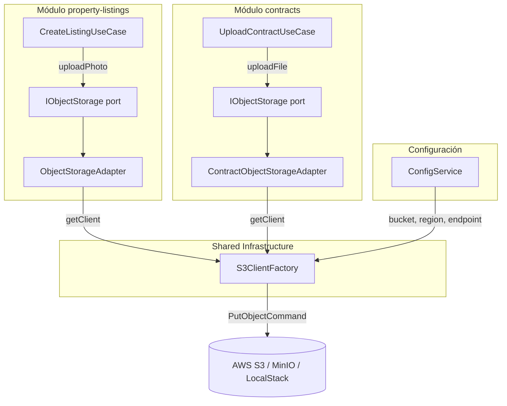
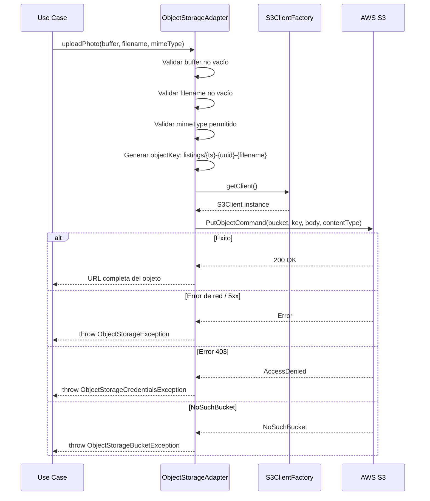

# Documento de Diseño — Implementación de Object Storage Real

## Visión General

Este diseño describe la implementación real de los adaptadores de almacenamiento de objetos que actualmente son stubs en los módulos `property-listings` y `contracts`. Se reemplazarán los adaptadores MVP que retornan URLs ficticias por implementaciones reales basadas en AWS S3 SDK v3 (`@aws-sdk/client-s3`).

La solución respeta la arquitectura hexagonal existente: los puertos (`IObjectStorage`) de cada módulo permanecen intactos, y solo se modifican los adaptadores de infraestructura y la configuración central. Se introduce un módulo compartido `S3ClientFactory` que centraliza la creación del `S3Client`, evitando duplicación de lógica de conexión entre módulos.

### Decisiones de Diseño Clave

| Decisión | Justificación |
|----------|---------------|
| `S3Client` compartido vía factory | Evita duplicar configuración de conexión en cada adaptador; un solo punto de cambio para endpoint/región |
| Validación de MIME type en el adaptador | Cada módulo tiene restricciones distintas (imágenes vs PDF); la validación en el adaptador mantiene la responsabilidad cerca del dominio |
| Object Key con `{prefix}/{timestamp}-{uuid}-{filename}` | Garantiza unicidad global, organización por módulo, y trazabilidad del archivo original |
| URL construida manualmente post-upload | `PutObjectCommand` no retorna URL; construirla a partir de bucket/region/key es el patrón estándar del SDK v3 |
| Validación de buffer vacío y filename antes de llamar a S3 | Fail-fast: evita llamadas de red innecesarias y produce errores descriptivos |

## Arquitectura



### Flujo de Upload



## Componentes e Interfaces

### 1. Configuración (`configuration.ts`)

Se extiende la interfaz `AppConfig` para incluir `region`:

```typescript
objectStorage: {
  bucket: string;
  endpoint: string;
  region: string;  // nuevo — default: 'us-east-1'
};
```

### 2. S3ClientFactory (shared)

Servicio inyectable que crea y cachea una instancia de `S3Client`:

```typescript
// src/backend/src/shared/s3/s3-client.factory.ts
@Injectable()
export class S3ClientFactory {
  private client: S3Client | null = null;

  constructor(private readonly configService: ConfigService) {}

  getClient(): S3Client {
    if (!this.client) {
      const region = this.configService.get<string>('objectStorage.region');
      const endpoint = this.configService.get<string>('objectStorage.endpoint');
      this.client = new S3Client({
        region,
        ...(endpoint ? { endpoint, forcePathStyle: true } : {}),
      });
    }
    return this.client;
  }
}
```

- `forcePathStyle: true` se activa solo cuando hay endpoint personalizado (LocalStack/MinIO).
- La instancia se cachea en memoria (singleton de NestJS).

### 3. ObjectStorageAdapter (property-listings)

Reemplaza el stub actual. Implementa `IObjectStorage.uploadPhoto()`:

- Valida: buffer no vacío, filename no vacío/whitespace, mimeType ∈ `{image/jpeg, image/png, image/webp}`
- Genera key: `listings/{Date.now()}-{uuidv4()}-{filename}`
- Ejecuta `PutObjectCommand` con `ContentType`
- Retorna URL: `https://{bucket}.s3.{region}.amazonaws.com/{key}`
- Mapea errores S3 a excepciones descriptivas

### 4. ContractObjectStorageAdapter (contracts)

Reemplaza el stub actual. Implementa `IObjectStorage.uploadFile()`:

- Valida: buffer no vacío, filename no vacío/whitespace, mimeType === `application/pdf`
- Genera key: `contracts/{Date.now()}-{uuidv4()}-{filename}`
- Ejecuta `PutObjectCommand` con `ContentType`
- Retorna URL con el mismo formato
- Mapea errores S3 a excepciones descriptivas

### 5. Funciones utilitarias compartidas

Para evitar duplicación entre los dos adaptadores, se extraen funciones puras:

```typescript
// src/backend/src/shared/s3/object-key.utils.ts

/** Genera un object key con formato: {prefix}/{timestamp}-{uuid}-{filename} */
export function generateObjectKey(prefix: string, filename: string): string;

/** Parsea un object key en sus componentes */
export function parseObjectKey(key: string): { prefix: string; timestamp: string; uuid: string; filename: string };

/** Construye la URL pública del objeto */
export function buildObjectUrl(bucket: string, region: string, key: string): string;

/** Valida que el buffer no esté vacío */
export function validateBuffer(buffer: Buffer, filename: string): void;

/** Valida que el filename no esté vacío ni sea solo whitespace */
export function validateFilename(filename: string): void;
```

### 6. Excepciones personalizadas

```typescript
// src/backend/src/shared/s3/object-storage.exceptions.ts
export class ObjectStorageException extends Error { /* error genérico de S3 */ }
export class ObjectStorageCredentialsException extends ObjectStorageException { /* 403 */ }
export class ObjectStorageBucketNotFoundException extends ObjectStorageException { /* NoSuchBucket */ }
export class ObjectStorageValidationException extends ObjectStorageException { /* validación local */ }
```

## Modelos de Datos

No se introducen nuevas entidades de dominio ni tablas de base de datos. Los modelos relevantes son:

### Parámetros de entrada (ya definidos en los puertos)

| Puerto | Método | Parámetros | Retorno |
|--------|--------|------------|---------|
| `IObjectStorage` (listings) | `uploadPhoto(fileBuffer, filename, mimeType)` | `Buffer`, `string`, `string` | `Promise<string>` (URL) |
| `IObjectStorage` (contracts) | `uploadFile(fileBuffer, filename, mimeType)` | `Buffer`, `string`, `string` | `Promise<string>` (URL) |

### Estructura del Object Key

```
{prefix}/{timestamp}-{uuid}-{filename}
```

| Componente | Tipo | Ejemplo |
|------------|------|---------|
| `prefix` | `string` | `listings` o `contracts` |
| `timestamp` | `number` (ms epoch) | `1719500000000` |
| `uuid` | `string` (UUID v4) | `a1b2c3d4-e5f6-7890-abcd-ef1234567890` |
| `filename` | `string` | `foto-sala.jpg` |

### Configuración extendida

```typescript
interface ObjectStorageConfig {
  bucket: string;    // OBJECT_STORAGE_BUCKET
  endpoint: string;  // OBJECT_STORAGE_ENDPOINT (opcional, para LocalStack/MinIO)
  region: string;    // OBJECT_STORAGE_REGION (default: 'us-east-1')
}
```


## Propiedades de Correctitud

*Una propiedad es una característica o comportamiento que debe mantenerse verdadero en todas las ejecuciones válidas de un sistema — esencialmente, una declaración formal sobre lo que el sistema debe hacer. Las propiedades sirven como puente entre especificaciones legibles por humanos y garantías de correctitud verificables por máquina.*

### Propiedad 1: Invariante de formato de Object Key

*Para cualquier* prefijo válido (`listings` o `contracts`) y *para cualquier* nombre de archivo no vacío, `generateObjectKey(prefix, filename)` debe producir una cadena que coincida con el patrón `{prefix}/{timestamp}-{uuid}-{filename}`, donde `timestamp` es un número entero positivo, `uuid` es un UUID v4 válido, y `filename` es el nombre original sin modificar.

**Valida: Requisitos 2.2, 3.2, 5.1, 5.2, 5.3**

### Propiedad 2: Formato de URL de objeto

*Para cualquier* combinación de bucket, región y object key no vacíos, `buildObjectUrl(bucket, region, key)` debe producir una cadena con el formato `https://{bucket}.s3.{region}.amazonaws.com/{key}`.

**Valida: Requisitos 2.3, 3.3**

### Propiedad 3: Rechazo de MIME types no permitidos

*Para cualquier* cadena de MIME type que NO pertenezca al conjunto permitido de un adaptador (`{image/jpeg, image/png, image/webp}` para listings; `{application/pdf}` para contracts), la operación de upload debe ser rechazada con un error descriptivo, sin realizar ninguna llamada a S3.

**Valida: Requisitos 2.5, 3.5**

### Propiedad 4: Rechazo de filenames vacíos o solo whitespace

*Para cualquier* cadena compuesta enteramente de caracteres de espacio en blanco (incluyendo la cadena vacía, espacios, tabs, newlines), `validateFilename()` debe rechazar la operación lanzando una excepción, antes de intentar cualquier comunicación con S3.

**Valida: Requisitos 4.5**

### Propiedad 5: Round-trip de Object Key (parse ↔ reconstruct)

*Para cualquier* Object Key generado por `generateObjectKey(prefix, filename)`, parsear el key con `parseObjectKey()` y luego reconstruirlo concatenando `{parsed.prefix}/{parsed.timestamp}-{parsed.uuid}-{parsed.filename}` debe producir un valor idéntico al key original.

**Valida: Requisitos 5.4**

## Manejo de Errores

### Estrategia de mapeo de errores S3

Los adaptadores capturan excepciones del SDK de S3 y las transforman en excepciones de dominio descriptivas:

| Error S3 | Excepción de dominio | Mensaje |
|-----------|---------------------|---------|
| Error de red / HTTP 5xx | `ObjectStorageException` | `Error al subir archivo '{filename}': error de comunicación con el servicio de almacenamiento` |
| HTTP 403 (AccessDenied) | `ObjectStorageCredentialsException` | `Error de configuración de credenciales al acceder al servicio de almacenamiento` |
| NoSuchBucket (404) | `ObjectStorageBucketNotFoundException` | `El bucket configurado '{bucket}' no existe` |

### Validaciones previas (fail-fast)

Antes de cualquier llamada a S3, los adaptadores validan:

1. `fileBuffer.length > 0` — si es vacío, lanza `ObjectStorageValidationException` con mensaje `El archivo está vacío`
2. `filename.trim().length > 0` — si es vacío/whitespace, lanza `ObjectStorageValidationException` con mensaje `El nombre de archivo es inválido`
3. `mimeType` ∈ conjunto permitido — si no pertenece, lanza `ObjectStorageValidationException` con mensaje descriptivo del tipo esperado

### Propagación al caso de uso

Los casos de uso (`CreateListingUseCase`, `UploadContractUseCase`) no capturan estas excepciones — se propagan al controlador donde NestJS las convierte en respuestas HTTP apropiadas vía exception filters.

## Estrategia de Testing

### Enfoque dual

La estrategia combina tests unitarios basados en ejemplos con tests basados en propiedades:

- **Tests unitarios (example-based)**: Verifican escenarios específicos, integración con el SDK mockeado, y mapeo de errores
- **Tests de propiedades (property-based)**: Verifican invariantes universales de las funciones puras (generación de keys, construcción de URLs, validaciones)

### Tests basados en propiedades

Se utiliza `fast-check` (ya presente en `devDependencies`) para implementar las 5 propiedades de correctitud definidas arriba.

Configuración:
- Mínimo **100 iteraciones** por test de propiedad
- Cada test referencia su propiedad del documento de diseño
- Formato de tag: `Feature: object-storage-implementation, Property {N}: {título}`

Tests de propiedad planificados:

| Propiedad | Función bajo test | Generadores |
|-----------|-------------------|-------------|
| 1: Formato de Object Key | `generateObjectKey()` | `fc.constantFrom('listings', 'contracts')` × `fc.string()` filtrado no-vacío |
| 2: Formato de URL | `buildObjectUrl()` | `fc.string()` × 3 (bucket, region, key) filtrados no-vacíos |
| 3: Rechazo de MIME | Validación en adaptadores | `fc.string()` filtrado para excluir MIME types permitidos |
| 4: Rechazo de filename | `validateFilename()` | `fc.stringOf(fc.constantFrom(' ', '\t', '\n', '\r'))` + `fc.constant('')` |
| 5: Round-trip de Key | `generateObjectKey()` + `parseObjectKey()` | `fc.constantFrom('listings', 'contracts')` × `fc.string()` filtrado no-vacío |

### Tests unitarios (example-based)

| Componente | Escenario | Tipo |
|------------|-----------|------|
| `S3ClientFactory` | Crea cliente con región y endpoint configurados | EXAMPLE |
| `S3ClientFactory` | Usa endpoint personalizado cuando está definido | EXAMPLE |
| `S3ClientFactory` | Cachea la instancia del cliente (singleton) | EXAMPLE |
| `ObjectStorageAdapter` | Upload exitoso retorna URL correcta | INTEGRATION (mock) |
| `ObjectStorageAdapter` | Pasa ContentType correcto a PutObjectCommand | INTEGRATION (mock) |
| `ObjectStorageAdapter` | Rechaza buffer vacío sin llamar a S3 | EDGE_CASE |
| `ContractObjectStorageAdapter` | Upload exitoso retorna URL correcta | INTEGRATION (mock) |
| `ContractObjectStorageAdapter` | Rechaza MIME type no-PDF | EDGE_CASE |
| Error mapping | Error de red → ObjectStorageException | EXAMPLE |
| Error mapping | 403 → ObjectStorageCredentialsException | EXAMPLE |
| Error mapping | NoSuchBucket → ObjectStorageBucketNotFoundException | EXAMPLE |
| `configuration.ts` | Region por defecto es 'us-east-1' | EXAMPLE |
