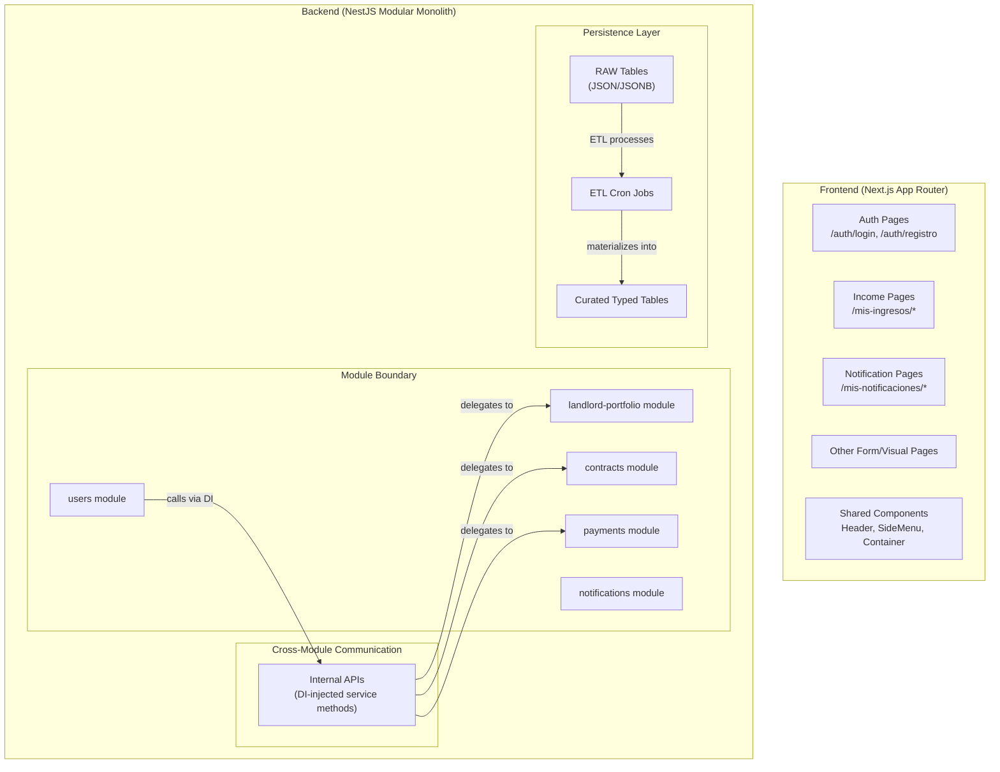

# Design Document — Platform-Wide Improvements

## Overview

This design covers a set of cross-cutting improvements to the Colombian urban housing rental platform, spanning frontend UX consistency (Requirements 1–5), backend persistence and architecture enforcement (Requirements 6–8), and documentation updates (Requirement 9). No new features or pages are introduced — the focus is on standardizing existing behavior and resolving architectural debt.

The changes are grouped into three workstreams:

1. **Frontend UX** — Navigation, layout, labels, and button styling fixes across existing pages
2. **Backend Architecture** — RAW/ETL persistence enforcement, soft delete, cross-schema query elimination
3. **Documentation** — Steering file and SRS updates to codify the new standards

---

## Architecture

The existing modular monolith architecture remains unchanged. This spec enforces existing architectural decisions more strictly rather than introducing new patterns.



### Key Architectural Changes

- **Cross-schema queries eliminated (Req 8):** The 5 raw SQL queries in `PrismaUserRepository` that join across `landlord_portfolio`, `tracking_process`, `contracts`, and `payments` schemas are replaced with internal API calls via NestJS DI. Each target module exposes a port interface and implementation.
- **Soft delete added globally (Req 7):** Every Prisma model gains a `deleted_at DateTime?` column. All repository read methods add `where: { deleted_at: null }` by default.
- **RAW persistence standardized (Req 6):** Modules that currently call `JSON.stringify()` on the RAW payload (`users`, `landlord-portfolio`) are fixed to pass the object directly.

---

## Components and Interfaces

### Frontend Components

#### 1. Auth Pages Navigation (Req 1)

**Current state:** Both `/auth/login` and `/auth/registro` render a custom `leftAction` back-arrow button in the `Header`, bypassing the default hamburger menu.

**Target state:** Remove the `leftAction` prop entirely. The `Header` component already renders the hamburger menu by default when no `leftAction` is provided. Add `SideMenu` state management (lazy-loaded, same pattern as `/mis-notificaciones`).

**Files affected:**
- `src/frontend/app/auth/login/page.tsx` — Remove `backButton` JSX, add `SideMenu` lazy import + state
- `src/frontend/app/auth/registro/page.tsx` — Remove `backButton` JSX, add `SideMenu` lazy import + state

**No changes to `Header.tsx`** — the component already supports both modes via the `leftAction` prop.

#### 2. Income Page — Zero-Income Units (Req 2)

**Current state:** The income page maps portfolio data from `portfolioService.getPortfolios()` and hardcodes `monthlyIncome: 0` for all portfolios. The income detail page at `/mis-ingresos/portafolio/[id]` likely filters out units with zero income.

**Target state:** The `PortfolioIncomeCard` already displays `totalUnits` from the backend and renders `$0` via `formatPrice(0)`. The income detail page must always show all units from the portfolio, displaying `$0` for units without income in the current period. Each unit row shows: unit name, lease status (via `StatusBadge`), and income amount.

**Files affected:**
- `src/frontend/app/mis-ingresos/portafolio/[id]/page.tsx` (or equivalent detail page) — Ensure all units render regardless of income amount
- `src/frontend/modules/landlord-accounting/components/PortfolioIncomeCard.tsx` — Already correct; verify `totalUnits` always displays

#### 3. Notification Type Translations (Req 3)

**Current state:** `translate-notification-type.ts` maps 4 types (`CONTRACT_SIGNED`, `PAYMENT_RECEIVED`, `CONTACT_INITIATED`, `CONTRACT_UPLOADED`). Missing: `PAYMENT_DUE`. Fallback returns the raw key unchanged.

**Target state:** Add `PAYMENT_DUE` → `"Pago pendiente"` to the map. Implement a fallback formatter that replaces underscores with spaces and title-cases the result (e.g., `SOME_NEW_TYPE` → `"Some New Type"`).

**Files affected:**
- `src/frontend/modules/notifications/utils/translate-notification-type.ts`

#### 4. Notification CTA Button Style (Req 4)

**Current state:** The "Gestionar preferencias" CTA in `NotificationsListView.tsx` is styled as a text link (`text-primary hover:underline`) in both the empty and populated states.

**Target state:** Restyle as a primary button: `bg-[#1d4ed8] text-white rounded-[6px] min-h-[44px] min-w-[44px]`. Keep the `<Link>` component for client-side navigation.

**Files affected:**
- `src/frontend/modules/notifications/components/NotificationsListView.tsx` — Update CSS classes on both CTA instances

#### 5. Desktop Container Consistency (Req 5)

**Current state:** Auth pages use `max-w-[448px]`. Some pages (e.g., `/mis-ingresos`) already use `max-w-[560px]`. Others (e.g., `/mis-notificaciones`, `/mis-notificaciones/preferencias`) have no centered container.

**Target state:** All form/visual pages (except `/explorar`) wrap `<main>` content in:
```html
<main className="flex justify-center px-mobile-margin md:px-desktop-margin ...">
  <div className="w-full max-w-[560px]">...</div>
</main>
```

**Files affected (audit needed):**
- `src/frontend/app/auth/login/page.tsx` — Change `max-w-[448px]` → `max-w-[560px]`
- `src/frontend/app/auth/registro/page.tsx` — Change `max-w-[448px]` → `max-w-[560px]`
- `src/frontend/app/mis-notificaciones/page.tsx` — Add centered container wrapper
- `src/frontend/app/mis-notificaciones/preferencias/page.tsx` — Add centered container wrapper
- Other pages: `/mi-perfil`, `/mi-portafolio/*`, `/mis-contratos/*`, `/mis-contratos-arrendatario/*`, `/mis-arriendos/*`, `/mis-pagos/*` — Audit and add container if missing

### Backend Interfaces

#### 6. RAW/ETL Persistence Fix (Req 6)

**Current problem:** The `users` module calls `JSON.stringify(data)` when writing to `UsersRaw`:
```typescript
// Current (WRONG) — in PrismaUserRepository.create()
await tx.usersRaw.create({
  data: { payload: JSON.stringify(data), processed: false },
});
```

The `landlord-portfolio` module likely has the same issue in its repository.

**Fix:** Pass the payload object directly. Prisma's `Json` type handles serialization:
```typescript
// Correct
await tx.usersRaw.create({
  data: { payload: data as any, processed: false },
});
```

**ETL backward compatibility:** Each ETL service must handle both formats during the transition period:
```typescript
function parsePayload<T>(raw: unknown): T {
  if (typeof raw === 'string') {
    return JSON.parse(raw) as T;
  }
  return raw as T;
}
```

**Files affected:**
- `src/backend/modules/users/infrastructure/repositories/prisma-user.repository.ts` — Fix `JSON.stringify`
- `src/backend/modules/landlord-portfolio/infrastructure/repositories/` — Fix `JSON.stringify` if present
- All ETL services — Add `parsePayload` helper for backward compatibility

#### 7. Cross-Module Internal APIs (Req 8)

**New port interfaces to create:**

```typescript
// landlord-portfolio/domain/ports/cross-module-query.port.ts
export interface IPortfolioCrossModuleQuery {
  hasActiveLeases(userId: string): Promise<boolean>;
  hasPortfoliosWithUnits(userId: string): Promise<boolean>;
  hasActiveLeasesInPortfolios(userId: string): Promise<boolean>;
}

// contracts/domain/ports/cross-module-query.port.ts
export interface IContractsCrossModuleQuery {
  hasActiveContractsAsRole(userId: string, role: string): Promise<boolean>;
}

// payments/domain/ports/cross-module-query.port.ts
export interface IPaymentsCrossModuleQuery {
  hasPendingPayments(userId: string): Promise<boolean>;
}
```

**Implementation:** Each module implements its port using Prisma queries against its own schema only. The `users` module injects these ports via NestJS DI tokens.

**Injection pattern:**
```typescript
// In users.module.ts
@Module({
  imports: [LandlordPortfolioModule, ContractsModule, PaymentsModule],
  providers: [
    {
      provide: PORTFOLIO_CROSS_MODULE_QUERY,
      useExisting: PortfolioCrossModuleQueryService,
    },
    // ... other cross-module tokens
  ],
})
```

**Files affected:**
- New: `landlord-portfolio/domain/ports/cross-module-query.port.ts`
- New: `landlord-portfolio/infrastructure/repositories/portfolio-cross-module-query.service.ts`
- New: `contracts/domain/ports/cross-module-query.port.ts`
- New: `contracts/infrastructure/repositories/contracts-cross-module-query.service.ts`
- New: `payments/domain/ports/cross-module-query.port.ts`
- New: `payments/infrastructure/repositories/payments-cross-module-query.service.ts`
- Modified: `users/infrastructure/repositories/prisma-user.repository.ts` — Remove 5 raw SQL methods, inject cross-module ports
- Modified: `users/users.module.ts` — Import cross-module providers
- Modified: `landlord-portfolio/landlord-portfolio.module.ts` — Export cross-module service
- Modified: `contracts/contracts.module.ts` — Export cross-module service
- Modified: `payments/payments.module.ts` — Export cross-module service (new file needed)

#### 8. Soft Delete (Req 7)

**Prisma schema changes:** Add `deleted_at DateTime?` to every model across all 8 schemas. Example:
```prisma
model User {
  // ... existing fields
  deleted_at DateTime?
  // ... relations
  @@schema("users")
}
```

**Repository changes:** All `findMany`, `findUnique`, `findFirst` calls add `where: { deleted_at: null }` to their filters. All `delete`/`deleteMany` calls become `update`/`updateMany` setting `deleted_at: new Date()`.

**Prisma middleware approach (recommended):** Instead of modifying every repository method, use Prisma middleware to automatically:
1. Add `deleted_at: null` to all `findMany`/`findFirst`/`findUnique`/`count` queries
2. Convert `delete` operations to `update` with `deleted_at: new Date()`

```typescript
// src/backend/src/shared/prisma/soft-delete.middleware.ts
export function softDeleteMiddleware(params: Prisma.MiddlewareParams, next: Function) {
  // For find operations: inject deleted_at: null filter
  if (['findMany', 'findFirst', 'findUnique', 'count'].includes(params.action)) {
    if (!params.args) params.args = {};
    if (!params.args.where) params.args.where = {};
    if (params.args.where.deleted_at === undefined) {
      params.args.where.deleted_at = null;
    }
  }
  // For delete: convert to update with deleted_at
  if (params.action === 'delete') {
    params.action = 'update';
    params.args.data = { deleted_at: new Date() };
  }
  if (params.action === 'deleteMany') {
    params.action = 'updateMany';
    if (!params.args) params.args = {};
    if (!params.args.data) params.args.data = {};
    params.args.data.deleted_at = new Date();
  }
  return next(params);
}
```

**Bypass mechanism:** To include soft-deleted records, pass `deleted_at: undefined` explicitly or use a special sentinel value that the middleware recognizes.

**Migration:** A single migration adds `deleted_at DateTime?` to all tables. Since the column is nullable with no default, existing rows automatically have `NULL`.

---

## Data Models

### Prisma Schema Changes (Req 7 — Soft Delete)

Every model in the schema gains:
```prisma
deleted_at DateTime?
```

This applies to all 8 schemas. Catalog tables (`DocumentType`, `PropertyType`, `Role`, `Permission`, etc.) retain their existing `is_active Boolean` field — `is_active` controls catalog item availability (business logic), while `deleted_at` controls record deletion (data lifecycle).

### RAW Table Payload Format (Req 6)

No schema changes needed — the `payload Json` column type already supports proper JSON objects. The fix is in the application code that writes to these tables.

**Before (users module):**
```typescript
payload: JSON.stringify(data)  // Stores as a JSON string value: "\"{ ... }\""
```

**After:**
```typescript
payload: data  // Stores as a proper JSON object: { ... }
```

---

## Correctness Properties

*A property is a characteristic or behavior that should hold true across all valid executions of a system — essentially, a formal statement about what the system should do. Properties serve as the bridge between human-readable specifications and machine-verifiable correctness guarantees.*

This spec is a mix of UI changes, schema migrations, and architecture refactoring. PBT applies to the backend logic (ETL payload handling, soft-delete filtering, notification type fallback formatting) but not to the UI layout/styling changes or documentation updates.

### Property 1: Unknown notification type fallback formatting

*For any* string that is not present in the notification type translation map, the `translateNotificationType` function SHALL return a string where all underscores are replaced by spaces and each word is title-cased (first letter uppercase, rest lowercase).

**Validates: Requirements 3.5**

### Property 2: RAW table payload round-trip preserves structure

*For any* valid write payload object, persisting it to a module's RAW table and reading it back SHALL yield a JSON object structurally equivalent to the original — never a stringified JSON string.

**Validates: Requirements 6.2**

### Property 3: ETL materialization correctness

*For any* valid RAW table payload, the ETL cron SHALL decompose it into the correct set of curated table rows, where each curated row's typed fields match the corresponding values in the original JSON payload.

**Validates: Requirements 6.3**

### Property 4: ETL backward-compatible format handling

*For any* valid payload, the ETL cron SHALL produce identical curated table output regardless of whether the RAW record stores the payload as a proper JSON object or as a stringified JSON string.

**Validates: Requirements 6.8**

### Property 5: Soft delete preserves records

*For any* record in any table, performing a delete operation SHALL keep the record in the database with a non-null `deleted_at` timestamp, and the record's other fields SHALL remain unchanged.

**Validates: Requirements 7.3**

### Property 6: Default queries exclude soft-deleted records

*For any* set of records where some have `deleted_at` set and some have `deleted_at = null`, a default read/list query SHALL return only records where `deleted_at` is `null` — no soft-deleted record SHALL appear in the result set.

**Validates: Requirements 7.4**

### Property 7: Bypass option includes soft-deleted records

*For any* set of records including both active and soft-deleted entries, a query with the explicit soft-delete bypass option SHALL return all records regardless of their `deleted_at` value.

**Validates: Requirements 7.5**

---

## Error Handling

### Frontend

| Scenario | Handling |
|----------|----------|
| `translateNotificationType` receives unknown key | Fallback formatter: replace underscores with spaces, title-case each word. Never throws. |
| Income detail page receives empty unit list from API | Render empty state message ("No hay inmuebles en este portafolio"). |
| SideMenu fails to lazy-load on auth pages | `Suspense fallback={null}` — page remains usable without the menu. |
| Portfolio API returns units with missing income data | Default to `$0` for any missing/null/undefined income value. |

### Backend

| Scenario | Handling |
|----------|----------|
| Cross-module service call fails (e.g., `hasActiveLeases`) | Let the exception propagate to the use case layer. The use case decides whether to fail the operation or use a safe default. |
| ETL encounters a RAW record with invalid/corrupt payload | Log the error, mark the record as `processed: true` to prevent infinite retry loops (existing pattern). |
| ETL encounters stringified JSON in RAW table (legacy) | `parsePayload` helper detects `typeof === 'string'` and calls `JSON.parse()`. If parsing fails, treat as corrupt payload. |
| Soft-delete middleware encounters a model without `deleted_at` | The middleware should check if the model has the `deleted_at` field before injecting the filter. RAW tables (`UsersRaw`, `PortfolioRaw`, etc.) may be excluded from soft-delete filtering since they use `processed` flag instead. |
| Migration fails on a table with existing constraints | The migration only adds a nullable column with no default — this is a non-breaking DDL change. No data migration needed. |

---

## Testing Strategy

### Unit Tests (Example-Based)

**Frontend (Requirements 1–5):**
- Auth pages render hamburger menu (not back button) and open SideMenu on click
- Income detail page renders all units with `$0` when income is zero
- `PortfolioIncomeCard` displays `totalUnits` regardless of income
- `translateNotificationType` returns correct Spanish labels for all known types (`CONTRACT_SIGNED`, `PAYMENT_RECEIVED`, `CONTACT_INITIATED`, `CONTRACT_UPLOADED`, `PAYMENT_DUE`)
- "Gestionar preferencias" CTA renders with primary button styles in both empty and populated states
- Auth pages use `max-w-[560px]` container (not `max-w-[448px]`)
- `/explorar` page does NOT have the centered container

**Backend (Requirements 6–8):**
- `UsersRaw` record stores proper JSON object after user creation (not stringified)
- `PortfolioRaw` record stores proper JSON object after portfolio creation
- Each cross-module port interface method returns correct boolean for known test scenarios
- `PrismaUserRepository` no longer contains raw SQL cross-schema queries
- Soft-delete middleware converts `delete` to `update` with `deleted_at`
- Soft-delete middleware injects `deleted_at: null` filter on find operations

### Property-Based Tests

Property-based tests use `fast-check` (TypeScript) with a minimum of 100 iterations per property.

| Property | Test Description | Tag |
|----------|-----------------|-----|
| Property 1 | Generate random strings with underscores, verify fallback formatting produces title-cased space-separated output | Feature: platform-wide-improvements, Property 1: Unknown notification type fallback formatting |
| Property 2 | Generate random valid payload objects, persist to RAW table mock, read back, assert `typeof payload !== 'string'` | Feature: platform-wide-improvements, Property 2: RAW table payload round-trip preserves structure |
| Property 3 | Generate random valid RAW payloads, run ETL logic, verify curated output fields match payload values | Feature: platform-wide-improvements, Property 3: ETL materialization correctness |
| Property 4 | Generate random payloads, store as both JSON and stringified JSON, run ETL on both, assert identical curated output | Feature: platform-wide-improvements, Property 4: ETL backward-compatible format handling |
| Property 5 | Generate random records, soft-delete them, assert record still exists with non-null `deleted_at` and unchanged fields | Feature: platform-wide-improvements, Property 5: Soft delete preserves records |
| Property 6 | Generate mixed active/deleted records, run default query, assert no results have non-null `deleted_at` | Feature: platform-wide-improvements, Property 6: Default queries exclude soft-deleted records |
| Property 7 | Generate mixed active/deleted records, run bypass query, assert all records returned | Feature: platform-wide-improvements, Property 7: Bypass option includes soft-deleted records |

### Integration Tests

- Cross-module DI wiring: verify `UsersModule` can inject `IPortfolioCrossModuleQuery`, `IContractsCrossModuleQuery`, `IPaymentsCrossModuleQuery` via NestJS DI
- End-to-end soft-delete: create a record via API, delete it via API, verify it's excluded from list but recoverable with bypass
- ETL pipeline: insert a RAW record, trigger ETL, verify curated tables are populated correctly

### Documentation (Requirement 9)

- Manual review: verify steering files (`tech.md`, `structure.md`, `product.md`) document the new patterns
- Consistency check: verify documentation matches implemented code behavior
