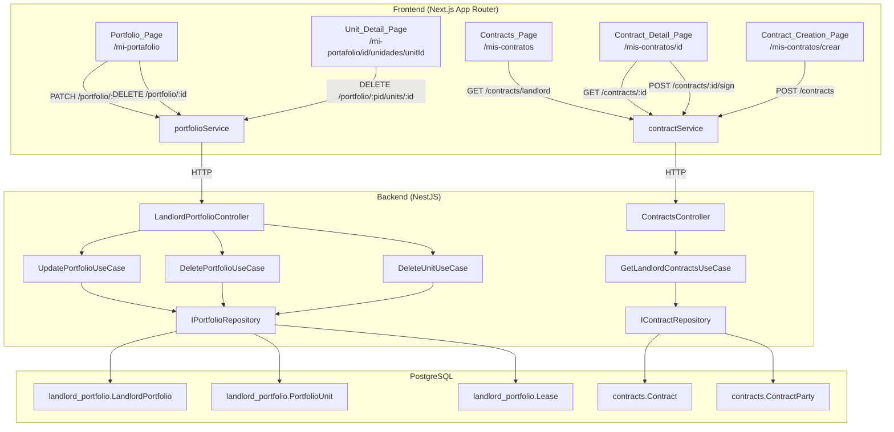

# Design Document: Portfolio Contracts Management

## Overview

This feature completes the CRUD lifecycle for the landlord portfolio module and introduces the contracts frontend experience. It addresses three gaps:

1. **Portfolio CRUD completion**: Add update (PATCH) and delete (DELETE) endpoints for portfolios and units, with corresponding frontend UI (inline edit forms, confirmation dialogs).
2. **Contracts list view**: A new page where landlords see all contracts across their portfolio units, with status badges and navigation to detail.
3. **Contract detail & creation flow**: Wire the existing `ContractWizard` components into routed pages, connect to the existing backend endpoints (`POST /contracts`, `GET /contracts/:id`, `POST /contracts/:id/sign`), and build a contract detail view.

The design follows the established hexagonal architecture, reuses existing modules (`landlord-portfolio`, `contracts`), and adheres to frontend conventions (Spanish routes, English code, WCAG 2.1 AA, custom typography tokens).

## Architecture

The feature spans two existing backend modules and their corresponding frontend modules. No new modules are created.



### Design Decisions

1. **No new modules**: Update/delete operations live in `LandlordPortfolioController`. The new landlord contracts list endpoint lives in `ContractsController`. Both follow existing hexagonal patterns.

2. **Delete guards via business rules**: Portfolio deletion requires zero units (checked via `countUnitsByPortfolioId`). Unit deletion requires no active leases (checked via `hasActiveLeases`). Both return 409 Conflict when violated.

3. **Ownership verification reuse**: All new endpoints reuse the existing `getPortfolioOwnerUserId` pattern for portfolio/unit operations. Contract list uses a new `findContractsByLandlordId` that traverses `Contract → Lease → PortfolioUnit → LandlordPortfolio → user_id`.

4. **Contracts page route**: `/mis-contratos` (Spanish, consistent with `/mi-portafolio`). Contract detail at `/mis-contratos/[id]`. Contract creation at `/mis-contratos/crear?leaseId=xxx`.

5. **Frontend service extension**: `portfolioService` gets `updatePortfolio`, `deletePortfolio`, `deleteUnit`. `contractService` gets `getContractsByLandlord`. Existing `getContract`, `createContract`, `signContract` are already implemented.

6. **Confirmation dialog pattern**: Delete actions use a modal `ConfirmationDialog` component (new shared component) that requires explicit confirmation before executing destructive operations.

## Components and Interfaces

### Backend — New Use Cases

#### `UpdatePortfolioUseCase`

Updates a portfolio's name and/or description. Verifies ownership and LANDLORD role.

```typescript
@Injectable()
export class UpdatePortfolioUseCase {
  constructor(
    @Inject(PORTFOLIO_REPOSITORY) private readonly repository: IPortfolioRepository,
  ) {}

  async execute(
    portfolioId: string,
    dto: UpdatePortfolioDto,
    userId: string,
    userRoles: string[],
  ): Promise<PortfolioSummaryResponseDto>
}
```

#### `DeletePortfolioUseCase`

Deletes a portfolio only if it has zero units. Verifies ownership and LANDLORD role.

```typescript
@Injectable()
export class DeletePortfolioUseCase {
  constructor(
    @Inject(PORTFOLIO_REPOSITORY) private readonly repository: IPortfolioRepository,
  ) {}

  async execute(
    portfolioId: string,
    userId: string,
    userRoles: string[],
  ): Promise<void>
}
```

#### `DeleteUnitUseCase`

Deletes a portfolio unit only if it has no active leases. Verifies ownership.

```typescript
@Injectable()
export class DeleteUnitUseCase {
  constructor(
    @Inject(PORTFOLIO_REPOSITORY) private readonly repository: IPortfolioRepository,
  ) {}

  async execute(
    portfolioId: string,
    unitId: string,
    userId: string,
  ): Promise<void>
}
```

#### `GetLandlordContractsUseCase`

Fetches all contracts for a landlord by traversing `Contract → Lease → PortfolioUnit → LandlordPortfolio`.

```typescript
@Injectable()
export class GetLandlordContractsUseCase {
  constructor(
    @Inject(CONTRACT_REPOSITORY) private readonly repository: IContractRepository,
  ) {}

  async execute(userId: string): Promise<LandlordContractListItemDto[]>
}
```

### Backend — New Repository Methods

#### `IPortfolioRepository` additions

```typescript
updatePortfolio(portfolioId: string, data: UpdatePortfolioData): Promise<LandlordPortfolioEntity>;
deletePortfolio(portfolioId: string): Promise<void>;
deleteUnit(unitId: string): Promise<void>;
countUnitsByPortfolioId(portfolioId: string): Promise<number>;
hasActiveLeases(unitId: string): Promise<boolean>;
```

#### `IContractRepository` additions

```typescript
findContractsByLandlordId(landlordUserId: string): Promise<LandlordContractListItem[]>;
```

This method performs a cross-schema query: `Contract → Lease (by lease_id) → PortfolioUnit (by portfolio_unit_id) → LandlordPortfolio (by portfolio_id, where user_id = landlordUserId)`. It returns enriched items including unit name and tenant name resolved from the `users` schema.

### Backend — New DTOs

#### `UpdatePortfolioDto` (Request)

```typescript
export class UpdatePortfolioDto {
  @ApiPropertyOptional({ example: 'Propiedades Centro' })
  @IsOptional() @IsString() @IsNotEmpty()
  name?: string;

  @ApiPropertyOptional({ example: 'Portafolio de propiedades en el centro' })
  @IsOptional() @IsString()
  description?: string;
}
```

#### `LandlordContractListItemDto` (Response)

```typescript
export class LandlordContractListItemDto {
  @ApiProperty() id!: string;
  @ApiProperty() unitName!: string;
  @ApiProperty() tenantName!: string;
  @ApiProperty({ example: 'PENDING' }) status!: string;
  @ApiProperty() startDate!: Date;
  @ApiPropertyOptional({ nullable: true }) endDate!: Date | null;
}
```

### Backend — Controller Additions

New routes on `LandlordPortfolioController`:

| Method | Path | Auth | Description |
|--------|------|------|-------------|
| `PATCH` | `/portfolio/:portfolioId` | JWT + LANDLORD | Update portfolio name/description |
| `DELETE` | `/portfolio/:portfolioId` | JWT + LANDLORD | Delete empty portfolio |
| `DELETE` | `/portfolio/:portfolioId/units/:id` | JWT + LANDLORD | Delete unit without active leases |

New route on `ContractsController`:

| Method | Path | Auth | Description |
|--------|------|------|-------------|
| `GET` | `/contracts/landlord` | JWT | List all contracts for the authenticated landlord |

The `GET /contracts/landlord` route must be registered **before** the existing `GET /contracts/:id` route to avoid NestJS treating `landlord` as an `:id` parameter.

### Frontend — New Pages

#### Contracts List Page (`/mis-contratos`)

- First-level page — uses `SideMenu` with hamburger menu (same pattern as `/mi-portafolio`), NOT a back arrow
- Fetches contracts via `contractService.getContractsByLandlord(token)`
- Displays each contract as a card with: unit name, tenant name, status badge, start date, end date
- Status badge colors: PENDING → amber, SIGNATURE_PENDING → blue, SIGNED → green (new `contract` variant on `StatusBadge`)
- Loading state: skeleton placeholders
- Error state: `ErrorState` component with retry
- Empty state: message with guidance to create a contract
- Tap on card → navigate to `/mis-contratos/[id]`

#### Contract Detail Page (`/mis-contratos/[id]`)

- Fetches contract via `contractService.getContract(id, token)` (already exists)
- Displays: start date, end date, status badge, PDF download link, parties list
- Conditional actions based on status:
  - PENDING → "Iniciar firma" button → `contractService.signContract(id, token)`
  - SIGNATURE_PENDING → informational message "Esperando firmas"
  - SIGNED → signed date + confirmation message
- Error state with retry
- Back button → `/mis-contratos`

#### Contract Creation Page (`/mis-contratos/crear?leaseId=xxx`)

- Wraps the existing `ContractWizard` component
- Receives `leaseId` from query params
- Fetches lease detail to pre-populate wizard
- On success → navigate to `/mis-contratos/[newContractId]`
- Back button → previous page

### Frontend — Modified Components

#### `PortfolioCard` Changes

Add two action buttons:
- **Edit button** (pencil icon): toggles inline edit form with pre-filled name and description
- **Delete button** (trash icon): opens `ConfirmationDialog`

The inline edit form follows the same pattern as the existing create portfolio form on the Portfolio_Page.

#### `UnitCard` Changes

Add a bottom row with two links side-by-side:
- **"Ver historial"** (left, primary color): navigates to `/mi-portafolio/[id]/unidades/[unitId]/arriendos` (shown for non-occupied units)
- **"Ver detalle de unidad"** (right, gray): navigates to `/mi-portafolio/[id]/unidades/[unitId]` (always shown)

Both links sit in the same `flex justify-between` container for consistent layout.

#### `UnitDetailView` Changes

Add a delete button that opens `ConfirmationDialog`. On confirmation, sends DELETE request and navigates back to portfolio units list (`/mi-portafolio/[id]/unidades`). The unit detail page lives at `/mi-portafolio/[id]/unidades/[unitId]` and is accessible via a "Ver detalle de unidad" link on each `UnitCard`.

### Frontend — New Shared Component

#### `ConfirmationDialog`

A modal dialog for confirming destructive actions.

```typescript
interface ConfirmationDialogProps {
  isOpen: boolean;
  title: string;
  message: string;
  confirmLabel: string;
  cancelLabel?: string;
  onConfirm: () => void;
  onCancel: () => void;
  isLoading?: boolean;
}
```

- Uses `<dialog>` element for native modal behavior
- Focus trap within the dialog
- Escape key closes the dialog
- Minimum 44px touch targets on buttons
- Accessible: `role="alertdialog"`, `aria-labelledby`, `aria-describedby`

### Frontend — Service Layer Extensions

#### `portfolioService` additions

```typescript
async updatePortfolio(portfolioId: string, data: UpdatePortfolioRequest, token: string): Promise<PortfolioSummary>
async deletePortfolio(portfolioId: string, token: string): Promise<void>
async deleteUnit(portfolioId: string, unitId: string, token: string): Promise<void>
```

Error handling follows existing pattern: 401 → "Sesión expirada", 403 → permission error, 409 → conflict message from server.

#### `contractService` additions

```typescript
async getContractsByLandlord(token: string): Promise<LandlordContractListItem[]>
```

Error handling: 401 → "Sesión expirada", 403 → permission error, network error → "No se pudo conectar con el servidor."

### `StatusBadge` Extension

New `contract` variant:

| Status | Label | Background | Text Color |
|--------|-------|-----------|------------|
| PENDING | Pendiente | `#FEF3C7` (amber-100) | `#92400E` (amber-800) |
| SIGNATURE_PENDING | Firma pendiente | `#DBEAFE` (blue-100) | `#1E40AF` (blue-800) |
| SIGNED | Firmado | `#D1FAE5` (green-100) | `#065F46` (green-800) |

## Data Models

### Existing Models (No Schema Changes)

No Prisma migrations are required. All operations use existing tables:

- **`LandlordPortfolio`** (`landlord_portfolio` schema): id, user_id, name, description, creation_date
- **`PortfolioUnit`** (`landlord_portfolio` schema): id, portfolio_id, property_id, name, conditions, lease_base_amount, lease_base_currency, leases[]
- **`Lease`** (`landlord_portfolio` schema): id, portfolio_unit_id, user_id, start_date, end_date
- **`Contract`** (`contracts` schema): id, lease_id, contract_status_id, start_date, end_date, parties[], files[]
- **`ContractParty`** (`contracts` schema): id, user_id, contract_id, role_in_contract
- **`ContractStatus`** (`contracts` schema): id, name (PENDING | SIGNATURE_PENDING | SIGNED)

### Cross-Schema Query: Landlord Contracts

```
Contract.lease_id → Lease.id (landlord_portfolio schema)
Lease.portfolio_unit_id → PortfolioUnit.id → PortfolioUnit.portfolio_id → LandlordPortfolio.id
LandlordPortfolio.user_id = landlordUserId
```

Additionally, to resolve tenant name:
```
Lease.user_id → User.id (users schema) → NaturalPersonDetail.first_name + last_name
```

And unit name:
```
Lease.portfolio_unit_id → PortfolioUnit.name
```

### New Data Interfaces

```typescript
// Portfolio update
export interface UpdatePortfolioData {
  name?: string;
  description?: string;
}

// Landlord contract list item (returned by cross-schema query)
export interface LandlordContractListItem {
  id: string;
  unitName: string;
  tenantName: string;
  status: string;
  startDate: Date;
  endDate: Date | null;
}
```

### Frontend Types

```typescript
// Added to landlord-contracts/types.ts
export interface LandlordContractListItem {
  id: string;
  unitName: string;
  tenantName: string;
  status: 'PENDING' | 'SIGNATURE_PENDING' | 'SIGNED';
  startDate: string;
  endDate: string | null;
}

// Added to landlord-portfolio/types.ts
export interface UpdatePortfolioRequest {
  name?: string;
  description?: string;
}
```

