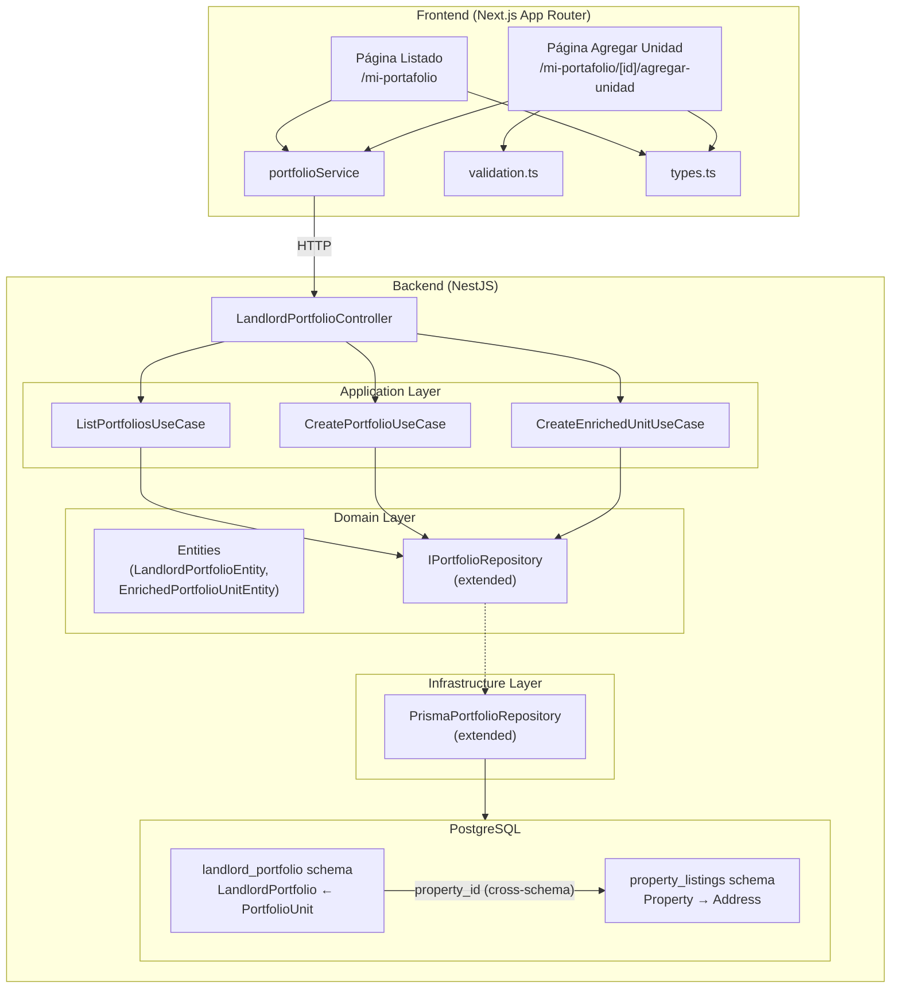
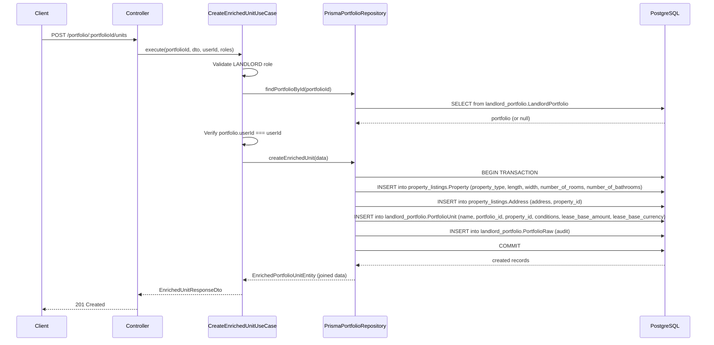

# Documento de Diseño — Alineación del Portafolio del Arrendador con Diseños Figma

## Overview

Este diseño detalla los cambios de backend y frontend necesarios para alinear el módulo de Portafolio del Arrendador con los diseños de Figma. El enfoque simplificado reutiliza las tablas existentes `Property` y `Address` del esquema `property_listings` en lugar de duplicar campos en `PortfolioUnit`.

1. **Backend**: Solo dos cambios al esquema Prisma (`description` en `LandlordPortfolio`, `name` en `PortfolioUnit`). Tres nuevos endpoints (`GET /portfolio` con paginación y estadísticas agregadas, `POST /portfolio` para crear portafolios, `POST /portfolio/:portfolioId/units` para crear unidades enriquecidas con creación cross-schema de `Property` + `Address` + `PortfolioUnit`). Los datos físicos del inmueble (tipo, dimensiones, habitaciones, baños) se almacenan en `Property`, y la dirección en `Address`, ambos ya existentes.

2. **Frontend**: Nuevas interfaces TypeScript (`PortfolioSummary`, `PaginatedPortfolios`, `CreatePortfolioRequest`, `CreateUnitRequest`), servicio actualizado (`portfolioService`), funciones de validación puras para el formulario de unidades, página de listado de portafolios con tarjetas y paginación, y página de creación de unidades con formulario de tres secciones (información básica, detalles de propiedad, datos de arriendo).

El diseño sigue la arquitectura hexagonal existente del módulo `landlord-portfolio`, mantiene las convenciones de cross-schema references (plain String, sin `@relation` entre schemas), y reutiliza los componentes compartidos del frontend (`Header`, `Button`, `Skeleton`, `ErrorState`, `Pagination`).

---

## Architecture

### Diagrama de Componentes



### Decisiones de Diseño

1. **Reutilización de Property/Address**: En lugar de agregar campos físicos (`area`, `floor`, `parking_spaces`, `unit_type`) a `PortfolioUnit`, se reutilizan las tablas existentes `Property` (con `property_type`, `length`, `width`, `number_of_rooms`, `number_of_bathrooms`) y `Address` (con `address`, `neighborhood`, `city`). El área se calcula como `length × width` cuando ambos están presentes. Esto minimiza cambios al esquema y evita duplicación de datos.

2. **Solo dos campos nuevos en el esquema**: `LandlordPortfolio.description` (String?) y `PortfolioUnit.name` (String con `@default('')`). Todos los demás datos del inmueble ya existen en `Property` y `Address`.

3. **Creación cross-schema en transacción**: La creación de unidades enriquecidas crea `Property` + `Address` en `property_listings` y `PortfolioUnit` en `landlord_portfolio`. Se usa `prisma.$transaction` para atomicidad.

4. **Cálculo de estadísticas en query**: `activeLeases` y `occupancyPercentage` se calculan en la query de base de datos usando filtros en `Lease.end_date`.

5. **Contadores globales en query separada**: `globalTotalUnits` y `globalActiveLeases` se calculan sobre todos los portafolios del usuario.

6. **Validación dual**: Validación client-side con funciones puras + validación server-side con `class-validator` en DTOs.

7. **propertyType en respuesta de portafolio**: Se obtiene del `Property.property_type` del primer/predominante Property vinculado a las unidades del portafolio, para mostrar el badge en la tarjeta.

8. **Campos diferidos para MVP**: `unit_type` (dropdown "Tipo de unidad"), `floor`/piso, y `parkingSpaces`/parqueaderos se difieren para iteraciones futuras.

---

## Components and Interfaces

### Backend — Nuevos DTOs

#### `ListPortfoliosQueryDto`
```typescript
class ListPortfoliosQueryDto {
  page?: number;   // default 1, min 1
  limit?: number;  // default 6, min 1, max 50
}
```

#### `PortfolioSummaryResponseDto`
```typescript
class PortfolioSummaryResponseDto {
  id: string;
  name: string;
  description: string | null;
  propertyType: string | null;
  creationDate: Date;
  totalUnits: number;
  activeLeases: number;
  occupancyPercentage: number;
}
```

#### `PaginatedPortfoliosResponseDto`
```typescript
class PaginatedPortfoliosResponseDto {
  data: PortfolioSummaryResponseDto[];
  total: number;
  page: number;
  limit: number;
  totalPages: number;
  globalTotalUnits: number;
  globalActiveLeases: number;
}
```

#### `CreatePortfolioDto`
```typescript
class CreatePortfolioDto {
  name: string;          // @IsNotEmpty, @Length(1, 200)
  description?: string;  // @IsOptional, @MaxLength(500)
}
```

#### `CreateEnrichedUnitDto`
```typescript
class CreateEnrichedUnitDto {
  name: string;                // @IsNotEmpty, @Length(1, 200)
  address: string;             // @IsNotEmpty, @Length(1, 300)
  propertyType: string;        // @IsNotEmpty
  length?: number;             // @IsOptional, @IsNumber, @IsPositive (Decimal)
  width?: number;              // @IsOptional, @IsNumber, @IsPositive (Decimal)
  numberOfRooms?: number;      // @IsOptional, @IsInt, @Min(0), default 0
  numberOfBathrooms?: number;  // @IsOptional, @IsInt, @Min(0), default 0
  description?: string;        // @IsOptional (stored in PortfolioUnit.conditions)
  leaseBaseAmount: number;     // @IsNumber, @Min(0)
  leaseBaseCurrency?: string;  // @IsOptional, @Length(3, 3), default "COP"
}
```

#### `EnrichedUnitResponseDto`
```typescript
class EnrichedUnitResponseDto {
  id: string;
  portfolioId: string;
  name: string;
  propertyType: string;
  address: string;
  area: number | null;         // computed: length × width, null if either missing
  numberOfRooms: number;
  numberOfBathrooms: number;
  description: string | null;
  leaseBaseAmount: number;
  leaseBaseCurrency: string;
  createdAt: Date;
  updatedAt: Date;
}
```

### Backend — Nuevos Use Cases

#### `ListPortfoliosUseCase`
- **Input**: `userId: string`, `query: ListPortfoliosQueryDto`
- **Output**: `PaginatedPortfoliosResponseDto`
- **Lógica**: Consulta portafolios del usuario con paginación, calcula estadísticas agregadas por portafolio (totalUnits, activeLeases, occupancyPercentage), obtiene `propertyType` del primer Property vinculado, calcula contadores globales.

#### `CreatePortfolioUseCase`
- **Input**: `dto: CreatePortfolioDto`, `userId: string`, `userRoles: string[]`
- **Output**: `PortfolioSummaryResponseDto`
- **Lógica**: Valida rol LANDLORD, crea `LandlordPortfolio` con name y description, retorna con estadísticas en cero y propertyType null.

#### `CreateEnrichedUnitUseCase`
- **Input**: `portfolioId: string`, `dto: CreateEnrichedUnitDto`, `userId: string`, `userRoles: string[]`
- **Output**: `EnrichedUnitResponseDto`
- **Lógica**: Valida rol LANDLORD, verifica que el portafolio existe y pertenece al usuario, crea `Property` (property_type, length, width, number_of_rooms, number_of_bathrooms) + `Address` (address string) en `property_listings` schema, crea `PortfolioUnit` (name, portfolio_id, property_id, conditions=description, lease_base_amount, lease_base_currency) en `landlord_portfolio` schema (todo en transacción), retorna la unidad creada con datos enriquecidos.

### Backend — Extensión del Port `IPortfolioRepository`

```typescript
// Nuevos métodos a agregar al port existente
interface IPortfolioRepository {
  // ... métodos existentes ...
  
  findPortfoliosByUserId(
    userId: string, 
    page: number, 
    limit: number
  ): Promise<{ portfolios: PortfolioWithStats[]; total: number }>;
  
  getGlobalStats(userId: string): Promise<{ totalUnits: number; activeLeases: number }>;
  
  createPortfolio(data: CreatePortfolioData): Promise<LandlordPortfolioEntity>;
  
  findPortfolioById(portfolioId: string): Promise<LandlordPortfolioEntity | null>;
  
  createEnrichedUnit(data: CreateEnrichedUnitData): Promise<EnrichedPortfolioUnitEntity>;
}
```

### Backend — Controller Endpoints Nuevos

| Método | Ruta | DTO Input | DTO Output | Guards |
|--------|------|-----------|------------|--------|
| `GET` | `/portfolio` | `ListPortfoliosQueryDto` (query) | `PaginatedPortfoliosResponseDto` | `JwtAuthGuard` |
| `POST` | `/portfolio` | `CreatePortfolioDto` (body) | `PortfolioSummaryResponseDto` | `JwtAuthGuard` |
| `POST` | `/portfolio/:portfolioId/units` | `CreateEnrichedUnitDto` (body) | `EnrichedUnitResponseDto` | `JwtAuthGuard` |

### Frontend — Nuevas Interfaces TypeScript

```typescript
interface PortfolioSummary {
  id: string;
  name: string;
  description: string | null;
  propertyType: string | null;
  creationDate: string;
  totalUnits: number;
  activeLeases: number;
  occupancyPercentage: number;
}

interface PaginatedPortfolios {
  data: PortfolioSummary[];
  total: number;
  page: number;
  limit: number;
  totalPages: number;
  globalTotalUnits: number;
  globalActiveLeases: number;
}

interface CreatePortfolioRequest {
  name: string;
  description?: string;
}

interface CreateUnitRequest {
  name: string;
  address: string;
  propertyType: string;
  length?: number;
  width?: number;
  numberOfRooms?: number;
  numberOfBathrooms?: number;
  description?: string;
  leaseBaseAmount: number;
  leaseBaseCurrency?: string;
}

interface EnrichedUnitFormData {
  name: string;
  address: string;
  propertyType: string;
  length: string;          // string for form input
  width: string;           // string for form input
  numberOfRooms: string;
  numberOfBathrooms: string;
  description: string;
  leaseBaseAmount: string; // string for form input
  leaseBaseCurrency: string;
}
```

### Frontend — Servicio Actualizado (`portfolioService`)

Nuevos métodos:
- `getPortfolios(token, page?, limit?): Promise<PaginatedPortfolios>` → `GET /portfolio?page=X&limit=Y`
- `createPortfolio(data, token): Promise<PortfolioSummary>` → `POST /portfolio`
- `createEnrichedUnit(portfolioId, data, token): Promise<EnrichedUnitResponse>` → `POST /portfolio/:portfolioId/units`

Patrón de manejo de errores idéntico al existente (401 → "Sesión expirada", 403 → "No tienes permiso...", 404 → "Recurso no encontrado", 5xx → "Error del servidor...", network → "No se pudo conectar...").

### Frontend — Funciones de Validación Puras

```typescript
validateUnitName(value: string): string | null
validateUnitAddress(value: string): string | null
validatePropertyType(value: string): string | null
validateLeaseBaseAmount(value: string): string | null   // reuses existing
validatePositiveDecimal(value: string, fieldLabel: string): string | null  // for length/width
validateNonNegativeInteger(value: string, fieldLabel: string): string | null
validateEnrichedUnitForm(data: EnrichedUnitFormData): Record<string, string>
```

Each function returns `null` if valid, or a Spanish error message string if invalid.

### Frontend — Componentes de Página

#### `PortfolioListPage` (`/mi-portafolio`)
- Usa `useAuth()` para obtener token
- Llama a `portfolioService.getPortfolios(token, page, limit)`
- Renderiza: Header ("Mis arriendos"), contadores globales, botón "+ Crear nuevo portafolio", lista de `PortfolioCard`, `Pagination`
- Estados: loading (Skeleton), error (ErrorState), empty (EmptyState)

#### `PortfolioCard`
- Props: `portfolio: PortfolioSummary`
- Renderiza: nombre con ícono, descripción, badge propertyType (si no null), stats (unidades/arriendos), barra de ocupación (`role="progressbar"`), botón "Ver unidades"

#### `AddUnitPage` (`/mi-portafolio/[portfolioId]/agregar-unidad`)
- Usa `useAuth()` para obtener token
- Formulario de tres secciones: "Información básica" (name, address, propertyType), "Detalles de la propiedad" (length, width, área calculada, numberOfRooms, numberOfBathrooms, description), "Datos de arriendo" (leaseBaseAmount, leaseBaseCurrency)
- Validación client-side con funciones puras
- Submit → `portfolioService.createEnrichedUnit(portfolioId, data, token)`
- Botones: "Agregar unidad" (primario), "Cancelar" (secundario)

---

## Data Models

### Cambios al Esquema Prisma (Mínimos)

#### `LandlordPortfolio` — Campo nuevo
```prisma
model LandlordPortfolio {
  // ... campos existentes ...
  description   String?  // NUEVO: descripción opcional del portafolio
}
```

#### `PortfolioUnit` — Campo nuevo
```prisma
model PortfolioUnit {
  // ... campos existentes ...
  name   String   @default('')  // NUEVO: nombre/identificación de la unidad
}
```

### Tablas Reutilizadas (sin cambios)

#### `Property` (ya existe en `property_listings`)
```prisma
model Property {
  id                  String   @id @default(uuid())
  property_type       String        // ← usado como tipo de propiedad
  length              Decimal?      // ← largo en metros
  width               Decimal?      // ← ancho en metros
  number_of_bathrooms Int           // ← baños
  number_of_rooms     Int           // ← habitaciones
  is_active           Boolean  @default(true)
  // ... timestamps, relations ...
}
```

#### `Address` (ya existe en `property_listings`)
```prisma
model Address {
  id           String   @id @default(uuid())
  property_id  String   @unique
  state        String
  city         String
  neighborhood String
  address      String        // ← dirección de la unidad
  // ... lat/lng ...
}
```

### Entidades de Dominio Actualizadas

#### `LandlordPortfolioEntity`
```typescript
class LandlordPortfolioEntity {
  constructor(
    public readonly id: string,
    public readonly userId: string,
    public readonly name: string,
    public readonly description: string | null,  // NUEVO
    public readonly creationDate: Date,
  ) {}
}
```

#### `EnrichedPortfolioUnitEntity` (nueva)
Entidad que combina datos de `PortfolioUnit`, `Property` y `Address` para la respuesta enriquecida:

```typescript
class EnrichedPortfolioUnitEntity {
  constructor(
    public readonly id: string,
    public readonly portfolioId: string,
    public readonly name: string,
    public readonly propertyType: string,
    public readonly address: string,
    public readonly area: number | null,       // computed: length × width
    public readonly numberOfRooms: number,
    public readonly numberOfBathrooms: number,
    public readonly description: string | null,
    public readonly leaseBaseAmount: number,
    public readonly leaseBaseCurrency: string,
    public readonly createdAt: Date,
    public readonly updatedAt: Date,
  ) {}
}
```

### Nuevos Tipos de Dominio para Estadísticas

```typescript
interface PortfolioWithStats {
  id: string;
  name: string;
  description: string | null;
  propertyType: string | null;
  creationDate: Date;
  totalUnits: number;
  activeLeases: number;
  occupancyPercentage: number;
}

interface CreatePortfolioData {
  userId: string;
  name: string;
  description?: string;
}

interface CreateEnrichedUnitData {
  portfolioId: string;
  name: string;
  propertyType: string;
  address: string;
  length?: number;
  width?: number;
  numberOfRooms: number;
  numberOfBathrooms: number;
  description?: string;
  leaseBaseAmount: number;
  leaseBaseCurrency: string;
}
```

### Migración de Base de Datos

La migración Prisma será mínima e incremental:
- `ALTER TABLE landlord_portfolio.LandlordPortfolio ADD COLUMN description TEXT;`
- `ALTER TABLE landlord_portfolio.PortfolioUnit ADD COLUMN name VARCHAR(200) NOT NULL DEFAULT '';`

Solo dos columnas nuevas. Los datos físicos del inmueble se almacenan en las tablas `Property` y `Address` ya existentes.

### Flujo de Creación Cross-Schema




## Correctness Properties

*A property is a characteristic or behavior that should hold true across all valid executions of a system — essentially, a formal statement about what the system should do. Properties serve as the bridge between human-readable specifications and machine-verifiable correctness guarantees.*

### Property 1: Portfolio listing returns only user-owned portfolios

*For any* authenticated user ID and any set of portfolios in the database (belonging to multiple users), the `GET /portfolio` endpoint SHALL return only portfolios where `userId` matches the authenticated user, and never portfolios belonging to other users.

**Validates: Requirements 1.1**

### Property 2: Active lease count and occupancy calculation

*For any* portfolio with a set of units, where each unit has zero or more leases with varying `end_date` values (null, past, future), the computed `activeLeases` SHALL equal the count of leases where `end_date` is null or after the current date, and `occupancyPercentage` SHALL equal `round((units with at least one active lease / totalUnits) × 100)`. If `totalUnits` is zero, `occupancyPercentage` SHALL be zero.

**Validates: Requirements 1.3, 1.4**

### Property 3: Pagination returns correct subset and metadata

*For any* total number of portfolios `N`, page number `p` (≥ 1), and limit `l` (1–50), the paginated response SHALL return at most `l` items starting from offset `(p-1)*l`, with `totalPages` equal to `ceil(N/l)`, `total` equal to `N`, and `page` equal to `p`. If `p` exceeds `totalPages`, the data array SHALL be empty.

**Validates: Requirements 1.5, 1.6, 1.8, 1.9**

### Property 4: Global stats are sum of individual portfolio stats

*For any* user with multiple portfolios, `globalTotalUnits` SHALL equal the sum of `totalUnits` across all the user's portfolios, and `globalActiveLeases` SHALL equal the sum of `activeLeases` across all the user's portfolios.

**Validates: Requirements 1.7**

### Property 5: Portfolio creation round-trip

*For any* valid portfolio name (1–200 characters, non-empty) and optional description (≤ 500 characters), creating a portfolio and then retrieving it SHALL return a portfolio with the same `name` and `description`, with `totalUnits: 0`, `activeLeases: 0`, `occupancyPercentage: 0`, and `propertyType: null`.

**Validates: Requirements 2.1, 2.5**

### Property 6: Portfolio creation validation rejects invalid input

*For any* string that is empty or exceeds 200 characters as `name`, the portfolio creation SHALL be rejected with a 400 error. *For any* string exceeding 500 characters as `description`, the portfolio creation SHALL be rejected with a 400 error. *For any* valid name (1–200 chars) and valid or absent description (≤ 500 chars), the creation SHALL succeed.

**Validates: Requirements 2.2, 2.3**

### Property 7: Enriched unit creation round-trip

*For any* valid enriched unit data (valid name, non-empty address, non-empty propertyType, optional positive length/width, non-negative integer rooms/bathrooms, non-negative leaseBaseAmount), creating a unit in an existing portfolio SHALL return a unit where all input fields match the provided values, and `area` equals `length × width` when both are provided (or `null` otherwise).

**Validates: Requirements 3.1, 3.11**

### Property 8: Client-side required string validation (name, address, propertyType)

*For any* string that is non-empty after `trim()`, `validateUnitName`, `validateUnitAddress`, and `validatePropertyType` SHALL return `null`. *For any* string that is empty or composed entirely of whitespace characters, all three functions SHALL return their respective error message (non-null string).

**Validates: Requirements 9.2, 9.3, 9.4, 9.8**

### Property 9: Client-side positive decimal validation (length, width)

*For any* string representation of a positive finite number (e.g., "5.5", "12"), `validatePositiveDecimal` SHALL return `null`. *For any* empty string, non-numeric string, zero, negative number, `Infinity`, or `NaN`, `validatePositiveDecimal` SHALL return a non-null error message.

**Validates: Requirements 9.6, 9.9**

### Property 10: Client-side non-negative integer validation

*For any* string representation of a non-negative integer (e.g., "0", "3", "15"), `validateNonNegativeInteger` SHALL return `null`. *For any* string representing a negative number, non-integer, non-numeric value, or empty string, `validateNonNegativeInteger` SHALL return a non-null error message.

**Validates: Requirements 9.7**

---

## Error Handling

### Backend Error Handling

| Escenario | Código HTTP | Mensaje | Origen |
|-----------|-------------|---------|--------|
| Token JWT inválido o expirado | 401 | "Unauthorized" | `JwtAuthGuard` |
| Usuario sin rol LANDLORD | 403 | "Acceso denegado" | Use case (ForbiddenException) |
| Portafolio no encontrado o no pertenece al usuario | 404 | "Portafolio no encontrado" | Use case (NotFoundException) |
| Validación de campos falla (name vacío, leaseBaseAmount negativo, etc.) | 400 | Mensajes descriptivos por campo | `class-validator` + `ValidationPipe` |
| `page` < 1 o `limit` < 1 o `limit` > 50 | 400 | Mensaje descriptivo | `class-validator` en query DTO |
| Error interno de base de datos | 500 | "Error interno del servidor" | Exception filter global |

### Frontend Error Handling

| Escenario | Comportamiento |
|-----------|---------------|
| Error de red (fetch falla) | Muestra "No se pudo conectar con el servidor. Verifica tu conexión e intenta de nuevo." con botón reintentar |
| HTTP 401 | Invoca `logout()` del AuthProvider → redirige a `/auth/login` |
| HTTP 403 | Muestra "No tienes permiso para realizar esta acción" |
| HTTP 404 (en agregar unidad) | Muestra "Portafolio no encontrado" con enlace a `/mi-portafolio` |
| HTTP 5xx | Muestra "Error del servidor. Intenta de nuevo más tarde." con botón reintentar |
| Validación client-side falla | Muestra mensajes de error inline bajo cada campo inválido, no envía request |
| Validación server-side falla (400) | Muestra mensaje de error del servidor, preserva datos del formulario |

### Validación Client-Side — Mensajes de Error

| Campo | Condición | Mensaje |
|-------|-----------|---------|
| Nombre/Identificación | Vacío o solo espacios | "El nombre de la unidad es obligatorio" |
| Dirección | Vacío o solo espacios | "La dirección es obligatoria" |
| Tipo de propiedad | Vacío o solo espacios | "El tipo de propiedad es obligatorio" |
| Canon base | Vacío | "El canon base es obligatorio" |
| Canon base | No numérico o negativo | "Ingresa un valor numérico válido" |
| Largo/Ancho | No numérico o ≤ 0 (cuando se proporciona) | "Ingresa un valor válido mayor a cero" |
| Habitaciones/Baños | Negativo | "El valor debe ser cero o mayor" |

---

## Testing Strategy

### Enfoque Dual de Testing

Este feature utiliza un enfoque dual:
- **Property-based tests**: Verifican propiedades universales con inputs generados aleatoriamente (mínimo 100 iteraciones por propiedad)
- **Unit tests**: Verifican ejemplos específicos, edge cases, y comportamiento de integración entre componentes

### Librería de Property-Based Testing

- **Backend (NestJS/Jest)**: `fast-check` con Jest
- **Frontend (Next.js/Jest)**: `fast-check` con Jest

### Property-Based Tests (Backend)

Cada test referencia su propiedad del documento de diseño:

1. **Property 1**: Test que genera múltiples usuarios con portafolios aleatorios, ejecuta `ListPortfoliosUseCase` para un usuario específico, y verifica que solo se retornan sus portafolios.
   - Tag: `Feature: portfolio-figma-alignment, Property 1: Portfolio listing returns only user-owned portfolios`

2. **Property 2**: Test que genera portafolios con unidades y leases aleatorios (mix de activos/expirados), ejecuta la lógica de agregación, y verifica `activeLeases` y `occupancyPercentage`.
   - Tag: `Feature: portfolio-figma-alignment, Property 2: Active lease count and occupancy calculation`

3. **Property 3**: Test que genera datasets de tamaño aleatorio y parámetros page/limit aleatorios, verifica que la paginación retorna el subconjunto correcto y metadatos correctos.
   - Tag: `Feature: portfolio-figma-alignment, Property 3: Pagination returns correct subset and metadata`

4. **Property 4**: Test que genera usuarios con múltiples portafolios, verifica que `globalTotalUnits` y `globalActiveLeases` son la suma de los valores individuales.
   - Tag: `Feature: portfolio-figma-alignment, Property 4: Global stats are sum of individual portfolio stats`

5. **Property 5**: Test que genera nombres (1–200 chars) y descripciones (≤ 500 chars) aleatorios, crea portafolios, y verifica round-trip de datos.
   - Tag: `Feature: portfolio-figma-alignment, Property 5: Portfolio creation round-trip`

6. **Property 6**: Test que genera strings de longitud aleatoria, verifica que la validación de creación de portafolio acepta/rechaza correctamente.
   - Tag: `Feature: portfolio-figma-alignment, Property 6: Portfolio creation validation rejects invalid input`

7. **Property 7**: Test que genera datos de unidad enriquecida aleatorios válidos (name, address, propertyType, optional length/width, rooms/bathrooms, leaseBaseAmount), crea unidades, y verifica round-trip de todos los campos incluyendo área calculada.
   - Tag: `Feature: portfolio-figma-alignment, Property 7: Enriched unit creation round-trip`

### Property-Based Tests (Frontend — Validación)

8. **Property 8**: Test que genera strings aleatorios (incluyendo vacíos, whitespace, y strings válidos), verifica `validateUnitName`, `validateUnitAddress`, y `validatePropertyType`.
   - Tag: `Feature: portfolio-figma-alignment, Property 8: Client-side required string validation`

9. **Property 9**: Test que genera strings aleatorios (números positivos, negativos, cero, NaN, vacíos, texto), verifica `validatePositiveDecimal`.
   - Tag: `Feature: portfolio-figma-alignment, Property 9: Client-side positive decimal validation`

10. **Property 10**: Test que genera strings aleatorios (enteros no negativos, negativos, decimales, texto), verifica `validateNonNegativeInteger`.
    - Tag: `Feature: portfolio-figma-alignment, Property 10: Client-side non-negative integer validation`

### Unit Tests (Backend)

- `CreatePortfolioUseCase`: Verifica creación exitosa, rechazo sin rol LANDLORD (403)
- `CreateEnrichedUnitUseCase`: Verifica creación exitosa con Property+Address+PortfolioUnit, rechazo con portafolio inexistente (404), rechazo con portafolio de otro usuario (404), rechazo sin rol LANDLORD (403)
- `ListPortfoliosUseCase`: Verifica listado vacío, listado con datos, paginación edge cases
- DTOs: Verifica que `class-validator` rechaza inputs inválidos específicos

### Unit Tests (Frontend)

- `portfolioService`: Verifica cada método con fetch mockeado (respuesta exitosa, 401, 403, 404, 5xx, error de red)
- Componentes: Render tests para `PortfolioCard`, `PortfolioListPage` (estados: loading, error, empty, data), `AddUnitPage` (formulario, submit, errores)
- Validación: Ejemplos específicos para cada función de validación (complementan los property tests)

### Configuración de Property Tests

```typescript
// fast-check configuration
fc.assert(
  fc.property(
    // ... arbitraries ...
    (input) => {
      // ... property assertion ...
    }
  ),
  { numRuns: 100 }
);
```
