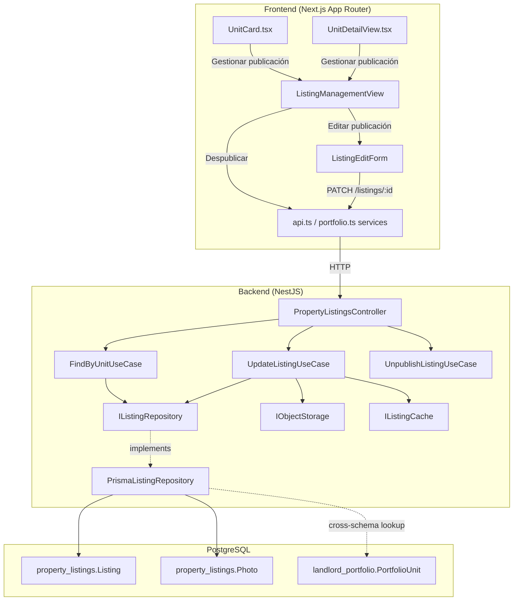

# Design Document: Portfolio Unit Listings Management

## Overview

This feature extends the existing property-listings and landlord-portfolio modules to give landlords full listing lifecycle management from within their portfolio context. Currently, landlords can publish a unit but cannot view, edit, or unpublish an existing listing from the portfolio UI. The feature adds:

1. Corrected publish/manage button logic on `UnitCard` and `UnitDetailView`
2. A new backend endpoint `GET /listings/by-unit/:portfolioUnitId` to fetch the active listing for a portfolio unit
3. A new backend endpoint `PATCH /listings/:id` to update an existing listing (title, description, price, photos)
4. A frontend Listing Management View at `/mi-portafolio/{portfolioId}/unidades/{unitId}/publicacion`
5. A frontend Listing Edit Form for modifying listing fields and photos

The design follows the existing hexagonal architecture, reuses the `property-listings` module's ports and adapters, and adheres to the established frontend conventions (Spanish routes, English code, WCAG 2.1 AA, custom typography tokens).

## Architecture

The feature spans two existing modules with no new modules required:



### Design Decisions

1. **No new module**: Both new endpoints live in `PropertyListingsController` since they operate on `Listing` entities. The portfolio module is only touched for frontend component changes.

2. **Ownership verification via cross-schema lookup**: The existing `getOwnerUserId` pattern (Listing → PortfolioUnit → LandlordPortfolio → user_id) is reused for both new endpoints. No new cross-schema patterns are introduced.

3. **Photo management in update**: The update endpoint accepts both new file uploads and a `removePhotoIds` array. New photos are uploaded to object storage via the existing `IObjectStorage` port. Removed photos are deleted from the `Photo` table. The total photo count (existing − removed + new) is validated to not exceed 10.

4. **Cache invalidation on update**: Same pattern as create/unpublish — `cache.invalidateByPattern('listings:published*')` after a successful update.

5. **Frontend routing**: The listing management page uses the Spanish route `/mi-portafolio/{portfolioId}/unidades/{unitId}/publicacion`, consistent with existing route conventions.

## Components and Interfaces

### Backend — New Use Cases

#### `FindListingByUnitUseCase`

Fetches the active listing for a given portfolio unit, with ownership verification.

```typescript
@Injectable()
export class FindListingByUnitUseCase {
  constructor(
    @Inject(LISTING_REPOSITORY) private readonly repository: IListingRepository,
    @Inject(PORTFOLIO_OWNER_PORT) private readonly portfolioOwner: IPortfolioOwnerPort,
  ) {}

  async execute(portfolioUnitId: string, userId: string): Promise<ListingResponseDto>
}
```

**Rationale for `IPortfolioOwnerPort`**: Rather than importing the portfolio repository directly (which would create a cross-module dependency), we define a lightweight port `IPortfolioOwnerPort` in the property-listings module that the portfolio module's repository can satisfy. This keeps the hexagonal boundary clean. Alternatively, the existing `getOwnerUserId` on `IListingRepository` can be extended with a `getOwnerUserIdByUnit(portfolioUnitId)` method since the repository already does cross-schema lookups.

**Chosen approach**: Add `getOwnerUserIdByUnit(portfolioUnitId: string): Promise<string | null>` to `IListingRepository` and `findActiveByPortfolioUnitId(portfolioUnitId: string): Promise<ListingEntity | null>` — this is simpler and consistent with the existing pattern where the listing repository already traverses PortfolioUnit → LandlordPortfolio.

#### `UpdateListingUseCase`

Updates an existing active listing's fields and manages photo additions/removals.

```typescript
@Injectable()
export class UpdateListingUseCase {
  constructor(
    @Inject(LISTING_REPOSITORY) private readonly repository: IListingRepository,
    @Inject(LISTING_CACHE) private readonly cache: IListingCache,
    @Inject(OBJECT_STORAGE) private readonly objectStorage: IObjectStorage,
  ) {}

  async execute(
    listingId: string,
    dto: UpdateListingDto,
    userId: string,
    files?: UploadedFile[],
  ): Promise<ListingResponseDto>
}
```

### Backend — New Repository Methods on `IListingRepository`

```typescript
// Added to IListingRepository
findActiveByPortfolioUnitId(portfolioUnitId: string): Promise<ListingEntity | null>;
update(id: string, data: UpdateListingData): Promise<ListingEntity>;
getOwnerUserIdByUnit(portfolioUnitId: string): Promise<string | null>;
```

### Backend — New DTOs

#### `UpdateListingDto` (Request)

```typescript
export class UpdateListingDto {
  @ApiPropertyOptional({ example: 'Apartamento renovado' })
  @IsOptional() @IsString() @IsNotEmpty()
  title?: string;

  @ApiPropertyOptional({ example: 'Descripción actualizada' })
  @IsOptional() @IsString()
  description?: string;

  @ApiPropertyOptional({ example: 1500000 })
  @IsOptional() @IsNumber() @Min(1)
  price?: number;

  @ApiPropertyOptional({ type: [String], description: 'Pre-supplied photo URLs' })
  @IsOptional() @IsArray() @IsString({ each: true })
  photoUrls?: string[];

  @ApiPropertyOptional({ type: [String], description: 'Photo IDs to remove' })
  @IsOptional() @IsArray() @IsString({ each: true })
  removePhotoIds?: string[];
}
```

### Backend — Controller Additions

Two new routes added to `PropertyListingsController`:

| Method | Path | Auth | Description |
|--------|------|------|-------------|
| `GET` | `/listings/by-unit/:portfolioUnitId` | JWT | Fetch active listing for a portfolio unit |
| `PATCH` | `/listings/:id` | JWT | Update listing fields and photos |

The `GET /listings/by-unit/:portfolioUnitId` route must be registered **before** the existing `GET /listings/:id` route to avoid NestJS treating `by-unit` as an `:id` parameter.

### Frontend — New Components

#### `ListingManagementView`

- Route: `/mi-portafolio/[portfolioId]/unidades/[unitId]/publicacion/page.tsx`
- Fetches listing via `GET /listings/by-unit/{unitId}`
- Displays: title, description, price (formatted COP), photos, listing date
- Actions: "Editar publicación" button → edit form, "Despublicar" button → confirmation dialog → `PATCH /listings/{id}/unpublish` → redirect to `/mi-portafolio/{portfolioId}/unidades`
- Back button → `/mi-portafolio/{portfolioId}/unidades/{unitId}` (standard back button pattern)
- 404 fallback: message + link to publish route

#### `ListingEditForm`

- Route: `/mi-portafolio/[portfolioId]/unidades/[unitId]/publicacion/editar/page.tsx`
- Pre-populates fields from current listing data
- Fields: title (required), description (optional), price (required, COP format), photos (add/remove, max 10)
- Submits via `PATCH /listings/{id}` with `multipart/form-data`
- On success: redirect to listing management view
- On error: display server error, preserve unsaved changes
- Back button → listing management view

### Frontend — Modified Components

#### `UnitCard` Changes

Current logic:
- `isAvailable && !hasActiveListing` → "Publicar en arriendo" button
- `hasActiveListing` → green "✓ Publicada en Explorar" indicator

New logic:
- `isAvailable && !hasActiveListing` → "Publicar en arriendo" button (unchanged)
- `hasActiveListing` → "Gestionar publicación" button linking to `/mi-portafolio/{portfolioId}/unidades/{unitId}/publicacion`
- `!isAvailable && !hasActiveListing` → no button (unchanged)
- A listing status badge (`StatusBadge` variant `listing`) is always shown in the top-right corner below the unit status badge: "Publicada" (blue) or "Sin publicar" (gray)

**Component deduplication**: The units page (`src/frontend/app/mi-portafolio/[id]/unidades/page.tsx`) previously had an inline `UnitCard` function duplicating the shared component. This has been refactored to import `UnitCard` from `@modules/landlord-portfolio/components/UnitCard.tsx` — single source of truth.

### Shared Components — `StatusBadge` Extension

The `StatusBadge` component (`src/frontend/shared/components/StatusBadge.tsx`) has been extended with a `listing` variant:

| Status | Background | Text Color |
|--------|-----------|------------|
| Publicada | `#DBEAFE` (blue-100) | `#1E40AF` (blue-800) |
| Sin publicar | `#F3F4F6` (gray-100) | `#4B5563` (gray-600) |

The `variant` prop type is now `'lease' | 'unit' | 'payment' | 'listing'`.

#### `UnitDetailView` Changes

Add conditional buttons:
- `hasActiveListing` → "Gestionar publicación" button
- `isAvailable && !hasActiveListing` → "Publicar en arriendo" button
- Neither condition → no listing-related button

### Frontend — Service Layer

New functions added to `api.ts`:

```typescript
export async function fetchListingByUnit(unitId: string, token: string): Promise<ListingResponse>
export async function updateListing(id: string, formData: FormData, token: string): Promise<ListingResponse>
```

## Data Models

### Existing Models (No Changes)

The Prisma schema requires **no migrations**. All data operations use existing tables:

- **`Listing`** (`property_listings` schema): id, portfolio_unit_id, title, description, listing_date, price, currency, is_active, photos[]
  - Constraint: `@@unique([portfolio_unit_id, is_active])` ensures at most one active listing per unit
- **`Photo`** (`property_listings` schema): id, listing_id, file_url, is_main, tx_hash
- **`PortfolioUnit`** (`landlord_portfolio` schema): id, portfolio_id, property_id, name, conditions, lease_base_amount, lease_base_currency
- **`LandlordPortfolio`** (`landlord_portfolio` schema): id, user_id, name, description

### Cross-Schema Ownership Resolution

```
Listing.portfolio_unit_id → PortfolioUnit.id → PortfolioUnit.portfolio_id → LandlordPortfolio.id → LandlordPortfolio.user_id
```

This 3-hop lookup is already implemented in `PrismaListingRepository.getOwnerUserId()`. The new `getOwnerUserIdByUnit()` method starts from `PortfolioUnit.id` directly (2-hop: PortfolioUnit → LandlordPortfolio → user_id).

### Update Data Interface

```typescript
export interface UpdateListingData {
  title?: string;
  description?: string;
  price?: number;
  newPhotoUrls?: string[];      // URLs from newly uploaded files
  removePhotoIds?: string[];    // Photo IDs to delete
}
```

### Frontend Types

```typescript
// Added to property-listings or landlord-portfolio types
export interface ListingResponse {
  id: string;
  portfolioUnitId: string;
  title: string;
  description: string | null;
  listingDate: string;
  price: number;
  currency: string;
  isActive: boolean;
  photos: { id: string; fileUrl: string; isMain: boolean }[];
}
```

