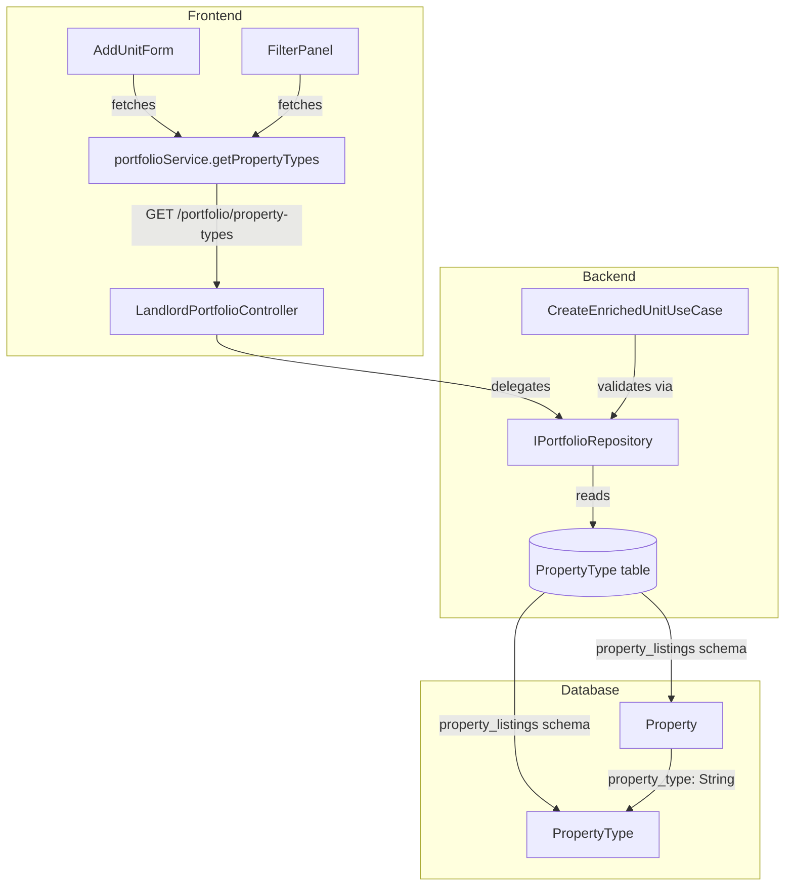

# Design Document: PropertyType Catalog

## Overview

This feature introduces a `PropertyType` catalog table in the `property_listings` schema, following the exact same pattern as `DocumentType` in the `users` module. It replaces the free-text `propertyType` field with a catalog-driven approach: a seeded table of Colombian property types, a public GET endpoint for frontend dropdowns, backend validation in `CreateEnrichedUnitUseCase`, and frontend integration in both `AddUnitForm` and `FilterPanel`.

The design mirrors `DocumentType` at every layer: same table structure (`id`, `code`, `description`, `is_active`), same repository methods (`findPropertyTypeByCode`, `findAllPropertyTypes`), same seed pattern (upsert by `code`), same public endpoint pattern (`@Public()` + `@Get`), and same frontend service/type pattern (`PropertyType` interface + `getPropertyTypes()` on `portfolioService`).

Key design decision: `Property.property_type` remains a plain `String` storing the code value — no foreign key relation — consistent with the project's cross-schema reference conventions.

## Architecture



The endpoint lives on the `LandlordPortfolioController` (`GET /portfolio/property-types`) rather than on a new controller, because:
1. The portfolio module already owns the `CreateEnrichedUnitUseCase` that validates property types
2. The `IPortfolioRepository` is the natural home for property type lookups (same module boundary)
3. This mirrors how `DocumentType` lives on the `UsersController` (`GET /auth/document-types`)

## Components and Interfaces

### Database Layer

**New Prisma model — `PropertyType`:**

```prisma
model PropertyType {
  id          String  @id @default(uuid())
  code        String  @unique
  description String
  is_active   Boolean @default(true)

  @@schema("property_listings")
}
```

No relation to `Property` — `Property.property_type` stays as a plain `String` field storing the code value.

### Seed Script

Add a new section to `src/backend/db/seeds/seed.ts` after the Document Types block:

```typescript
const propertyTypes = [
  { code: 'APARTAMENTO', description: 'Apartamento' },
  { code: 'CASA',        description: 'Casa' },
  { code: 'LOCAL',       description: 'Local comercial' },
  { code: 'OFICINA',     description: 'Oficina' },
  { code: 'BODEGA',      description: 'Bodega' },
  { code: 'LOTE',        description: 'Lote' },
  { code: 'FINCA',       description: 'Finca' },
  { code: 'HABITACION',  description: 'Habitación' },
  { code: 'ESTUDIO',     description: 'Estudio' },
];

for (const pt of propertyTypes) {
  await prisma.propertyType.upsert({
    where: { code: pt.code },
    update: { description: pt.description, is_active: true },
    create: { code: pt.code, description: pt.description, is_active: true },
  });
}
```

Uses `where: { code }` for idempotent upsert — same pattern as `DocumentType`.

### Domain Layer — Repository Port

**Extend `IPortfolioRepository`** with two new methods:

```typescript
// In portfolio-repository.port.ts
export interface IPortfolioRepository {
  // ... existing methods ...
  findPropertyTypeByCode(code: string): Promise<{ id: string; code: string } | null>;
  findAllPropertyTypes(): Promise<{ id: string; code: string; description: string }[]>;
}
```

Mirrors `IUserRepository.findDocumentTypeByCode` and `findAllDocumentTypes`.

### Infrastructure Layer — Prisma Repository

**Add to `PrismaPortfolioRepository`:**

```typescript
async findPropertyTypeByCode(code: string): Promise<{ id: string; code: string } | null> {
  const pt = await this.prisma.propertyType.findUnique({ where: { code } });
  return pt ? { id: pt.id, code: pt.code } : null;
}

async findAllPropertyTypes(): Promise<{ id: string; code: string; description: string }[]> {
  const types = await this.prisma.propertyType.findMany({
    where: { is_active: true },
    orderBy: { code: 'asc' },
  });
  return types.map((t) => ({ id: t.id, code: t.code, description: t.description }));
}
```

Same implementation pattern as `PrismaUserRepository.findDocumentTypeByCode` / `findAllDocumentTypes`.

### Application Layer — Use Case Validation

**Modify `CreateEnrichedUnitUseCase.execute()`** to validate `propertyType` before creating the unit:

```typescript
// After portfolio ownership check, before createEnrichedUnit call:
const propertyType = await this.portfolioRepository.findPropertyTypeByCode(dto.propertyType);
if (!propertyType) {
  throw new BadRequestException(
    `Tipo de propiedad no válido: "${dto.propertyType}". Consulte GET /portfolio/property-types para ver los tipos disponibles.`
  );
}
```

### Application Layer — Response DTO

**New `PropertyTypeResponseDto`:**

```typescript
export class PropertyTypeResponseDto {
  @ApiProperty({ example: 'uuid-here' })
  id!: string;

  @ApiProperty({ example: 'APARTAMENTO' })
  code!: string;

  @ApiProperty({ example: 'Apartamento' })
  description!: string;
}
```

### Controller Layer

**Add to `LandlordPortfolioController`:**

```typescript
@Public()
@Get('property-types')
@ApiOperation({
  summary: 'Listar tipos de propiedad válidos',
  description: 'Retorna el catálogo de tipos de propiedad activos para poblar dropdowns en el frontend.',
})
@ApiOkResponse({ description: 'Lista de tipos de propiedad activos', type: [PropertyTypeResponseDto] })
getPropertyTypes() {
  return this.portfolioRepository.findAllPropertyTypes();
}
```

The controller injects `IPortfolioRepository` directly for this read-only catalog query (same pattern as `UsersController` injecting `IUserRepository` for `getDocumentTypes`). This requires adding `@Inject(PORTFOLIO_REPOSITORY) private readonly portfolioRepository: IPortfolioRepository` to the controller constructor.

**Route ordering note:** The `property-types` route must be declared before `:portfolioId/units` to avoid NestJS interpreting `property-types` as a `portfolioId` parameter.

### DTO Update — ListingFiltersDto

Update the `propertyType` field's Swagger description:

```typescript
@ApiPropertyOptional({
  example: 'APARTAMENTO',
  description: 'Filtrar por tipo de propiedad. Los valores válidos provienen del catálogo: GET /portfolio/property-types',
})
```

### Frontend — Type Definition

**Add to `src/frontend/modules/landlord-portfolio/types.ts`:**

```typescript
export interface PropertyType {
  id: string;
  code: string;
  description: string;
}
```

### Frontend — Portfolio Service

**Add to `src/frontend/shared/services/portfolio.ts`:**

```typescript
async getPropertyTypes(): Promise<PropertyType[]> {
  let res: Response;
  try {
    res = await fetch(`${API_URL}/portfolio/property-types`, {
      method: 'GET',
      headers: { 'Content-Type': 'application/json' },
    });
  } catch {
    throw new Error('No se pudo conectar con el servidor. Verifica tu conexión e intenta de nuevo.');
  }

  if (!res.ok) {
    if (res.status >= 500) throw new Error('Error del servidor. Intenta de nuevo más tarde.');
    throw new Error('Error del servidor. Intenta de nuevo más tarde.');
  }

  return res.json();
}
```

No auth token needed — the endpoint is public. Same error handling pattern as `authService.getDocumentTypes()`.

### Frontend — AddUnitForm Changes

1. Add `useState` for `propertyTypes` and `isLoadingPropertyTypes`
2. Add `useEffect` to fetch property types on mount via `portfolioService.getPropertyTypes()`
3. Replace the `<input>` for propertyType with a `<select>`:
   - Show `<Skeleton>` while loading (same pattern as `Step2PersonalData` document type dropdown)
   - Default disabled option: `"Selecciona un tipo de propiedad"`
   - Map fetched types to `<option key={pt.code} value={pt.code}>{pt.description}</option>`
   - Keep `aria-describedby` linking to error message, `min-h-[44px]`, and associated `<label>`

### Frontend — FilterPanel Changes

1. Add `useState` for `propertyTypes` (fetched list) and `isLoadingPropertyTypes`
2. Add `useEffect` to fetch property types on mount via `portfolioService.getPropertyTypes()`
3. Remove the hardcoded `const PROPERTY_TYPES = [...]` array
4. Replace the property type `<select>` options:
   - Map fetched types to `<option key={pt.code} value={pt.code}>{pt.description}</option>`
   - On fetch failure: catch error silently, leave `propertyTypes` as empty array (graceful degradation — the dropdown shows only "Todos los tipos")

## Data Models

### PropertyType (new table)

| Column      | Type    | Constraints              |
|-------------|---------|--------------------------|
| id          | UUID    | PK, auto-generated       |
| code        | String  | UNIQUE, NOT NULL         |
| description | String  | NOT NULL                 |
| is_active   | Boolean | NOT NULL, DEFAULT true   |

Schema: `property_listings`

### Property (existing — no changes)

`property_type` remains `String`. The value stored will now be a `PropertyType.code` (e.g., `"APARTAMENTO"`) instead of free text (e.g., `"Apartamento"`). Existing data with free-text values will still work for reads but won't match catalog codes for filtering until migrated.

### Migration Consideration

Existing `Property` rows may have free-text values like `"Apartamento"` that don't match the uppercase catalog codes like `"APARTAMENTO"`. A data migration to normalize existing values is recommended but out of scope for this feature — it can be handled as a follow-up task.

## Correctness Properties

*A property is a characteristic or behavior that should hold true across all valid executions of a system — essentially, a formal statement about what the system should do. Properties serve as the bridge between human-readable specifications and machine-verifiable correctness guarantees.*

### Property 1: Active-only filtering

*For any* collection of PropertyType records with varying `is_active` values, `findAllPropertyTypes()` SHALL return only those records where `is_active` is `true`, and SHALL exclude all records where `is_active` is `false`.

**Validates: Requirements 3.3, 4.4**

### Property 2: Alphabetical ordering invariant

*For any* collection of active PropertyType records returned by `findAllPropertyTypes()`, the result array SHALL be sorted by `code` in ascending alphabetical order — that is, for every consecutive pair of elements `result[i]` and `result[i+1]`, `result[i].code <= result[i+1].code`.

**Validates: Requirements 3.4**

### Property 3: Validation accepts valid codes and rejects invalid codes

*For any* string `s`, `CreateEnrichedUnitUseCase` SHALL accept `s` as a valid `propertyType` if and only if there exists an active PropertyType record in the catalog whose `code` equals `s`. If no such record exists, the use case SHALL throw a `BadRequestException`.

**Validates: Requirements 4.1, 4.2**

### Property 4: AddUnitForm dropdown renders catalog faithfully

*For any* non-empty array of PropertyType objects returned by the API, the AddUnitForm `<select>` SHALL contain exactly one `<option>` per PropertyType, where each option's `value` attribute equals the PropertyType's `code` and the option's display text equals the PropertyType's `description`. Selecting any option SHALL set `formData.propertyType` to that option's `code`.

**Validates: Requirements 5.3, 5.5**

### Property 5: FilterPanel dropdown renders catalog faithfully

*For any* non-empty array of PropertyType objects returned by the API, the FilterPanel property type `<select>` SHALL contain exactly one `<option>` per PropertyType, where each option's `value` attribute equals the PropertyType's `code` and the option's display text equals the PropertyType's `description`.

**Validates: Requirements 6.2, 6.3**

## Error Handling

| Scenario | Layer | Response |
|----------|-------|----------|
| Invalid `propertyType` code in CreateEnrichedUnit | Use Case | 400 Bad Request with descriptive message |
| PropertyType fetch network failure (frontend) | Service | Throws "No se pudo conectar con el servidor..." |
| PropertyType fetch server error ≥ 500 (frontend) | Service | Throws "Error del servidor..." |
| PropertyType fetch fails in AddUnitForm | Component | Shows error state (same as other fetch failures) |
| PropertyType fetch fails in FilterPanel | Component | Graceful degradation — dropdown shows only "Todos los tipos" |
| Seed script fails mid-execution | Seed | Transaction rollback per upsert; re-runnable due to idempotent upserts |

## Testing Strategy

### Property-Based Tests (fast-check)

The feature has testable properties suitable for PBT, primarily around the repository filtering/ordering logic and the validation logic in the use case.

- Library: `fast-check` (already available in the project)
- Minimum 100 iterations per property test
- Tag format: `Feature: property-type-catalog, Property {N}: {description}`

**Property tests to implement:**

1. **findAllPropertyTypes active-only filtering** — Generate random arrays of `{ code, description, is_active }` records, mock the Prisma query, verify only active records are returned.
2. **findAllPropertyTypes ordering** — Generate random arrays of active records, verify the result is sorted by `code` ascending.
3. **CreateEnrichedUnitUseCase validation** — Generate random strings, mock `findPropertyTypeByCode` to return non-null for known codes and null for unknown, verify accept/reject behavior matches.
4. **AddUnitForm dropdown rendering** — Generate random PropertyType arrays, render the component, verify option count, values, and labels match.
5. **FilterPanel dropdown rendering** — Generate random PropertyType arrays, render the component, verify option count, values, and labels match.

### Unit Tests (example-based)

- Endpoint returns 200 without authentication
- AddUnitForm shows skeleton while loading
- AddUnitForm default option is disabled with "Selecciona un tipo de propiedad"
- FilterPanel gracefully degrades on fetch failure
- `getPropertyTypes()` throws correct error messages for network/server errors
- Unknown `propertyType` filter on `GET /listings` returns empty results (no error)

### Integration Tests

- Seed script creates all 9 property types with correct codes/descriptions
- Seed script is idempotent (running twice produces no duplicates)
- Full flow: seed → fetch property types → create enriched unit with valid code → verify stored value
