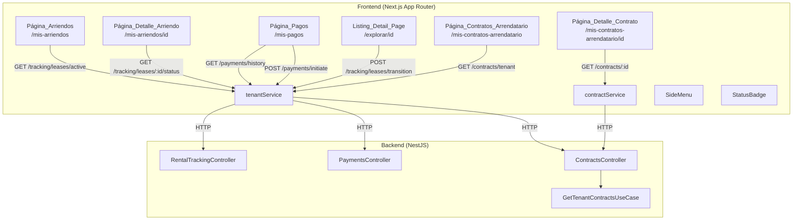

# Design Document: Tenant Flows Frontend

## Overview

This feature implements the authenticated tenant experience in the existing Next.js frontend. Today, tenants can browse listings anonymously, register, log in, and view their profile — but have no authenticated pages for managing their rental lifecycle. This design adds five tenant-facing pages, a new frontend service layer, a new backend endpoint, extensions to the SideMenu and StatusBadge shared components, and a contact-landlord flow on the listing detail page.

The implementation follows established patterns: hexagonal architecture on the backend, App Router pages with lazy-loaded SideMenu on the frontend, shared services using native `fetch`, and WCAG 2.1 AA accessibility throughout. All UI text is in Spanish; all code identifiers are in English.

### Scope

| Area | What's new |
|------|-----------|
| Backend | `GET /contracts/tenant` endpoint in `ContractsController` |
| Frontend service | `tenantService` in `src/frontend/shared/services/tenant.ts` |
| Pages | `/mis-arriendos`, `/mis-arriendos/[id]`, `/mis-contratos-arrendatario`, `/mis-contratos-arrendatario/[id]`, `/mis-pagos` |
| Shared components | StatusBadge `tracking` + `paymentStatus` variants, SideMenu role-based links |
| Existing page modification | `/explorar/[id]` — "Contactar arrendador" button |

## Architecture



### Design Decisions

1. **Separate `tenantService`**: A new service file (`tenant.ts`) encapsulates all tenant-oriented API calls. The existing `contractService.getContract()` is reused for the contract detail page since it already handles `GET /contracts/:id`. The new `GET /contracts/tenant` endpoint is called from `tenantService` to keep tenant-specific calls in one place.

2. **ProtectedRoute reuse**: All tenant pages wrap content in the existing `ProtectedRoute` component. Role checking (TENANT) is done at the page component level — if the user lacks the TENANT role, they see a permission message rather than being redirected, since they may be a valid LANDLORD user.

3. **SideMenu role-based links**: Instead of a single hardcoded `NAV_LINKS` array, the SideMenu builds links dynamically from the user's `roles` array via the AuthProvider. Landlord links and tenant links are defined separately; dual-role users see the union.

4. **StatusBadge extension**: Two new variants (`tracking`, `paymentStatus`) are added using the same `ContractColorMapping` pattern (with `label` field) already used by the `contract` variant, since the API returns English keys that need Spanish display labels.

5. **Contact flow on listing detail**: The "Contactar arrendador" button is added to the existing `/explorar/[id]` page. It uses `POST /tracking/leases/transition` with `newState: CONTACT_INITIATED`. Auth state is checked inline — unauthenticated users are redirected to login; non-TENANT users see an informational message.

6. **No new backend module**: The `GET /contracts/tenant` endpoint is added to the existing `ContractsController`, following the same pattern as `GET /contracts/landlord`. A new `GetTenantContractsUseCase` handles the cross-schema query.

7. **Relative time formatting**: The rentals list uses `Intl.RelativeTimeFormat` with locale `es` for "Hace X días" display, avoiding external date libraries.


## Components and Interfaces

### Backend — New Use Case

#### `GetTenantContractsUseCase`

Fetches all contracts where the authenticated user is a party with `role_in_contract = 'TENANT'`. Resolves unit name and landlord name via cross-schema lookups.

```typescript
@Injectable()
export class GetTenantContractsUseCase {
  constructor(
    @Inject(CONTRACT_REPOSITORY) private readonly repository: IContractRepository,
    @Inject(PII_ENCRYPTOR) private readonly piiEncryptor: IPIIEncryptor,
  ) {}

  async execute(userId: string): Promise<TenantContractListItemDto[]>
}
```

Cross-schema resolution chain:
- Unit name: `Contract.lease_id → Lease.portfolio_unit_id → PortfolioUnit.name`
- Landlord name: `ContractParty (role_in_contract = 'LANDLORD') → User → NaturalPersonDetail.first_name + last_name` or `LegalPersonDetail.business_name`, with PII decryption

### Backend — New Repository Method

#### `IContractRepository` addition

```typescript
findContractsByTenantId(tenantUserId: string): Promise<TenantContractRawItem[]>;
```

This method queries `ContractParty` where `user_id = tenantUserId` and `role_in_contract = 'TENANT'`, joins to `Contract` and `ContractStatus`, and returns raw items. The use case then performs cross-schema lookups for unit name and landlord name.

### Backend — New DTO

#### `TenantContractListItemDto` (Response)

```typescript
export class TenantContractListItemDto {
  @ApiProperty() id!: string;
  @ApiProperty() leaseId!: string;
  @ApiProperty({ example: 'PENDING' }) status!: string;
  @ApiProperty() startDate!: Date;
  @ApiPropertyOptional({ nullable: true }) endDate!: Date | null;
  @ApiProperty() unitName!: string;
  @ApiProperty() landlordName!: string;
}
```

### Backend — Controller Addition

New route on `ContractsController`:

| Method | Path | Auth | Description |
|--------|------|------|-------------|
| `GET` | `/contracts/tenant` | JWT | List contracts where authenticated user is tenant party |

This route must be registered **before** the existing `GET /contracts/:id` route to avoid NestJS treating `tenant` as an `:id` parameter. It returns an empty array if the user has no TENANT role (rather than 403), per requirement 2.5.

### Frontend — New Service: `tenantService`

Located at `src/frontend/shared/services/tenant.ts`. Follows the same pattern as `contractService` and `leaseService`.

```typescript
// TypeScript interfaces
export interface ActiveLeaseSummary {
  leaseId: string;
  propertyName: string;
  currentState: string;
  lastChangedAt: string;
}

export interface LeaseStatusHistoryItem {
  id: string;
  state: string;
  recordedAt: string;
}

export interface LeaseStatusResponse {
  leaseId: string;
  currentState: string;
  lastChangedAt: string;
  history: LeaseStatusHistoryItem[];
}

export interface PaymentResponse {
  id: string;
  scheduledPaymentId: string;
  amount: number;
  currency: string;
  status: string;
  dueDate: string;
  paymentDesc: string | null;
  createdAt: string | null;
}

export interface InitiatePaymentRequest {
  scheduledPaymentId: string;
}

export interface InitiatePaymentResponse {
  redirectUrl: string;
  status: string;
}

export interface TenantContractListItem {
  id: string;
  leaseId: string;
  status: 'PENDING' | 'SIGNATURE_PENDING' | 'SIGNED';
  startDate: string;
  endDate: string | null;
  unitName: string;
  landlordName: string;
}

export const tenantService = {
  async getActiveLeases(token: string): Promise<ActiveLeaseSummary[]>,
  async getLeaseStatus(leaseId: string, token: string): Promise<LeaseStatusResponse>,
  async getPaymentHistory(token: string): Promise<PaymentResponse[]>,
  async initiatePayment(data: InitiatePaymentRequest, token: string): Promise<InitiatePaymentResponse>,
  async transitionLeaseState(leaseId: string, newState: string, token: string): Promise<void>,
  async getTenantContracts(token: string): Promise<TenantContractListItem[]>,
};
```

Error handling pattern (consistent with existing services):
- 401 → `"Sesión expirada"`
- 403 → `"No tienes permiso para realizar esta acción"`
- 404 → `"Recurso no encontrado"`
- 5xx / network → `"Error del servidor. Intenta de nuevo más tarde."` or `"No se pudo conectar con el servidor. Verifica tu conexión e intenta de nuevo."`

All requests include `Authorization: Bearer <token>` header. Uses native `fetch`.

### Frontend — New Pages

#### Rentals List Page (`/mis-arriendos`)

- First-level page: Header with hamburger → SideMenu
- Fetches `tenantService.getActiveLeases(token)`
- Renders each lease as a card: property name (H3), StatusBadge variant `tracking`, relative date
- Card is a `<Link>` to `/mis-arriendos/[leaseId]`
- States: loading (skeleton), empty (message + link to `/explorar`), error (ErrorState with retry)
- Protected: `ProtectedRoute` + TENANT role check

#### Rental Detail Page (`/mis-arriendos/[id]`)

- Sub-level page: Header with back arrow → `/mis-arriendos`
- Fetches `tenantService.getLeaseStatus(id, token)`
- Sections:
  1. Current state: StatusBadge + last changed date
  2. Progress timeline: vertical stepper showing all 5 lifecycle states (PUBLISHED → CONTACT_INITIATED → CONTRACT_UPLOADED → CONTRACT_SIGNED → PAYMENT_RECEIVED), completed states in primary blue (`#1d4ed8`), pending in gray (`#d1d5db`), current highlighted with `aria-current="step"`
  3. History: chronological list of state transitions (most recent first)
- States: loading (skeleton), 404 (not found message + link back), error (ErrorState with retry)

#### Tenant Contracts List Page (`/mis-contratos-arrendatario`)

- First-level page: Header with hamburger → SideMenu
- Fetches `tenantService.getTenantContracts(token)`
- Renders each contract as a card: unit name (H3), landlord name (caption), StatusBadge variant `contract`, date range
- Card is a `<Link>` to `/mis-contratos-arrendatario/[id]`
- States: loading (skeleton), empty (message), error (ErrorState with retry)
- Protected: `ProtectedRoute` + TENANT role check

#### Tenant Contract Detail Page (`/mis-contratos-arrendatario/[id]`)

- Sub-level page: Header with back arrow → `/mis-contratos-arrendatario`
- Fetches `contractService.getContract(id, token)` (reuses existing service)
- Displays: status badge, date range, parties list, "Ver documento" link (opens presigned PDF URL in new tab)
- Conditional messages: SIGNATURE_PENDING → "El contrato está en proceso de firma", SIGNED → "El contrato ha sido firmado por todas las partes"
- States: loading (skeleton), 403 (permission denied message), error (ErrorState with retry)

#### Payments Page (`/mis-pagos`)

- First-level page: Header with hamburger → SideMenu
- Fetches `tenantService.getPaymentHistory(token)`
- Renders each payment as a card: amount formatted with `formatCOP`, due date in Spanish, StatusBadge variant `paymentStatus`, description (if available)
- PENDING payments show a "Pagar" button that calls `tenantService.initiatePayment()`
- On success: confirmation message (MVP stub returns APPROVED)
- Button disabled + spinner while processing
- States: loading (skeleton), empty (message), error (ErrorState with retry)
- Protected: `ProtectedRoute` + TENANT role check

### Frontend — Modified Components

#### SideMenu — Role-Based Navigation

Replace the hardcoded `NAV_LINKS` array with role-based link building:

```typescript
const TENANT_LINKS = [
  { label: 'Explorar inmuebles', href: '/explorar', icon: SearchIcon },
  { label: 'Mis arriendos', href: '/mis-arriendos', icon: HomeIcon },
  { label: 'Mis contratos', href: '/mis-contratos-arrendatario', icon: FileIcon },
  { label: 'Mis pagos', href: '/mis-pagos', icon: WalletIcon },
  { label: 'Mi perfil', href: '/mi-perfil', icon: UserIcon },
];

const LANDLORD_LINKS = [
  { label: 'Explorar inmuebles', href: '/explorar', icon: SearchIcon },
  { label: 'Mi portafolio', href: '/mi-portafolio', icon: HomeIcon },
  { label: 'Mis ingresos', href: '/mis-ingresos', icon: WalletIcon },
  { label: 'Mis contratos', href: '/mis-contratos', icon: FileIcon },
  { label: 'Mi perfil', href: '/mi-perfil', icon: UserIcon },
];
```

The SideMenu receives `roles: string[]` (from AuthProvider) and builds the union. For dual-role users, shared links (Explorar, Mi perfil) appear once; role-specific links are merged in a defined order. Landlord contract link shows "Mis contratos (arrendador)" and tenant contract link shows "Mis contratos (arrendatario)" when both roles are present.

New SideMenu props:

```typescript
interface SideMenuProps {
  isOpen: boolean;
  onClose: () => void;
  user?: { name: string; role: string; roles?: string[] } | null;
  onLogout?: () => void;
}
```

The `roles` array is added as optional to maintain backward compatibility. When present, it drives link selection; when absent, falls back to current behavior.

#### StatusBadge — New Variants

New `tracking` variant:

| Status Key | Label | Background | Text Color |
|------------|-------|-----------|------------|
| PUBLISHED | Publicado | `#F3F4F6` | `#4B5563` |
| CONTACT_INITIATED | Contacto iniciado | `#DBEAFE` | `#1E40AF` |
| CONTRACT_UPLOADED | Contrato cargado | `#FEF3C7` | `#92400E` |
| CONTRACT_SIGNED | Contrato firmado | `#DCFCE7` | `#166534` |
| PAYMENT_RECEIVED | Pago recibido | `#D1FAE5` | `#065F46` |

New `paymentStatus` variant:

| Status Key | Label | Background | Text Color |
|------------|-------|-----------|------------|
| PENDING | Pendiente | `#FEF3C7` | `#92400E` |
| PROCESSING | Procesando | `#DBEAFE` | `#1E40AF` |
| PAID | Pagado | `#DCFCE7` | `#065F46` |
| REJECTED | Rechazado | `#FEE2E2` | `#991B1B` |

Both use the `ContractColorMapping` pattern (with `label` field) since API keys are English and display labels are Spanish. The `StatusBadgeProps.variant` type is extended to include `'tracking' | 'paymentStatus'`.

#### Listing Detail Page (`/explorar/[id]`) — Contact Button

A "Contactar arrendador" button is added below the `ListingDetailView` component:

- If user is not authenticated: clicking redirects to `/auth/login`
- If user is authenticated but not TENANT: shows informational message "Solo los arrendatarios pueden contactar arrendadores"
- If user is authenticated TENANT: shows `ConfirmationDialog` asking to confirm contact initiation, then calls `tenantService.transitionLeaseState(leaseId, 'CONTACT_INITIATED', token)`
- On success: confirmation message in Spanish
- On error (404): "No se encontró un arriendo asociado a este inmueble"
- Button disabled + spinner while processing

The `leaseId` is resolved from the listing detail — the backend `POST /tracking/leases/transition` endpoint accepts a `leaseId`. The listing detail response needs to include the associated `leaseId` for the tenant, or the frontend derives it from context. Since the current `ListingDetail` type may not include `leaseId`, the transition endpoint is called with the listing's `portfolioUnitId` context, and the backend resolves the lease internally.

**Note:** The exact mechanism for resolving the lease from a listing depends on the backend's `TransitionLeaseStateDto` which requires a `leaseId`. The frontend will need the lease ID associated with the listing. This may require the listing detail endpoint to return the active lease ID for the authenticated tenant, or a separate lookup. For MVP, the "Contactar arrendador" flow will use `POST /tracking/leases/transition` with the `leaseId` that the backend can resolve from the listing context.


## Data Models

### Existing Models (No Schema Changes)

No Prisma migrations are required. All operations use existing tables:

- **`Lease`** (`landlord_portfolio` schema): id, portfolio_unit_id, user_id (tenant), start_date, end_date
- **`LeaseStatus`** (`tracking_process` schema): id, name (PUBLISHED | CONTACT_INITIATED | CONTRACT_UPLOADED | CONTRACT_SIGNED | PAYMENT_RECEIVED)
- **`LeaseStatusHistory`** (`tracking_process` schema): id, lease_id, lease_status_id, record_created_at
- **`LeaseCurrentStatus`** (`tracking_process` schema): lease_id, lease_status_history_id, lease_status_id
- **`Contract`** (`contracts` schema): id, lease_id, contract_status_id, start_date, end_date
- **`ContractParty`** (`contracts` schema): id, user_id, contract_id, role_in_contract (LANDLORD | TENANT)
- **`ContractStatus`** (`contracts` schema): id, name (PENDING | SIGNATURE_PENDING | SIGNED)
- **`ScheduledPayment`** (`payments` schema): id, lease_id, amount, currency, due_date
- **`Payment`** (`payments` schema): id, scheduled_payment_id, amount, currency, payment_desc
- **`PaymentStatus`** (`payments` schema): id, name (PENDING | PROCESSING | PAID | REJECTED)
- **`User`** (`users` schema): id, user_type, mail — PII fields encrypted
- **`NaturalPersonDetail`** (`users` schema): user_id, first_name, last_name
- **`LegalPersonDetail`** (`users` schema): user_id, business_name

### Cross-Schema Query: Tenant Contracts

```
ContractParty.user_id = tenantUserId AND role_in_contract = 'TENANT'
  → Contract.id, Contract.lease_id, Contract.contract_status_id
    → ContractStatus.name (status label)
    → Lease.portfolio_unit_id (via Contract.lease_id)
      → PortfolioUnit.name (unit name)
    → ContractParty (role_in_contract = 'LANDLORD').user_id
      → User → NaturalPersonDetail / LegalPersonDetail (landlord name, PII decrypted)
```

### Frontend Type Definitions

```typescript
// src/frontend/shared/services/tenant.ts

export interface ActiveLeaseSummary {
  leaseId: string;
  propertyName: string;
  currentState: string;       // PUBLISHED | CONTACT_INITIATED | ...
  lastChangedAt: string;      // ISO date string
}

export interface LeaseStatusHistoryItem {
  id: string;
  state: string;
  recordedAt: string;
}

export interface LeaseStatusResponse {
  leaseId: string;
  currentState: string;
  lastChangedAt: string;
  history: LeaseStatusHistoryItem[];
}

export interface PaymentResponse {
  id: string;
  scheduledPaymentId: string;
  amount: number;
  currency: string;
  status: string;             // PENDING | PROCESSING | PAID | REJECTED
  dueDate: string;
  paymentDesc: string | null;
  createdAt: string | null;
}

export interface TenantContractListItem {
  id: string;
  leaseId: string;
  status: 'PENDING' | 'SIGNATURE_PENDING' | 'SIGNED';
  startDate: string;
  endDate: string | null;
  unitName: string;
  landlordName: string;
}
```

### State Translation Maps

```typescript
// Tracking states → Spanish labels
const TRACKING_STATE_LABELS: Record<string, string> = {
  PUBLISHED: 'Publicado',
  CONTACT_INITIATED: 'Contacto iniciado',
  CONTRACT_UPLOADED: 'Contrato cargado',
  CONTRACT_SIGNED: 'Contrato firmado',
  PAYMENT_RECEIVED: 'Pago recibido',
};

// Payment statuses → Spanish labels
const PAYMENT_STATUS_LABELS: Record<string, string> = {
  PENDING: 'Pendiente',
  PROCESSING: 'Procesando',
  PAID: 'Pagado',
  REJECTED: 'Rechazado',
};

// Ordered lifecycle steps for the progress timeline
const LIFECYCLE_STEPS = [
  'PUBLISHED',
  'CONTACT_INITIATED',
  'CONTRACT_UPLOADED',
  'CONTRACT_SIGNED',
  'PAYMENT_RECEIVED',
] as const;
```


## Correctness Properties

*A property is a characteristic or behavior that should hold true across all valid executions of a system — essentially, a formal statement about what the system should do. Properties serve as the bridge between human-readable specifications and machine-verifiable correctness guarantees.*

### Property 1: Authorization header is always attached

*For any* non-empty token string and any tenant service function call, the outgoing HTTP request SHALL include an `Authorization` header with value `Bearer <token>`.

**Validates: Requirements 1.4**

### Property 2: Server errors produce Spanish error messages

*For any* HTTP response with a status code in the 5xx range (500–599), the tenant service SHALL throw an error whose message is a non-empty string in Spanish (not an HTTP status code or English technical message).

**Validates: Requirements 1.7**

### Property 3: Tenant contracts endpoint returns only tenant-party contracts with complete data

*For any* set of contracts in the database with various party configurations, `GET /contracts/tenant` SHALL return only contracts where the authenticated user has a `ContractParty` with `role_in_contract = 'TENANT'`, and each returned contract SHALL include non-null values for id, leaseId, status, startDate, unitName, and landlordName.

**Validates: Requirements 2.1, 2.2**

### Property 4: Tenant contracts are ordered by creation date descending

*For any* list of contracts returned by `GET /contracts/tenant` with more than one element, each contract's creation date SHALL be greater than or equal to the creation date of the next contract in the list.

**Validates: Requirements 2.6**

### Property 5: Timeline step classification is consistent with lifecycle ordering

*For any* valid tracking state (one of PUBLISHED, CONTACT_INITIATED, CONTRACT_UPLOADED, CONTRACT_SIGNED, PAYMENT_RECEIVED), the progress timeline function SHALL classify all states before the current state as "completed", the current state as "current", and all states after the current state as "pending", according to the fixed lifecycle ordering.

**Validates: Requirements 4.4**

### Property 6: Role-based navigation links are the correct union of role-specific links

*For any* combination of user roles (empty set, TENANT only, LANDLORD only, both TENANT and LANDLORD), the SideMenu link-building function SHALL return exactly the union of the link sets defined for each present role, with no duplicates for shared links (Explorar inmuebles, Mi perfil) and with role-disambiguated labels for contracts links when both roles are present.

**Validates: Requirements 9.1, 9.2, 9.3, 9.4**

### Property 7: StatusBadge variant mappings produce correct labels and colors

*For any* StatusBadge variant (tracking, paymentStatus, lease, unit, payment, listing, contract) and any valid status key for that variant, the rendered badge SHALL display the correct Spanish label, background color, and text color as defined in the variant's color mapping. Existing variant mappings SHALL remain unchanged after adding the new variants.

**Validates: Requirements 10.1, 10.2, 10.3**

### Property 8: StatusBadge color pairs meet WCAG AA contrast ratios

*For any* StatusBadge variant and valid status key, the contrast ratio between the text color and background color SHALL be at least 4.5:1, meeting WCAG 2.1 AA requirements for normal text.

**Validates: Requirements 11.5**


## Error Handling

### Frontend Service Layer (`tenantService`)

| HTTP Status | Error Message | Action |
|-------------|--------------|--------|
| 401 | "Sesión expirada" | Propagated to component; component calls `logout()` |
| 403 | "No tienes permiso para realizar esta acción" | Displayed to user |
| 404 | "Recurso no encontrado" | Context-specific message shown (e.g., "Arriendo no encontrado") |
| 409 | Server message extracted from response body | Displayed to user |
| 5xx | "Error del servidor. Intenta de nuevo más tarde." | ErrorState with retry |
| Network error | "No se pudo conectar con el servidor. Verifica tu conexión e intenta de nuevo." | ErrorState with retry |

### Page-Level Error Handling

Each page follows a consistent state machine pattern:

```typescript
type PageState =
  | { status: 'loading' }
  | { status: 'success'; data: T }
  | { status: 'empty' }
  | { status: 'error'; message?: string }
  | { status: 'not_found' }       // detail pages only
  | { status: 'forbidden' };      // contract detail only
```

- **Loading**: Skeleton placeholder with `aria-busy="true"` and `aria-live="polite"`
- **Success**: Render data
- **Empty**: Spanish message with contextual guidance (e.g., link to `/explorar`)
- **Error**: `ErrorState` component with retry callback that re-fetches data
- **Not found**: Message with link back to list page
- **Forbidden**: Permission denied message

### Session Expiration

When any service call returns 401 ("Sesión expirada"), the consuming component calls `logout()` from `useAuth()`, which clears localStorage and redirects to `/auth/login`. This is consistent with the existing pattern in `ContractsListView`.

### Payment Initiation Errors

The "Pagar" button has its own error state separate from the page-level error:
- Button shows spinner while processing (`isSubmitting` state)
- On failure: inline error message below the button, button re-enabled for retry
- On success: inline success message, button hidden or disabled

### Contact Flow Errors

The "Contactar arrendador" button on `/explorar/[id]`:
- Uses `ConfirmationDialog` before making the API call
- On 404: "No se encontró un arriendo asociado a este inmueble"
- On network/server error: "Ocurrió un error al iniciar el contacto. Intenta de nuevo."
- Success: "El contacto ha sido iniciado. El arrendador será notificado."

## Testing Strategy

### Dual Testing Approach

This feature uses both unit tests and property-based tests for comprehensive coverage.

### Property-Based Tests

Library: **fast-check** (for TypeScript/JavaScript)

Each property test runs a minimum of 100 iterations and references its design document property.

| Property | What's Tested | Generator Strategy |
|----------|--------------|-------------------|
| Property 1: Auth header | `tenantService` functions with mocked fetch | Generate random non-empty strings as tokens |
| Property 2: 5xx errors | `tenantService` error handler with mocked responses | Generate random integers in 500–599 range |
| Property 3: Tenant contracts filter | `GetTenantContractsUseCase` with in-memory repository | Generate random contract/party configurations |
| Property 4: Contract ordering | `GetTenantContractsUseCase` output | Generate random lists of contracts with varying dates |
| Property 5: Timeline classification | Pure `classifyTimelineSteps(currentState)` function | Generate random valid tracking states |
| Property 6: Role-based links | Pure `buildNavLinks(roles)` function | Generate random subsets of {TENANT, LANDLORD} |
| Property 7: StatusBadge mappings | StatusBadge render output | Generate random valid variant/status pairs |
| Property 8: Color contrast | StatusBadge color pairs | Enumerate all variant/status combinations |

Tag format: `Feature: tenant-flows-frontend, Property {N}: {title}`

### Unit Tests (Example-Based)

| Area | Tests |
|------|-------|
| `tenantService` | 401 → "Sesión expirada", 403 → permission error, network error handling |
| Rentals list page | Loading skeleton, empty state with link, error state with retry, card navigation |
| Rental detail page | Loading skeleton, 404 not found, back button navigation, history rendering |
| Contracts list page | Loading skeleton, empty state, error state, card navigation |
| Contract detail page | PDF link opens in new tab, SIGNATURE_PENDING message, SIGNED message, 403 handling |
| Payments page | Loading skeleton, empty state, "Pagar" button visibility, payment initiation flow, success/error messages |
| Contact flow | Confirmation dialog, auth redirect, non-TENANT message, success message, 404 error |
| SideMenu | Anonymous user links, TENANT links, LANDLORD links, dual-role links |
| StatusBadge | Unknown status fallback to gray |

### Integration Tests

| Area | Tests |
|------|-------|
| `GET /contracts/tenant` | Cross-schema resolution of unit name and landlord name with seeded data |
| `GET /contracts/tenant` | PII decryption of landlord name |
| `GET /contracts/tenant` | Empty result for non-TENANT user |
| Contact flow E2E | Full flow from button click → API call → state transition |

### Accessibility Testing

- Automated: axe-core checks on all rendered pages
- Manual: keyboard navigation walkthrough, screen reader testing on progress timeline
- Contrast: automated verification of all StatusBadge color pairs (covered by Property 8)

