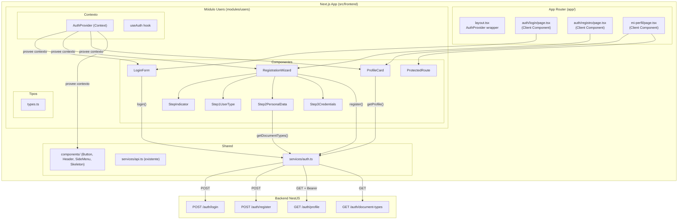
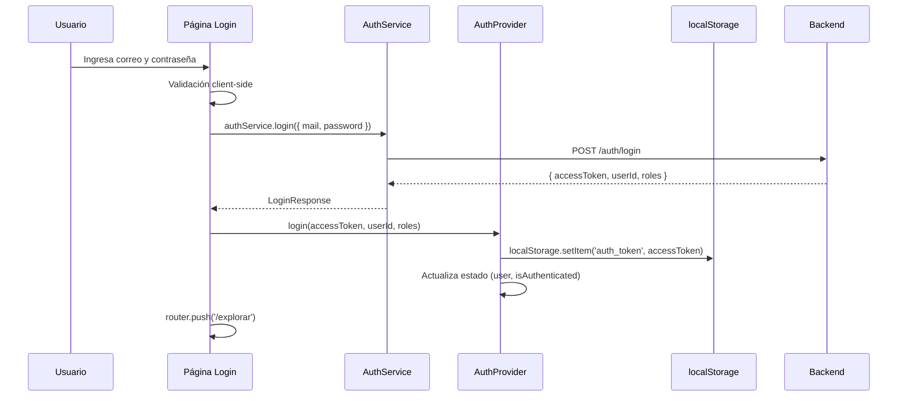
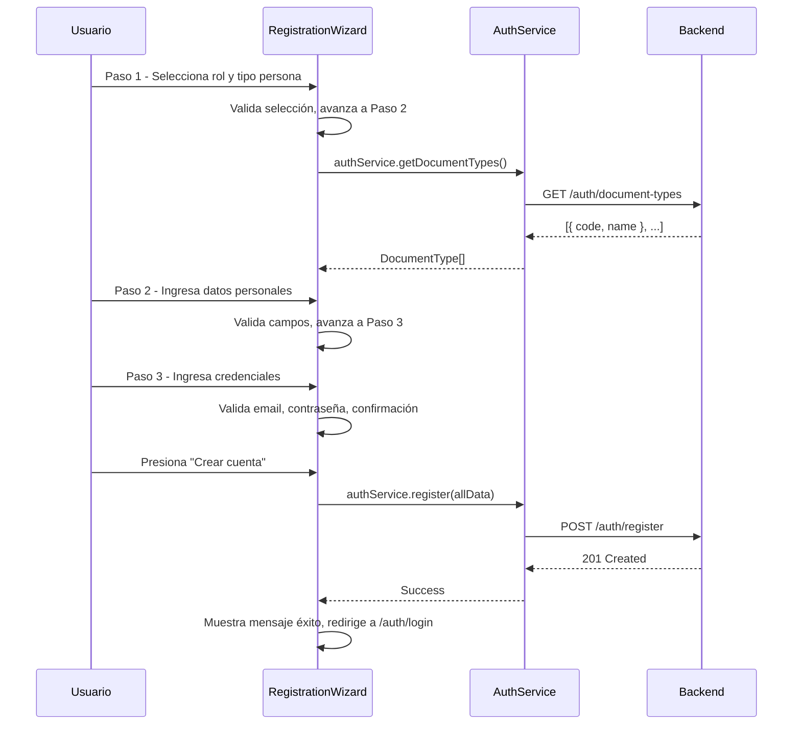
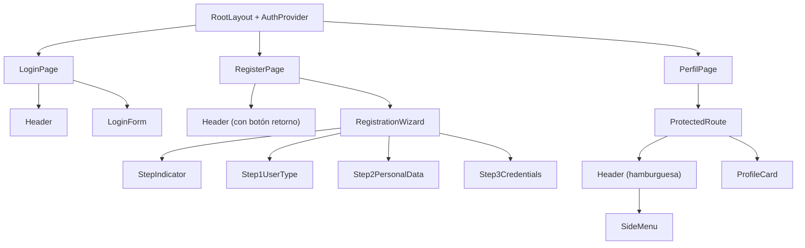

# Documento de Diseño — Usuarios (Autenticación y Perfil) Frontend

## Visión General

Este diseño cubre la implementación del módulo frontend de Usuarios (Autenticación y Perfil) de la plataforma de arriendo de vivienda. El módulo permite a usuarios anónimos registrarse como arrendador o arrendatario, iniciar sesión con correo y contraseña, visualizar su perfil y gestionar su sesión JWT.

La solución se implementa dentro de la aplicación Next.js (App Router) existente en `src/frontend/`, con Tailwind CSS y TypeScript, siguiendo un enfoque mobile-first. Consume los endpoints REST del backend NestJS existente (`POST /auth/login`, `POST /auth/register`, `GET /auth/profile`, `GET /auth/document-types`).

El diseño de referencia visual se encuentra en Figma: `https://www.figma.com/design/Yw53CFbVdMWVX7bQ6MFefk/properties_rental_platform_design`

### Decisiones de Diseño Clave

| Decisión | Justificación |
|----------|---------------|
| AuthProvider como Client Component en `layout.tsx` | El estado de autenticación requiere `useState`/`useEffect` y `localStorage`, que solo funcionan en el cliente. Envuelve toda la app para que cualquier componente acceda al contexto |
| Token JWT en `localStorage` | Persistencia entre recargas, accesible desde cualquier pestaña. Consistente con el patrón de la plataforma |
| Logout automático en respuesta 401 | Garantiza que tokens expirados no dejen al usuario en un estado inconsistente |
| Formulario de registro multi-paso con estado local | Reduce la carga cognitiva del usuario; el estado se preserva en un solo `useState` del componente padre, sin necesidad de estado global |
| Validación client-side antes de enviar al backend | Retroalimentación inmediata al usuario, reduce llamadas innecesarias al servidor |
| Skeleton loader en página de perfil | Comunica al usuario que los datos están siendo obtenidos, consistente con el patrón de `explore-properties-frontend` |
| Protección de rutas con estado de carga | Evita flash de redirección mostrando un loader mientras se verifica la autenticación |
| `fetch` nativo en AuthService | Consistente con el patrón establecido en `shared/services/api.ts` |
| Interfaz en español | Requisito de la plataforma; todos los mensajes de error y labels en español |
| Nombres de componentes en inglés, rutas en español | Los componentes, funciones y variables usan inglés para consistencia del código. Las rutas URL usan español (`/explorar`, `/mi-perfil`, `/auth/registro`) porque los usuarios finales hablan español |
| Tokens de diseño de `tailwind.config.ts` | Fuente única de verdad para colores, tipografía y espaciado |

---

## Arquitectura

### Diagrama de Arquitectura General



### Estrategia de Renderizado

| Página | Tipo | Razón |
|--------|------|-------|
| `/auth/login` | Client Component | Formulario interactivo con validación, estado de carga, acceso a AuthProvider |
| `/auth/registro` | Client Component | Formulario multi-paso con estado local complejo, validación en tiempo real |
| `/mi-perfil` | Client Component | Requiere token JWT para fetch, acceso a AuthProvider para logout |

Todas las páginas de este módulo son Client Components porque requieren interactividad (formularios, estado, `localStorage`, redirecciones programáticas).

### Flujo de Autenticación



### Flujo de Registro Multi-Paso



---

## Componentes e Interfaces

### Estructura de Archivos

```
src/frontend/
├── app/
│   ├── layout.tsx                          # Modificado: envuelve con AuthProvider
│   ├── auth/
│   │   ├── login/
│   │   │   └── page.tsx                    # Página de login
│   │   └── registro/
│   │       └── page.tsx                    # Página de registro
│   └── mi-perfil/
│       └── page.tsx                        # Página de perfil (protegida)
├── modules/
│   └── users/
│       ├── components/
│       │   ├── LoginForm.tsx               # Formulario de login (Client)
│       │   ├── RegistrationWizard.tsx          # Orquestador multi-paso (Client)
│       │   ├── StepIndicator.tsx           # Indicador de progreso 1-2-3
│       │   ├── Step1UserType.tsx           # Paso 1: tipo usuario + tipo persona
│       │   ├── Step2PersonalData.tsx       # Paso 2: datos personales + documento
│       │   ├── Step3Credentials.tsx        # Paso 3: email + contraseña
│       │   ├── ProfileCard.tsx             # Tarjeta de perfil (solo lectura)
│       │   └── ProtectedRoute.tsx          # Wrapper de protección de rutas
│       ├── context/
│       │   └── AuthContext.tsx             # AuthProvider + useAuth hook
│       ├── types.ts                        # Interfaces TypeScript del módulo
│       └── validation.ts                   # Funciones de validación de campos
├── shared/
│   ├── services/
│   │   ├── api.ts                          # Existente (sin cambios)
│   │   └── auth.ts                         # Nuevo: AuthService
│   └── components/                         # Existentes (Header, SideMenu, Button, etc.)
```

### Jerarquía de Componentes



### Especificaciones de Componentes Clave

#### `AuthProvider` (context/AuthContext.tsx)

- **Tipo**: Client Component (`'use client'`)
- **Estado**: `{ user: AuthUser | null, isLoading: boolean }`
- **Interfaz AuthUser**: `{ userId: string, roles: string[], accessToken: string }`
- **Funciones expuestas**: `login(accessToken, userId, roles)`, `logout()`, `isAuthenticated: boolean`, `isLoading: boolean`, `user: AuthUser | null`
- **Comportamiento al montar**: Lee `auth_token` de `localStorage`, si existe decodifica los datos almacenados y restaura el estado. Establece `isLoading = false` al completar.
- **login()**: Almacena token en `localStorage` bajo clave `auth_token`, almacena datos de usuario bajo clave `auth_user` (JSON), actualiza estado.
- **logout()**: Elimina `auth_token` y `auth_user` de `localStorage`, restablece estado a anónimo, redirige a `/auth/login` con `router.push`.

#### `ProtectedRoute`

- **Props**: `children: React.ReactNode`
- **Tipo**: Client Component
- **Comportamiento**: Consume `useAuth()`. Si `isLoading` es true, muestra un skeleton/spinner centrado. Si `!isAuthenticated` y `!isLoading`, redirige a `/auth/login`. Si `isAuthenticated`, renderiza `children`.

#### `LoginForm`

- **Props**: ninguna (consume AuthProvider vía `useAuth()`)
- **Tipo**: Client Component
- **Estado local**: `{ mail: string, password: string, errors: Record<string, string>, serverError: string | null, isSubmitting: boolean }`
- **Validación**: Al hacer submit, valida email (no vacío + formato) y contraseña (no vacía + mínimo 8 caracteres). Mensajes de error en español según requisitos. Los errores desaparecen al corregir el campo (`onChange`).
- **Submit**: Llama a `authService.login()`, en éxito invoca `login()` del AuthProvider y redirige a `/explorar`. En error 401 muestra "Correo electrónico o contraseña incorrectos" encima del formulario. En error de red muestra mensaje genérico.
- **Accesibilidad**: Labels con `htmlFor`, errores con `aria-describedby`, botón deshabilitado durante submit, `aria-live="polite"` en zona de errores.

#### `RegistrationWizard`

- **Props**: ninguna
- **Tipo**: Client Component
- **Estado local**: `{ currentStep: 1|2|3, formData: RegistrationFormData, errors: Record<string, string>, serverError: string | null, isSubmitting: boolean }`
- **RegistrationFormData**: Objeto que acumula todos los campos de los 3 pasos. Se preserva al navegar entre pasos.
- **Navegación**: Botón "Continuar" valida el paso actual antes de avanzar. Botón de retorno (flecha) regresa al paso anterior o a `/auth/login` si está en paso 1.
- **Submit (Paso 3)**: Construye el payload `RegisterRequest` a partir de `formData` y llama a `authService.register()`. En éxito muestra mensaje de confirmación y redirige a `/auth/login`. En error 409 muestra "Este correo electrónico ya está registrado". En error 400 muestra mensajes del backend.

#### `StepIndicator`

- **Props**: `currentStep: number, totalSteps: number`
- **Tipo**: Componente presentacional
- **Comportamiento**: Muestra 3 círculos numerados conectados por líneas. El paso actual tiene fondo primario, los completados tienen check, los pendientes tienen fondo neutral.
- **Accesibilidad**: `aria-current="step"` en el paso actual, `aria-label="Paso X de Y"`.

#### `Step1UserType`

- **Props**: `data: RegistrationFormData, errors: Record<string, string>, onChange: (field, value) => void`
- **Comportamiento**: Dos tarjetas seleccionables para rol (Arrendador/Arrendatario) con icono, título y descripción. Debajo, selector de tipo de persona (Natural/Jurídica). Área táctil mínima 44×44px.

#### `Step2PersonalData`

- **Props**: `data: RegistrationFormData, errors: Record<string, string>, onChange: (field, value) => void, documentTypes: DocumentType[]`
- **Comportamiento**: Campos condicionales según `personType`: para natural muestra firstName, lastName, preferredName (opcional); para jurídica muestra businessName. Campos comunes: dropdown tipo documento (poblado desde API), número de documento, teléfono (10 dígitos).
- **Validación**: Campos requeridos no vacíos, solo letras y espacios para nombres, solo alfanuméricos para documento, exactamente 10 dígitos para teléfono.

#### `Step3Credentials`

- **Props**: `data: RegistrationFormData, errors: Record<string, string>, onChange: (field, value) => void`
- **Comportamiento**: Campos email, contraseña (mínimo 8 caracteres), confirmación de contraseña. Validación de coincidencia en tiempo real.

#### `ProfileCard`

- **Props**: `profile: UserProfile, onLogout: () => void`
- **Tipo**: Componente presentacional
- **Comportamiento**: Tarjeta con fondo blanco, borde `#d1d5db`, border-radius 6px. Muestra avatar (64×64px, fondo `#f3f4f6`), correo, roles como badges, estado activo/inactivo. Botón "Cerrar sesión" (variante secundaria).

#### Modificación del `SideMenu` existente

El `SideMenu` ya acepta `user?: { name: string, role: string } | null`. La integración consiste en:
- Cuando el usuario está autenticado, pasar `{ name: user.userId, role: translateRole(user.roles[0]) }` donde `translateRole` mapea `LANDLORD` → "Arrendador", `TENANT` → "Arrendatario".
- El enlace "Cerrar sesión" invocará `logout()` del AuthProvider en lugar de navegar directamente.
- Cuando el usuario es anónimo (`user = null`), el SideMenu ya muestra los enlaces de login/registro.

---

## Modelos de Datos

### Interfaces TypeScript del Módulo

```typescript
// modules/users/types.ts

export interface AuthUser {
  userId: string;
  roles: string[];
  accessToken: string;
}

export interface LoginRequest {
  mail: string;
  password: string;
}

export interface LoginResponse {
  accessToken: string;
  userId: string;
  roles: string[];
}

export interface NaturalDetails {
  firstName: string;
  lastName: string;
  preferredName?: string;
}

export interface LegalDetails {
  businessName: string;
}

export interface RegisterRequest {
  fullName: string;
  userType: 'LANDLORD' | 'TENANT';
  documentTypeCode: string;
  documentNumber: string;
  mail: string;
  phoneNumber: string;
  password: string;
  role: 'LANDLORD' | 'TENANT';
  personType: 'natural' | 'legal';
  naturalDetails?: NaturalDetails;
  legalDetails?: LegalDetails;
}

export interface UserProfile {
  id: string;
  mail: string;
  roles: string[];
  isActive: boolean;
}

export interface DocumentType {
  code: string;
  name: string;
}

export interface RegistrationFormData {
  // Paso 1
  userType: 'LANDLORD' | 'TENANT' | '';
  personType: 'natural' | 'legal' | '';
  // Paso 2 - Persona Natural
  firstName: string;
  lastName: string;
  preferredName: string;
  // Paso 2 - Persona Jurídica
  businessName: string;
  // Paso 2 - Comunes
  documentTypeCode: string;
  documentNumber: string;
  phoneNumber: string;
  // Paso 3
  mail: string;
  password: string;
  confirmPassword: string;
}

export interface AuthContextValue {
  user: AuthUser | null;
  isAuthenticated: boolean;
  isLoading: boolean;
  login: (accessToken: string, userId: string, roles: string[]) => void;
  logout: () => void;
}
```

### AuthService (shared/services/auth.ts)

```typescript
// shared/services/auth.ts

const API_URL = process.env.NEXT_PUBLIC_API_URL || 'http://localhost:3001';

export const authService = {
  async login(data: LoginRequest): Promise<LoginResponse> { ... },
  async register(data: RegisterRequest): Promise<void> { ... },
  async getProfile(token: string): Promise<UserProfile> { ... },
  async getDocumentTypes(): Promise<DocumentType[]> { ... },
};
```

Cada método:
- Usa `fetch` nativo con `Content-Type: application/json`
- `getProfile` adjunta `Authorization: Bearer <token>`
- Maneja errores HTTP: 401 → "Credenciales inválidas" o "Sesión expirada", 409 → "El correo electrónico ya está registrado", 5xx → "Error del servidor. Intenta de nuevo más tarde."

### Funciones de Validación (modules/users/validation.ts)

```typescript
// modules/users/validation.ts

export function validateEmail(value: string): string | null { ... }
// Retorna null si válido, o mensaje de error en español

export function validatePassword(value: string): string | null { ... }
export function validatePasswordMatch(password: string, confirm: string): string | null { ... }
export function validateRequired(value: string, fieldName: string): string | null { ... }
export function validateOnlyLetters(value: string, fieldName: string): string | null { ... }
export function validateAlphanumeric(value: string, fieldName: string): string | null { ... }
export function validatePhone(value: string): string | null { ... }
export function validateDocumentType(value: string): string | null { ... }

// Validación por paso completo
export function validateStep1(data: RegistrationFormData): Record<string, string> { ... }
export function validateStep2(data: RegistrationFormData): Record<string, string> { ... }
export function validateStep3(data: RegistrationFormData): Record<string, string> { ... }
export function validateLoginForm(mail: string, password: string): Record<string, string> { ... }
```

Reglas de validación por campo:

| Campo | Regla | Mensaje de error |
|-------|-------|-----------------|
| Email (vacío) | No vacío | "El correo electrónico es obligatorio" |
| Email (formato) | Patrón con `@` y dominio | "Ingresa un correo electrónico válido (ej. usuario@ejemplo.com)" |
| Contraseña (vacía) | No vacía | "La contraseña es obligatoria" |
| Contraseña (corta) | ≥ 8 caracteres | "La contraseña debe tener al menos 8 caracteres" |
| Confirmación | Coincide con contraseña | "Las contraseñas no coinciden" |
| Tipo usuario | Seleccionado | "Selecciona un tipo de usuario para continuar" |
| Tipo persona | Seleccionado | "Selecciona un tipo de persona para continuar" |
| Nombres (vacío) | No vacío | "Este campo es obligatorio" |
| Nombres (formato) | Solo letras y espacios | "Este campo solo admite letras y espacios" |
| Tipo documento | Seleccionado | "Selecciona un tipo de documento" |
| Nro. documento (vacío) | No vacío | "El número de documento es obligatorio" |
| Nro. documento (formato) | Solo alfanuméricos | "El número de documento solo admite letras y números" |
| Teléfono (vacío) | No vacío | "El número de teléfono es obligatorio" |
| Teléfono (formato) | Solo dígitos | "El teléfono solo admite números" |
| Teléfono (longitud) | Exactamente 10 dígitos | "El teléfono debe tener exactamente 10 dígitos" |

---

## Propiedades de Correctitud

*Una propiedad es una característica o comportamiento que debe mantenerse verdadero en todas las ejecuciones válidas de un sistema — esencialmente, una declaración formal sobre lo que el sistema debe hacer. Las propiedades sirven como puente entre especificaciones legibles por humanos y garantías de correctitud verificables por máquina.*

### Propiedad 1: Round-trip de estado de autenticación

*Para cualquier* tripleta válida (accessToken, userId, roles), invocar `login(accessToken, userId, roles)` en el AuthProvider y luego leer el estado restaurado desde `localStorage` (simulando una recarga) debe producir un objeto `AuthUser` equivalente al original con los mismos valores de `accessToken`, `userId` y `roles`.

**Valida: Requisitos 1.2, 1.3, 1.4**

### Propiedad 2: Logout limpia completamente el estado de autenticación

*Para cualquier* estado autenticado (con cualquier combinación de userId, roles y accessToken), invocar `logout()` debe resultar en `user === null`, `isAuthenticated === false`, y `localStorage` sin las claves `auth_token` ni `auth_user`.

**Valida: Requisito 1.5**

### Propiedad 3: Validación de correo electrónico

*Para cualquier* cadena de texto, `validateEmail` debe retornar `null` (válido) si y solo si la cadena no está vacía y contiene un formato de email válido (con `@` y dominio). Si la cadena está vacía, debe retornar "El correo electrónico es obligatorio". Si no está vacía pero no tiene formato válido, debe retornar "Ingresa un correo electrónico válido (ej. usuario@ejemplo.com)".

**Valida: Requisitos 3.3, 4.8**

### Propiedad 4: Validación de contraseña

*Para cualquier* cadena de texto, `validatePassword` debe retornar `null` (válido) si y solo si la cadena tiene 8 o más caracteres. Si la cadena está vacía, debe retornar "La contraseña es obligatoria". Si tiene entre 1 y 7 caracteres, debe retornar "La contraseña debe tener al menos 8 caracteres".

**Valida: Requisitos 3.4, 4.8**

### Propiedad 5: Validación de coincidencia de contraseñas

*Para cualquier* par de cadenas (password, confirmPassword), `validatePasswordMatch` debe retornar `null` si y solo si ambas cadenas son idénticas. Si difieren, debe retornar "Las contraseñas no coinciden".

**Valida: Requisito 4.9**

### Propiedad 6: Validación de número de teléfono

*Para cualquier* cadena de texto, `validatePhone` debe retornar `null` (válido) si y solo si la cadena consiste exactamente en 10 dígitos numéricos (`/^\d{10}$/`). Si está vacía, debe retornar "El número de teléfono es obligatorio". Si contiene caracteres no numéricos, debe retornar "El teléfono solo admite números". Si tiene dígitos pero no exactamente 10, debe retornar "El teléfono debe tener exactamente 10 dígitos".

**Valida: Requisito 4.11**

### Propiedad 7: Header de autorización en peticiones protegidas

*Para cualquier* cadena de token no vacía, las peticiones HTTP realizadas por el AuthService a endpoints protegidos (`getProfile`) deben incluir el header `Authorization` con el valor exacto `Bearer <token>`.

**Valida: Requisitos 2.4, 8.1**

---

## Manejo de Errores

### Errores de Red y Servidor

| Escenario | Componente | Comportamiento |
|-----------|-----------|----------------|
| Error de red (fetch falla) | LoginForm | Muestra "No se pudo conectar con el servidor. Verifica tu conexión e intenta de nuevo." encima del formulario |
| Error de red | RegistrationWizard | Muestra mensaje de error preservando todos los datos del formulario |
| Error de red | ProfileCard | Muestra ErrorState con botón "Reintentar" |
| Error 5xx del servidor | Todos | Muestra "Error del servidor. Intenta de nuevo más tarde." |

### Errores de Autenticación

| Escenario | Componente | Comportamiento |
|-----------|-----------|----------------|
| 401 en login | LoginForm | Muestra "Correo electrónico o contraseña incorrectos" encima del formulario, no borra campos |
| 401 en endpoint protegido | AuthService | Invoca `logout()` del AuthProvider → redirige a `/auth/login` |
| 409 en registro | RegistrationWizard | Muestra "Este correo electrónico ya está registrado", preserva datos |
| 400 en registro | RegistrationWizard | Muestra mensajes de error del backend en español |

### Errores de Validación Client-Side

- Los mensajes de error aparecen debajo del campo afectado en tipografía Caption (14px), color de estado error
- El borde del campo se resalta con color de error
- Los mensajes desaparecen automáticamente cuando el usuario corrige el valor (`onChange`)
- Los errores se asocian al campo mediante `aria-describedby` y se anuncian con `aria-live="polite"`
- El formulario NO se envía al backend si hay errores de validación

### Estados de Carga

| Escenario | Indicador |
|-----------|-----------|
| Submit de login | Botón deshabilitado + spinner dentro del botón |
| Submit de registro | Botón "Crear cuenta" deshabilitado + spinner |
| Carga de perfil | Skeleton loader replicando la estructura de ProfileCard |
| Verificación de auth en rutas protegidas | Spinner centrado en pantalla |
| Carga de tipos de documento (Paso 2) | Skeleton en el dropdown |

---

## Estrategia de Testing

### Enfoque Dual: Tests Unitarios + Tests de Propiedades

Este módulo se beneficia de property-based testing para las funciones de validación puras, que tienen un espacio de entrada grande y propiedades universales claras. Los componentes de UI se testean con tests unitarios basados en ejemplos.

### Librería de Property-Based Testing

- **fast-check** para TypeScript/JavaScript
- Mínimo 100 iteraciones por propiedad
- Cada test referencia la propiedad del documento de diseño

### Tests de Propiedades (Property-Based)

| Propiedad | Archivo de Test | Tag |
|-----------|----------------|-----|
| P1: Round-trip auth state | `modules/users/__tests__/auth-context.property.test.ts` | Feature: users-auth-frontend, Property 1: Auth state round-trip |
| P2: Logout clears state | `modules/users/__tests__/auth-context.property.test.ts` | Feature: users-auth-frontend, Property 2: Logout clears auth state |
| P3: Email validation | `modules/users/__tests__/validation.property.test.ts` | Feature: users-auth-frontend, Property 3: Email validation |
| P4: Password validation | `modules/users/__tests__/validation.property.test.ts` | Feature: users-auth-frontend, Property 4: Password validation |
| P5: Password match | `modules/users/__tests__/validation.property.test.ts` | Feature: users-auth-frontend, Property 5: Password match validation |
| P6: Phone validation | `modules/users/__tests__/validation.property.test.ts` | Feature: users-auth-frontend, Property 6: Phone validation |
| P7: Bearer token header | `shared/services/__tests__/auth.property.test.ts` | Feature: users-auth-frontend, Property 7: Bearer token attachment |

### Tests Unitarios (Example-Based)

| Área | Archivo de Test | Cobertura |
|------|----------------|-----------|
| LoginForm | `modules/users/__tests__/LoginForm.test.tsx` | Renderizado, validación visual, submit exitoso, error 401, error de red, redirección de autenticados |
| RegistrationWizard | `modules/users/__tests__/RegistrationWizard.test.tsx` | Navegación entre pasos, preservación de datos, campos condicionales, submit exitoso, errores 409/400/red |
| ProfileCard | `modules/users/__tests__/ProfileCard.test.tsx` | Renderizado de datos, skeleton, error con retry, logout |
| ProtectedRoute | `modules/users/__tests__/ProtectedRoute.test.tsx` | Redirección de anónimos, loader durante verificación, renderizado de autenticados |
| AuthService | `shared/services/__tests__/auth.test.ts` | Mapeo de errores 401/409/5xx, construcción de URLs |
| StepIndicator | `modules/users/__tests__/StepIndicator.test.tsx` | Accesibilidad (aria-current, aria-label) |

### Tests de Integración

| Flujo | Descripción |
|-------|-------------|
| Login completo | Formulario → AuthService → AuthProvider → redirección |
| Registro completo | 3 pasos → submit → mensaje éxito → redirección a login |
| Perfil con 401 | Carga perfil → 401 → logout automático → redirección |
| SideMenu autenticado | AuthProvider con usuario → SideMenu muestra nombre y rol |
